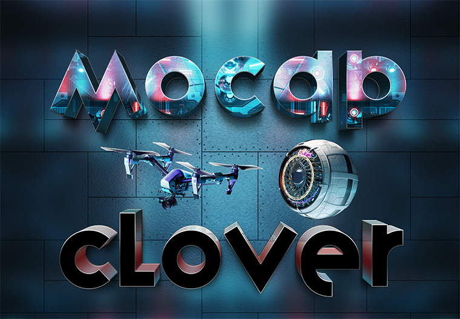
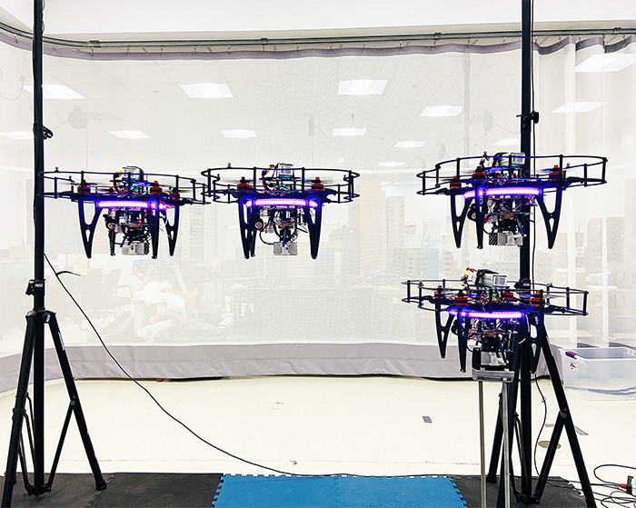
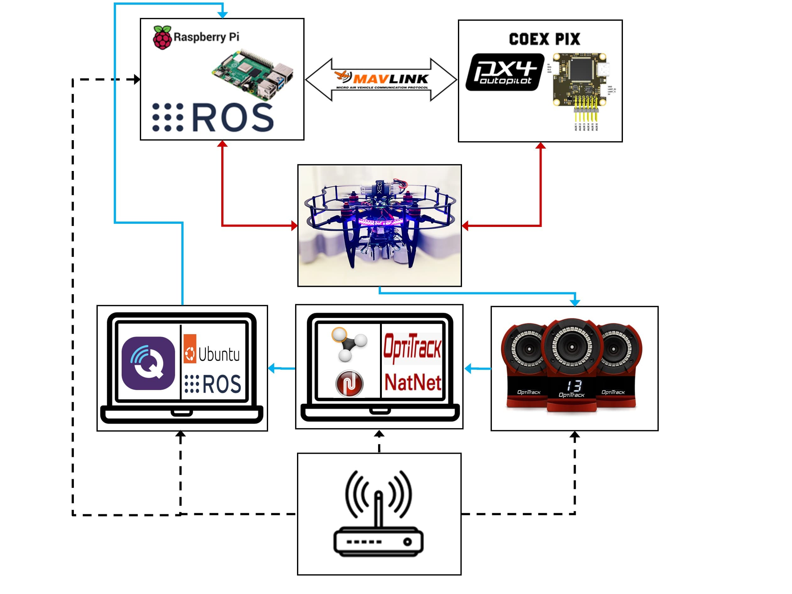
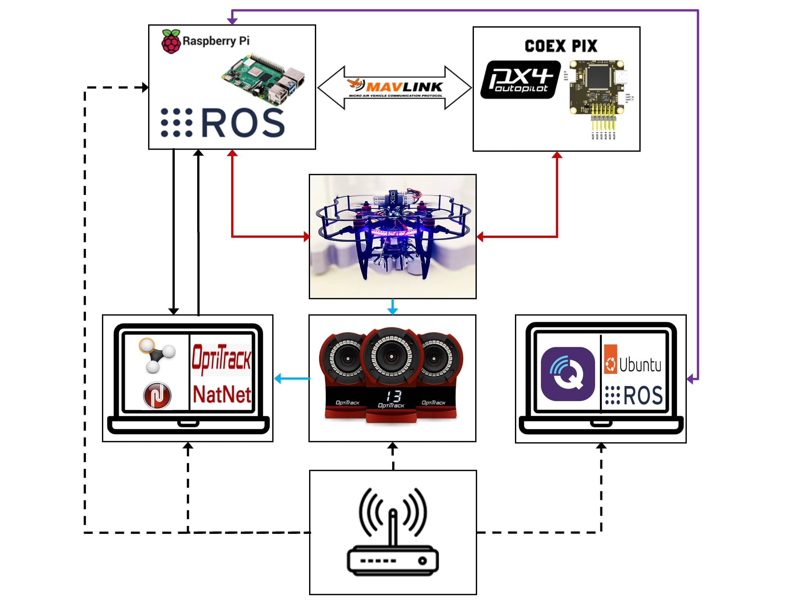
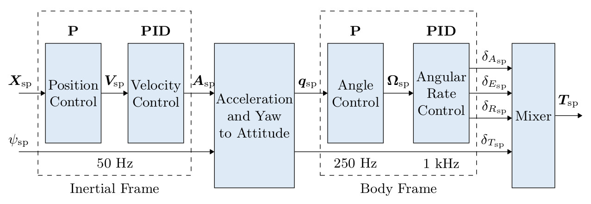

# Project Video

[CopterHack-2023](copterhack2023.md), team **Clover with Motion Capture System**. Click logo for project video.

  

## Table of Contents

* [Team Information](#item-one)
* [Educational Document](#item-two)
* [Introduction](#item-three)
* [Project Description](#item-four)
* [Hardware](#item-hardware)
* [Data Transfer](#item-transfer)
* [Examples](#item-examples)
* [Trajectory Tracking](#item-figure8)
* [Auto-Tuning](#item-auto)
* [Conclusion](#item-last)

## Team Information {#item-one}

The list of team members:

* Sean Smith, @ssmith_81, roboticist and developer: [GitHub](https://github.com/ssmith-81), [Linkedin](https://www.linkedin.com/in/sean-smith-61920915a/).

## Educational Document {#item-two}

**My Gitbook, with detailed step by step analysis of the proposed project during the CopterHack 2023 competition can be found:**
[MoCap Clover Gitbook](https://0406hockey.gitbook.io/mocap-clover/).

This page gives a broad overview on the motivation and purpose behind this project, it also provides research and industry based knowledge around UAV application that the reader may find interesting. If the user is interested in the technical details and implementation then refer to the educational Gitbook document.

## Introduction {#item-three}

Aerial robotics has become a common focus in research and industry over the past few decades. Many technical developments in research require a controlled test environment to isolate certain characteristics of the system for analysis. This typically takes place indoors to eliminate unwanted disturbances allowing results to be more predictable. Removing localization and pose feedback concerns can be accomplished with motion capture (MoCap) systems that track unmanned aerial vehicles (UAVs) pose with high precision as stated:

"OptiTrack’s drone and ground robot tracking systems consistently produce positional error less than 0.3mm and rotational error less than 0.05°" [[reference](https://optitrack.com/applications/robotics/#:~:text=Exceptional%203D%20precision%20and%20accuracy&text=OptiTrack's%20drone%20and%20ground%20robot,error%20less%20than%200.05%C2%B0)].

<!-- markdownlint-disable MD044 -->

This enables researchers to study the dynamics and behavior of UAVs in different environments, evaluate their performance, and develop advanced control algorithms for improved flight stability, autonomy, and safety. Research facilities around the world tend to built research drones from the ground up using off-the-shelf components with open source platforms such as PX4. While the end goal is the same: transferring pose feedback to the flight controller along with high level commands, the platforms and methods can vary significantly depending on factors such as onboard and offboard computing frameworks and data transfer methods. Many developers have a detailed background and understanding of the theoretical components of their research, however, adapting hardware configurations to their own platform such as sensor feedback and sensor fusion is not obvious. The purpose of this project is to provide detailed documentation on integrating the Clover platform with the MoCap system along with examples to familiarize users with the hardware, sensor fusion, high and low level controller development, and trajectory tracking.

<!-- markdownlint-enable MD044 -->

## Project Description {#item-four}

In this article, we will provide an overview of MoCap systems for tracking UAV pose in research applications, highlighting their significance, advantages, and potential impacts in the field of UAV controller development.

## Document structure

The Motion Capture System educational document is divided into three main sections outside of the Introduction and Conclusion. Each section and its purpose is listed:

### Hardware {#item-hardware}

The main goal in this section is to educate the reader on the MoCap system hardware and software. This can be further divided into several steps including camera placement, marker placement, and system calibration. A summary of the process is provided:

| Task      | Description |
| --------- | ----------- |
| Camera Placement      | Position the motion capture cameras in strategic locations around the area where the UAV will be flying. The number of cameras and their placement will depend on the size of the area and the desired capture volume. Typically, cameras are placed on tripods or mounted on walls or ceilings at specific heights and angles to capture the UAV's movements from different perspectives. **A simple 4-camera setup example is provided in the educational document**. |
| Marker Placement   | Attach OptiTrack markers to the UAV in specific locations. OptiTrack markers are small reflective spheres that are used as reference points for the motion capture system to track the UAV's position and movements. **An example placement on the Clover is shown in the educational document**.
| System Calibration | Perform system calibration to establish the spatial relationship between the cameras and the markers. This involves capturing a calibration sequence, during which a known pattern or object is moved in the capture volume. The system uses this data to calculate the precise positions and orientations of the cameras and markers in 3D space, which is crucial for accurate motion capture.  |

With these components completed correctly, you are well on your way to commanding indoor autonomous missions like this:
     

    
    

<!--
    - Testing and Validation: After setting up the cameras and markers, perform test flights with the UAV to validate the accuracy of the MoCap system. Analyze the captured data to ensure that the UAV's movements are accurately captured and that the system is functioning correctly.
    - Fine-tuning: Fine-tune the motion capture system as needed based on the test results. This may involve adjusting camera angles, marker placements, or calibration settings to improve the accuracy and reliability of the system.
    - Data Collection: Once the motion capture system is properly set up and calibrated, you can start collecting data for your UAV research. The system will continuously track the positions and movements of the markers on the UAV in real-time, providing precise data that can be used for various analyses and experiments.
    - Data Analysis: Analyze the captured data using appropriate software to extract relevant information for your UAV research. This may involve tracking the UAV's position, velocity, acceleration, orientation, and other parameters, and analyzing how they change over time or in response to different conditions or inputs.
-->
Overall, configuring a motion capture system for UAV research requires careful planning, precise marker placement, accurate system calibration, and thorough validation to ensure accurate and reliable data collection for your research purposes. For more information, refer to the [informative documentation](https://0406hockey.gitbook.io/mocap-clover/hardware/motion-capture-setup-optitrack).

### Data Transfer {#item-transfer}

With the data acquired from the MoCap system, the main goal in this section is to transfer it to the Raspberry Pi onboard the Clover and remap it to the flight controller/PX4 for control. A summary of the steps are listed:

    

* Data Acquisition: The motion capture system continuously tracks the position and orientation (pose) of the UAV using markers attached to the UAV and cameras positioned in the capture volume. The system calculates the 3D pose of the UAV in real-time and can be viewed through the motive software.
* Data Transmission: The pose data is transmitted from the motion capture system to a Raspberry Pi using VRPN and a ROS network. While this works, I have implemented a strictly UDP data transmission method where highlighting the setup process and ease of use will be a future development, both configurations can be seen in the below figures. The Raspberry Pi acts as an intermediary for processing and relaying the data to the flight controller onboard the UAV using MAVROS. The connection can be established using USB or UART, I chose UART in my setups.

 

       
       
       <em>Fig.1(a) - Left figure: ROS network experimental setup topology. Legend: Black dotted line is the provided local network; Blue solid line is the Clover pose transmission where the final transmission from laptop to Pi is over a ROS network; Red line is hardware connections; MAVLink arrow is communication via a MAVLink protocol. .</em>  
       <em>Fig.1(b) - Right figure: UDP transmission experimental setup topology. Legend: Black dotted line is the provided local network; Black solid line is the UDP client-server drone pose transmission; Light blue line is the pose data transmission; Red line is hardware connections; Purple line is communication via secure shell protocol and ROS network communication; MAVLink arrow is communication via a MAVLink protocol. .</em>
 

* Data Processing: The Raspberry Pi receives the pose data from the motion capture system over a ROS network on a VRPN ROS topic, this was initially parsed from the sensor readings into position and attitude.
* Data Remapping: Once the pose data is processed, the Raspberry Pi maps it to the to a gateway/MAVROS topic sending it to the flight controller onboard the UAV. All coordinate transformations (ENU->NED) are taken care of with MAVROS.
* Flight Control Update: The flight controller onboard the UAV receives the remapped pose data and uses it to update the UAV's flight control algorithms. The updated pose information can be used to adjust the UAV's flight trajectory, orientation, or other control parameters to achieve the desired flight behavior or control objectives based on the motion capture system feedback.
* Closed-Loop Control: The flight controller continuously receives pose feedback from the motion capture system via the Raspberry Pi, and uses it to update the UAV's flight control commands in a closed-loop fashion (PX4 uses a cascaded PID control system with more details provided in the educational document). This allows the UAV to maintain precise position and orientation control based on the real-time pose data provided by the motion capture system.

Overall, sending pose feedback from a motion capture system to a Raspberry Pi and remapping the data to the flight controller onboard a UAV involves acquiring, processing, and transmitting the pose data in a compatible format to enable real-time closed-loop control of the UAV based on the motion capture system's feedback.

### Examples {#item-examples}

This section provides two practical examples to help the user better understand the Clover platform, sensor fusion, UAV applications such as trajectory tracking, high level commands, and low level control. The reader will become familiar with an abundance of state-of-the-art open source UAV platforms/technologies such as:

| Platform    | Description |
| ----------- | ----------- |
| PX4         | PX4 is an open-source flight control software for drones and other unmanned vehicles used on the Clover. It supports a wide range of platforms and sensors and is used in commercial and research applications. |
| Robot Operating System (ROS) |ROS is an open-source software framework for building robotic systems. It provides a set of libraries and tools for developing and managing robot software and is widely used in drone and robotics research. |
| MAVLink| MAVLink is a lightweight messaging protocol for communicating with unmanned systems. It is widely used in drone and robotics applications and provides a flexible and extensible communication framework.|
|QGroundControl (QGC)| QGC is an open-source ground control station software for drones and other unmanned vehicles. It provides a user-friendly interface for managing and monitoring drone flights and is widely used in commercial and research applications. |

1. **A figure-8 high-level trajectory generation**: this example is outlined for both Software in the Loop (SITL) simulations and hardware testing with the Clover platform. Check out this interesting example from my [trajectory tracking section](https://0406hockey.gitbook.io/mocap-clover/examples/flight-tests/complex-trajectory-tracking)!

    

    <em>Fig.2 - Lemniscate of Bernoulli [<a href="https://upload.wikimedia.org/wikipedia/commons/f/f1/Lemniscate_of_Bernoulli.gif">reference</a>].</em>

Here's a summary of the importance of trajectory tracking for UAV applications:

* *Navigation and Path Planning*: Trajectory tracking allows UAVs to follow pre-defined paths or trajectories, which is essential for tasks such as aerial mapping, surveying, inspection, and monitoring.
* *Precision and Safety*: Trajectory tracking enables precise control of the UAV's position, velocity, and orientation, which is crucial for maintaining safe and stable flight operations. Precise trajectory tracking allows UAVs to avoid obstacles, maintain safe distances from other objects or aircraft, and operate in confined or complex environments with high precision, reducing the risk of collisions or accidents.
* *Autonomy and Scalability*: Trajectory tracking enables UAV autonomy, allowing them to operate independently without constant operator intervention. This enables UAVs to perform repetitive or complex tasks autonomously, freeing up human operators to focus on higher-level decision-making or supervisory roles. Trajectory tracking also facilitates scalable operations, where multiple UAVs can follow coordinated trajectories to perform collaborative tasks, such as swarm operations or coordinated data collection.
* *Flexibility and Adaptability*: Trajectory tracking allows UAVs to adapt their flight paths or trajectories in real-time based on changing conditions or objectives. UAVs can dynamically adjust their trajectories to accommodate changes in environmental conditions, mission requirements, or operational constraints, allowing for flexible and adaptive operations in dynamic or unpredictable environments.

In summary, trajectory tracking is crucial for UAV applications as it enables precise navigation, safety, efficiency, autonomy, and scalability, while optimizing payload performance and adaptability to changing conditions. It plays a fundamental role in ensuring that UAVs can accomplish their missions effectively and safely, making it a critical component of UAV operations in various industries and domains.

1. **Clover adaptive auto-tuning**: The second example shows the user how to implement the adaptive auto-tune module provided by PX4 to tune the low-level controllers or attitude control module. You can take a look into how this is accomplished with the Clover platform in the [auto-tuning section](https://0406hockey.gitbook.io/mocap-clover/examples/auto-tuning).

    
    

    

    <em>Fig.3 - Cascaded PX4 control system [<a href="https://docs.px4.io/v1.12/en/flight_stack/controller_diagrams.html#multicopter-control-architecture">reference</a>].</em>

This is a much faster and easier way to tune a real drone and provides good tuning for most air frames. Manual tuning is recommended when auto-tuning dos not work, or when fine-tuning is essential. However, the process is tedious and not easy especially for users with limited control background and experience. The Clover airframe provides sufficient base settings where auto-tuning can further improve performance depending on the Clover being used.

Here's a summary of the importance of low-level controller performance for UAV applications:

* *Flight Stability and Safety*: The low-level controller, typically implemented as a PID (Proportional-Integral-Derivative) or similar control algorithm, governs the UAV's attitude and position control. Properly tuning the low-level controller ensures that the UAV remains stable during flight, with accurate and responsive control inputs. This is essential for safe and reliable UAV operations, as it helps prevent undesired oscillations, overshooting, or instability that can lead to crashes or accidents.
* *Control Precision and Responsiveness*: Accurate control is crucial for achieving precise and responsive UAV maneuvers, such as smooth trajectory tracking, precise hovering, or dynamic maneuvers. Proper tuning of the low-level controller allows for precise control of the UAV's attitude, position, and velocity, enabling it to accurately follow desired flight trajectories, respond to changing conditions or commands, and perform complex flight maneuvers with high precision.
* *Adaptability and Robustness*: UAV operations can be subject to varying environmental conditions, payload configurations, or operational requirements. Proper low-level controller tuning allows for adaptability and robustness, enabling the UAV to perform reliably and accurately across a wide range of conditions or mission requirements. Tuning the controller parameters can help account for changes in payload mass, wind conditions, or other external factors, ensuring stable and responsive flight performance.

    

In summary, low-level controller tuning is crucial for UAV applications as it directly affects flight stability, control precision, payload performance, energy efficiency, adaptability, and compliance with safety and regulatory requirements. It is an essential step in optimizing the performance and safety of UAV operations, ensuring reliable and effective flight control for various applications across different industries and domains.

## Conclusion {#item-last}

Over the course of this project I was able to extend my knowledge in robotic applications while enduring many ups and downs along the way. This greatly helped me with my research when testing controller development was required. The motivation behind this documentation is to improve this experience for other researchers, robotic developers, or hobbyists that have a desire to learn fundamental robotic application which is beginning to shape the world we know today. These details can be explored in a [GitBook](https://0406hockey.gitbook.io/mocap-clover/) for those who are interested.

I provided many details on the interworking components required to achieve an indoor autonomous flight setup with the COEX Clover platform. With an extensive background in UAV control, I tried to provide a basic understanding of this for the readers benefit. There are many more sections I would like to include along with improving upon the existing ones. A few examples include firmware testing with hardware in the loop simulations, advanced trajectory generation, and an extensive list of flight examples for the Gazebo simulator with application to hardware.

Lastly, I would like to thank the entire COEX team that made this project possible by providing a wonderful platform with support. I would like to give a special thanks to [Oleg Kalachev](https://github.com/okalachev) for helping me debug and succeed through applied learning. With that being said, I hope you all enjoy the resourceful content provided, and I plan on releasing more detailed documents on other interesting topics as I progress through my research and development.

<!--
## Project description

This project is an educational reference and detailed tutorial on how to setup the OptiTrack Motion Capture (MoCap) system with the COEX Clover platform.
It gives brief descriptions on the camera and motive software setup with many resourceful links, but it assumes the user has a basic understanding on how to
setup the cameras and motive computer software. MoCap markers allow the MoCap to stream positional data of the Clover therefore marker placement is discussed.
From there details on how to stream position data from the MoCap to the Clover along with how to configure the Clover; specifically, the Raspberry Pi and PX4
firmware parameters are discussed. The overall network will be provided as it is the most important part.

At the end, I will provide an interesting example such as a tracking a complex trajectory that any user can implement.

### Project idea

In many research applications highly precise position feedback is required and that is why a MoCap system is popular in this field of robotics. Research papers
are published detailed around certain topics such as control, path planning, obstacle avoidance and many more although the details surrounding certain hardware
setups such as with the MoCap system are not provided. There are a few sources that provide help with setting up the MoCap system with PX4 and other specific
systems but with limited knowledge of how and why steps are made one might not be able to adapt it to their own setup such as with the Clover. That is why this
project has been created; so that a student or user can follow this tutorial with the COEX Clover and have a working setup with the MoCap and Clover even with
a limited understanding of software and hardware. The article also provides descriptions on why certain things are done to allow the user the better understand
the system setup.

I currently have the setup running but now working well. The Clover is unable to follow setpoints with any precision
therefore working through network and software issues seems to be the current stage (I am not sure what exactly is causing this issue actually). I am hoping to
receive guidance in this area from this project so I can have it working as desired.

### Using Clover platform

The COEX Clover 4.2 kit is used where the MoCap system setup is specific for the Clover platform. It provides useful information for all robotics users interested in
implementing external sensor feedback although it is specific for Clover owners.

### Additional information at the request of participants
I am a masters student looking to implement this project in my research.

-->
