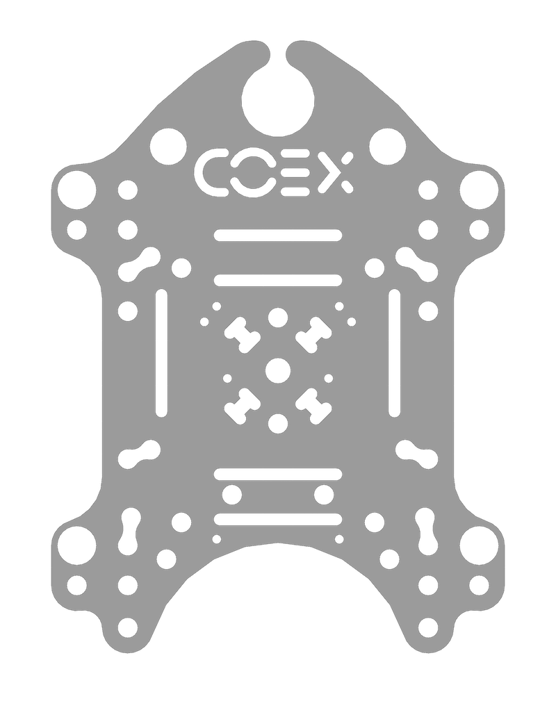
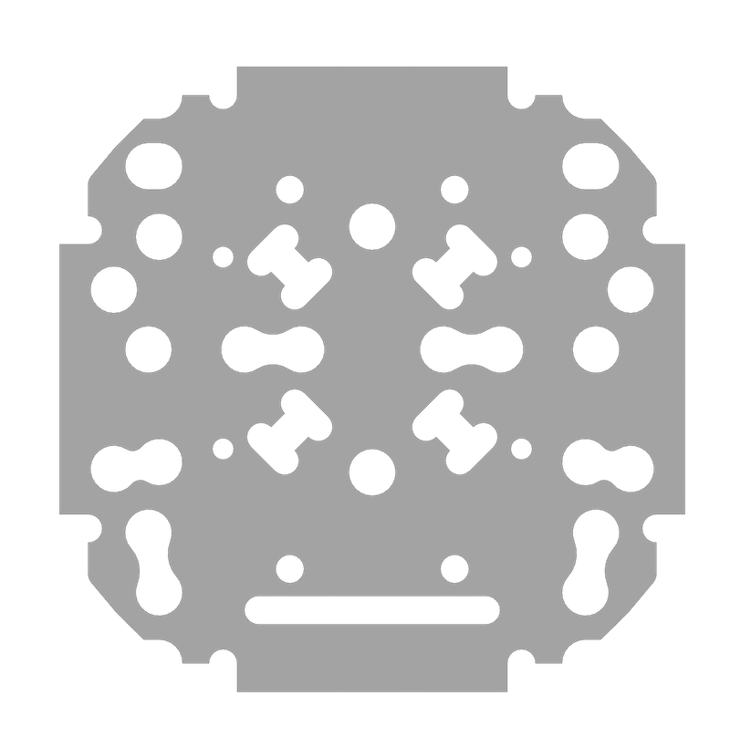
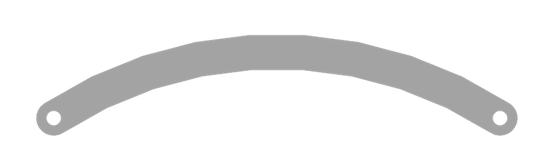
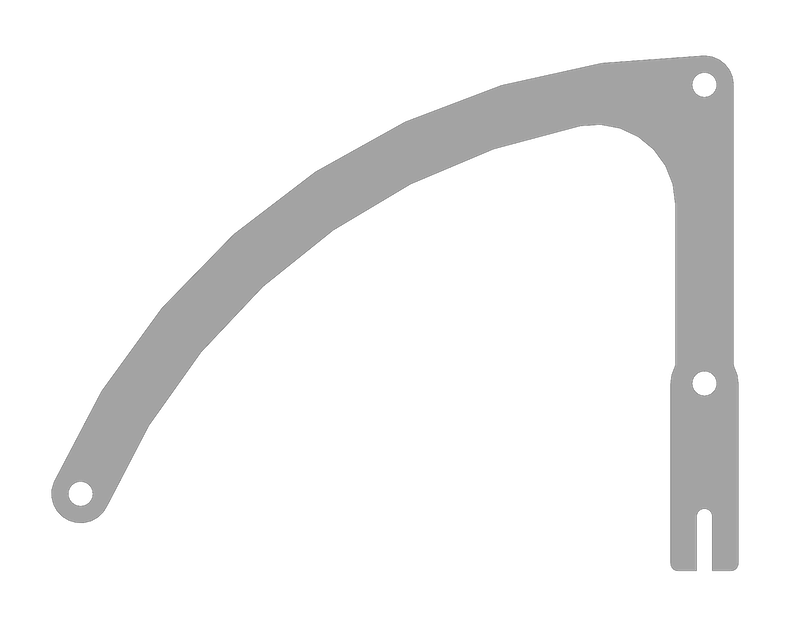
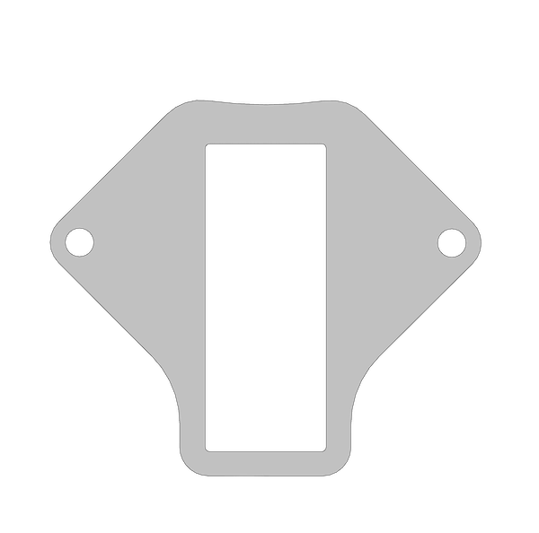

# Model files for parts

This page contains models and drawings of some of the drone parts. They can be used for 3D printing and/or laser cutting replacement parts.

## Clover 4.2

### Milling

<table>
    <tr><th width=150>Preview</th><th>Part</th><th width=1>Files</th></tr>
    <tr>
        <td></td>
        <td>
            <b>Deck mount</b>. 
            Function: Deck for installing battery and Raspberry Pi 
            Material: Monolithic polycarbonate 2mm. 
            Quantity: 1 pcs.
        </td>
        <td>
            <a href="https://github.com/CopterExpress/hardware/raw/master/COEX%20Clover/4.2/PC/Deck%20Mount/Deck%20Mount.dxf"><code>Deck&nbsp;Mount.dxf</code></a> 
            <a href="https://github.com/CopterExpress/hardware/raw/master/COEX%20Clover/4.2/PC/Deck%20Mount/Deck%20Mount.ipt"><code>Deck&nbsp;Mount.ipt</code></a> 
            <a href="https://github.com/CopterExpress/hardware/raw/master/COEX%20Clover/4.2/PC/Deck%20Mount/Deck%20Mount.stp"><code>Deck&nbsp;Mount.stp</code></a>
        </td>
    </tr>
    <tr>
        <td></td>
        <td>
            <b>Deck mount small</b>. 
            Function: Deck for mounting FPV cameras and mounting stiffening plates. 
            Material: Monolithic polycarbonate 2mm. 
            Quantity: 1 pcs.
        </td>
        <td>
            <a href="https://github.com/CopterExpress/hardware/raw/master/COEX%20Clover/4.2/PC/Deck%20Mount%20Small/Deck%20Mount%20Small.dxf"><code>Deck&nbsp;Mount&nbsp;Small.dxf</code></a> 
            <a href="https://github.com/CopterExpress/hardware/raw/master/COEX%20Clover/4.2/PC/Deck%20Mount%20Small/Deck%20Mount%20Small.ipt"><code>Deck&nbsp;Mount&nbsp;Small.ipt</code></a> 
            <a href="https://github.com/CopterExpress/hardware/raw/master/COEX%20Clover/4.2/PC/Deck%20Mount%20Small/Deck%20Mount%20Small.stp"><code>Deck&nbsp;Mount&nbsp;Small.stp</code></a>
        </td>
    </tr>
    <tr>
        <td></td>
        <td>
            <b>Grab deck</b>. 
            Function: Deck for installing grippers and external peripherals (camera, rangefinder). 
            Material: Monolithic polycarbonate 2mm. 
            Quantity: 1 pcs.
        </td>
        <td>
            <a href="https://github.com/CopterExpress/hardware/raw/master/COEX%20Clover/4.2/PC/Grab%20Deck/Grab%20Deck.dxf"><code>Grab&nbsp;Deck.dxf</code></a> 
            <a href="https://github.com/CopterExpress/hardware/raw/master/COEX%20Clover/4.2/PC/Grab%20Deck/Grab%20Deck.ipt"><code>Grab&nbsp;Deck.ipt</code></a> 
            <a href="https://github.com/CopterExpress/hardware/raw/master/COEX%20Clover/4.2/PC/Grab%20Deck/Grab%20Deck.stp"><code>Grab&nbsp;Deck.stp</code></a>
        </td>
    </tr>
    <tr>
        <td></td>
        <td>
            <b>LED mount plate</b>. 
            Function: Fixing the LED strip. 
            Material: Monolithic polycarbonate 2mm. 
            Quantity: 1 pcs.
        </td>
        <td>
            <a href="https://github.com/CopterExpress/hardware/raw/master/COEX%20Clover/4.2/PC/LED%20mount%20plate/LED%20mount%20plate.dxf"><code>LED&nbsp;mount&nbsp;plate.dxf</code></a> 
            <a href="https://github.com/CopterExpress/hardware/raw/master/COEX%20Clover/4.2/PC/LED%20mount%20plate/LED%20mount%20plate.ipt"><code>LED&nbsp;mount&nbsp;plate.ipt</code></a> 
            <a href="https://github.com/CopterExpress/hardware/raw/master/COEX%20Clover/4.2/PC/LED%20mount%20plate/LED%20mount%20plate.stp"><code>LED&nbsp;mount&nbsp;plate.stp</code></a>
        </td>
    </tr>
    <tr>
        <td></td>
        <td>
            <b>Prop guard</b>. 
            Function: Prevent damage of propellers. 
            Material: Monolithic polycarbonate 2mm. 
            Quantity: 4 pcs.
        </td>
        <td>
            <a href="https://github.com/CopterExpress/hardware/raw/master/COEX%20Clover/4.2/PC/Prop%20Guard/Prop%20Guard.dxf"><code>Prop&nbsp;Guard.dxf</code></a> 
            <a href="https://github.com/CopterExpress/hardware/raw/master/COEX%20Clover/4.2/PC/Prop%20Guard/Prop%20Guard.ipt"><code>Prop&nbsp;Guard.ipt</code></a> 
            <a href="https://github.com/CopterExpress/hardware/raw/master/COEX%20Clover/4.2/PC/Prop%20Guard/Prop%20Guard.stp"><code>Prop&nbsp;Guard.stp</code></a>
        </td>
    </tr>
    <tr>
        <td></td>
        <td>
            <b>Prop guard mount</b>. 
            Function: Arc for securing the guard. 
            Material: Monolithic polycarbonate 2mm. 
            Quantity: 2 pcs.
        </td>
        <td>
            <a href="https://github.com/CopterExpress/hardware/raw/master/COEX%20Clover/4.2/PC/Prop%20Guard%20Mount/Prop%20Guard%20Mount.dxf"><code>Prop&nbsp;Guard&nbsp;Mount.dxf</code></a> 
            <a href="https://github.com/CopterExpress/hardware/raw/master/COEX%20Clover/4.2/PC/Prop%20Guard%20Mount/Prop%20Guard%20Mount.ipt"><code>Prop&nbsp;Guard&nbsp;Mount.ipt</code></a> 
            <a href="https://github.com/CopterExpress/hardware/raw/master/COEX%20Clover/4.2/PC/Prop%20Guard%20Mount/Prop%20Guard%20Mount.stp"><code>Prop&nbsp;Guard&nbsp;Mount.stp</code></a>
        </td>
    </tr>
    <tr>
        <td></td>
        <td>
            <b>Small leg</b>. 
            Function: Standard footing element. 
            Material: Monolithic polycarbonate 2mm. 
            Quantity: 2 pcs.
        </td>
        <td>
            <a href="https://github.com/CopterExpress/hardware/raw/master/COEX%20Clover/4.2/PC/Small%20Leg/Small%20Leg.dxf"><code>Small&nbsp;Leg.dxf</code></a> 
            <a href="https://github.com/CopterExpress/hardware/raw/master/COEX%20Clover/4.2/PC/Small%20Leg/Small%20Leg.ipt"><code>Small&nbsp;Leg.ipt</code></a> 
            <a href="https://github.com/CopterExpress/hardware/raw/master/COEX%20Clover/4.2/PC/Small%20Leg/Small%20Leg.stp"><code>Small&nbsp;Leg.stp</code></a>
        </td>
    </tr>
    <tr>
        <td></td>
        <td>
            <b>Arm</b>. 
            Function: motor mount. 
            Material: carbon fibre 2mm. 
            Quantity: 4 pcs.
        </td>
        <td>
            <a href="https://github.com/CopterExpress/hardware/raw/master/COEX%20Clover/4.2/Carbon/Arm/Arm.dxf"><code>Arm.dxf</code></a> 
            <a href="https://github.com/CopterExpress/hardware/raw/master/COEX%20Clover/4.2/Carbon/Arm/Arm.ipt"><code>Arm.ipt</code></a> 
            <a href="https://github.com/CopterExpress/hardware/raw/master/COEX%20Clover/4.2/Carbon/Arm/Arm.stp"><code>Arm.stp</code></a>
        </td>
    </tr>
    <tr>
        <td></td>
        <td>
            <b>Central plate</b>. 
            Function: a place to mount PCBs. 
            Material: carbon fibre 2mm. 
            Quantity: 1 pc.
        </td>
        <td>
            <a href="https://github.com/CopterExpress/hardware/raw/master/COEX%20Clover/4.2/Carbon/Central%20Plate/Central%20Plate.dxf"><code>Central&nbsp;Plate.dxf</code></a> 
            <a href="https://github.com/CopterExpress/hardware/raw/master/COEX%20Clover/4.2/Carbon/Central%20Plate/Central%20Plate.ipt"><code>Central&nbsp;Plate.ipt</code></a> 
            <a href="https://github.com/CopterExpress/hardware/raw/master/COEX%20Clover/4.2/Carbon/Central%20Plate/Central%20Plate.stp"><code>Central&nbsp;Plate.stp</code></a>
        </td>
    </tr><tr>
        <td></td>
        <td>
            <b>Small deck mount</b>. 
            Function: holds stiffener plates. 
            Material: carbon fibre 2mm. 
            Quantity: 1 pc.
        </td>
        <td>
            <a href="https://github.com/CopterExpress/hardware/raw/master/COEX%20Clover/4.2/Carbon/Deck%20Mount%20Small/Deck%20Mount%20Small.dxf"><code>Deck&nbsp;Mount&nbsp;Small.dxf</code></a> 
            <a href="https://github.com/CopterExpress/hardware/raw/master/COEX%20Clover/4.2/Carbon/Deck%20Mount%20Small/Deck%20Mount%20Small.ipt"><code>Deck&nbsp;Mount&nbsp;Small.ipt</code></a> 
            <a href="https://github.com/CopterExpress/hardware/raw/master/COEX%20Clover/4.2/Carbon/Deck%20Mount%20Small/Deck%20Mount%20Small.stp"><code>Deck&nbsp;Mount&nbsp;Small.stp</code></a>
        </td>
    </tr><tr>
        <td></td>
        <td>
            <b>Stiffener plate</b>. 
            Function: frame stiffener. 
            Material: carbon fibre 2mm. 
            Quantity: 4 pcs.
        </td>
        <td>
            <a href="https://github.com/CopterExpress/hardware/raw/master/COEX%20Clover/4.2/Carbon/Stiffener%20Plate/Stiffener%20Plate.dxf"><code>Stiffener&nbsp;Plate.dxf</code></a> 
            <a href="https://github.com/CopterExpress/hardware/raw/master/COEX%20Clover/4.2/Carbon/Stiffener%20Plate/Stiffener%20Plate.ipt"><code>Stiffener&nbsp;Plate.ipt</code></a> 
            <a href="https://github.com/CopterExpress/hardware/raw/master/COEX%20Clover/4.2/Carbon/Stiffener%20Plate/Stiffener%20Plate.stp"><code>Stiffener&nbsp;Plate.stp</code></a>
        </td>
    </tr>
</table>

## Clover 4.2 WorldSkills

### Milling

<table>
    <tr><th width=150>Preview</th><th>Part</th><th width=1>Files</th></tr>
    <tr>
        <td></td>
        <td>
            <b>Big leg</b>. 
            Function: Extended footing element. 
            Material: Monolithic polycarbonate 2mm. 
            Quantity: 2 pcs.
        </td>
        <td>
            <a href="https://github.com/CopterExpress/hardware/raw/master/COEX%20Clover/4.2/PC/Big%20Leg/Big%20Leg.dxf"><code>Big&nbsp;Leg.dxf</code></a> 
            <a href="https://github.com/CopterExpress/hardware/raw/master/COEX%20Clover/4.2/PC/Big%20Leg/Big%20Leg.ipt"><code>Big&nbsp;Leg.ipt</code></a> 
            <a href="https://github.com/CopterExpress/hardware/raw/master/COEX%20Clover/4.2/PC/Big%20Leg/Big%20Leg.stp"><code>Big&nbsp;Leg.stp</code></a>
        </td>
    </tr>
    <tr>
        <td></td>
        <td>
            <b>Grip spacer</b>. 
            Function: spacer for the gripper plates. 
            Material: monolithic polycarbonate 2mm. 
            Quantity: 1 pcs.
        </td>
        <td>
            <a href="https://github.com/CopterExpress/hardware/raw/master/COEX%20Clover/4.2/PC/Grab%20Spacer/Grab%20Spacer.dxf"><code>Grab&nbsp;Spacer.dxf</code></a> 
            <a href="https://github.com/CopterExpress/hardware/raw/master/COEX%20Clover/4.2/PC/Grab%20Spacer/Grab%20Spacer.ipt"><code>Grab&nbsp;Spacer.ipt</code></a> 
            <a href="https://github.com/CopterExpress/hardware/raw/master/COEX%20Clover/4.2/PC/Grab%20Spacer/Grab%20Spacer.stp"><code>Grab&nbsp;Spacer.stp</code></a>
        </td>
    </tr>
</table>

## Clover 4

### 3D print

* Battery holder – [`battery_holder.stl`](https://github.com/CopterExpress/clover/raw/master/docs/assets/stl/battery_holder.stl). Filament: PLA/ABS/SBS. Infill: 50% or more.

### Laser cut

* Reinforcing Pad – [`reinforcing_pad.dxf`](https://github.com/CopterExpress/clover/raw/master/docs/assets/dxf/reinforcing_pad.dxf)

## Contributed models for Clover 4

Reinforced mounting plate for [Jetson Nano](jetson_nano.md) and additional equipment by [Vyacheslav Buzov](https://t.me/buzyakabarbuzyaka).

### Laser cut

* Reinforced plate base (for Jetson Nano) – [`reinforced_plate_base.dxf`](https://github.com/CopterExpress/clover/raw/master/docs/assets/dxf/reinforced_plate_base.dxf)
* Reinforced plate rib – [`reinforced_plate_rib.dxf`](https://github.com/CopterExpress/clover/raw/master/docs/assets/dxf/reinforced_plate_rib.dxf) (x2)
* Camera pad for reinforced plate – [`reinforced_plate_camera_pad.dxf`](https://github.com/CopterExpress/clover/raw/master/docs/assets/dxf/reinforced_plate_camera_pad.dxf)

## Clover 3

### 3D print

* Camera case – [`camera_case.stl`](https://github.com/CopterExpress/clover/raw/master/docs/assets/stl/camera_case.stl). Filament: PLA/ABS/SBS.
* Camera mount – [`camera_mount.stl`](https://github.com/CopterExpress/clover/raw/master/docs/assets/stl/camera_mount.stl). Filament: PLA/ABS/SBS.
* Camera plate – [`camera_plate.stl`](https://github.com/CopterExpress/clover/raw/master/docs/assets/stl/camera_plate.stl). Filament: PLA/ABS/SBS.
* Mounting deck small – [`mounting_deck_small.stl`](https://github.com/CopterExpress/clover/raw/master/docs/assets/stl/mounting_deck_small.stl). Filament: PLA/ABS/SBS.

### Laser cut

* Big leg – [`big_leg.dxf`](https://github.com/CopterExpress/clover/raw/master/docs/assets/dxf/big_leg.dxf).
* Deck mount – [`deck.dxf`](https://github.com/CopterExpress/clover/raw/master/docs/assets/dxf/deck.dxf).
* Prop guard – [`prop_guard.dxf`](https://github.com/CopterExpress/clover/raw/master/docs/assets/dxf/prop_guard.dxf).
* Prop guard fork – [`prop_guard_mount.dxf`](https://github.com/CopterExpress/clover/raw/master/docs/assets/dxf/prop_guard_mount.dxf).
* Spacer – [`grab_spacer.dxf`](https://github.com/CopterExpress/clover/raw/master/docs/assets/dxf/grab_spacer.dxf).
* Leg – [`leg.dxf`](https://github.com/CopterExpress/clover/raw/master/docs/assets/dxf/leg.dxf).
* LED mount plate – [`led_mount_plate.dxf`](https://github.com/CopterExpress/clover/raw/master/docs/assets/dxf/led_mount_plate.dxf).
* Mounting deck small – [`mounting_deck_small.dxf`](https://github.com/CopterExpress/clover/raw/master/docs/assets/dxf/mounting_deck_small.dxf).

### Milling

* Central plate – [`central_plate.dxf`](https://github.com/CopterExpress/clover/raw/master/docs/assets/dxf/central_plate.dxf).
* Arm – [`arm.dxf`](https://github.com/CopterExpress/clover/raw/master/docs/assets/dxf/arm.dxf).
