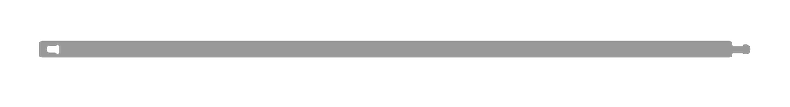
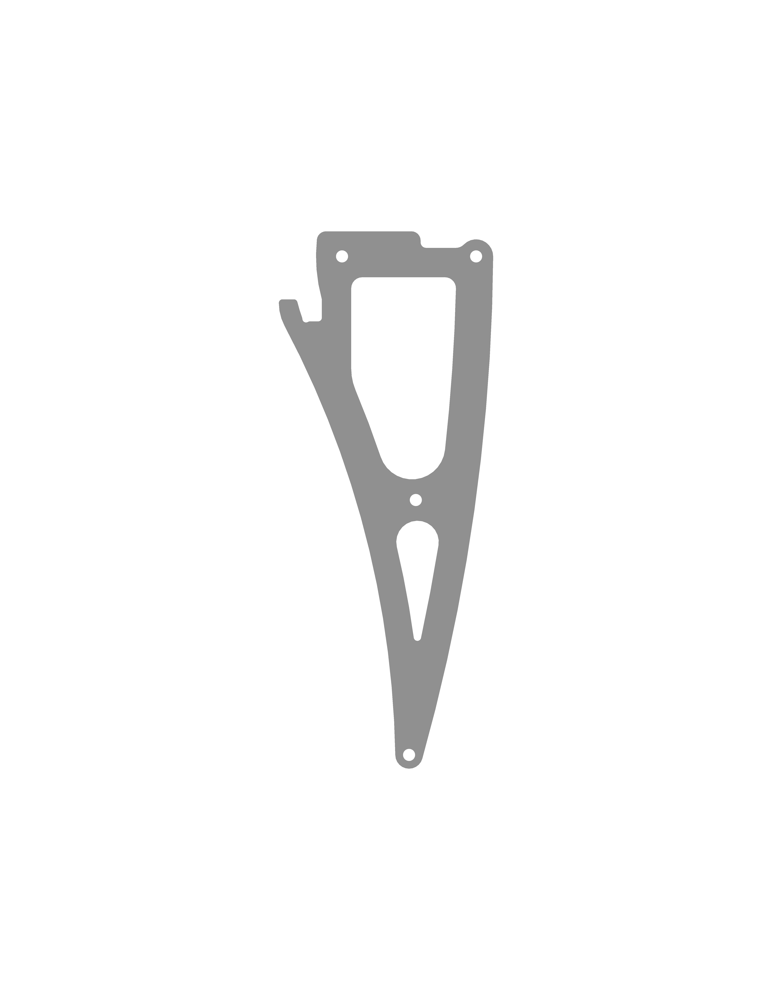

# Model files for parts

This page contains models and drawings of some of the drone parts. They can be used for 3D printing and/or laser cutting replacement parts.

## Clover 4.2

### Milling

<table>
    <tr><th width=150>Preview</th><th>Part</th><th width=1>File</th></tr>
    <tr>
        <td></td>
        <td>
            <b>Deck mount</b>. 
            Function: Deck for installing battery and Raspberry Pi 
            Material: Monolithic polycarbonate 2mm. 
            Quantity: 1 pcs.
        </td>
        <td><a href="https://github.com/CopterExpress/clover/raw/master/docs/assets/dxf/4.2/deck_mount.dxf"><code>deck_mount.dxf</code></a></td>
    </tr>
    <tr>
        <td></td>
        <td>
            <b>Deck mount small</b>. 
            Function: Deck for mounting FPV cameras and mounting stiffening plates. 
            Material: Monolithic polycarbonate 2mm. 
            Quantity: 1 pcs.
        </td>
        <td><a href="https://github.com/CopterExpress/clover/raw/master/docs/assets/dxf/4.2/deck_mount_small.dxf"><code>deck_mount_small.dxf</code></a></td>
    </tr>
    <tr>
        <td></td>
        <td>
            <b>Grab deck</b>. 
            Function: Deck for installing grippers and external peripherals (camera, rangefinder). 
            Material: Monolithic polycarbonate 2mm. 
            Quantity: 1 pcs.
        </td>
        <td><a href="https://github.com/CopterExpress/clover/raw/master/docs/assets/dxf/4.2/grab_deck.dxf"><code>grab_deck.dxf</code></a></td>
    </tr>
    <tr>
        <td></td>
        <td>
            <b>Led mount plate</b>. 
            Function: Fixing the LED strip. 
            Material: Monolithic polycarbonate 2mm. 
            Quantity: 1 pcs.
        </td>
        <td><a href="https://github.com/CopterExpress/clover/raw/master/docs/assets/dxf/4.2/led_mount_plate.dxf"><code>led_mount_plate.dxf</code></a></td>
    </tr>
    <tr>
        <td></td>
        <td>
            <b>Prop guard</b>. 
            Function: Prevent damage of propellers. 
            Material: Monolithic polycarbonate 2mm. 
            Quantity: 4 pcs.
        </td>
        <td><a href="https://github.com/CopterExpress/clover/raw/master/docs/assets/dxf/4.2/prop_guard.dxf"><code>prop_guard.dxf</code></a></td>
    </tr>
    <tr>
        <td></td>
        <td>
            <b>Prop guard mount</b>. 
            Function: Arc for securing the guard. 
            Material: Monolithic polycarbonate 2mm. 
            Quantity: 2 pcs.
        </td>
        <td><a href="https://github.com/CopterExpress/clover/raw/master/docs/assets/dxf/4.2/prop_guard_mount.dxf"><code>prop_guard_mount.dxf</code></a></td>
    </tr>
    <tr>
        <td></td>
        <td>
            <b>Small leg</b>. 
            Function: Standard footing element. 
            Material: Monolithic polycarbonate 2mm. 
            Quantity: 2 pcs.
        </td>
        <td><a href="https://github.com/CopterExpress/clover/raw/master/docs/assets/dxf/4.2/small_leg.dxf"><code>small_leg.dxf</code></a></td>
    </tr>
</table>

## Clover 4.2 WorldSkills

### Milling

<table>
    <tr><th width=150>Preview</th><th>Part</th><th width=1>File</th></tr>
    <tr>
        <td></td>
        <td>
            <b>Big leg</b>. 
            Function: Extended footing element. 
            Материал: Monolithic polycarbonate 2mm. 
            Quantity: 2 шт.
        </td>
        <td><a href="https://github.com/CopterExpress/clover/raw/master/docs/assets/dxf/4.2/big_leg.dxf"><code>big_leg.dxf</code></a></td>
    </tr>
    <tr>
        <td></td>
        <td>
            <b>Grip spacer</b>. 
            Function: spacer for the gripper plates. 
            Material: monolithic polycarbonate 2mm. 
            Quantity: 1 pcs.
        </td>
        <td><a href="https://github.com/CopterExpress/clover/raw/master/docs/assets/dxf/4.2/grip_spacer.dxf"><code>grip_spacer.dxf</code></a></td>
    </tr>
</table>

## Clover 4

### 3D print

* Battery holder – [`battery_holder.stl`](https://github.com/CopterExpress/clover/raw/master/docs/assets/stl/battery_holder.stl). Filament: PLA/ABS/SBS. Infill: 50% or more.

### Laser cut

* Reinforcing Pad – [`reinforcing_pad.dxf`](https://github.com/CopterExpress/clover/raw/master/docs/assets/dxf/reinforcing_pad.dxf)

## Contributed models for Clover 4

Reinforced mounting plate for [Jetson Nano](jetson_nano.md) and additional equipment by [Vyacheslav Buzov](https://t.me/buzyakabarbuzyaka).

### Laser cut

* Reinforced plate base (for Jetson Nano) – [`reinforced_plate_base.dxf`](https://github.com/CopterExpress/clover/raw/master/docs/assets/dxf/reinforced_plate_base.dxf)
* Reinforced plate rib – [`reinforced_plate_rib.dxf`](https://github.com/CopterExpress/clover/raw/master/docs/assets/dxf/reinforced_plate_rib.dxf) (x2)
* Camera pad for reinforced plate – [`reinforced_plate_camera_pad.dxf`](https://github.com/CopterExpress/clover/raw/master/docs/assets/dxf/reinforced_plate_camera_pad.dxf)

## Clover 3

### 3D print

* Camera case – [`camera_case.stl`](https://github.com/CopterExpress/clover/raw/master/docs/assets/stl/camera_case.stl). Filament: PLA/ABS/SBS.
* Camera mount – [`camera_mount.stl`](https://github.com/CopterExpress/clover/raw/master/docs/assets/stl/camera_mount.stl). Filament: PLA/ABS/SBS.
* Camera plate – [`camera_plate.stl`](https://github.com/CopterExpress/clover/raw/master/docs/assets/stl/camera_plate.stl). Filament: PLA/ABS/SBS.
* Mounting deck small – [`mounting_deck_small.stl`](https://github.com/CopterExpress/clover/raw/master/docs/assets/stl/mounting_deck_small.stl). Filament: PLA/ABS/SBS.

### Laser cut

* Big leg – [`big_leg.dxf`](https://github.com/CopterExpress/clover/raw/master/docs/assets/dxf/big_leg.dxf).
* Deck mount – [`deck.dxf`](https://github.com/CopterExpress/clover/raw/master/docs/assets/dxf/deck.dxf).
* Prop guard – [`prop_guard.dxf`](https://github.com/CopterExpress/clover/raw/master/docs/assets/dxf/prop_guard.dxf).
* Prop guard fork – [`prop_guard_mount.dxf`](https://github.com/CopterExpress/clover/raw/master/docs/assets/dxf/prop_guard_mount.dxf).
* Spacer – [`grab_spacer.dxf`](https://github.com/CopterExpress/clover/raw/master/docs/assets/dxf/grab_spacer.dxf).
* Leg – [`leg.dxf`](https://github.com/CopterExpress/clover/raw/master/docs/assets/dxf/leg.dxf).
* LED mount plate – [`led_mount_plate.dxf`](https://github.com/CopterExpress/clover/raw/master/docs/assets/dxf/led_mount_plate.dxf).
* Mounting deck small – [`mounting_deck_small.dxf`](https://github.com/CopterExpress/clover/raw/master/docs/assets/dxf/mounting_deck_small.dxf).

### Milling

* Central plate – [`central_plate.dxf`](https://github.com/CopterExpress/clover/raw/master/docs/assets/dxf/central_plate.dxf).
* Arm – [`arm.dxf`](https://github.com/CopterExpress/clover/raw/master/docs/assets/dxf/arm.dxf).
