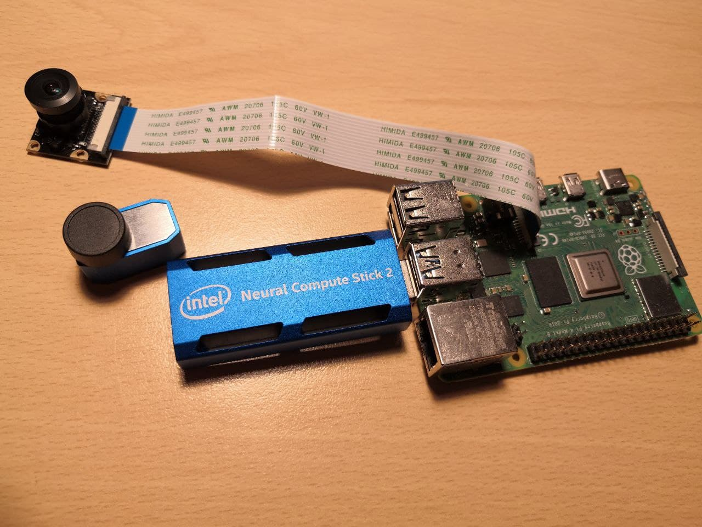

# Neural and vision-based landing method

[CopterHack-2022](copterhack2022.md), team Edgenoon.

## Team information

The list of team members:

* Bartosz Ptak, bartptak@gmail.com / @latajacy6, engineer and programmer.
* Mateusz Piechocki, piechocki.mateusz97@gmail.com, engineer and programmer.

## Project description

### Project idea

The project involves increasing the precision of landing (one of the most dangerous maneuvers for flying machines) under operational conditions on a mobile platform and taking care of safety in its vicinity.

Due to these reasons, we plan to implement autonomous landing on a specifically
designed pad that is marked with graphical elements, making it possible to recover
its relative pose and orientation. Additional safety measures will be
implemented - no landing is attempted if persons are present in the vicinity of the
landing pad. We want to achieve this using convolutional neural networks and USB
inference accelerators, for example, Neural Compute Stick 2 or Google Coral USB Accelerator.

### The potential outcomes

Precision landing is essential for building mobile flying robots. The use of classical
GPS or very costly GPS RTK allows you to move closer to the landing platform with
limited precision, while a vision-based system using deep neural networks will enable
not only precise landing without the need for tags, but will also take care of safety
in its area.

### Using Clover platform

The clover platform will be used as the basis for the safe testing of landing algorithms
in a real-world environment.

### Additional information at the request of participants

We are fresh Ph.D. students at Poznan University of Technology. We have successfully
developed an intelligent system based on a drone with an object detection algorithm
for waste detection. The system in 2021 was awarded 3rd prize during the Teknofest
festival’s “Free mission” contest in Turkey. Project website: [UAVVaste](https://uavvaste.github.io/).
