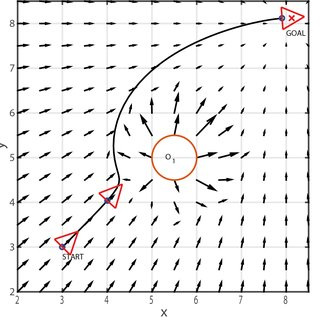

# Obstacle avoidance using artificial potential fields method

[CopterHack-2022](copterhack2022.md), team **Stereo**.

## Team information

The list of team members:

* Denis Konstantinov, @den_konstantinov, engineer and developer.

[The project repository is here](https://github.com/den250400/potential-fields-obstacle-avoidance)

## Project description


[This](https://github.com/den250400/potential-fields-obstacle-avoidance) repository contains obstacle avoidance system for quadcopters with Raspberry Pi 4 onboard computer. The code in this repository is designed to work with [Clover Raspberry Pi image](https://clover.coex.tech/en/image.html) and [special PX4-based firmware](https://clover.coex.tech/en/firmware.html) modified for easier communication with Raspberry Pi.

Artificial potential fields method is based on considering quadcopter, obstacles and target point as electric-charged points. Quadcopter and obstacles have positive charge, and target point is assigned with negative charge. This results in quadcopter "attracting" itself to the target point, while being repelled by the same-signed charges of obstacles. Using this analogy, you can compute a safe, collision-free trajectory, which can be executed by the vehicle.



It's obvious that you need some sort of geometrical information about the surrounding world if you want to avoid obstacles. This algorithm uses Intel RealSense D435 depth camera - it provides a 3D point cloud which can be easily used for potential fields computation.

## Installation

This guide is intended to be used on Ubuntu 20.04. Python version is 3.8.10, but it's very likely that it will work on other versions like 3.7, 3.9, 3.10 without any changes.

1. Install the [Clover simulator](https://clover.coex.tech/en/simulation.html).
2. Install [realsense_gazebo_plugin](https://github.com/issaiass/realsense_gazebo_plugin) and [realsense2_description](https://github.com/issaiass/realsense2_description):

    ```bash
    cd ~/catkin_ws/src
    git clone https://github.com/issaiass/realsense_gazebo_plugin
    git clone https://github.com/issaiass/realsense2_description
    cd ~/catkin_ws
    catkin_make
    ```

3. Replace your `~/catkin_ws/src/clover/clover_description` folder with one in this repository. This will add RealSense D435 to quadcopter model and make other minor changes so you will be able to reproduce our results.
4. Install all necessary Python packages

    ```bash
    pip3 install -r requirements.txt
    sudo apt-get install ros-noetic-ros-numpy
    ```

5. Make sure your `PYTHONPATH` env variable is set as

    ```bash
    PYTHONPATH=/home/<username>/catkin_ws/devel/lib/python3/dist-packages:/opt/ros/noetic/lib/python3/dist-packages
    ```

    If it's not, add the following paths to `PYTHONPATH`.

## Launch

Launch the clover simulator and spawn some obstacles:

```bash
roslaunch clover_simulation simulator.launch
```

Open another terminal window, and launch the takeoff script. The drone will arm its motors and take off to the altitude specified in takeoff.py script:

```bash
python3 ./scripts/takeoff.py
```

Then, you should open main.py script and specify the target point (as x, y, z array). It is defined on the line

```python
nav = AvoidanceNavigation(np.array([0, 0, 2]))
```

Finally, launch main.py to start the obstacle avoidance flight:

```bash
python3 main.py
```

## Obstacle avoidance algorithm description

This algorithm uses a point cloud produced by stereo camera to infer the flight path by simulating a motion of charged particle. Each point from the point cloud is considered as obstacle, and repels the vehicle with the force directed in 'point->vehicle' direction. The repelling force has a magnitude `q_repel / dist` (dist is distance from vehicle to point). Similarly, an attraction point attracts the vehicle with the constant magnitude of `q_attract`. **The sum of these force vectors is the desired flight direction.**. The speed of a particle is set as `speed` argument of `AvoidanceNavigation` and directed along the resulted force vector. This way, we get a motion equation which we can solve numerically. Now, we have the trajectory which can be executed by the vehicle.

The algorithm is still in development, so we can't guarantee that default parameters will work in all cases. However, you may tweak the parameters yourself. Here is a brief description of each parameter in descending order of importance:

* `speed` - if your vehicle systematically crashes, the first thing you should do is to decrease the flight speed. Values of 1.5-2 m/s show good performance on most obstacle types
* `dist_threshold` - this sets a 'sphere of influence' for individual obstacle point. Larger values of this parameter will result in trajectories with bigger margin from obstacle
* `lead` - this is a smoothing factor of trajectory execution. If this value is too big, vehicle will ignore sharp obstacle avoidance maneuvers and risks crashing into a small/thin obstacle. If this value is too small, vehicle will fly too wobbly.
* `q_repel` - the strength of repelling force is determined by this parameter.
