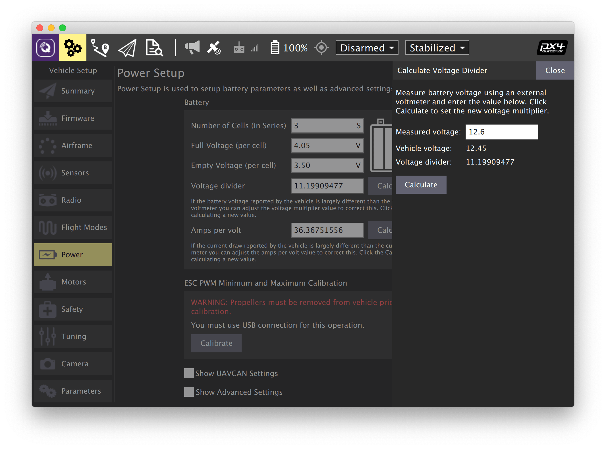
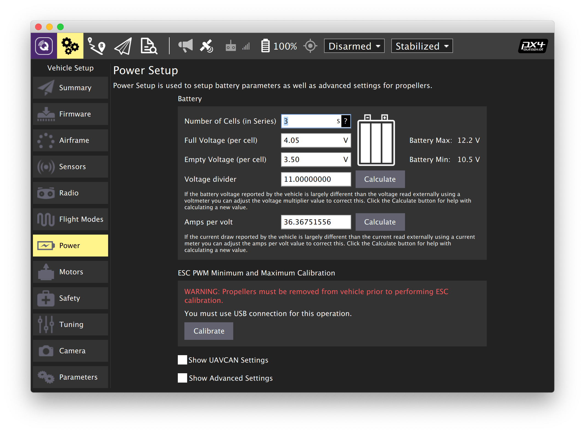

# Power setup

Open the *Vehicle Setup* tab and select the *Power* menu.

## Calibrating the power sensor

> **Note** Power sensor calibration should be done with the battery pack connected to the drone.

If there is no voltage indicator or manual calibration is not possible, set the average value of the voltage divider for the Clover 4 kit (*Voltage divider* = 11).

1. Set the *Number of cells* parameter according to the number of cells in your battery (*3* for the Clover 4 drone).
2. Calculate the voltage divider:
    * Measure voltage across the battery (you may use a battery voltage tester for that).
    * Press the *Calculate* button next to the *Voltage divider* label.
    * Put the battery voltage into the prompt and click *Calculate*.
    * Press *Close* to save the calculated value.

Further reading: https://docs.qgroundcontrol.com/en/SetupView/Power.html.

## ESC calibration

> **Warning** **Never attempt ESC calibration with propellers on!** In some cases the motors will start spinning with maximum speed.

1. Make sure the battery is disconnected and the propellers are not mounted.
2. Press *Calibrate*.
3. Connect the battery when prompted.
4. Wait for the *Calibration complete*.

Further reading: https://docs.px4.io/v1.9.0/en/advanced_config/esc_calibration.html.

**Next**: [Failsafe configuration](failsafe.md)
