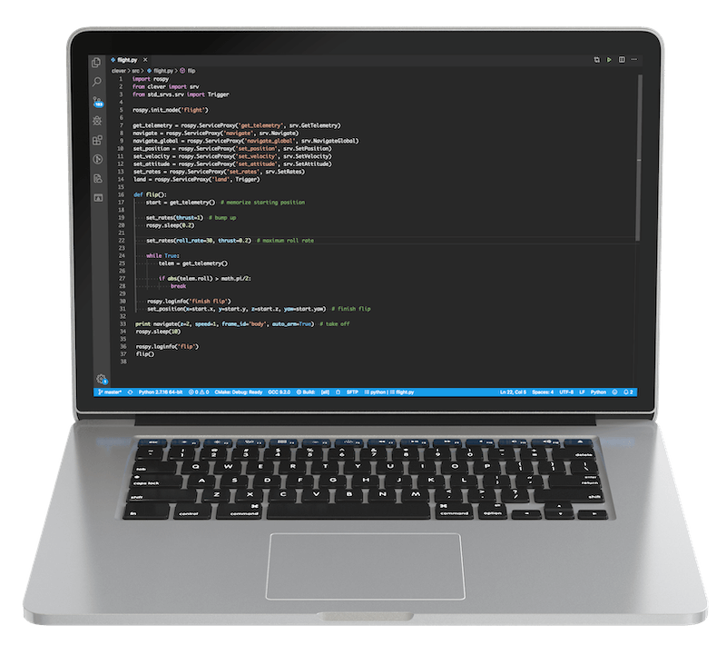

# Programming



The Clover platform allows a [Raspberry Pi](raspberry.md) computer to be used for programming autonomous flights. The flight program is typically written using the Python programming language. The program may [receive telemetry data](simple_offboard.md#get_telemetry) (which includes battery data, attitude, position, and other parameters) and send commands like: [fly to a point in space](simple_offboard.md#navigate), [set attitude](simple_offboard.md#set_attitude), [set angular rates](simple_offboard.md#set_rates), and others.

The platform utilizes the [ROS framework](ros.md), which allows the user program to communicate with the Clover services that are running as a `clover` systemd daemon. The [MAVROS](mavros.md) package is used to interact with the flight controller.

PX4 uses [OFFBOARD mode](modes.md#auto) for autonomous flights. The Clover API can be used to transition the drone to this flight mode automatically. If you need to interrupt the autonomous flight, use your flight mode stick on your RC controller to transition to any other flight mode.

## Positioning system {#positioning}

A drone has to use a positioning system to be able to hover still or to fly from point to point. The system should compute the drone position and feed this data into the flight controller. Clover allows using multiple positioning systems, such as [optical flow](optical_flow.md) (requires a [camera](camera.md) and a [rangefinder](laser.md)), [fiducial markers](aruco.md) (requires a camera and markers), GPS and others.

### Optical flow

Optical flow is used to compute shifts between consecutive frames and to use this data to compute the drone shifting in space.

Read more in the [Optical Flow article](optical_flow.md).

### ArUco markers

Fiducial markers allow the drone to compute its position relative to these markers. This data may then be transferred to the flight controller.

Read more about [ArUco markers](aruco.md) in our articles about them.

### GPS (outdoor flight)

GPS allows you to specify global Earth coordinates (latitude and longitude). The [`navigate_global`](simple_offboard.md#navigate_global) function takes these as parameters instead of the usual cartesian coordinates.

Read more in the [GPS connection](gps.md) article.

## Autonomous flight {#flight}

> **Info** For studying Python programming language, see [tutorial](https://www.learnpython.org/en/Welcome).

After you've configured your positioning system, you can start writing programs for autonomous flights. Use the [SSH connection to the Raspberry Pi](ssh.md) to run your scripts.

Before the first flight it's recommended to check the Clover's configuration with [selfcheck.py utility](selfcheck.md):

```bash
rosrun clover selfcheck.py
```

In order to run a Python script use the `python3` command:

```bash
python3 flight.py
```

Below is a complete flight program that performs a takeoff, flies forward and lands:

```python
import rospy
from clover import srv
from std_srvs.srv import Trigger

rospy.init_node('flight')

get_telemetry = rospy.ServiceProxy('get_telemetry', srv.GetTelemetry)
navigate = rospy.ServiceProxy('navigate', srv.Navigate)
navigate_global = rospy.ServiceProxy('navigate_global', srv.NavigateGlobal)
set_position = rospy.ServiceProxy('set_position', srv.SetPosition)
set_velocity = rospy.ServiceProxy('set_velocity', srv.SetVelocity)
set_attitude = rospy.ServiceProxy('set_attitude', srv.SetAttitude)
set_rates = rospy.ServiceProxy('set_rates', srv.SetRates)
land = rospy.ServiceProxy('land', Trigger)

# Takeoff and hover 1 m above the ground
navigate(x=0, y=0, z=1, frame_id='body', auto_arm=True)

# Wait for 3 seconds
rospy.sleep(3)

# Fly forward 1 m
navigate(x=1, y=0, z=0, frame_id='body')

# Wait for 3 seconds
rospy.sleep(3)

# Perform landing
land()
```

> **Note** The `navigate` function call is not blocking; that is, the program will continue executing the next commands before the drone arrives at the set point. Look at the [`navigate_wait`](snippets.md#navigate_wait) snippet for a blocking function.

Note that only the first `navigate` call has its `auto_arm` parameter set to `True`. This parameter arms the drone and transitions it to the OFFBOARD flight mode.

The `frame_id` parameter specifies which frame of reference will be used for the target point:

* `body` is rigidly bound to the drone body;
* `navigate_target` has its origin at the last target point for `navigate`;
* `map` is the drone's local frame;
* `aruco_map` is bound to the ArUco marker map;
* `aruco_N` is bound to the marker with ID=N.

Read more in the [coordinate systems](frames.md) article.

You can also use the ["Autonomous flight"](simple_offboard.md) article as an API reference.

> **Hint** Clover supports [blocks-based programming](blocks.md) as well.

## Additional periphery

The Clover platform also exposes APIs for interacting with other peripherals. Read more in the following articles:

* [LED strip](leds.md);
* [laser rangefinder](laser.md);
* [GPIO](gpio.md);
* [ultrasonic rangefinder](sonar.md);
* [camera](camera.md).
