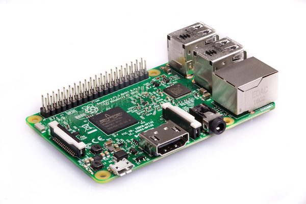

Raspberry Pi
============

**Raspberry Pi** is a single-board computer that fits in the palm, created on the basis of mobile microprocessor ARM11. It features low energy consumption, and it can even run on solar panels. Raspberry Pi 3 is included in the kits for programmable quadcopters "Clever 2" and "Clever 3".

* Weight is 45 grams.
* Clock rate is 1.2 GHz.
* Graphics core in the Broadcom BCM2837 processor.
* RAM is 1 GB.
* Four USB 2.0 ports.
* An HDMI port.

The scope of Raspberry Pi computer application is quite wide, since after all it is quite a full-fledged computer. If you need a machine to solve simple problems that do not require too many resources in terms of calculations, you can safely connect your Raspberry Pi device to the standard PC elements: a monitor, a mouse, or a keyboard.

The Raspberry Pi is a very popular platform where you can implement a variety of projects, such as:

* a home automation server (or a "smart house" system);
* a data storage server (NAS);
* a home media server;
* a "think-tank" for automated machines or robots.

In fact, we will use it as the last in the list, due to its ability to connect to the Pixhawk autopilot.

See more:

* [RPi image](microsd_images.md)
* [SSH access](ssh.md)
* [Network setup](network.md)
