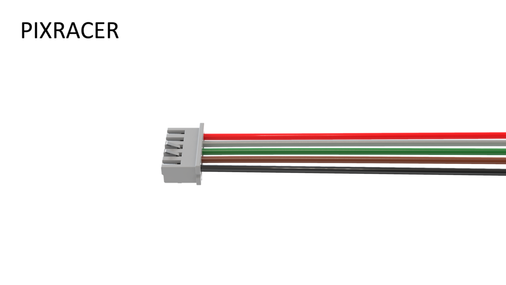
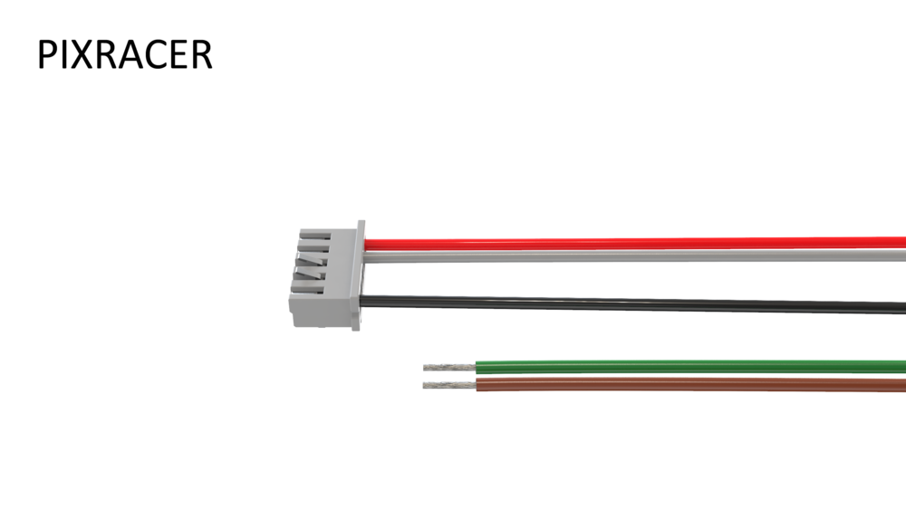
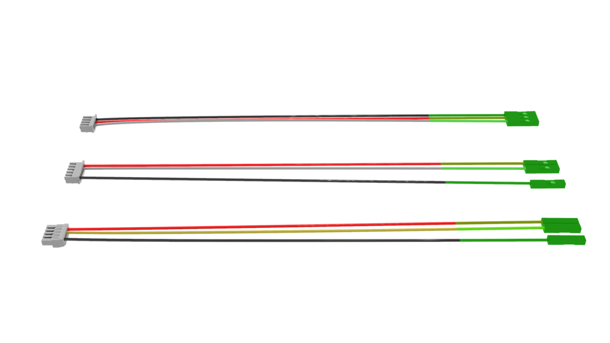
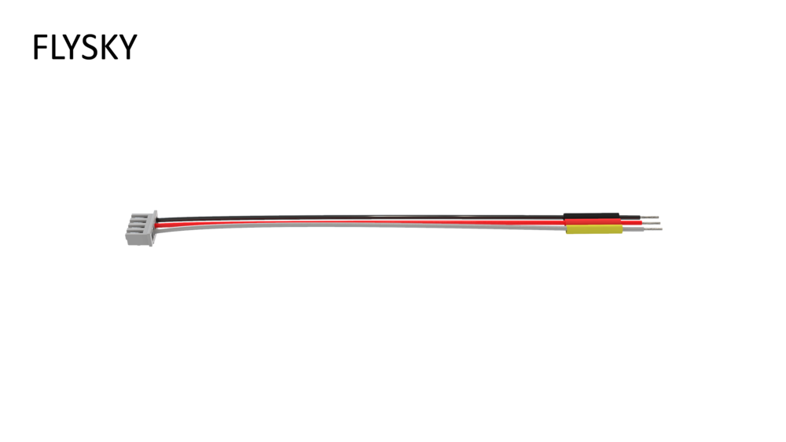
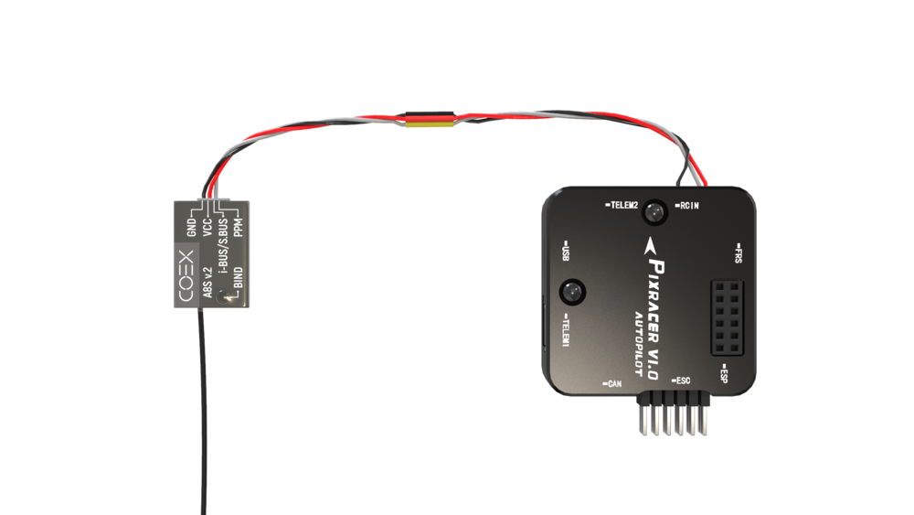
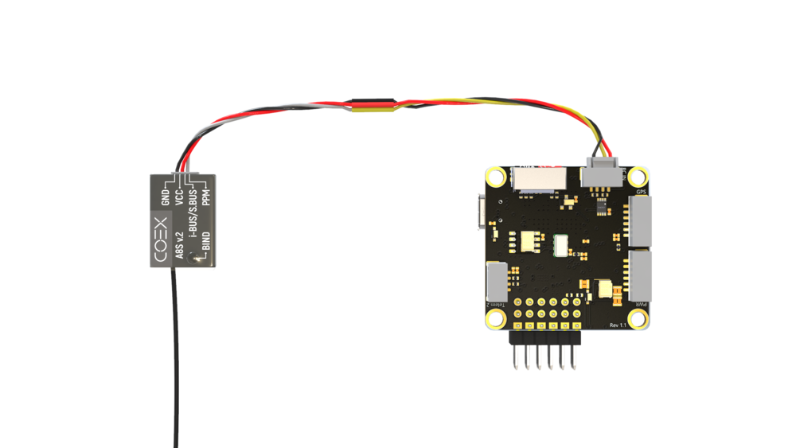
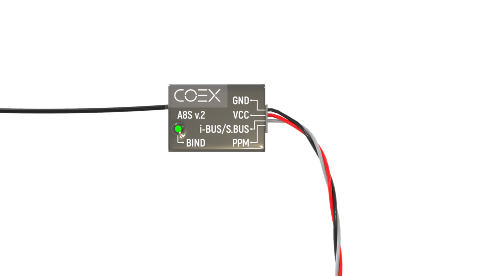
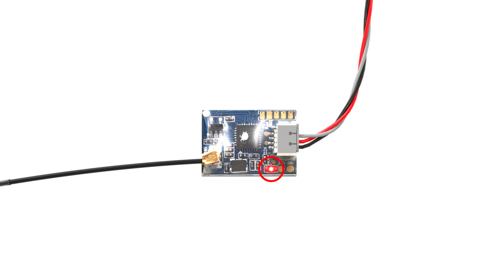

# Using Flysky FS-A8S

The Flysky FS-A8S receiver is compatible with the Flysky FS-i6 and FS-i6x transmitters. The receiver can output both analog PPM and digital S.Bus/i-Bus signals to the flight controller.

S.Bus is the preferred protocol for the receiver.

## Making a cable

> **Note** You don't need to follow these steps if you already have the right cable; read on to learn [how to bind your transmitter](#rc_bind).

1. Gently remove the yellow wire from the receiver connector. Use sharp tweezers to lift up the plastic wire lock:

    

        
        
    

2. [Pixracer only] Remove the green and brown wires from the 5-pin connector:

    

        
        
    

3. [COEX Pix only] Remove the green wire (or blue if the green one is not present) from the 4-pin connector:

    

        
        
    

4. Use side cutters to cut the Dupont connectors:

    

        
        
    

5. Strip and tin 5-7 mm of wire from each side:

    

6. Put heat shrinking tubes on the wires:

    

7. Solder the following wires:
    * black wire from the receiver connector to the black wire from the flight controller connector;
    * red wire from the receiver connector to the red wire from the flight controller connector;
    * white wire from the receiver connector to the white (if you're using Pixracer) or yellow (if you're using COEX Pix) wire from the flight controller connector:

    

8. Put the heat shrinking tubes on the solder joints and heat them:

    

9. Twist your new cable:

    

Connect your receiver to the RC IN port on your flight controller:

    
    

> **Hint** Double check that you're using the RC IN port on the COEX Pix:

## Binding your transmitter {#rc_bind}

Do the following to bind your transmitter to the FS-A8S receiver:

1. Make sure your flight controller is powered off.
2. Hold the **BIND** button on the receiver:

    

3. Turn on the flight controller. The LED light on the receiver should blink fast, about 3 times per second.

    

4. Hold the **BIND KEY** on your transmitter and power it on. You should see a message saying **RX Binding...**

    

5. The LED light on the receiver should start blinking slowly, about once per second.

    

6. Turn your transmitter off and on again. The LED light on the receiver should glow steadily.

    

> **Note** This receiver does not send any telemetry data back to the transmitter. Your transmitter will not display any data like RSSI and drone battery level on its screen. In fact, there will be no indication that the transmitter is connected to the receiver. This is not a malfunction, the controls will still work.

## Changing the receiver mode (S.Bus/i-Bus)

Connect your flight controller to your computer and open QGroundControl. In it, open the Radio tab:

If it shows zero channels under the transmitter image, hold the **BIND** key on the receiver for 2 seconds. You should then see 18 channels appear under the image:

