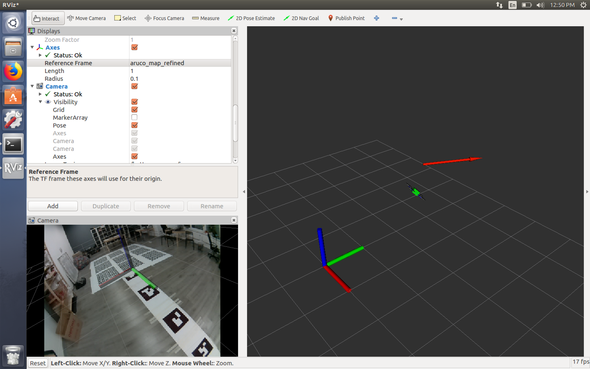
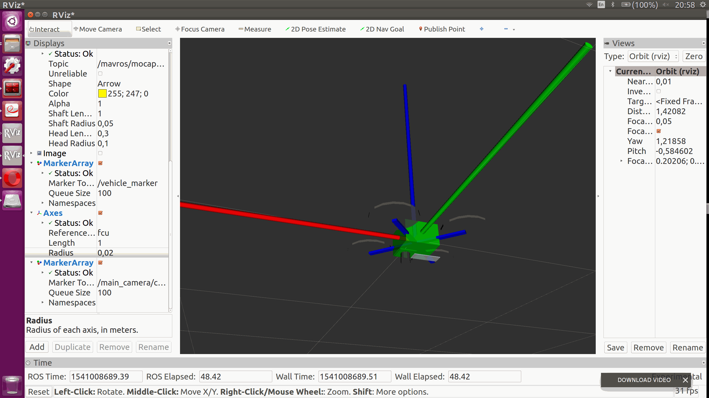
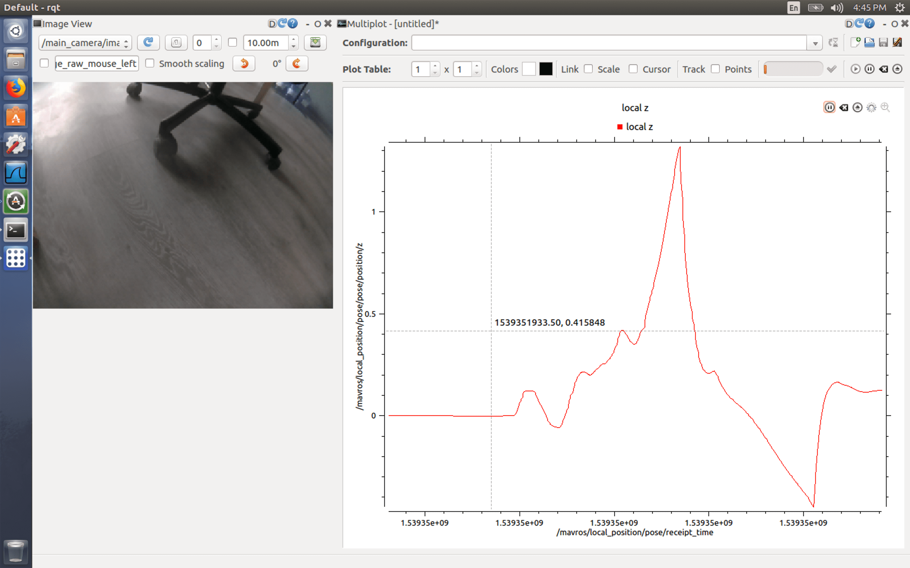

Using rviz and rqt
===



The [rviz](http://wiki.ros.org/rviz) tool allows real-time visualization of all components of the robotic system —the system of coordinates, moving parts, sensors, camera images — on the 3D stage.

[rqt](http://wiki.ros.org/rqt) is a set of GUI for analyzing and controlling ROS systems. For example, `rqt_image_view` allows viewing topics with images, `rqt_multiplot` allows plot charts by the values in topics, etc.

To use rviz and rqt, a PC running Ubuntu Linux (or a virtual machine such as [Parallels Desktop Lite](https://itunes.apple.com/ru/app/parallels-desktop-lite/id1085114709?mt=12) or [VirtualBox](https://www.virtualbox.org)) is required.

> **Hint** You can use the [preconfigured virtual machine image](simulation_vm.md) with ROS and Clover toolkit.

Install package `ros-melodic-desktop-full` or `ros-melodic-desktop` using the [installation documentation](http://wiki.ros.org/melodic/Installation/Ubuntu).

Start rviz
---

To start the Clover state visualization in real time, connect to it [via Wi-Fi](wifi.md) (`clover-xxxx`) and run rviz, specifying an appropriate ROS_MASTER_URI:

```(bash)
ROS_MASTER_URI=http://192.168.11.1:11311 rviz
```

> **Note** In case of using a virtual machine for using rviz and other tools it might be necessary to change its network configuration to *bridge* mode ([see details for VMware](https://docs.vmware.com/en/VMware-Workstation-Player-for-Windows/16.0/com.vmware.player.win.using.doc/GUID-826323AD-D014-475D-8909-DFA73B5A3A57.html)).

Using rviz
---

### Visualization of the copter position

It is recommended to set the `map` frame as a reference frame. To visualize the copter, add visualization markers from topic `/vehicle_markers`. To visualize the camera of the copter, add visualization markers from topic `/main_camera/camera_markers`.

The result of copter and camera visualization is shown below:



### Visualization of the environment

You can view a picture with augmented reality from the topic of the main camera `/main_camera/image_raw`.

Axis or Grid configured to frame `aruco_map` will visualize the location [on the map of ArUco marks](aruco.md).

### jsk_rviz_plugins

It is also recommended to install additional useful plugins for rviz [jsk_rviz_plugins](https://jsk-visualization.readthedocs.io/en/latest/jsk_rviz_plugins/index.html). This kit allows visualizing topics like `TwistStamped` (velocity) `CameraInfo`, `PolygonArray`, and many more. To install, use command:

```(bash)
sudo apt-get install ros-melodic-jsk-visualization
```

Starting the rqt toolkit
---



To start rqt for monitoring Clover status, use command:

```(bash)
ROS_MASTER_URI=http://192.168.11.1:11311 rqt
```

An example of starting a specific plugin (`rqt_image_view`):

```(bash)
ROS_MASTER_URI=http://192.168.11.1:11311 rqt_image_view
```

Brief description of useful rqt plugins:

* `rqt_image_view` – viewing images from topics like `sensor_msgs/Image`;
* `rqt_multiplot` – Building charts from the data from of arbitrary topics (installation: `sudo apt-get install ros-melodic-rqt-multiplot`);
* Bag – working with [Bag-files](http://wiki.ros.org/rosbag).
