# Seed spreading quadcopter

[CopterHack-2021](copterhack2021.md), team **MINIONS**.

Have you ever wondered what a world without trees would look like? Close your eyes, and try to imagine a desolate Earth. There'd be no more paper, and everyone would have to resort to technological use - that is, if anyone was left. Trees are a crucial factor to our existence not only because they produce paper, lumber and chewing gum, but because they serve an important role in the carbon cycle.

Ever since the industrial revolution between 1760 and 1840, the world has been in a never-ending carbon chaos. Trees and Plankton are our only saviours in terms of handling this problem, and we can only control one of them, trees.

We need to save trees by protecting them from the destructive human activities like clearance of forests, deforestation for urbanization, etc. Trees are the lungs for the earth. It is an important part of nature’s ecosystem. They balance the soil composition and also act as the barrier for wind and storm. Thus, they provide various uses to the ecosystem. For these reasons, it’s imperative that we save trees.

Since there are a lot of dangerous and difficult-to-reach landsides for humans to plant, the most viable alternative is to use drones for plantation in those regions.

Seed-firing drones will, as the name suggests, fire seeds into fertile soil to allow millions of trees to grow back after being cut down for industrial use. If the rate of planting exceeds the rate of cutting, eventually we will restore the trees we once felled.

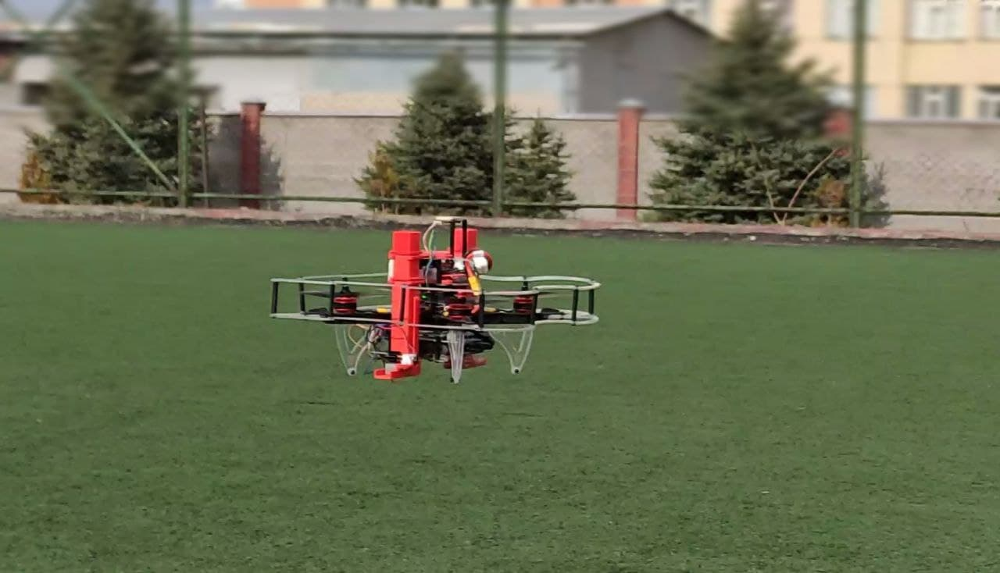

## Our Aim

We will make drones able to hold seeds onboard and drop them in an area which we drove in a special application. We can control the density of the seeds and the height of the drop. We also thought about protection of the seeds from insects, animals and dehydration. We choose the earth ball technique invented by Masanobu Fukuoka, aka Fukuoka Technique. This earth ball contains all needed elements to grow, plant seeds and earth for protection. When we drop it on the ground, the earth ball will hold seeds until it gets the needed amount of water and seeds will begin to grow.

YouTube video link - [https://www.youtube.com/embed/Nz1w59v451U](https://www.youtube.com/embed/Nz1w59v451U).

We achieved to do small seeding missions but we faced some problem about autonomous flying with GPS.

We coated our battery to protect it from cold weather, seeding missions need to start in winter since apple seeds need to stay in a cold place for some time to break dormancy.

- [Seed capsules](#seed-capsules)
- [How to assemble seeding mechanism to clover 4.2 drone](#how-to-assemble-seeding-mechanism-to-clover-42-drone)
- [How to control the seeding mechanism](#how-to-control-the-seeding-mechanism)
- [Programming](#programming)

## Files

Link for the all files used in this project: [https://github.com/Sahinysf/TreeSeedQuad](https://github.com/Sahinysf/TreeSeedQuad).

## Seed capsules

### Fukuoka technique

In southern Japan, the Japanese farmer and philosopher Masanobu Fukuoka invented a seed ball planting technique. The method is regarded as a natural farming technique that requires no machines, no chemicals and very little weeding. By the use of seed balls, land is cultivated without any soil preparation.

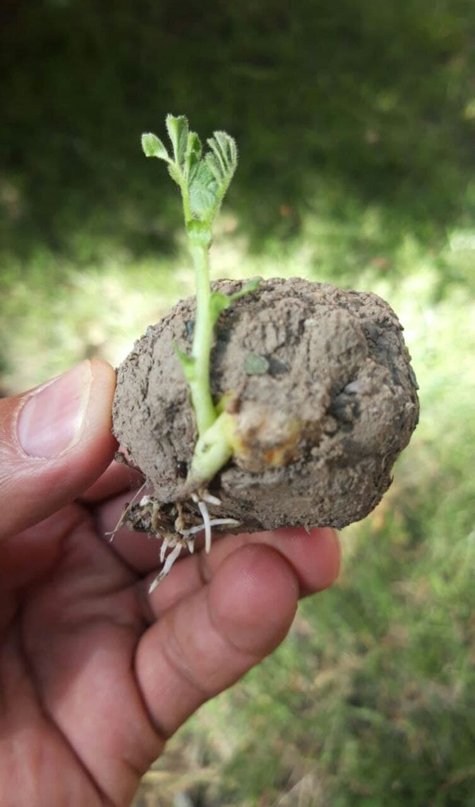

Advantages of seed balls:

- It is simple and easier to make seed balls without machines.
- Easier for reforestation and plantation in difficult terrains.
- Contribute to protect soil, environment and livelihood.
- It is an organic technique and doesn’t use any chemicals.
- It is a low-cost method compared to traditional afforestation/reforestation techniques.
- It requires low maintenance.

### Which Seeds can be used?

Any seed which grows in your area (In our it’s apple seed).

Size and weight of the seed capsule: size and Weight of seed capsules are very important for this project. After some experiments we decided that best size is 16-18mm  diameter and maximum weight is 10 g.

Required materials for making seed balls:

1. 1 bucket of clay
2. 1 bucket of organic dark soil / compost
3. 1 bucket of water (amount of water may vary depending on the soil type)
4. ¼ bucket of seeds

Steps for making seed balls:

1. Collect same quantity of both clay and organic soil. For example, if you use one bucket of clay, then you should mix with one bucket of organic soil.
2. Make sure that clay and organic soil fine particles.
3. The clay and organic soil texture should be wet but not sticky
4. Take a bit of mixture and roll it into balls. Test the ball by throwing it on a flat surface. If the ball doesn’t break easily, it means it has got good bonding.
5. Seed balls must be a perfectly round shape otherwise they will be stuck while throwing with the quadcopter
6. Insert seeds (1 to 2 seeds per seed ball for permanent trees such as mahogany, sandalwood, orange, moringa…) (± 5 seeds per seed ball for vegetables, flowers, grasses, clovers…)
7. Dry the seed balls for one to two days in a shaded area, if properly dry, the seed balls will be protected from external predators such as chickens, birds, rats…

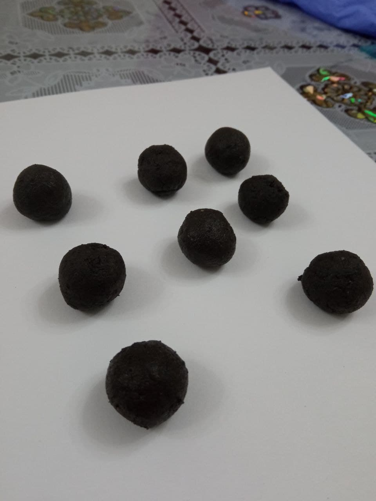

Second technique - paper seed capsules.

This method was influenced by a Korean newspaper that contained seed that could be planted outside after reading it.
                                                                                                                                                              Paper seed capsules :

Required materials:

1. Any kind of paper
2. Water
3. Blender
4. Seeds

Steps for making paper seed balls:

1. Shred all of your paper.
2. Put paper in blender and add water, after 2 minutes blend.
3. Squeeze all the water out with paper.
4. Add seeds and give round shape.
5. Let it dry overnight.

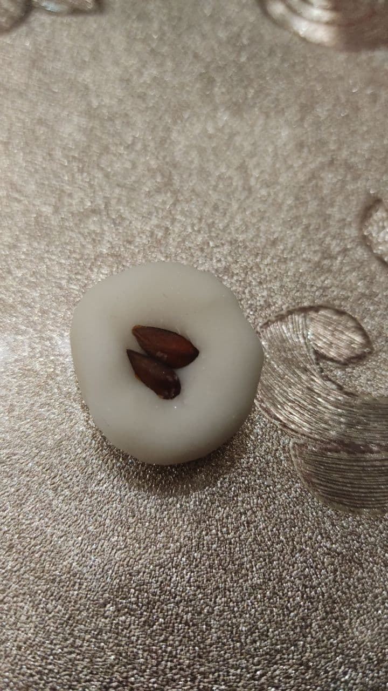

Advantages of paper balls:

- Easy to find materials.
- Environmentally friendly.

REREFENCES

<https://web.archive.org/web/20090115211020/http://www.rmaf.org.ph/Awardees/Biography/BiographyFukuokaMas.htm>
<http://www.guerrillagardening.org/ggseedbombs.html>

## How to assemble seeding mechanism to Clover 4.2 drone

### How to assemble seeding mechanism

After finishing step 4, at section Installing guard of Clover 4.2 assembly.

1. Install the Lower Tank Holders to top Deck mount and fix with the M3x8 screws.

    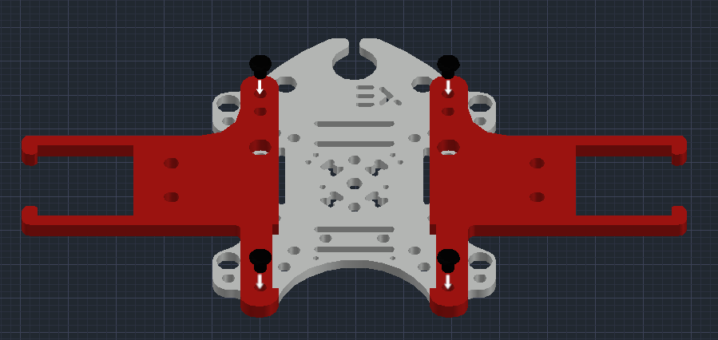

2. Install Nylon rack(40 mm) to 4 sides of the Deck mount.

    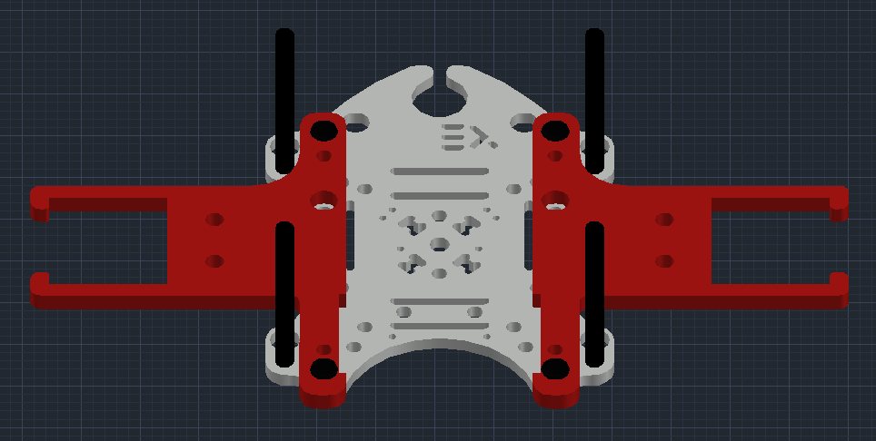

3. Install the Grab deck and fix with the M3x8 screws.

    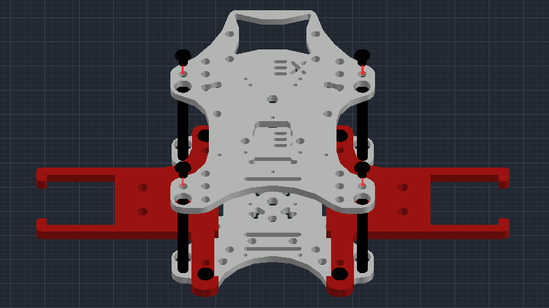

4. Install the Upper Tank Holders to top Grab mount and fix with the M3x8 screws.

    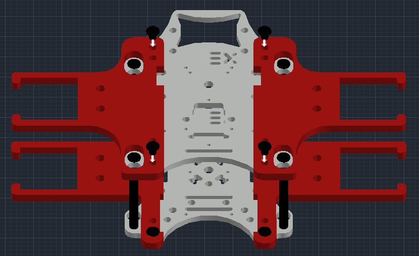

5. Connect the Tanks carefully to Tank Holders.

    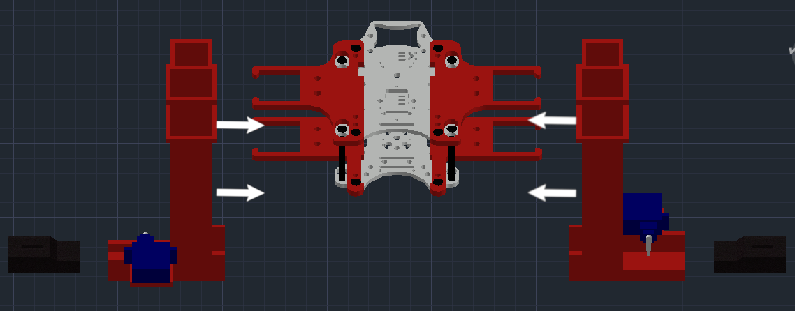

6. Connect SG90 servo motors to Tank using zip tie.

Final view of seeding drone:

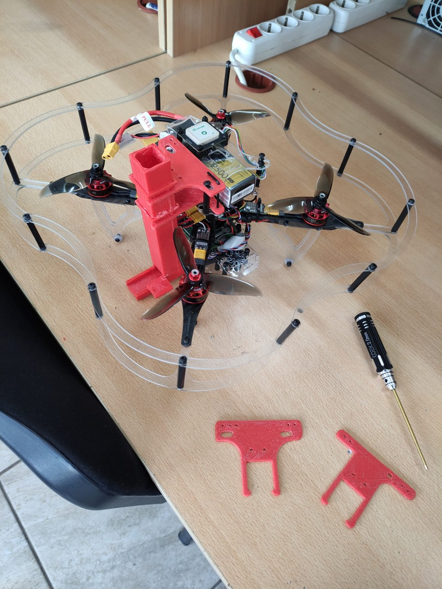

### GPS Module

We installed the GPS Module to the top using 2 Nylon rack (40 mm):

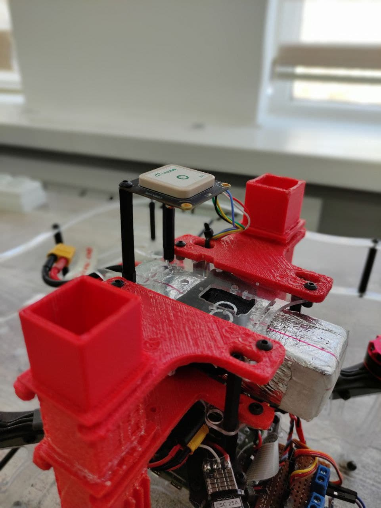

We coated the battery to protect it from the cold weather:


## How to control the seeding mechanism

Electronic part of seed dropping mechanism consists of:

- Raspberry Pi 4 B of COEX Clover 4.
- 2 Micro Servo Motors SG90.
- PDB (Power Distribution Board) of COEX Clover 4.

Servo motor’s signal pins are connected to Raspberry Pi’s Hardware PWM pins 32 and 33, and power is taken from Power Distribution Board (5 V).

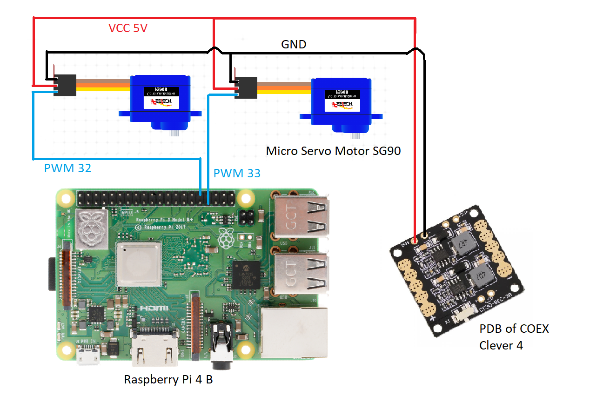

### Explanation of code for controlling servo motors

Servo motors are controlled using a PWM (Pulse-Width Modulation) signal from Raspberry Pi. PWM controls the amount of time when signal is HIGH or LOW within a certain period of time. Duty Cycle – percentage of time when signal is HIGH.

In a table below it's presented the duty cycle of Servo Motor SG90 of each angle of servo motor. In order to use duty cycle in code we need to convert time to percentage by dividing duty cycle time by the total PWM period.

What we get is:

- -90° rotation angle or 2ms Duty Cycle => 1/20*100% = 5% Duty Cycle.
- 90° rotation angle or 2ms Duty Cycle => 2/20*100% = 10% Duty Cycle.
- 0° rotation angle or 1,5ms Duty Cycle => 1,5/20*100% = 7,5% Duty Cycle.

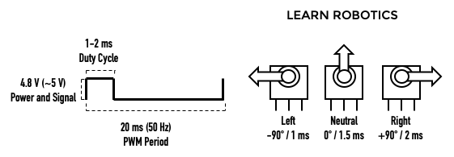

We’ll do this by using the RPi.GPIO library and writing Python code on the Raspberry Pi.

First, import the RPi.GPIO library and the sleep function:

```python
import RPi.GPIO as GPIO
from time import sleep
```

Then, setup the GPIO mode as BOARD:

```python
servo = 33
GPIO.setmode(GPIO.BOARD)
GPIO.setup(servo, GPIO.OUT)
```

Next, create a variable for the servo, PWM. Then, send a 50 Hz PWM signal on that GPIO pin using the `GPIO.PWM` function. Start the signal at 0:

```python
pwm=GPIO.PWM(servo, 50)
pwm.start(0)
```

Use the `ChangeDutyCycle` function to write duty cycle percentages to the servo motor.

```python
pwm.ChangeDutyCycle(5) # left -90 deg position
sleep(1)
pwm.ChangeDutyCycle(7.5) # neutral position
sleep(1)
pwm.ChangeDutyCycle(10) # right +90 deg position
sleep(1)
```

## Programming

In order for the mission to be achievable in the best way and within our reach, we were required to utilize the threading in Python.

Simple mission code:

```py
import threading
import time
import rospy
from clover import srv
from std_srvs.srv import Trigger
import RPi.GPIO as GPIO

rospy.init_node('flight')

get_telemetry = rospy.ServiceProxy('get_telemetry', srv.GetTelemetry)
navigate = rospy.ServiceProxy('navigate', srv.Navigate)
navigate_global = rospy.ServiceProxy('navigate_global', srv.NavigateGlobal)
set_position = rospy.ServiceProxy('set_position', srv.SetPosition)
set_velocity = rospy.ServiceProxy('set_velocity', srv.SetVelocity)
set_attitude = rospy.ServiceProxy('set_attitude', srv.SetAttitude)
set_rates = rospy.ServiceProxy('set_rates', srv.SetRates)
land = rospy.ServiceProxy('land', Trigger)

servo1 = 33        # PWM pins
servo2 = 32

GPIO.setmode(GPIO.BOARD)    #set pin numbering system

GPIO.setup(servo1,GPIO.OUT)
GPIO.setup(servo2,GPIO.OUT)

pwm1 = GPIO.PWM(servo1,50)    #create PWM instance with frequency
pwm2 = GPIO.PWM(servo2,50)

pwm1.start(0)        #start PWM of required Duty Cycle
pwm2.start(0)


def servo_drop(seconds):   #function to drop seed capsules from 2 tanks
    print("Dropping")

    i = 1                           #variable to choose which tank
    for num in range(seconds/2):
        if(i == 1):                 #first tank
            pwm1.ChangeDutyCycle(10) # release one seed capsule
            time.sleep(0.5)
            pwm1.ChangeDutyCycle(5) # push then drop the capsule
            time.sleep(0.5)
            i = 2                   #changing the variable for to use the second tank in next dropping

        elif(i == 2):               #first tank
            pwm2.ChangeDutyCycle(10) # release one seed capsule
            time.sleep(0.5)
            pwm2.ChangeDutyCycle(5) # push then drop the capsule
            time.sleep(0.5)
            i = 1                   #changing the variable for to use the first tank in next dropping

        print(num)
        time.sleep(2)


if name == "main":
    # Take off and drone 10m above the ground
    navigate(x=0, y=0, z=10, frame_id='body', auto_arm=True)

    # rospy waits for 10 seconds to take off
    rospy.sleep(10)

    # Dropping starts simultaneously with flying forwards 5 meters
    d = threading.Thread(target=servo_drop, args=(18,))  # 18 is the sum of all the time that the drone hovers after take off
    d.start()

    navigate(x=5, y=0, z=0, frame_id='body')

    #rospy waits for 8 seconds to fly forward
    rospy.sleep(8)

    # Fly right 1 m
    navigate(x=0, y=1, z=0, frame_id='body')

    #rospy waits for 2 seconds to fly right
    rospy.sleep(2)

    # Fly backward 5 m
    navigate(x=-5, y=0, z=0, frame_id='body')

    #rospy waits for 8 seconds to fly backward
    rospy.sleep(8)

    # Perform landing
    land()

pwm1.stop()
pwm2.stop()
GPIO.cleanup()
```

### References

- https://www.nationalgeographic.com/environment/article/deforestation
- http://www.fao.org/fileadmin/templates/rap/files/NRE/Forestry_Group/Landslide_PolicyBrief.pdf
- https://earthenginepartners.appspot.com/

## Developed by Team MINIONS

Special thanks to International Ala-Too University for funding the Clover 4 kits.


