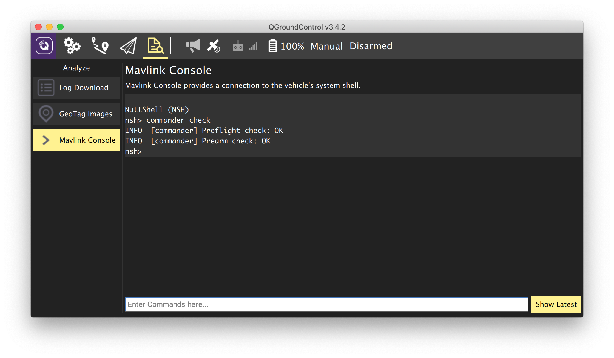

# Automatic check

It is generally a good idea to perform some checks before flight, especially before an autonomous one. There are several methods of automated self-checks of the drone subsystems.

## <span>selfcheck</span>.py

The `selfcheck.py` utility script is part of the `clever` package; it performs automated tests of the main aspects of the ROS platform and PX4. The utility is pre-installed on [the Raspberry Pi image](image.md).

In order to run it, enter the following command in [the Raspberry Pi console](ssh.md):

```(bash)
rosrun clever selfcheck.py
```


Description of some checks:

* FCU – checks for proper connection with the flight controller;
* IMU – checks whether the data from from IMU is sane;
* Local position – checks presence of local position data;
* Velocity estimation – checks whether drone velocity estimation is sane(**autonomous flight is not to be performed if this check fails!**);
* Global position (GPS) — checks for presence of global position data (GPS module is required for this check);
* Camera — checks for proper operation of the Raspberry camera.
* ArUco — checks whether [ArUco](aruco.md) detection is working
* VPE — checks whether VPE data is published
* Rangefinder — checks whether [rangefinder](laser.md) data is published

## commander check

In order check the main subsystems of PX4 and the possibility of arming at the moment you can run the `commander check` command in the MAVLink console.



If you're running SITL, you should use the terminal where PX4 simulation is running instead of the MAVLink console.
