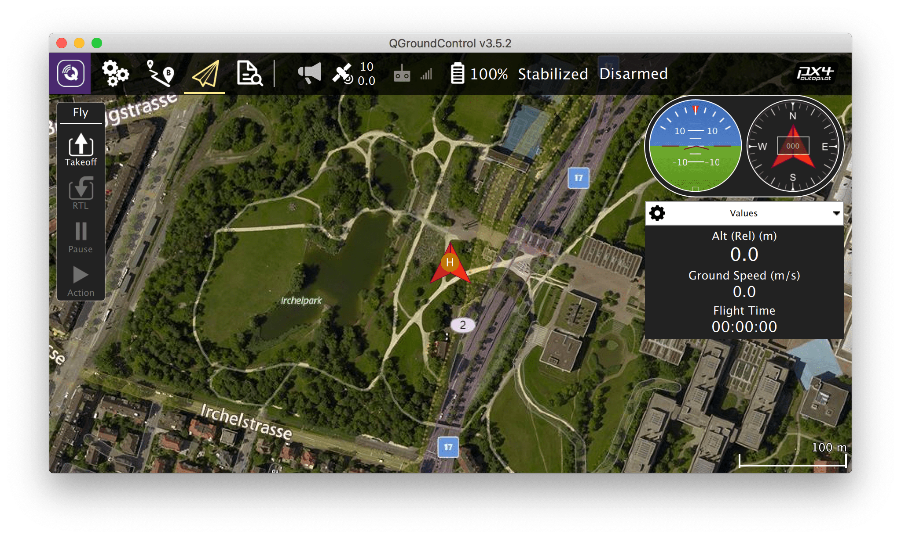
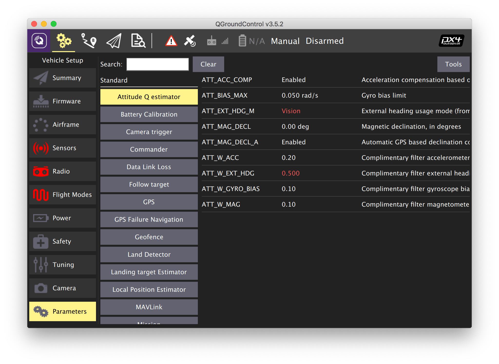

# Initial setup

## Installing QGroundControl

**QGroundControl** is a software package that can be used to flash, configure and calibrate the flight controller.

Download and install the version for your operating system [from the official QGroundControl website](https://docs.qgroundcontrol.com/en/getting_started/download_and_install.html). When asked, agree to install additional drivers.

Consult the [official QGroundControl user guide](https://docs.qgroundcontrol.com/en/) if anything goes wrong.

## Preparing the MicroSD card

Prepare the MicroSD card for your flight controller.

* Put the card into your computer (use an adapter if necessary).
* Format the card to FAT32 filesystem. Right click on the SD card icon in Windows Explorer and select "Format". Use the Disk Utility in macOS.
* Use "Safely Remove Hardware" and unplug the card.
* Put the card into your flight controller.

## Flashing the flight controller

Main article: https://docs.qgroundcontrol.com/en/SetupView/Firmware.html

> **Note** Do not connect your flight controller prior to flashing.

We recommend using the modified version of PX4 by CopterExpress for the Clover drone, especially for autonomous flights. Download the latest stable version **<a class="latest-firmware v4" href="https://github.com/CopterExpress/Firmware/releases">from our GitHub</a>**.

> **Info** For Pixhawk-based quadcopters there is a separate firmware version. See details in "[Pixhawk / Pixracer firmware flashing](firmware.md)" article.

Flash the flight controller with this firmware:

1. Launch QGroundControl software.
2. Open the *Vehicle Setup* tab.
3. Select the *Firmware* menu.
4. Connect your flight controller to your PC over USB.
5. Wait for the flight controller to connect to QGroundControl.
6. Select *PX4 Flight Stack* in the right bar.

To use the recommended Copter Express firmware:

* Check *Advanced Settings* checkbox.
* Select *Custom firmware file...* from the dropdown list.
* Press *OK* and select the file that you've downloaded.

To use the latest official stable firmware just press *OK*.

Wait for QGroundControl to finish flashing the flight controller.

> **Warning** Do not unplug the flight controller during the flashing process.

Read more about the firmware in the "[Pixhawk Firmware](firmware.md)" article.

## Configuring the flight controller

> **Hint** You can use the [Raspberry Pi to access the flight controller over Wi-Fi](gcs_bridge.md) for the rest of the setup process.

This is how the main QGroundControl settings window will look like:

1. Parameters that require setup: *Airframe*, *Radio*, *Sensors*, *Flight Modes*.
2. Current firmware version.
3. Current flight mode.
4. Error messages.

### Selecting the airframe

1. Open the *Vehicle Setup* tab.
2. Select the *Airframe* menu.
3. Select the *Quadrotor X* airframe type.
4. For Clover 4 select *COEX Clover 4* from the dropdown menu. Otherwise select *Generic Quadrotor X*.
5. Return to the top of the list and press *Apply and Restart* button, confirm by pressing *Apply*.
6. Wait for the settings to be applied and for the flight controller to restart.

### Setting parameters

Open the *Vehicle Setup* tab and select the *Parameters* menu. You can use the *Search* field to find parameters by name.

Press the *Save* button to save the changed value to the flight controller. Changing some parameters require rebooting the flight controller. You can do that by pressing the *Tools* button and selecting the *Reboot vehicle* option.

#### Configuring PID regulators

> **Info** Selecting *COEX Clover 4* frame subtype doesn't require setting PID coefficients.

##### Averaged PID coefficients for the Clover 4 drone

* `MC_PITCHRATE_P` = 0.087
* `MC_PITCHRATE_I` = 0.037
* `MC_PITCHRATE_D` = 0.0044
* `MC_PITCH_P` = 8.5
* `MC_ROLLRATE_P` = 0.087
* `MC_ROLLRATE_I` = 0.037
* `MC_ROLLRATE_D` = 0.0044
* `MC_ROLL_P` = 8.5
* `MPC_XY_VEL_P` = 0.11
* `MPC_XY_VEL_D` = 0.013
* `MPC_XY_P` = 1.1
* `MPC_Z_VEL_P` = 0.24
* `MPC_Z_P` = 1.2

##### Averaged PID coefficients for the Clover 3 drone

* `MC_PITCHRATE_P` = 0.145
* `MC_PITCHRATE_I` = 0.050
* `MC_PITCHRATE_D` = 0.0025
* `MC_ROLLRATE_P` = 0.145
* `MC_ROLLRATE_I` = 0.050
* `MC_ROLLRATE_D` = 0.0025

> **Hint** Note that you should fine-tune the PID parameters for each drone individually.  <!-- TODO: add PID article link -->

#### Circuit breaker parameters

1. Set `CBRK_USB_CHK` to 197848 to allow flights with the USB cable connected.
2. Disable safety switch check: `CBRK_IO_SAFETY` = 22027.

**Next**: [Sensor calibration](calibration.md).
