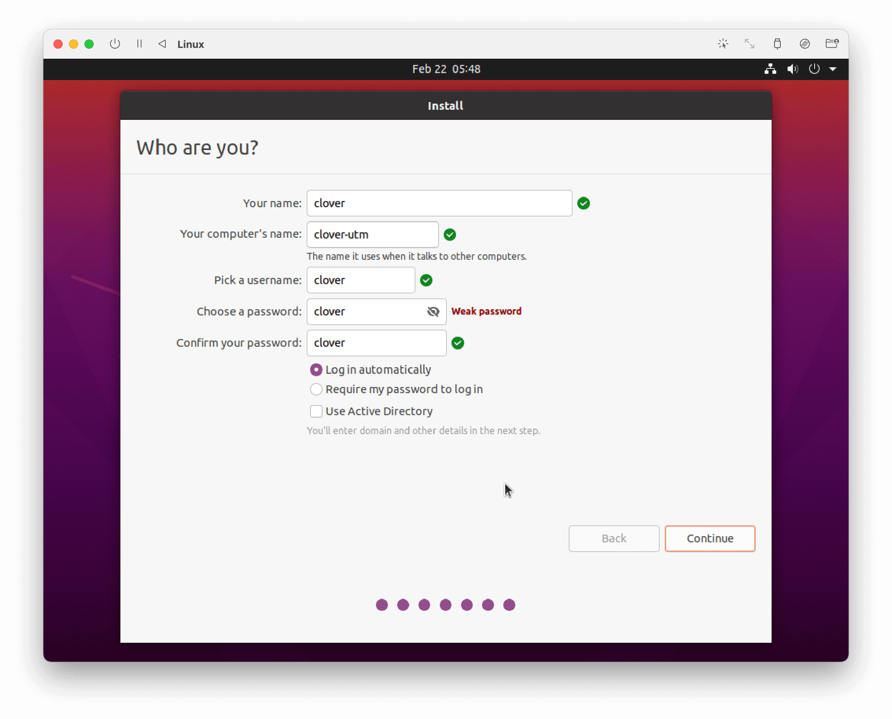

# Running simulator on M1 powered computer

There is no preconfigured VM image for ARM64 architecture of M1 chip (Apple Silicon), so the only possibility is to install the simulation software manually.

The recommended virtual machine hypervisor is [UTM app](https://mac.getutm.app/). Also it's possible to use **VMware Fusion Public Tech Preview** with M1 support.

## Simulation installation with UTM


1. Download UTM App from the official site [mac.getutm.app](https://mac.getutm.app/) and install it.
2. Download Ubuntu Linux 20.04 installation iso-file for ARM64 architecture using the link: https://clovervm.ams3.digitaloceanspaces.com/focal-desktop-arm64.iso.
3. Create a new virtual machine in UTM, using the following settings:

    * **Type**: Virtualize.
    * **Operating System**: Linux.
    * **Boot ISO Image**: choose downloaded file `focal-desktop-arm64.iso`.
    * **Memory**: 4096 MB or more.
    * **CPU Cores**: 4 or more.
    * Turn on *Enable hardware OpenGL acceleration* option.
    * **Storage**: 20 GB or more.

4. Run the created virtual machine.
5. Choose *Install Ubuntu* in the menu and install it using the installation master.

    * Recommended apps: *Minimal installation*.
    * Installation type: *Erase disk and install Ubuntu*.
    * Input your account parameters, for example:

        

6. Finish the installation and run the system (you need to eject the virtual CD or choose *Boot from next volume* in the boot menu).
7. Install the simulation using the [native setup manual](simulation_native.md).

### Troubleshooting

#### Black screen

If you see a black screen on your virtual machine, try to run the machine without the GPU support.

In virtual machine settings, choose *Display*, and set *Emulated Display Card* menu to *virtio-ramfb*. Run you machine. If it runs successfully, change the setting back to *virtio-ramfb-gl (GPU Supported)* and run it again.

#### Problem with `git clone`

The following error can occur while performing `git clone`:

```txt
on git clone if error: RPC failed; curl 56 GnuTLS recv error (-54): Error in the pull function.
fatal: the remote end hung up unexpectedly
fatal: early EOF
fatal: index-pack failed
```

In this case, change the type of the network card to bridged. In the virtual machine settings, choose *Network*, and set *Network Mode* menu to *Bridged (Advanced)*.

Later, if some network issues occur, change the network mode back to *Shared Network*.
