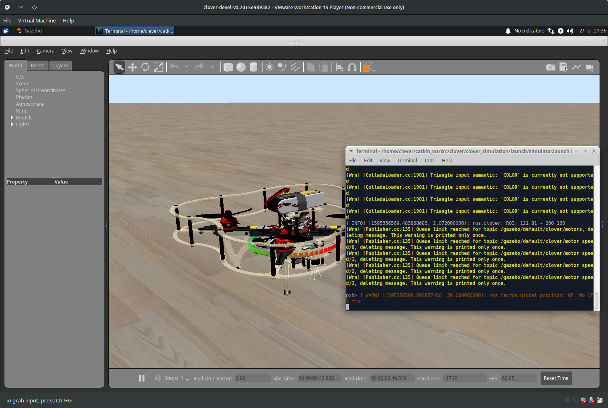
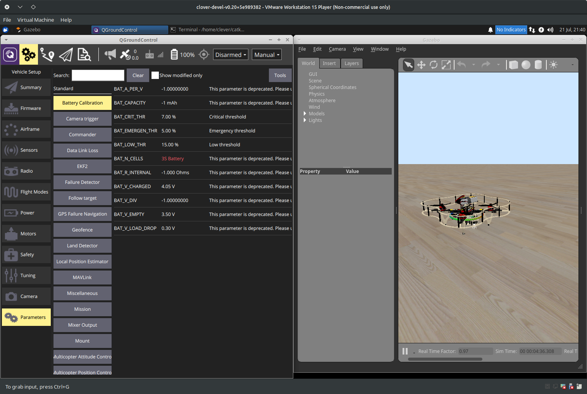
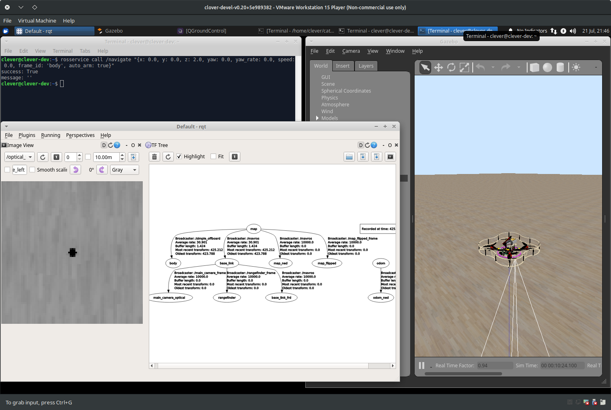
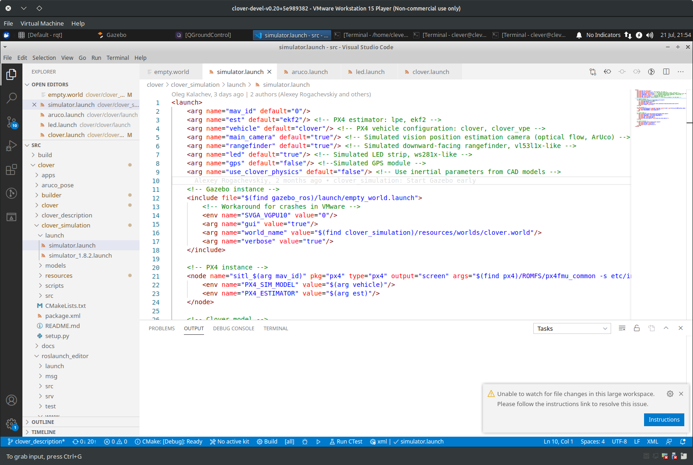

# Using the simulator

The Clover simulation environment allows the user to test their code without any risk of equipment damage. Additionally, the [virtual machine](simulation_setup_vm.md)-based environment has additional (non-ROS) services that are present on a real drone, like Monkey web server.

## Running the simulation

After [setting up the simulation packages](simulation_setup_native.md) or [importing and running the VM](simulation_setup_vm.md), you can use `roslaunch` to start Gazebo simulation:

```bash
# Be sure to activate your workspace first
source ~/catkin_ws/devel/setup.bash
roslaunch clover_simulation simulator.launch
```

> **Note** Alternatively, if you are using the VM, just double-click on the `Gazebo PX4` icon on the desktop.

This will launch Gazebo server and client, the PX4 SITL binary and Clover nodes. The terminal in which the command was run will display diagnostic messages from the nodes and PX4, and will accept input for the PX4 command interpreter:



You can use QGroundControl to configure the simulated drone parameters, plan missions (if GPS is simulated) and control the drone using a joystick:



You can also use [our simplified OFFBOARD control](simple_offboard.md) to control the drone, and traditional ROS GUI utilities like [rviz and rqt](rviz.md) to analyze the drone state:



## Configuring the simulation

The simulation can be configured by passing additional arguments to the `roslaunch` command or by changing the `~/catkin_ws/src/clover/clover_simulation/launch/simulator.launch` file. Nodes that provide [ArUco detection](aruco.md), [optical flow calculation](optical_flow.md) and other services can be configured by changing their respective `.launch` files, just like on a real drone.

### Changing the drone parameters



You can enable or disable some of the drone sensors by changing parameters in the `simulator.launch` file. For example, in order to enable GPS, set the `gps` argument to `true`:

```xml
    <arg name="gps" value="true"/>
```

Note that this will simply enable the sensor, you will have to change the PX4 estimator parameters to enable GPS fusion.

If you wish to add additional sensors or change their placement, you will have to change the drone description. The description file is located in `~/catkin_ws/src/clover/clover_description/urdf/clover/clover4.xacro`, and uses the [xacro](http://wiki.ros.org/xacro) format to build URDF description.

### Changing the default world

Gazebo plugins for the drone currently require the `real_time_update_rate` world parameter to be 250, and `max_step_size` to be 0.004. Using other values will not work. Consider using `~/catkin_ws/src/clover/clover_simulation/resources/worlds/empty.world` as a base.
