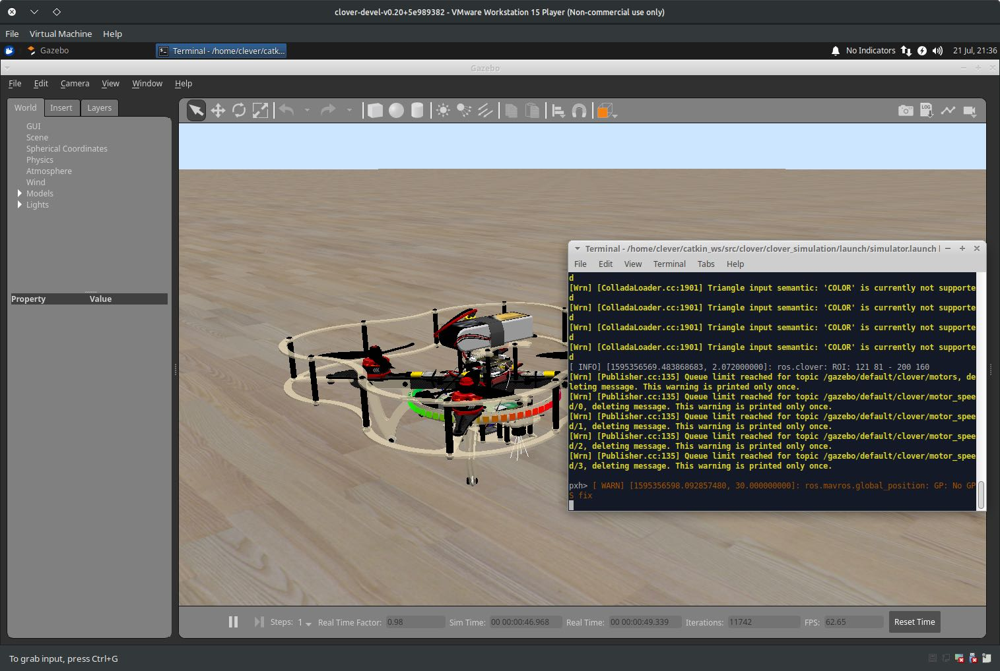
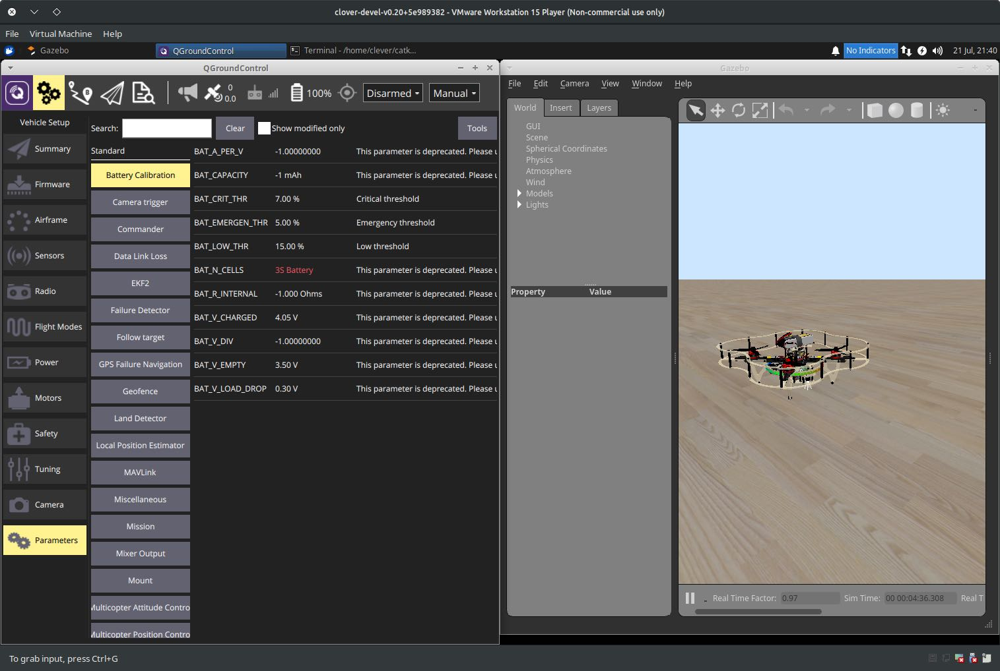
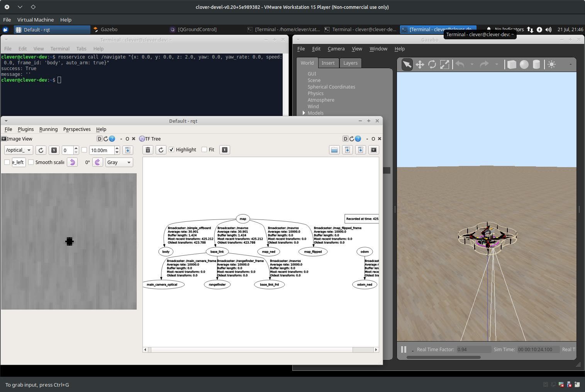
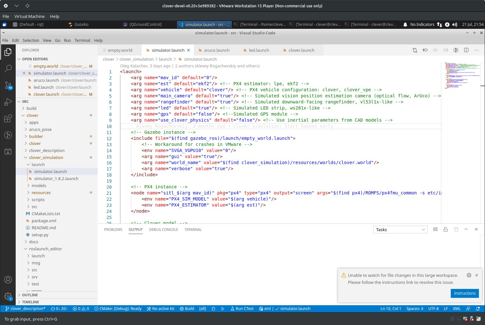
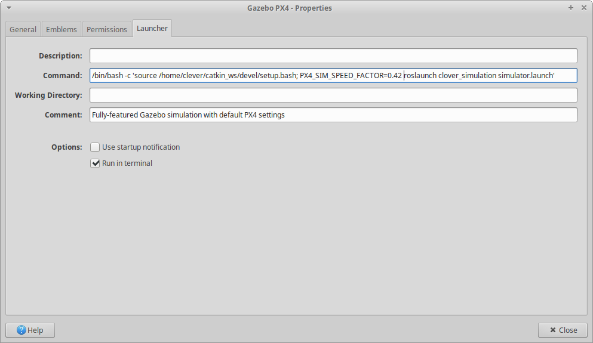

# Using the simulator

The Clover simulation environment allows the user to test their code without any risk of equipment damage. Additionally, the [virtual machine](simulation_vm.md)-based environment has additional (non-ROS) services that are present on a real drone, like Monkey web server.

## Running the simulation

After [setting up the simulation packages](simulation_native.md) or [importing and running the VM](simulation_vm.md), you can use `roslaunch` to start Gazebo simulation:

```bash
# Be sure to activate your workspace first
source ~/catkin_ws/devel/setup.bash
roslaunch clover_simulation simulator.launch
```

> **Note** Alternatively, if you are using the VM, just double-click on the `Gazebo PX4` icon on the desktop.

This will launch Gazebo server and client, the PX4 SITL binary and Clover nodes. The terminal in which the command was run will display diagnostic messages from the nodes and PX4, and will accept input for the PX4 command interpreter:



You can use QGroundControl to configure the simulated drone parameters, plan missions (if GPS is simulated) and control the drone using a joystick:



You can also use [our simplified OFFBOARD control](simple_offboard.md) to control the drone, and traditional ROS GUI utilities like [rviz and rqt](rviz.md) to analyze the drone state:



## Configuring the simulation

The simulation can be configured by passing additional arguments to the `roslaunch` command or by changing the `~/catkin_ws/src/clover/clover_simulation/launch/simulator.launch` file. Nodes that provide [ArUco detection](aruco.md), [optical flow calculation](optical_flow.md) and other services can be configured by changing their respective `.launch` files, just like on a real drone.



### Enabling GPS

In order to enable GPS sensor, set the `gps` argument in `simulator.launch` to `true`:

```xml
<arg name="gps" value="true"/>
```

### Camera

If you don't need the camera when flying using GPS, it may be disabled in `simulator.launch` file:

```xml
<arg name="main_camera" default="false"/>
```

### Another sensors

If you wish to add additional sensors or change their placement, you will have to change the drone description. The description file is located in `~/catkin_ws/src/clover/clover_description/urdf/clover/clover4.xacro`, and uses the [xacro](http://wiki.ros.org/xacro) format to build URDF description.

### Changing the default world

Gazebo plugins for the drone currently require the `real_time_update_rate` world parameter to be 250, and `max_step_size` to be 0.004. Using other values will not work. Consider using `~/catkin_ws/src/clover/clover_simulation/resources/worlds/clover.world` as a base.

## Performance suggestions

Gazebo simulation environment is resource-intensive, and requires a fast CPU and a decent GPU for real-time execution. However, the simulation may still work on less powerful systems at slower-than-realtime rate. Below are some suggestions for running Gazebo on hardware that does not allow realtime execution.

### Use `throttling_camera` plugin

By default, Gazebo does not slow simulation down for visual sensors. This can be remedied by using the `throttling_camera` plugin from `clover_simulation`.

You can enable it for the drone by changing the `maintain_camera_rate` argument to `true` in `clover_description/launch/spawn_drone.launch`:

```xml
    <!-- Slow simulation down to maintain camera rate -->
    <arg name="maintain_camera_rate" default="true"/>
```

The plugin will collect publishing rate statistics and slow the simulation down so that the camera publishing rate is no less than requested. However, large slowdowns may negatively affect non-ROS software that connects to PX4. If your simulation is being slowed down to values lower than 0.5 of realtime, consider using the next suggestion.

### Set simulation speed

Since v1.9 the PX4 SITL setup supports [setting the simulation speed](https://dev.px4.io/v1.9.0/en/simulation/#simulation_speed) by setting the `PX4_SIM_SPEED_FACTOR` environment variable. Its value is picked up by PX4 startup scripts, which in turn reconfigure it to expect a certain speedup/slowdown.

You should set its value to the actual real time factor that you get with `throttling_camera`. The real time factor may be found in the Gazebo GUI window at the bottom:


In this example you should set `PX4_SIM_SPEED_FACTOR` to `0.42` when launching the simulation:

```bash
PX4_SIM_SPEED_FACTOR=0.42 roslaunch clover_simulation simulator.launch
```

> **Note** If you are using the VM, it may be convenient to put the value in the Gazebo desktop shortcut. Right-click on the Gazebo icon, select "Properties..." and add `PX4_SIM_SPEED_FACTOR=0.42` to the Command field as follows:


### Allocate more resources to the VM

The virtual machine may benefit from several CPU cores, especially if the cores are not very performant. In our tests, a four-core machine with only a single core allocated to the VM was unable to run the simulation, with constant interface freezes and dropped ROS messages. The same machine with all four cores available to the VM was able to run the simulation at 0.25 real-time speed.

Do note that you should not allocate more resources than you have on your host hardware.
