# Simulation VM setup

In addition to [native installation instructions](simulation_native.md), we provide a [preconfigured developer virtual machine image](https://github.com/CopterExpress/clover_vm/releases/latest). The image contains:

* Ubuntu 20.04 with XFCE lightweight desktop environment;
* ROS packages required to develop for the Clover platform;
* QGroundControl;
* preconfigured Gazebo simulation environment;
* Visual Studio Code with C++ and Python plugins.

> **Info** The default username on the VM is `clover`, with password `clover`.

The VM is an easy way to set up a simulation environment, but can be used as a development environment for a real drone as well.

## Downloading

You can download the latest VM image [in the VM releases repository](https://github.com/CopterExpress/clover_vm/releases).

## Setting up the VM

You need to use a VM manager that supports OVF format, like [VirtualBox](https://www.virtualbox.org/wiki/Downloads), [VMware Player](https://www.vmware.com/products/workstation-player.html) or [VMware Workstation](https://www.vmware.com/products/workstation-pro.html).

Make sure that you have hardware virtualization enabled in your BIOS/UEFI (it may be supported by your hardware but turned off by default).

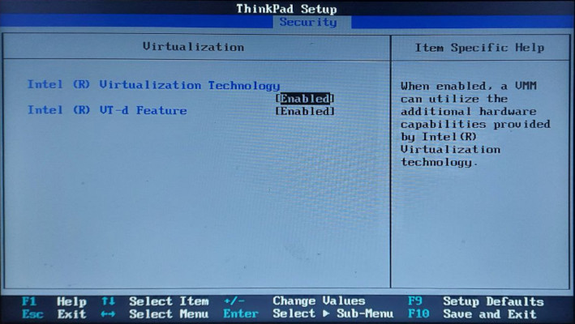

The steps to enable virtualization differ from manufacturer to manufacturer, but should be described in your system manual. Consult your system's manufacturer if you're having trouble turning virtualization on.

### Configuring virtual machine in the VMware Player environment

1. Import the OVA archive into your virtualization environment. Use the **Open a Virtual Machine** option in VMware Player:

    

    > **Note** You may see a dialog box with a warning about the VM format:
    
    You can safely ignore the warning and press **Retry**.

2. Right-click on the VM name and select **Virtual Machine Settings**. In the new window, set the following parameters:

    * increase the amount of memory available to the virtual machine (a good rule of thumb is 2048 MB per CPU core, but no less than 4 GB):
    
    * increase the amount available CPU cores:
    
    * enable 3D acceleration:
    
    * enable USB 2.0/3.0 controller  (if you plan to connect external devices to the VM):
    
    * optionally enable the "bridged" network connection (if you plan to connect to a real drone):
    

    > **Note** Some host network adapters may not work well with the bridged network. Consider using external USB Wi-Fi adapters managed by your VM to connect to a real drone.

3. "Power on" the virtual machine. You may see a warning message about your host system not providing 3D acceleration:

    

    Make sure you have the latest GPU drivers for your host system. If the warnings persist, add the following line to `clover-devel.vmx` (actual file name may differ based on the VM name):

    ```
    mks.gl.allowBlacklistedDrivers = "TRUE"
    ```

    You can find this file in a folder where the VM is imported to.

4. (Bridged networking only) Set up network bridge configuration in VM settings or using `vmware-netcfg` utility (in Linux):

    

    Select `vmnet0` in the networks list, set it to *Bridged*, and choose the adapter you are planning to use to connect to drone in the drop-down menu.

### Configuring virtual machine in the VirtualBox environment

Hereafter, a *laptop* will be understood as the *main system* in which the virtual machine is being created.

1. Import the virtual machine archive into the virtualization environment.

    * use the menu item **Open in VirtualBox** or double-click on the downloaded `clover-devel.ova` file:
    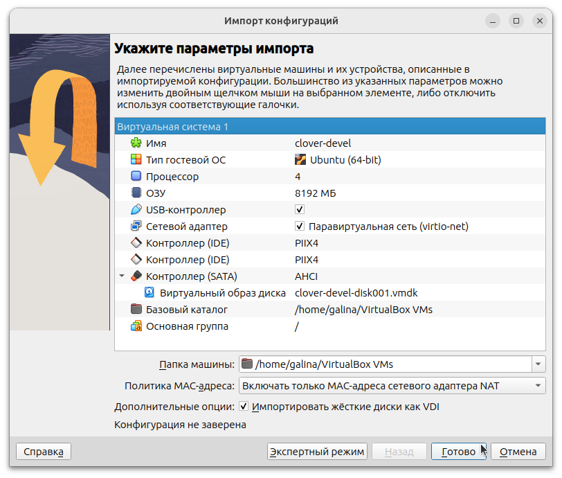
    * wait for the virtual machine import procedure to complete;
    * after the import is completed, the downloaded `clover-devel.ova` file can be deleted.

2. Open the virtual machine settings window and change the settings to best match the capabilities of the laptop:

    * increase the amount of RAM allocated to the virtual machine (recommended size is above 8GB):
    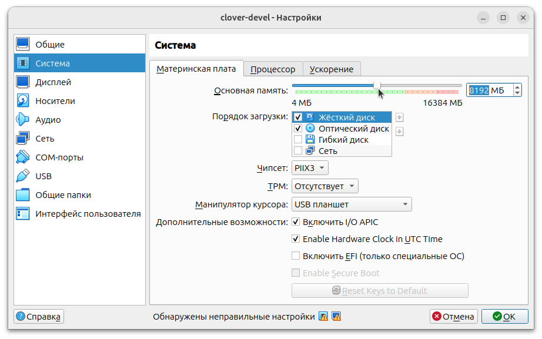
    * increase the number of available processor cores (it is recommended to allocate half of the processor cores from the available number in the laptop):
    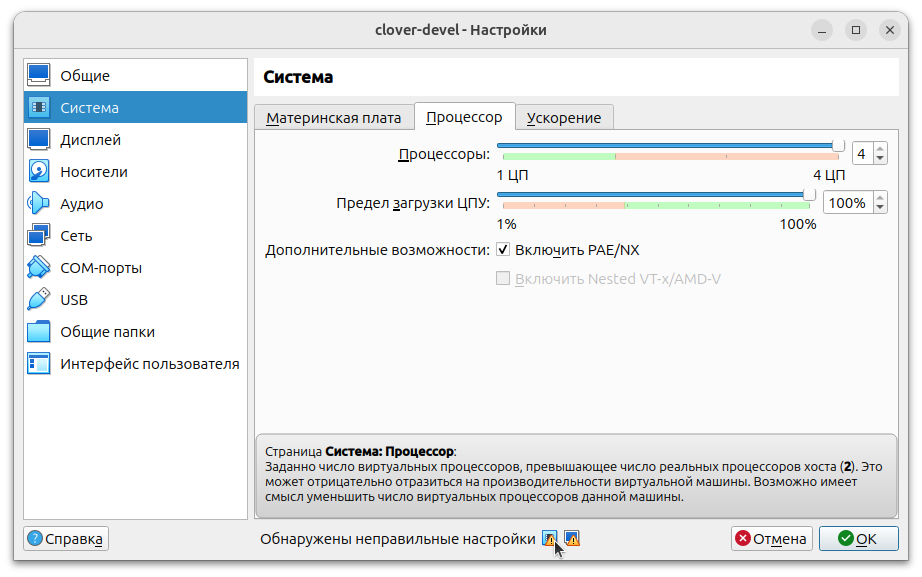
    * enable all available additional hardware acceleration features supported by your laptop:
    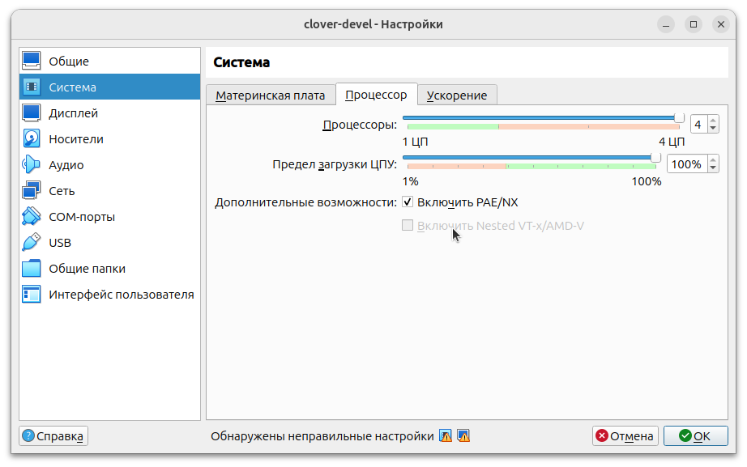
    * disable remote access to the virtual machine if you plan to use it on a laptop and not on the server:
    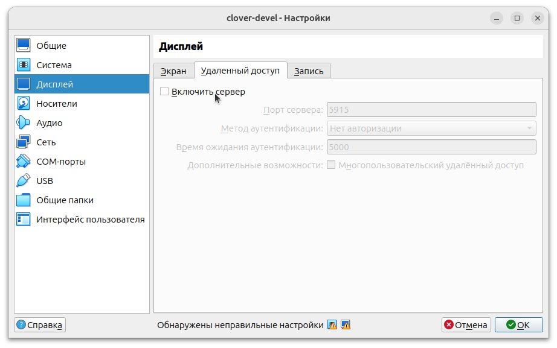
    * select the type of graphics controller `VMSVGA` (pay attention to the warning prompts at the bottom of the window, a different type of graphics controller may be recommended for use on your laptop):
    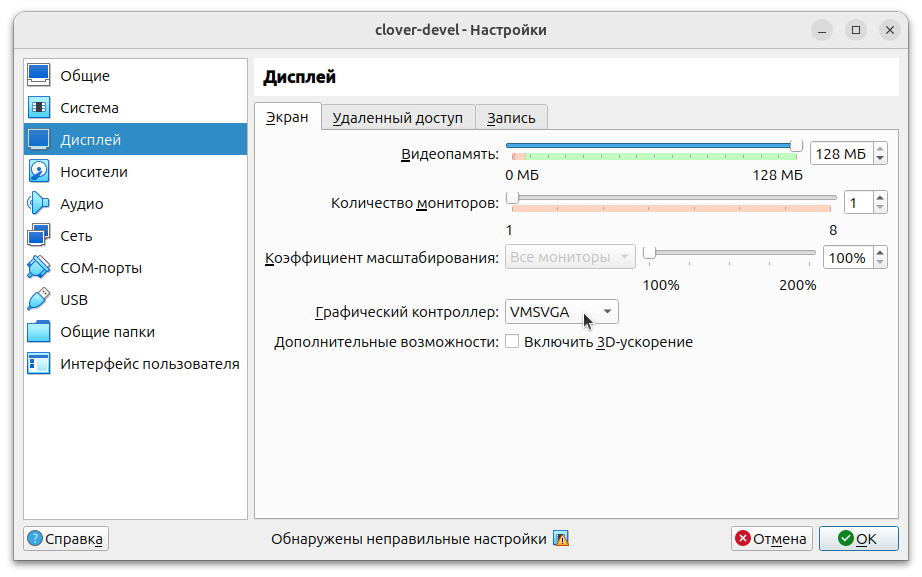
    * disable "3D acceleration" in the same tab of the settings window (the lightweight XFCE graphical shell in the virtual machine does not use 3D acceleration, and when 3D acceleration is enabled, some laptops experience "slowness" in operation);
    * add an optical disk drive, in the new window specify the path to `VBoxGuestAdditions.iso` to the file (in Windows, you can find this file in the directory `C:\Program files\Oracle\VirtualBox`, and on Linux, look for it in the directory `/usr/share/virtualbox`, if it is not there, then see the instructions below):
    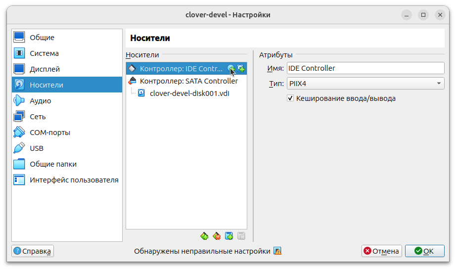

    ```bash
    # installation VBoxGuestAdditions.iso on Linux
    sudo apt install virtualbox-guest-additions-iso
    # search for the location of the .iso file
    # filepath is usually /usr/share/virtualbox/VBoxGuestAdditions.iso
    dpkg -L virtualbox-guest-additions-iso | grep VBoxGuestAdditions.iso
    ```

    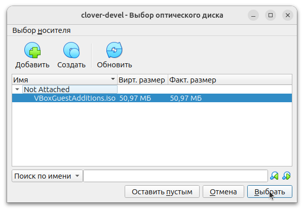
    * confirm file path selection, make sure that the new CD drive is in the list of devices:
    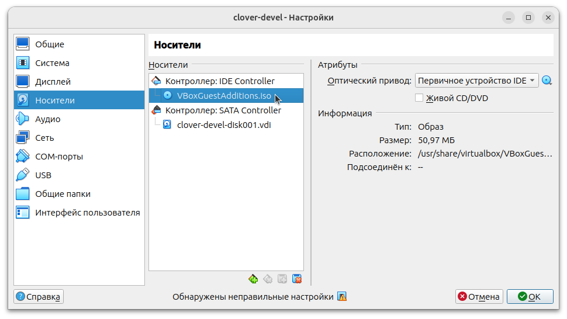
    * for more information about contents of the add-on disc, see [this link](https://docs.oracle.com/en/virtualization/virtualbox/7.0/user/guestadditions.html);
    * close the settings window by saving the changes using the "OK" button.

3. Start the virtual machine. Install the extensions for VirtualBox so that you can use the *clipboard* and work with files using the *shared folder* mode.

    * after starting the virtual machine, make sure that in the "Devices | Optical discs" check the box opposite `VBoxGuestAdditions.iso` installed;
    * open the file manager in the virtual machine and find the "Devices" group on the top right, click on `VBox_GA_7.0.12`:
    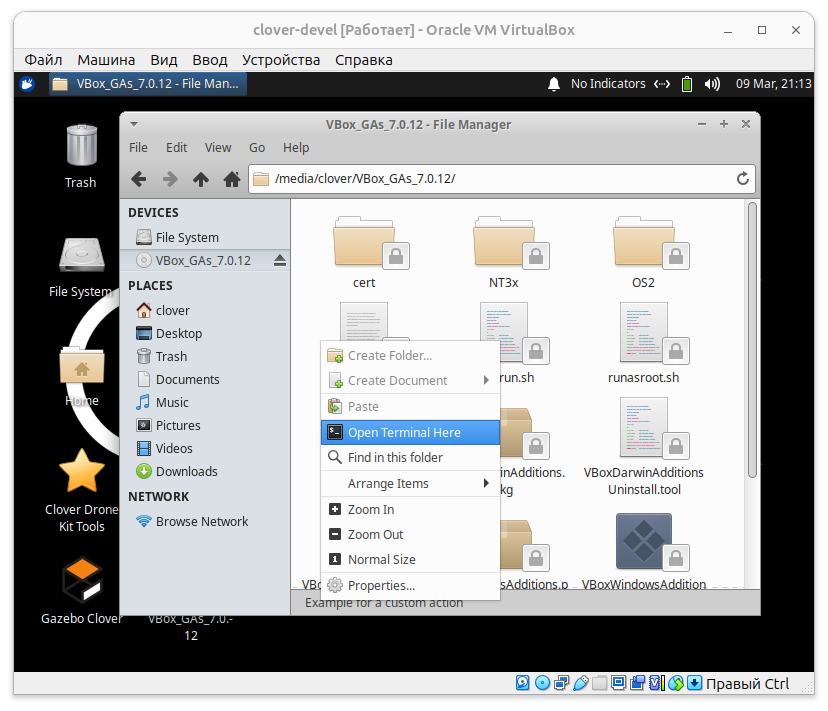
    * in the list of files that appears, click on an empty space (not on the icon), select "Open terminal here", enter the command `sudo ./autorun.sh`:
    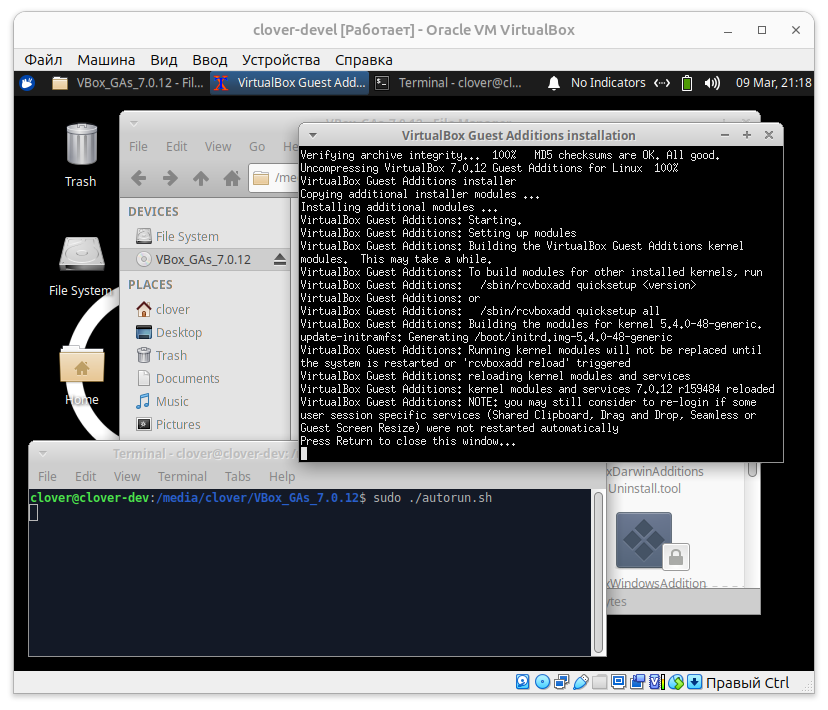
    * a new window will appear in which the necessary drivers and programs for working with the clipboard and shared folders will be builded;
    * wait for the completion of the program' building, when the inscription "Press Return to close this window..." appears, press Enter, the window will close;
    * add the Linux user of the virtual machine to the group that is allowed to share files, to do this, enter the command `sudo adduser $USER vboxsf`:
    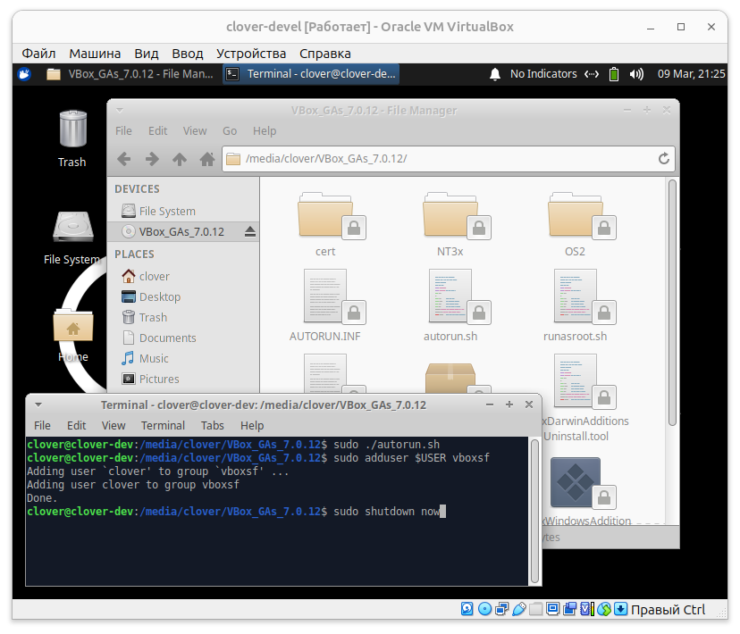
    * the changes will require restarting the virtual machine, turn it off using the `sudo shutdown now` command;
    * after shutting down the virtual machine in the VirtualBox program window, go back to its settings and enable the shared clipboard and Drag'n'Drop function (optional):
    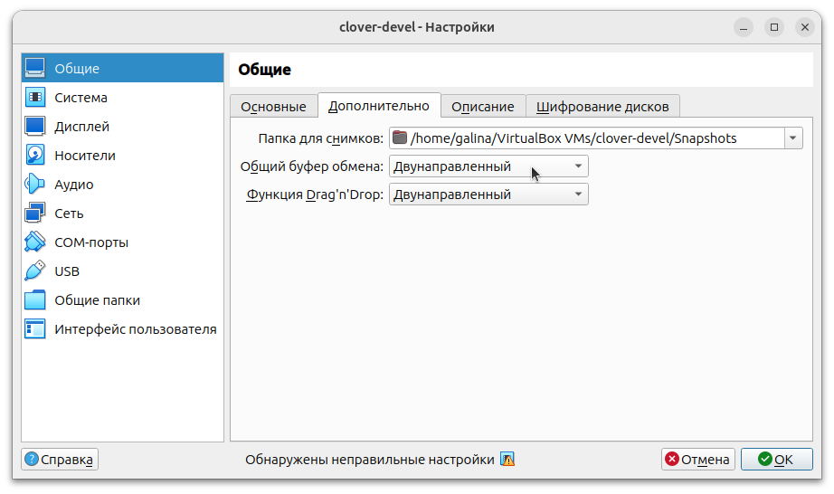
    * close the settings window by saving the changes using the "OK" button.

4. Start the virtual machine. Make sure that the functions of the VirtualBox add-ons are working.

    * in the "View" menu, the "Screen integration mode" will be available to you, when you change the size of the virtual machine window, its resolution will adjust to the size of the window, so that you can work in Gazebo with large display resolutions;
    * check the functionality of the *clipboard* content sharing function both when copying text from a virtual machine and from a laptop to a virtual machine;
    * check the functionality of the Drag'n'Drop function by dragging a file from the laptop to the desktop of the virtual machine (*attention! if you are using Windows on a laptop, dragging files may cause crashes in the virtual machine, in which case it is recommended to disable this feature*);
    * in the virtual machine menu "Devices | Shared Folders | Configure Shared Folders" add a new folder by selecting the path on the laptop (*attention! it is recommended to use folders with only Latin characters, for example `/home/galina/Workspace` or `c:\Users\galina\Documents`*):
    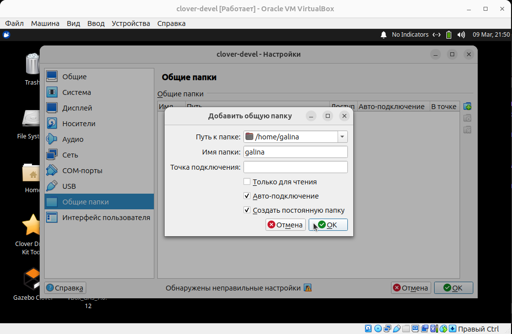
    * in the folder settings specify "Auto-connect" and "Create a permanent folder";
    * close the settings window by saving the changes using the "OK" button.
    * open the file manager, find a new folder in the upper Devices group, which will have a prefix `sf_`, for example `sf_galina`, create an empty file, make sure that the file appears in the laptop's file system:
    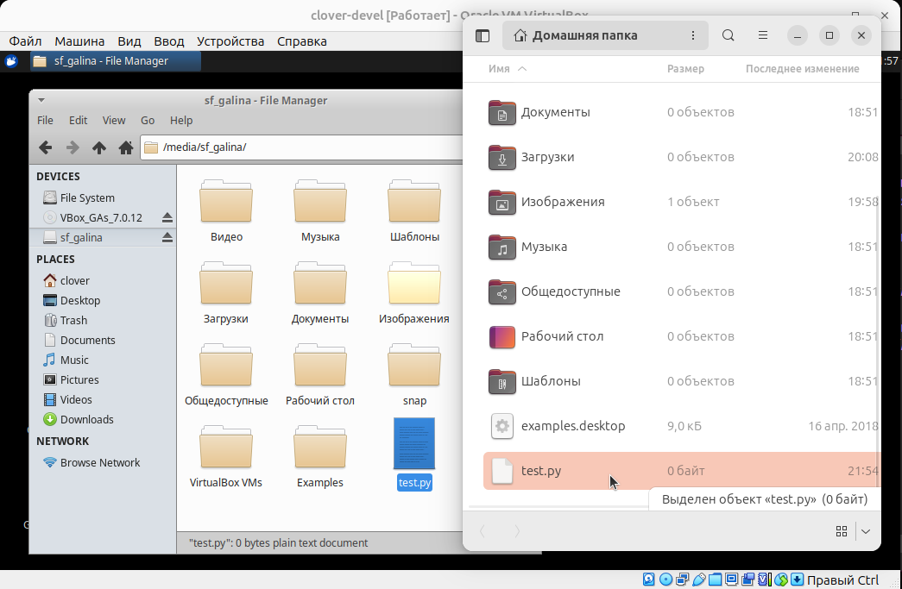
    * if any of the listed items does not work, repeat the steps listed in section 3 by re-installing and configuring the VirtualBox extensions.

5. Configure networking in the virtual machine. Changing the network mode in VirtualBox is possible in real time, you can choose any suitable option. See below for a list of options from which you can choose the one that will be most convenient for you in your work:

    * **Connection type: NAT** - default mode. In this mode, your laptop creates a separate local network for the virtual machine, from which it can connect to the network (for example, download something from the Internet), but network nodes in the opposite direction will not be able to connect to the server on the virtual machine (for example, Raspberry Pi **will not be able** to connect to [clever-show](clever-show.md) server). The network IP address that the virtual machine will receive will be from the range generated by your laptop, for example `10.0.2.15`. This mode is identical to the conditions created by home routers, when your home computer can access the Internet, but computers from the Internet will not be able to access your computer on their own initiative (this feature must be configured and allowed).
    * **Connection type: Network Bridge**. In this mode, the virtual machine connects to the network through your laptop *transparently*. Along with the choice of connection type, you are also asked to choose the name of the network interface related to the network of which the virtual machine will become a part. In this mode, the virtual machine will receive a network IP address related to your chosen network, for example, if your home router distributed addresses in the range `192.168.0.xxx`, then connecting the virtual machine to the router's network it would receive an address such as `192.168.0.100`. In this mode, inside the selected network, you are allowed to connect to any network node, and other nodes have the ability to connect to your virtual machine (for example, Raspberry Pi **will be able to** connect to [clever-show](clever-show.md) server).

To change the network type, go to the "Devices | Network | Configure network" menu item. Select the connection option that suits you, if necessary, select the name of the network connection, confirm the change using the "OK" button. To make changes to the network, select the menu item "Devices | Network | Connect the network cable", wait for the "Disconnected" notification to appear in the VM. Then select the "Devices | Network | Connect the network cable" menu item again, wait for the "Connection Established" notification to appear in the VM.

For example, switch the network to the "Network Bridge" mode by selecting the network interface corresponding to your WiFi adapter (by performing the above-recommended manipulation of reconnecting the "network cable"). Connect your laptop to a WiFi network with internet access.

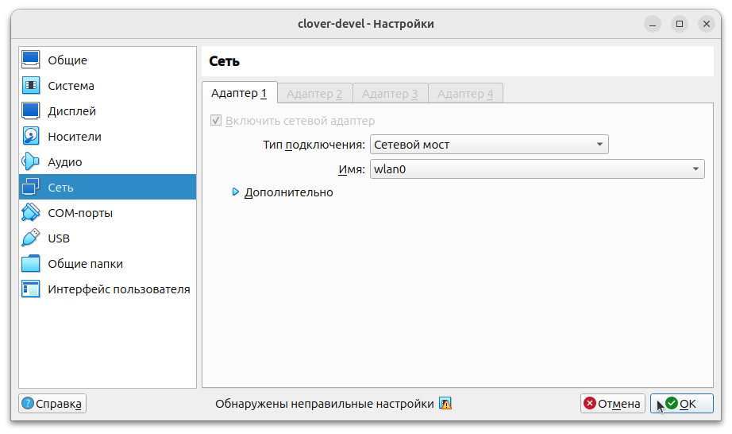

Make sure that the address of the virtual machine is actually received inside a WiFi network with Internet access, and the Internet is available in the virtual machine.

```bash
ip a
ping ya.ru
```

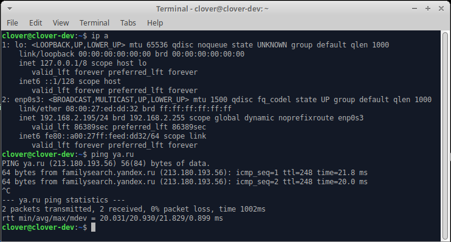

In the screenshot above, the IP address of the virtual machine is the address `192.168.2.195` and it has Internet access because the server `ya.ru` is pinging.

Then [connect to Raspberry Pi via Wi-Fi](wi fi.md), repeat the above recommended manipulation of switching the "network cable".

```bash
ip a
ping 192.168.11.1
ssh pi@192.168.11.1
```

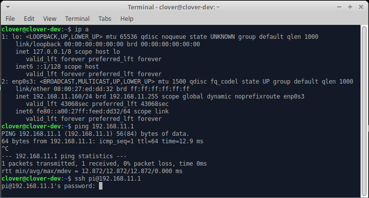

In the screenshot above, the IP address of the virtual machine is the address `192.168.11.160`, it pings the Raspberry Pi with the address `192.168.11.1`, and can login into the microcomputer [via SSH](ssh.md). *There will be no Internet access on this virtual machine, because both it and the laptop have disconnected from the WiFi network with Internet access*. Without disconnecting from the Clover WiFi network, scan the network nodes connected to the network:

```bash
sudo nmap -sP -PR -T3 192.168.11.0/24
ip a
```

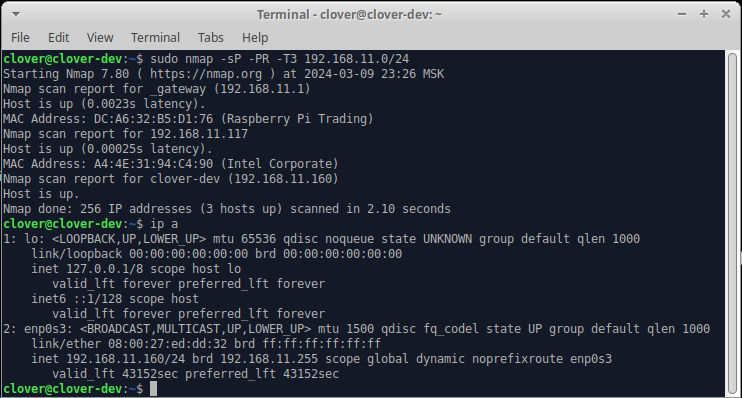

In the screenshot above, nodes have been found on the network:

* `192.168.11.1` - Raspberry Pi microcomputer;
* `192.168.11.117` - laptop with an Intel network adapter;
* `192.168.11.160` - the `clover-dev` virtual machine from which the scan was performed.

If all the checks listed above have been passed, then your virtual machine running in the VirtualBox environment is ready to work.
