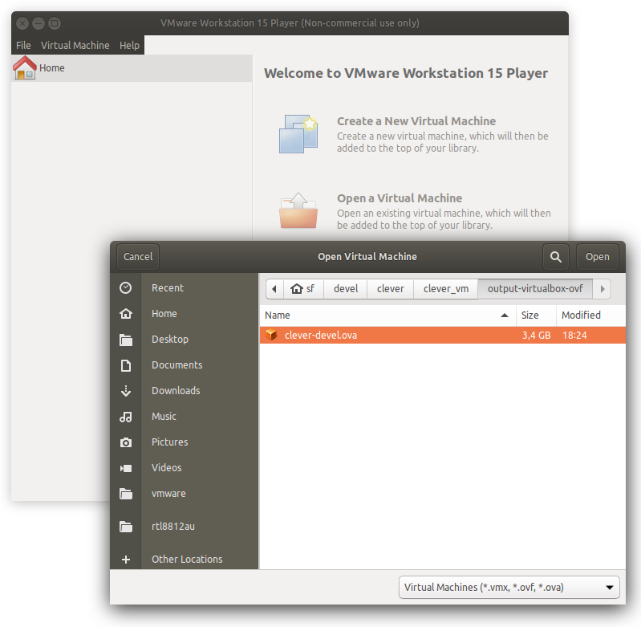
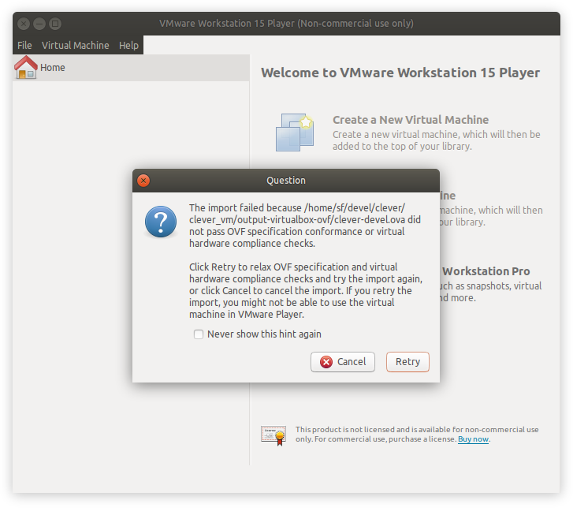
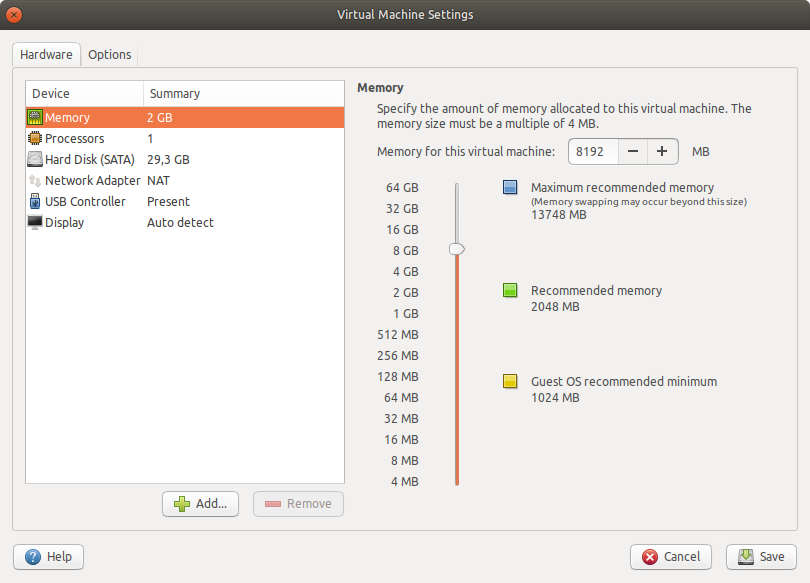
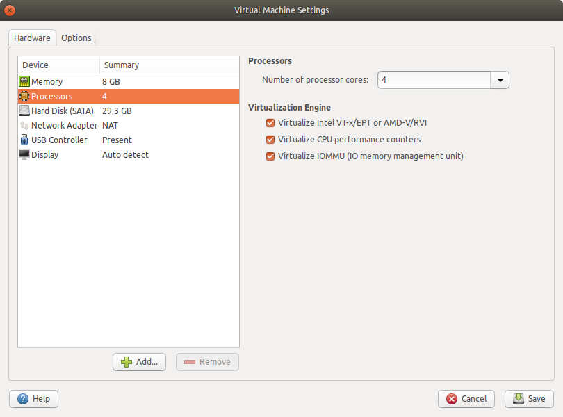
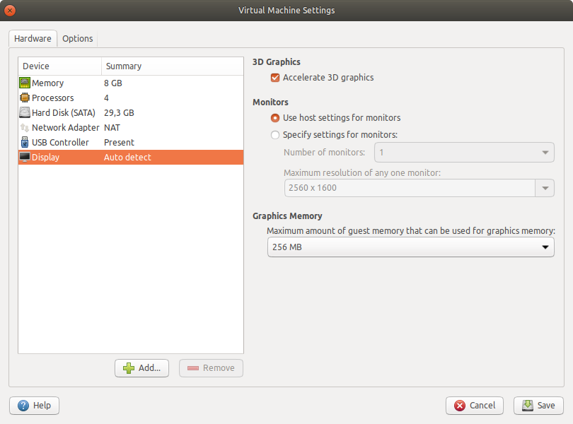
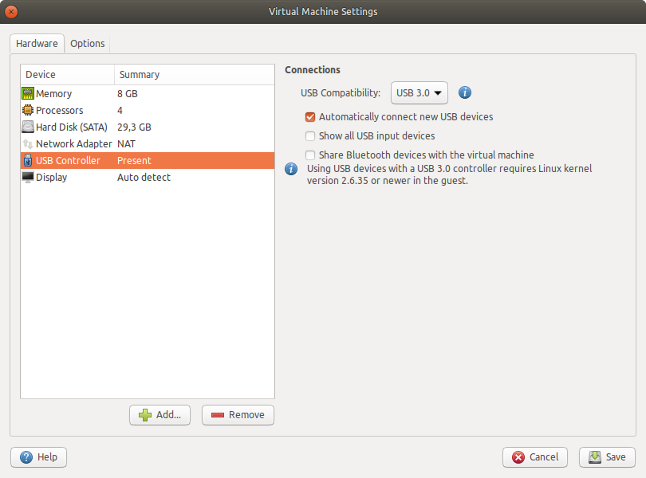
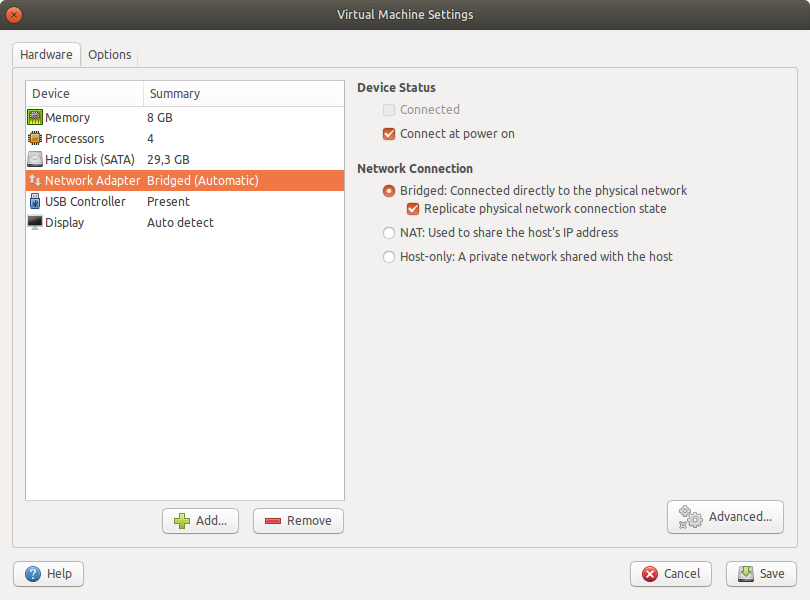
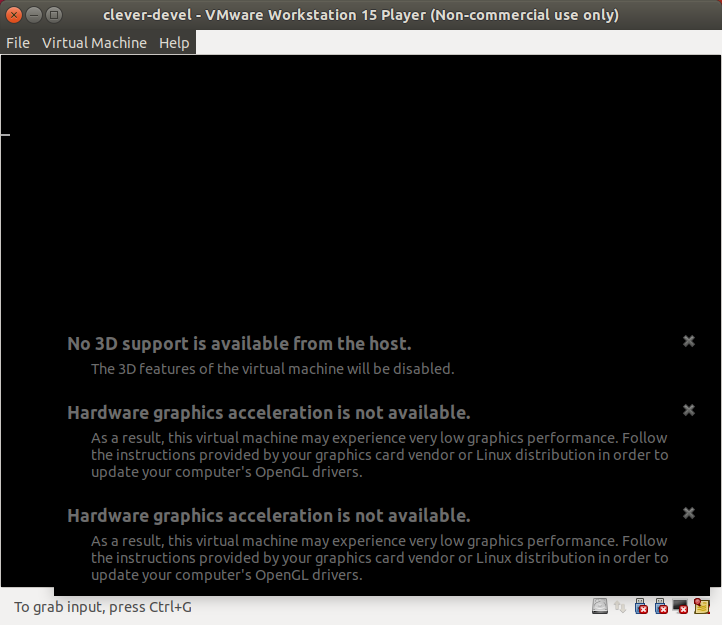
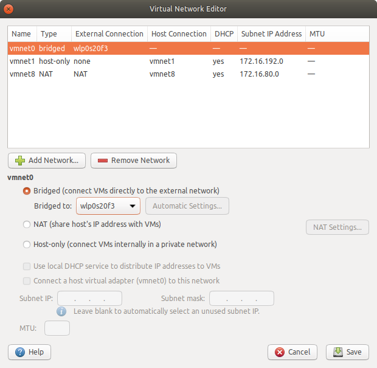

# Simulation VM setup

In addition to [native installation instructions](simulation_native.md), we provide a [preconfigured developer virtual machine image](https://github.com/CopterExpress/clover_vm/releases/latest). The image contains:

* Ubuntu 18.04 with XFCE lightweight desktop environment;
* ROS packages required to develop for the Clover platform;
* QGroundControl;
* preconfigured Gazebo simulation environment;
* Visual Studio Code with C++ and Python plugins.

> **Info** The default username on the VM is `clover`, with password `clover`.

The VM is an easy way to set up a simulation environment, but can be used as a development environment for a real drone as well.

## Downloading

You can download the latest VM image [in the VM releases repository](https://github.com/CopterExpress/clover_vm/releases).

> **Note** The virtual machine should be used when native installation is not feasible or possible. You may experience reduced performance in programs that use 3D rendering, like rviz and Gazebo.

## Setting up the VM

You need to use a VM manager that supports OVF format, like [VirtualBox](https://www.virtualbox.org/wiki/Downloads), [VMware Player](https://www.vmware.com/products/workstation-player.html) or [VMware Workstation](https://www.vmware.com/products/workstation-pro.html).

> **Note** At the time of writing VirtualBox had issues running the VM, particularly with 3D applications. We recommend using VMware Player or VMware Workstation if possible. The following steps assume you're using VMware Player.

Make sure that you have hardware virtualization enabled in your BIOS/UEFI (it may be supported by your hardware but turned off by default). The steps to enable virtualization differ from manufacturer to manufacturer, but should be described in your system manual. Consult your system's manufacturer if you're having trouble turning virtualization on.

1. Import the OVA archive into your virtualization environment. Use the **Open a Virtual Machine** option in VMware Player:

    

    > **Note** You may see a dialog box with a warning about the VM format:
    
    You can safely ignore the warning and press **Retry**.

2. Right-click on the VM name and select **Virtual Machine Settings**. In the new window, set the following parameters:

    * increase the amount of memory available to the virtual machine (a good rule of thumb is 2048 MB per CPU core, but no less than 4 GB):
    
    * increase the amount available CPU cores:
    
    * enable 3D acceleration:
    
    * enable USB 2.0/3.0 controller  (if you plan to connect external devices to the VM):
    
    * optionally enable the "bridged" network connection (if you plan to connect to a real drone):
    

    > **Note** Some host network adapters may not work well with the bridged network. Consider using external USB Wi-Fi adapters managed by your VM to connect to a real drone.

3. "Power on" the virtual machine. You may see a warning message about your host system not providing 3D acceleration:

    

    Make sure you have the latest GPU drivers for your host system. If the warnings persist, add the following line to `clover-devel.vmx` (actual file name may differ based on the VM name):

    ```
    mks.gl.allowBlacklistedDrivers = "TRUE"
    ```

    You can find this file in a folder where the VM is imported to.

4. (Bridged networking only) Set up network bridge configuration in VM settings or using `vmware-netcfg` utility (in Linux):

    

    Select `vmnet0` in the networks list, set it to *Bridged*, and choose the adapter you are planning to use to connect to drone in the drop-down menu.
