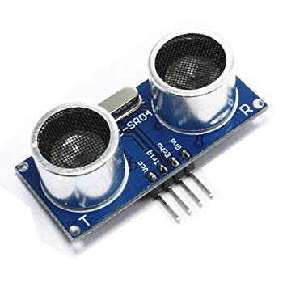
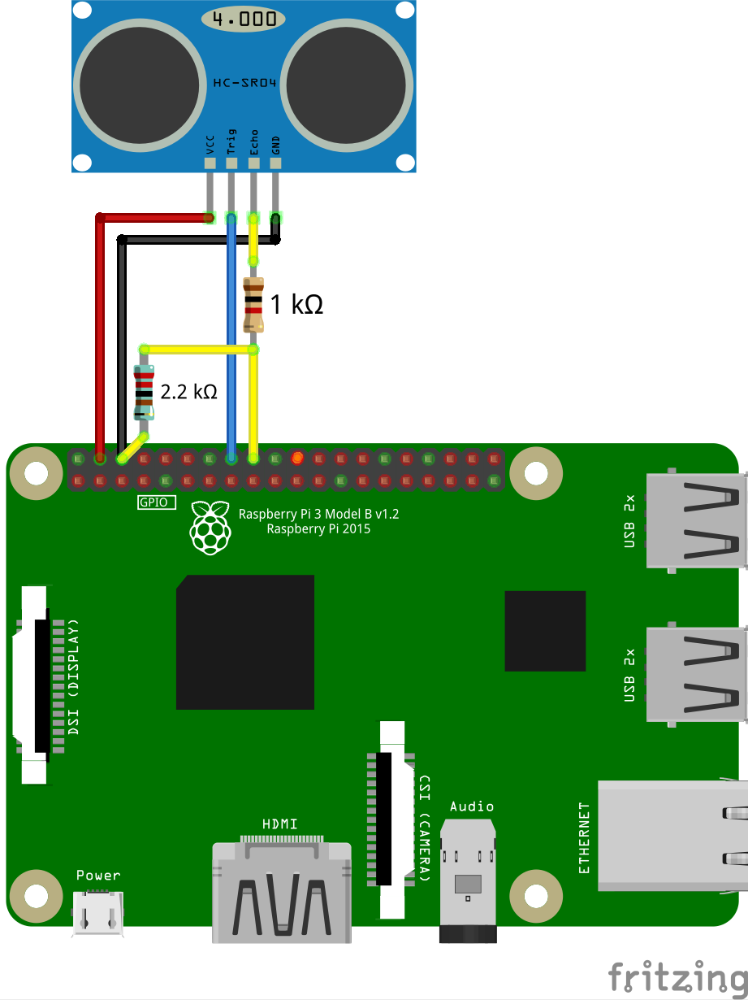

# Working with the ultrasonic distance gage

Ultrasonic distance gage (*"sonar"*) is a distance gage based on the principle of measuring the time of a sound wave (about 40 kHz) propagation to the obstacle and back. The sonar can measure the distance up to 1.5 – 3 m with the accuracy of several centimeters.

## Distance gage HC-SR04



## Installation

The distance gage is attached to the body using double-sided tape. For obtaining acceptable results, the use of vibro-insulation is required. A piece of PU foam may be used for vibro-insulation.

### Connection

Connect HC-SR04 to Raspberry Pi according to the connection diagram. Use 1.0 and 2.2 kΩ resistors and any free GPIO pins, e.g., 23 and 24:



> **Hint** Instead of a 2.2 kΩ resistor, you can use two 1 kΩ resistors connected in series.

<!-- -->

> **Hint** There are several interchangeable pins **GND** and **VCC 5V** on Raspberry Pi. Use the [pinout] (https://pinout.xyz) to find them.

### Reading the data

To read the data from distance gage HC-SR04 library for working with <abbr title="General-Purpose Input/Output">GPIO</abbr> is used – [`pigpio`](http://abyz.me.uk/rpi/pigpio/index.html). This library is pre-installed in the [Clover image](image.md), starting with version **v0.14**. For older versions of the image, use [an installation guide](http://abyz.me.uk/rpi/pigpio/download.html).

To work with `pigpio`, start appropriate daemon:

```(bash)
sudo systemctl start pigpiod.service
```

You can also enable `pigpiod` auto launch on system startup:

```(bash)
sudo systemctl enable pigpiod.service
```

Thus, it becomes possible to interact with the `pigpiod` daemon from Python:

```python
import pigpio
pi = pigpio.pi()
```

> **Hint** See detailed description of Python API in [`pigpio` documentation](http://abyz.me.uk/rpi/pigpio/python.html).

An example of the code for reading data from HC-SR04:

```python
import time
import threading
import pigpio

TRIG = 23  # pin connected to the Trig pin of the sonar
ECHO = 24  # pin connected to the Echo pin of the sonar

pi = pigpio.pi()
done = threading.Event()

def rise(gpio, level, tick):
    global high
    high = tick

def fall(gpio, level, tick):
    global low
    low = tick - high
    done.set()

def read_distance():
    global low
    done.clear()
    pi.gpio_trigger(TRIG, 50, 1)
    if done.wait(timeout=5):
        return low / 58.0 / 100.0

pi.set_mode(TRIG, pigpio.OUTPUT)
pi.set_mode(ECHO, pigpio.INPUT)
pi.callback(ECHO, pigpio.RISING_EDGE, rise)
pi.callback(ECHO, pigpio.FALLING_EDGE, fall)

while True:
    # Reading the distance:
    print(read_distance())

```

### Filtering the data

To filter (smooth out) the data and delete [outliers](https://en.wikipedia.org/wiki/Outlier), [Kalman filter](https://en.wikipedia.org/wiki/Kalman_filter) or a simple [median filter](https://en.wikipedia.org/wiki/Median_filter) can be used. An example of median filtering implementation:

```python
import collections
import numpy

# ...

history = collections.deque(maxlen=10)  # 10 - number of samples for averaging

def read_distance_filtered():
    history.append(read_distance())
    return numpy.median(history)

while True:
    print(read_distance_filtered())
```

An example of charts of initial and filtered data:


The source code of the ROS-node used for building the chart can be found [on Gist](https://gist.github.com/okalachev/feb2d7235f5c9636802c3cda43add253).

## Distance gage RCW-0001


Ultrasonic distance gage RCW-0001 is compatible with distance gage HC-SR04. Use the instruction above to connect and work with it.

## Flight

An example of a flight program with the use of [simple_offboard](simple_offboard.md), which makes the copter fly forward until the connected ultrasonic distance gage detects an obstacle:

```python
set_velocity(vx=0.5, frame_id='body', auto_arm=True) # flying forward at the velocity of 0.5 mps

while True:
    if read_distance_filtered() < 1:
        # if the obstacle is closer than 1 m, hanging on the spot
        set_position(x=0, y=0, z=0, frame_id='body')
    rospy.sleep(0.1)
```
