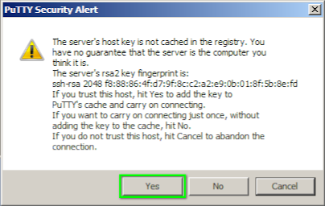

# Connecting to Raspberry Pi using SSH keys

*This instruction will allow you to quickly connect to the Raspberry Pi. In just one second. Without entering a password.*

Basic information on working with SSH can be found in the section [SSH access to Raspberry Pi](ssh.md). In this section you will find advanced information on using SSH, as well as a number of recommendations on using SSH when working with Clover.

## General information

SSH (*secure shell*) is a network protocol that allows you to remotely control the operating system on the computer you are connected to. It is similar to a protocol such as *telnet*, but allows you to encrypt network traffic during interaction. Thus, the transfer of passwords and other secret information is hidden. The Raspberry Pi operating system supports SSH communication, like many other common Linux-based systems.

SSH allows you not only to organize work in the command shell, but also to transfer files, as well as tunnel transmitted data from other protocols, such as information from a video camera or telemetry. In addition, SSH supports several authentication modes (that is, verification of the connecting user), with its help it is possible to connect to the Clover not only using a password, but also password-free access (authentication by a key pair, i.e. SSH keys).

## Password authentication

Authentication [by password](ssh.md) on the image of RPi for Clover is enabled by default and the password can be used to enter into the command shell of the minicomputer. On computers with Linux operating systems (and primarily on servers connected to the Internet), the ability to login with a password is usually disabled, since there is a more secure authentication method.

> **Hint** It is not recommended to disable logging into Clover by password, since you can completely lose access to the command shell over the network.

When connecting to RPi for the first time, you will see the notification with a suggestion to save a unique *fingerprint*. The stored information is accumulated on computers from which SSH login to RPi is performed, and is checked for sudden substitution.

On Linux and Unix (Mac OS) the first SSH-connection to the RPi looks like this:

```bash
ssh pi@192.168.11.1
# The authenticity of host '192.168.11.1 (192.168.11.1)' can't be established.
# ED25519 key fingerprint is SHA256:4w/7MqTgrtsqPwKnVAMISpouaOJNqzUew2NkJjldMWI.
# This key is not known by any other names
# Are you sure you want to continue connecting (yes/no/[fingerprint])? yes
# Warning: Permanently added '192.168.11.1' (ED25519) to the list of known hosts.
# pi@192.168.11.1's password: *********
# Linux clover-3270 5.10.17-v7l+ #1414 SMP Fri Apr 30 13:20:47 BST 2021 armv7l

whoami
# pi

exit
```

In graphical programs in Windows, you will periodically see window with similar warnings.



> **Hint** Windows 10 has a built-in SSH client that can be run from the command line, see the Microsoft usage guide [at this link](https://learn.microsoft.com/ru-ru/windows-server/administration/openssh/openssh_install_firstuse).

## Authentication using SSH keys

SSH keys are a convenient, fast alternative way to connect to the Raspberry Pi, which does not require entering a password. In particular, when operating with Clover, this method is convenient because it saves time, and therefore battery power, and the time limit allocated for events in flight zones. In addition, using SSH keys opens up opportunities for convenient use of other programs that you would hardly use if you needed to type a password every time.

The SSH key is divided into two parts: the pair consists of a so-called *private* and *public* key. The key is generated once. One part of the key (open) is transferred once to the remote computer to which the connection will be made, the second part of the key (private) is stored on the computer that will connect, the private part of the key is not transferred anywhere.

> **Hint** The public key is copied once to the Raspberry Pi, and the private key is stored in the laptop as a file.

### Preparation

In order for a key pair to appear, it must be generated. In Linux and Unix (Mac OS), there is a program `ssh-keygen` with which we will get the key pair we need (**attention!** commands are executed not in Raspberry Pi, and not in the virtual machine of the Gazebo simulator, but in the command shell of the laptop from which you will connect to the Clover):

Before using the keys, you need to perform a number of actions to configure access rights *on the laptop*:

```bash
# one-time setting of access rights to user directories
chmod o-rwx $HOME
mkdir ~/.ssh
chmod g-rwx,o-rwx ~/.ssh
touch ~/.ssh/config ~/.ssh/known_hosts
chmod 600 ~/.ssh/config ~/.ssh/known_hosts
```

> **Hint** The `.ssh` directory in the user's home folder is the standard storage location for both key pairs and SSH connection settings, so we prohibit access to it by the Others group (*outsiders*). Modern Linux distributions check access rights to files in the `.ssh` directory and may refuse authentication by key pairs.

### Generating an SSH key pair

Generating a pair of SSH keys in the `~/.ssh` directory on the laptop:

```bash
ssh-keygen -f ~/.ssh/id_clover -C "SSH key for Clover" -N ""
# Your identification has been saved in /home/galina/.ssh/id_clover
# Your public key has been saved in /home/galina/.ssh/id_clover.pub

chmod 400 ~/.ssh/id_clover*
```

### Copying SSH key to Raspberry Pi

After that [connect to Raspberry Pi via WiFi](wi fi.md) and continue to enter commands *on the laptop* to copy the key to the minicomputer:

```bash
ssh-copy-id -i ~/.ssh/id_clover.pub pi@192.168.11.1
# pi@192.168.11.1's password: *********
```

As a result, the so-called *public* part of the key will be copied from the laptop to the RPi microcomputer, and the *private* part will remain on the laptop. To verify the connection without entering a password, use the command indicating the path where the SSH key is located:

```bash
ssh -i ~/.ssh/id_clover pi@192.168.11.1
```

If the terminal does not require you to enter a password to connect to the RPi, then you did everything correctly and the SSH key pair works. Now you can type the exit command from the SSH terminal to continue configuring the laptop:

```bash
pi@clover-3270:~ $ exit
# logout
# Connection to 192.168.11.1 closed.

galina@Thinkpad-X1:~/.ssh$
```

## Configuring SSH connection to Clover

Now let's set up the SSH terminal in such a way that you don't have to enter the path to the private key every time. This is done by editing the `~/.ssh/config` file *on a laptop*. Open the file in a text editor and add the following lines to the file (if there is already some information there, then put them at the end of the file):

```txt
Host 192.168.11.1
    User pi
    IdentityFile ~/.ssh/id_clover
    PreferredAuthentications publickey,password
    PubkeyAuthentication yes
    PasswordAuthentication yes
    ConnectTimeout 1
    TCPKeepAlive yes
    ServerAliveInterval 2
    ServerAliveCountMax 3
    StrictHostKeyChecking no
```

This setting:

* affects the operation of the SSH terminal when connected to a computer with the IP address `192.168.11.1`;
* if the user name is not specified, the name `pi` will be used automatically;
* the private key `~/.ssh/id_clover` will be used automatically;
* if the key does not fit for some reason (it was replaced on one laptop, but forgot to replace it on another), then the SSH terminal will switch to password authentication (settings `PreferredAuthentications`, `PubkeyAuthentication`, `PasswordAuthentication`);
* if communication with RPi cannot be established (WiFi is not yet connected), then the SSH connection will not hang, but will be completed quickly (setting `ConnectTimeout`);
* if the connection with RPi is suddenly severed, the SSH connection will not hang, but will be completed quickly (settings `TCPKeepAlive`, `ServerAliveInterval`, `ServerAliveCountMax`);
* the unique SSH *fingerprints* of the RPi microcomputers mentioned above will no longer be checked (the settings `StrictHostKeyChecking`).

This will solve a lot of inconveniences associated with using SSH connections.

> **Hint** If you have several Raspberry Pi-based drones in your laboratory, and several laptops, then you can **generate SSH keys once**, copy them to all drones and spread them across all laptops, then you can quickly access any of the drones from any laptop.

Now, to connect to RPi from a Linux terminal, you just need to type `ssh 1[TAB][TAB][ENTER]` and the ip address `192.168.11.1` will be automatically updated on the command line, because the command shell uses addresses from the file `~/.ssh/config` and is able to "guess" your intentions to connect to the Clover. By pressing enter, you will instantly find yourself in the RPi terminal.

> **Hint** Graphical programs for Windows that support working with SSH keys, which you can use: [PuTTY](https://www.chiark.greenend.org.uk/~sgtatham/putty/latest.html) and [MobaXterm](https://mobaxterm.mobatek.net/).

## Copying files using SSH

To copy a file `circle_flight.py` from the laptop to the RPi to the user's home folder `pi`, you can also use SSH. To do this, type the command in the command shell:

```bash
# first we specify 'what' we copy, and then 'where'
scp circle_flight.py 192.168.11.1
```

To copy `output.avi` file from the `examples` RPi' folder to the laptop, use a similar command:

```bash
# after the ':' character (colon), you can specify the path on the remote computer
# the path specified as './' means the current folder where the file will be copied
scp 192.168.11.1:examples/output.avi ./
```

## Remote command launch via SSH

To run a command at laptop on the RPi (that is, remotely), you can also use SSH.

Raspberry shutdown command:

```bash
ssh 192.168.11.1 'sudo shutdown now'
```

Example of a Python script' startup command:

```bash
ssh -t 192.168.11.1 'ROS_HOSTNAME=`hostname`.local && . /opt/ros/noetic/setup.bash && . /home/pi/catkin_ws/devel/setup.bash && python3 examples/get_telemetry.py'
```

In order to remotely start video recording, you can run the command:

```bash
ssh -t 192.168.11.1 'ROS_HOSTNAME=`hostname`.local && . /opt/ros/noetic/setup.bash && . /home/pi/catkin_ws/devel/setup.bash && rosrun image_view video_recorder image:=/main_camera/image_raw'
```
