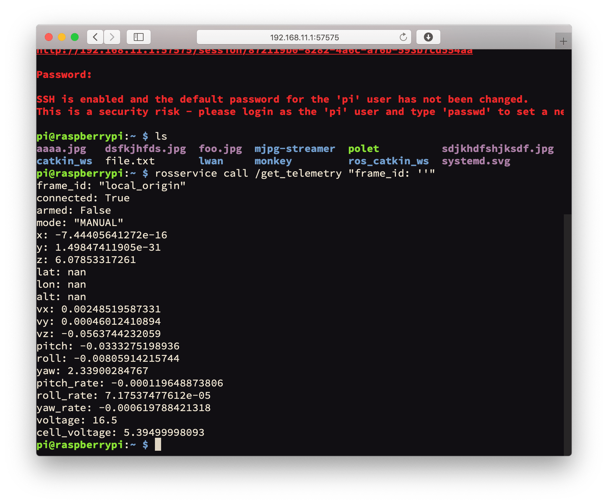

SSH access to Raspberry Pi
===

[RPi image](image.md) is configured to be accessed via SSH for editing files, loading data and running programs.

For the SSH access, it is necessary [to connect to Raspberry Pi over Wi-Fi](wifi.md) (connection via an Ethernet cable is also possible).

In Linux or macOS, run the command prompt, and execute command:

```bash
ssh pi@192.168.11.1
```

Password: `raspberry`.

For SSH access from Windows, you may use [PuTTY](https://www.chiark.greenend.org.uk/~sgtatham/putty/latest.html).

You can also gain SSH access from your smart-phone using the [Termius](https://www.termius.com) app.

Read more: https://www.raspberrypi.org/documentation/remote-access/ssh/README.md

Web access
----------

Starting with version 0.11.4 [of the image](image.md), access to the shell is also available via a web browser (using [Butterfly](https://github.com/paradoxxxzero/butterfly)). To gain access, open web page http://192.168.11.1, and select link *Open web terminal*:



**Next**: [Command-line interface](cli.md)
