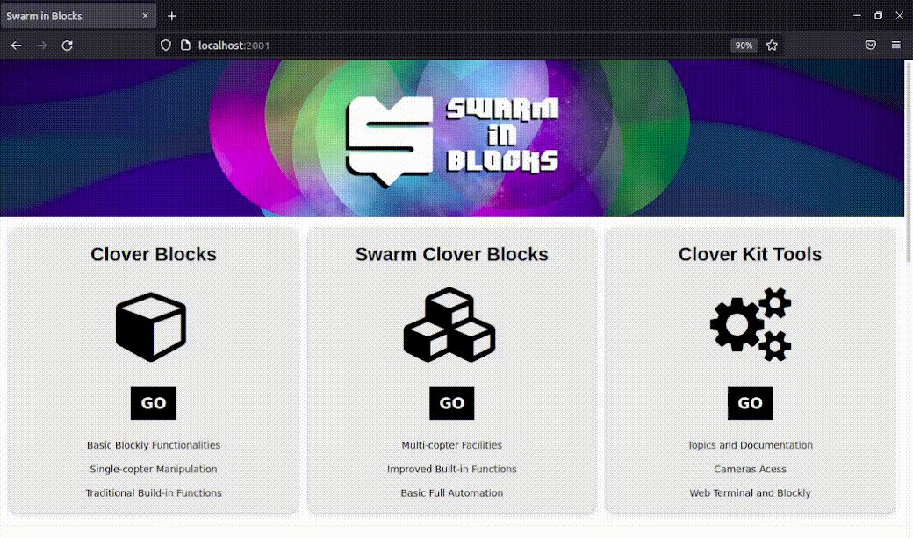
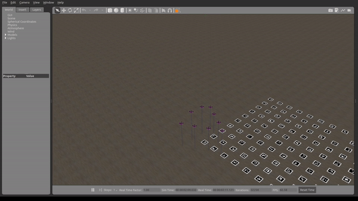
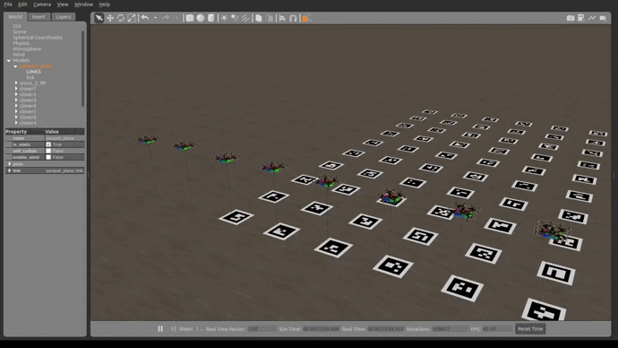
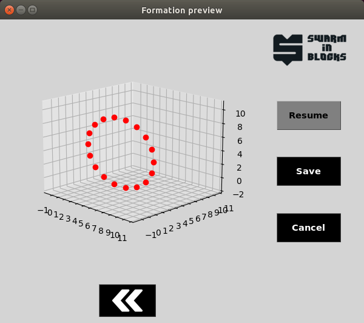
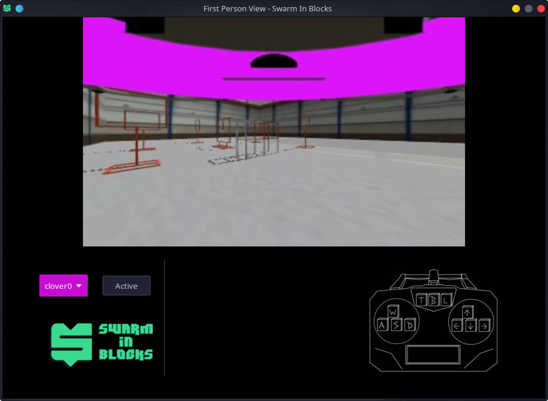

# Swarm-in-blocks

## Detailed Gitbook

Check our Gitbook, with the detailed informations about all that was developed by Atena Team during CopterHack 2022: https://swarm-in-blocks.gitbook.io/swarm-in-blocks/introduction/swarm-in-blocks

## Introduction

Nowadays, swarm of drones are getting more and more applications and being used in several different areas, since agriculture to surveillance and rescues, but controlling a high amount of drones usually isn't a simple task, demanding a lot of studies and a complex software. Swarm in Blocks was born looking to make a high-level interface based on the blocks language, to make simple handling swarms, without requiring advanced knowledge in all the necessary platforms, creating tools to allow a lot of applications based on the user needs and also using the Clover platform, which has a lot of advantages as being complete and intuitive, supporting all the project goals. 

## Usability

### How it works

The Swarm in Blocks can be programmed either with the blocks interface or directly in Python and we developed three main launch modes, each one focused on a different application of the project, they are:

- **Planning Mode:** Its main goal is allowing the user to check the drones' layout, save and load formations, before starting the simulator or using real clovers. In order to need less computational power and avoid possible errors during the simulation.
- **Simulation Mode:** In this mode happens the simulation indeed, starting the Gazebo, the necessary ROS nodes and some other tools. It allows applying the developed features, which will be explained ahead and see how they would behavior in real life.
- **Navigation Mode:** The last mode will support execute everything developed in real clovers, so that it's possible to control a swarm with block programming. The biggest obstacle yet is the practical testing of this mode, due to the financial difficulty of acquiring a Clover swarm.

### Blocks Interface

The entire Swarm in Blocks project was designed so that the user was in an intuitive and comfortable environment within the manipulation of swarms, for this, the existing platform with clover packages was completely rethought and adapted. In our [gitbook](https://app.gitbook.com/s/C9O11TiXK1JPnlrpilLg/usability/blocks-api), we have more details of the front-end design, how the user can interact with it and achieve our main goal: Programming in blocks.

### Features

Along the project we developed some features, they can be used together or independently and also serve as base for the implementation of more specific and advanced innovations. Here are the list and a brief explanation of each tool, to see more details and instructions about their use, check our [gitbook](https://app.gitbook.com/s/C9O11TiXK1JPnlrpilLg/background-theory/system)!

- **Formations:** There are some types of formation that were developed in order to create figures and other images, for uses in engineering and espectacles. They are:
  
  - 2D Formations: We made functions to generate some simple geometries, allowing the user to set the amount of clovers used and the size of the figure, the geometries options made until now are *circle*, *empty square*, *full square* and *triangle*.
  - 3D Formations: Besides the 2D figures, there are also some simple 3D geometries, which are *cube*, *sphere* and *pyramid*.
  - Alphabet: There is also the option to generate letters and words, using our Clover swarm.
  - 3D Figures: Lastly, we have the alternative to make other 3D formations more complex, for this we use a library called Open3D that deals with 3D data, allowing the drones to create any 3D image the user inputs, since it's in the supported formats.

- **Transformations:** In addition to creating the formations, it's important to give the option of edit their disposition, so some operations were developed. It also makes possible executing more complex actions and activities with the Clovers. The transformations operations are:
  
  - Scale: Changes the distance between the drones, increasing or decreasing the image.
  - Translate: All the drones move the same distance in the chosen directions.
  - Rotate: The formation rotates around a determined axis.

  
- **LED effects:** Enjoying the LEDs included in the Clover, we made some functions to apply effects in all the swarm, creating figures and operations with the LEDs too.

- **Swarm Preview:** The main goal of this feature is to help the user to visualize how the swarm will behave in the simulation or real life, without using a lot of computational power and avoiding some problems in the simulation. This way an 2D or 3D image ilustrating the drones disposition can pop up on the screen when using this function.

- **First Person View (FPV):** The FPV node makes a lot easier to visualize each drone's camera individually and also control each one of them at a time using keyboard bindings.

All these features can be very useful for some applications and also being an attractive to arouse the curiosity of the general public.

## Conclusion

Along the last months we studied a lot, grew and surpassed our limits, trying to explore some swarm applications, all to deliver the best possible project: **Swarm in Blocks**. All the motivation to facilitate such a complex task as the manipulation of swarms of drones, even through block programming, delighted us a lot and we hope it will delight all our users. We tried to resume all the project in this article, but as there are many details and needed explanations, it was made a [gitbook](https://swarm-in-blocks.gitbook.io/swarm-in-blocks/introduction/swarm-in-blocks), to explore them for those who are interested.

For us, the results achieved were very expressive and positive, however, we believe that there is still room for improvement in the project, both considering the robustness of the swarm and the simplification of the usability of our platform. Improvement in the collision avoidance system, implementation of more formations and tests in real Clovers are some of the points that we hope to develop in future opportunities. 

Finally, we thank the entire COEX team that made it possible for CopterHack 2022 to take place and all the support given during the competition. We are **Atena Team**, creator of the **Swarm in Blocks** platform and we thank you for your attention!

### The Atena Team members
- Guilherme Soares Silvestre : [Github](https://github.com/guisoares9), [LinkedIn](https://www.linkedin.com/in/guilherme-soares-silvestre-76570118b/)
- Eduardo Morelli Fares: [Github](https://github.com/faresedu), [LinkedIn](https://www.linkedin.com/in/eduardo-fares-a271561a0/)
- Felipe Tommaselli: [Github](https://github.com/Felipe-Tommaselli), [LinkedIn](https://www.linkedin.com/in/felipe-tommaselli-385a9b1a4/)
- João Aires C. F. Marsicano: [Github](https://github.com/Playergeek181), [LinkedIn](https://www.linkedin.com/in/joao-aires-correa-fernandes-marciano-53b426195/)
- José Carlos Andrade do Nascimento: [Github](https://github.com/joseCarlosAndrade), [LinkedIn](https://www.linkedin.com/in/jos%C3%A9-carlos-andrade-do-nascimento-71186421a)
- Rafael Saud C. Ferro: [Github](https://github.com/Rafael-Saud), [LinkedIn](https://www.linkedin.com/in/rafael-saud/)
