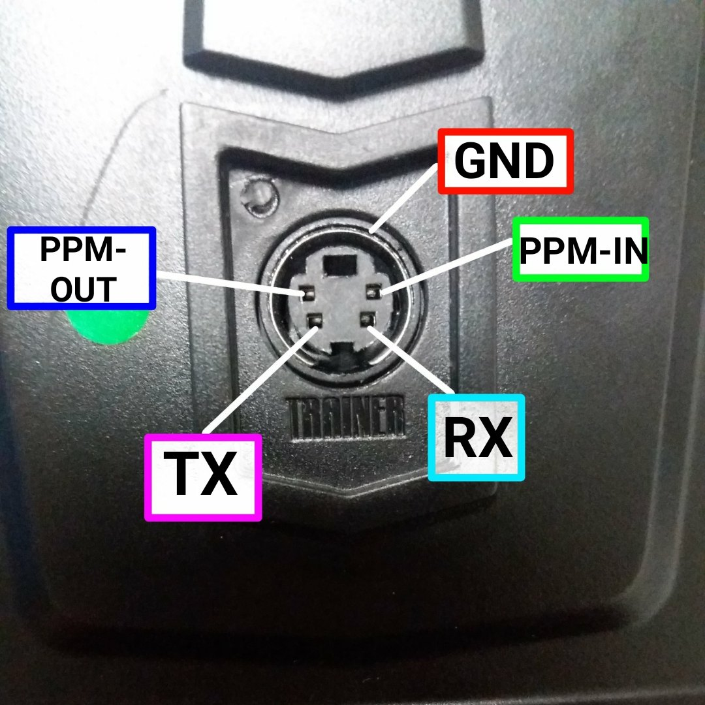
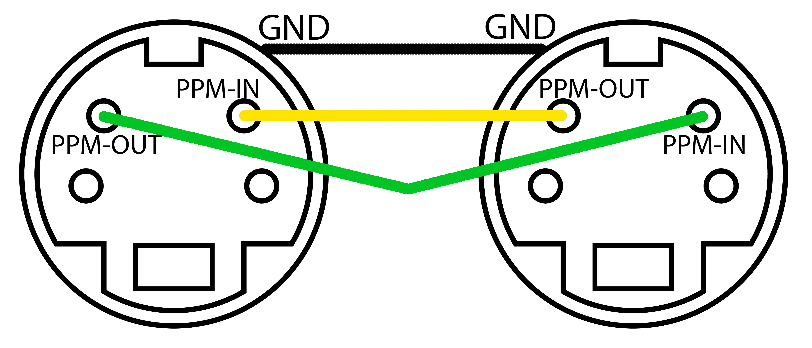

# FlySky Trainer mode settings

The trainer mode is used for teaching students how to fly a drone. In trainer mode the experienced pilot is ready to take control of the drone in case of emergency situation during the flight.

For that we connect two remote controllers. The first controller (Slave) is for a student and the second (Trainer) is for a teacher.

## Wire pinout

To create a link between remote controllers, a connector is used at the back of the case (S-Video). Three contacts in the connector are used for receiving, transmitting information and for ground. The PPM-OUT (transmit) contact must be connected to the PPM-IN (receive) and vice versa. To avoid environmental interference, ground contacts must be interconnected.

This is how we need to solder the wires to the connector.

## Trainer’s settings

Go to settings (hold OK button). Then to the System setup and look for (Up / Down) Trainer mode.

To activate mode, the Mode line should be ‘ON’. Use the Up/Down buttons to change the parameter. To save the parameter, click OK.

Now select the switch for taking the control:

Do it in the Trainer mode menu. In the Switch line, select (you can change using Up/Down) any convenient switch (SwA, SwB, SwC, SwD). Trainer now will take control of the drone after toggling the switching.

To save the settings hold Cancel.

> **Hint** Both teacher’s and student’s remote controllers must be in the same flight mode.

## Student’s settings

Go to the settings, System setup and select the student mode (Student mode). Then click OK and use Up\Down to select ‘Yes’.
Hold Cancel to save the settings. If everything is configured correctly, the letter S will appear on the main screen.
