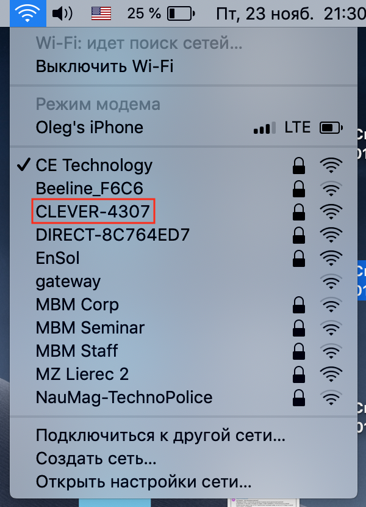

Connecting to Clover via Wi-Fi
===

[RPi image](image.md) provides a pre-configured Wi-Fi access point with SSID `Clover-xxxx`, where `xxxx` are four random numbers that are assigned when your Raspberry Pi is run for the first time.

Connect to this Wi-Fi using the password `cleverwifi`.

To edit Wi-Fi settings, or to obtain more detailed information about the network device on Raspberry Pi, read this [article](network.md).

## Web interface

After connecting to Clover Wi-Fi, open http://192.168.11.1 in you web browser. It contains all the basic web tools of Clover: viewing image topics, web terminal (Butterfly), and the full copy of this documentation.

**Next**: [Connecting Raspberry Pi to the flight controller](connection.md).
