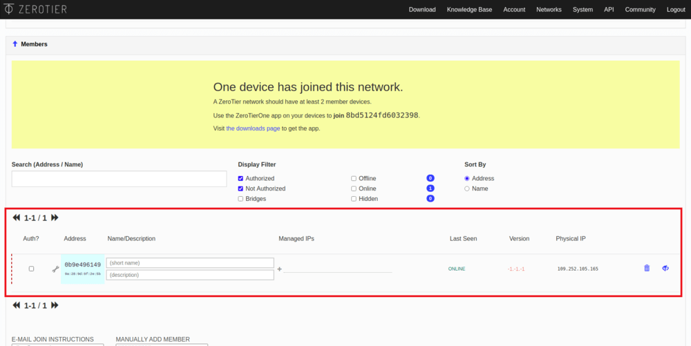
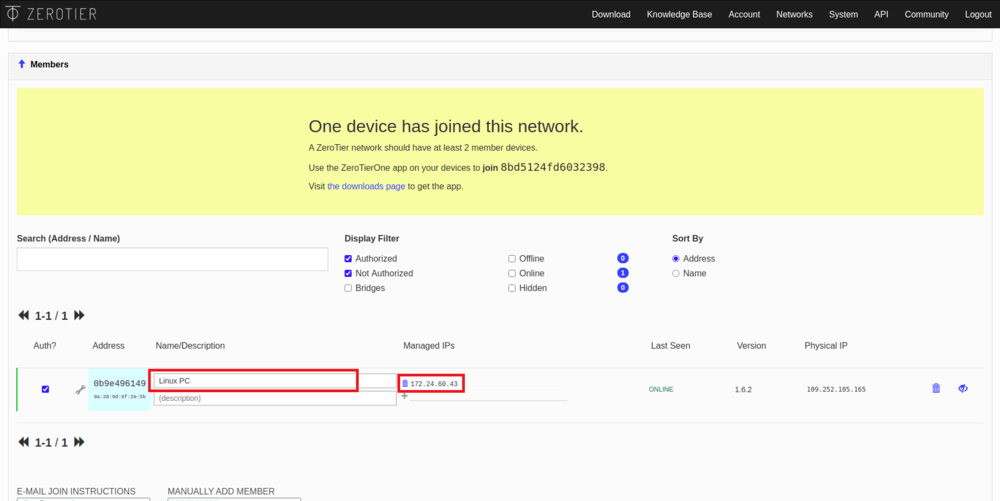
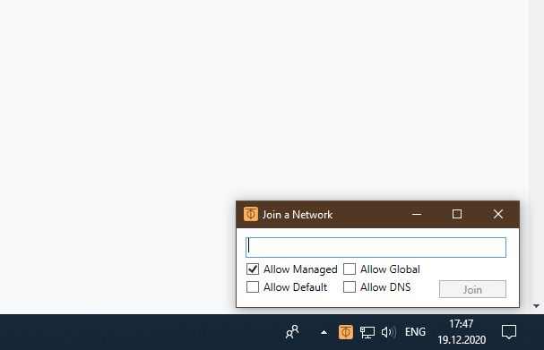
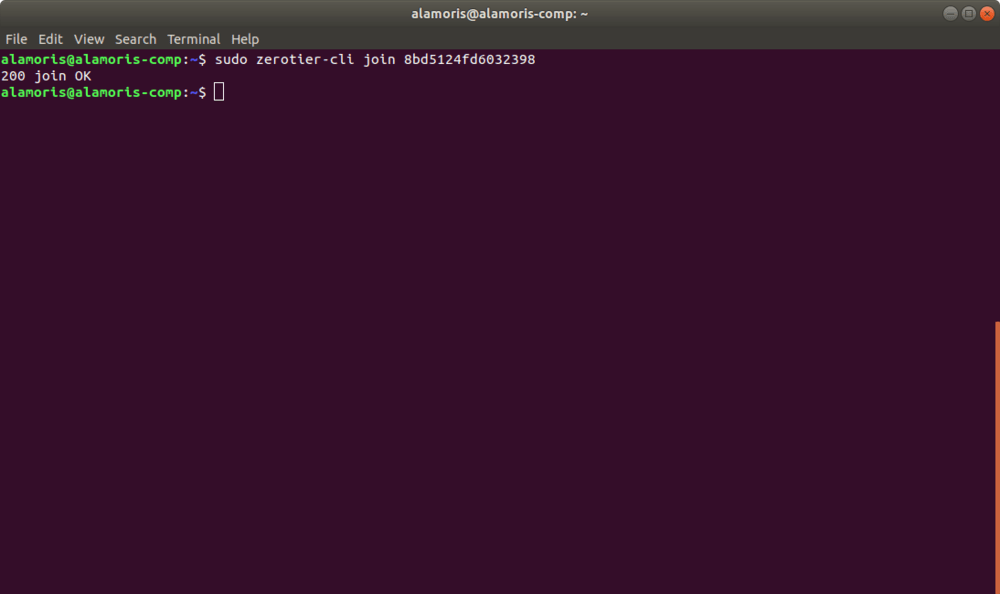
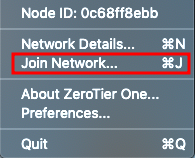

# Creating a virtual network ZeroTier One and connecting to it

## Creating and configuring a ZeroTier network

1. Go to [ZeroTier](https://www.zerotier.com/) website.

    

2. Sign up on ZeroTier.

    

3. Go to your account.

4. Click on the *Create A Network*.

    

5. After that, you will see the network you created, its ID and name. Click on the network to configure it.

    

6. In the window that appears you can change the network name and connection privacy.

    

7. Scroll down to the *Members* column. It will say that there are no users on the network.

    

8. Devices connected to the network will be displayed in this column. To allow them to connect to the network, activate the *Auth?* checkbox. The connected device will automatically be given an internal IP address, which will then be used to communicate with this device.

    <div class="image-group">
        
        
    </div>

    > **Hint** specify names for new devices, it will help you distinguish them from each other in the future.

9. Repeat the last step for all the devices that you want to connect.

    > **Info** ZeroTier network supports up to 50 users simultaneously for free use.

## Setup on Windows

### Installing the app

1. Go to the ZeroTier website.

    

2. Click on the Windows icon.

    

3. Download and run the `ZeroTier One.msi` file.

    <div class="image-group">
        
        
    </div>

### Network connection

1. Run ZeroTier One.

2. Click on the ZeroTier One icon in the taskbar.

3. Click on the *Join Network...* to connect to the network.

    

4. In the window that appears, enter your network ID and click *Join*.

    

5. Allow using the new network.

## Setup on iOS

### Installing the app

1. Go to the ZeroTier website.

    

2. Click on the iOS icon.

    

3. Install the *ZeroTier One* app.

### Network connection

1. Run ZeroTier One app.

2. Click on *+* to add a new connection.

    

3. Confirm the privacy policy.

    

4. Enter your network ID and click *Add Network*.

    

5. Confirm adding the new VPN configuration.

6. Connect to the VPN network by sliding the network activation slider.

    <div class="image-group">
        
        
    </div>

## Setup on Linux (PC, Raspberry Pi)

### Installing the app

1. Open the console by pressing the keyboard shortcut *ctrl + alt + t* or type *terminal* in the program search bar.

2. Enter the ZeroTier installation command.

    ```bash
    curl -s  https://install.zerotier.com  | sudo bash
    ```

### Network connection

1. Open the console.

2. Enter the command `sudo zerotier-cli join network-id`, where `network-id` is your network ID.

    

3. If the connection is successful, the corresponding message will be displayed in the console.

## Installing and configuring on macOS

### Installing the app

1. Go to the ZeroTier website.

    

2. Click on the macOS icon.

    

3. Download and run `ZeroTier One.pkg` file.

4. Install the ZeroTier One app.

### Network connection

1. Run ZeroTier One app.

2. Click on the ZeroTier One icon in the taskbar .

3. In the window that appears, click on *Join Network...*.

    

4. In the *Enter Network ID* field, enter your network ID.

    

## Connecting to the copter

1. Make sure that ZeroTier is working and connected to the network on the drone and control device. To do this, make sure that these have an *Online* status.

     

2. Make sure that all devices have local IP addresses - *Managed IPs*.

3. Open GQC and in the *Comm Links* tab add a TCP connection specifying the IP of the drone. Read more about remote connection [here](gcs_bridge.md).

    <div class="image-group">
        
        
    </div>
