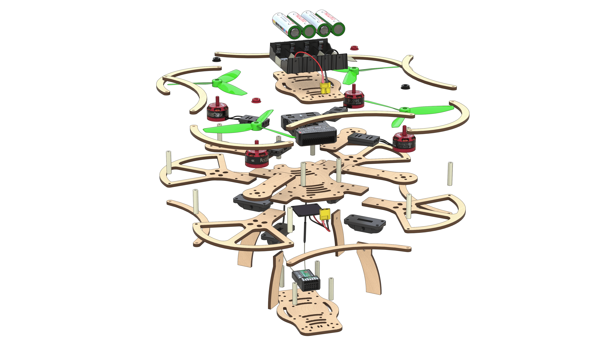

Состав конструктора
-------------------

* Рама центральная x2.
* Рама дополнительная х4.
* Луч x8.
* Ножки x8.
* Защита для лучей x8.
* Защита пропеллеров x16.
* Защита боковая x16.
* Пропеллер пластиковый Dalprop 5045 x4.
* Бесколлекторный электродвигатель Racerstar BR2205 2300kV x4.
* Регуляторы хода ESC, DYS XSD20А x4.
* Разъем силовой XT60 pin x1.
* Разъем силовой XT60 socket x1.
* Трехпроводной шлейф “мама-мама” x2.
* Провод медный многожильный с силиконовой изоляцией 14AWG (красный, черный), длина 50 см.
* Плата распределения питания PDB BeeRotor Power Distribution Board V2.0 x1.
* Аккумуляторная батарея (АКБ) Li-ion 18650 x8.
* Зарядное устройство EFEST Luc V4 Li-lon x1.
* Защитный бокс регуляторов x4.
* Крепление под ножки x8.
* Полетный контроллер PIXHAWK x1.
* Радиоприемник FlySky i6 x1.
* Радиопульт FlySky i6 x1.
* Зарядное устройство EFEST LUC V4 x1.
* Провод Micro USB - USB x1
* Батарейный отсек 18650 li-Ion x1
* Провод медный многожильный с силиконовой изоляцией 18AWG (красный, черный), длина  100 см.
* Батарейка АА х4
* Джампер, Bind-разъем

#### Крепежные элементы
* Пластиковые стойки 6 мм x28.
* Пластиковые стойки 30 мм x32.
* Винты М3x8 x48.
* Винты М3x12 x24.
* Винты М3x16 x40.
* Гайки Пластиковые x8.
* Гайки Металлические x48.
* Наклейки для отсека АКБ х8 .
* Термоусадка ф15 , .50 см
* Термоусадка ф5, 100 см
* Двухсторонний скотч 3M x16.
* Отвертка x1 (нужна визуализация)
* Изоляционная лента х1
* Ножницы канцелярские х1
* Ремешок для батареи 250 мм х1

Функционал радиопульта Flysky i6
---------------------------
1. Переключатель A (SwA).
2. Переключатель B (SwB).
3. Переключатель С (SwC).
4. Переключатель D (SwD).
5. Левый стик.
6. Правый стик.
7. Левый триммер.
8. Правый триммер.
9. Кнопка Вверх.
10. Кнопка Вниз.
11. Кнопка Ок.
12. Кнопка Отмены.
13. Кнопка BIND KEY.
14. Переключатель питания POWER.
15. ЖК-дисплей.
16. Ручка A (VrA).
17. Ручка B (VrB).

Дополнительное оборудование
---------------------------
#### Данное оборудование не входит в состав конструктора Клевер 2, но оно необходимо для реализации сборочного процесса

1. Паяльник
2. Канифоль/ Флюс (нейтральный)
3. Припой
4. Фен промышленный
5. Плоскогубцы
6. Пинцет
7. Канцелярский нож
8. Мультиметр

