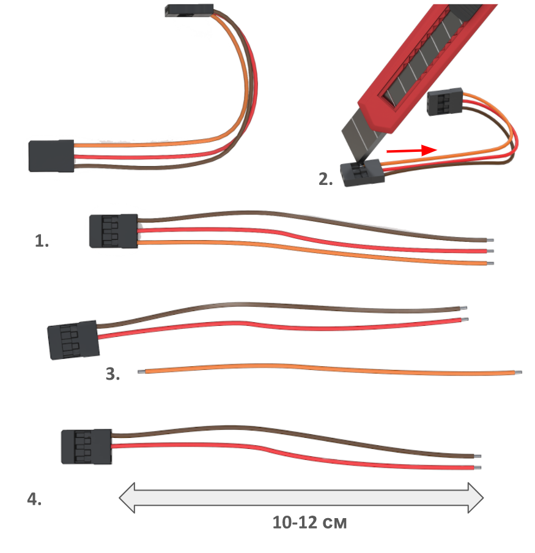

### Монтаж разъемов питания

#### Подготовка проводов для силовых разъемов XT60

1. Взять моток красных и черных проводов, промаркированных как 14AWG
2. Отрезать 4 куска провода следующей длины
* Длина 7 см (Для силового разъема XT60 pin) - 1 красный, 1 черный
* Длина 9 см (Для силового разъема XT60 socket) - 1 красный, 1 черный

#### Подготовка силовых разъемов питания XT60 pin и XT60 socket

1. Под разъем XT60 pin залудить два силовых провода красный и чёрный 14AWG длиной 7 см.
2. Залудить контактные площадки разъема XT60 pin.
3. Припаять черный провод к “-” контакту разъема.
4. Припаять красный провод к “+” контакту разъема .
5. Нарезать термоусадку ф5 (2 отрезка по 10 мм).
6. Надеть термоусадку ф5 на провода так, чтобы она закрывала контактные площадки проводов с XT60 .
7. Усадить термоусадку феном.

8. Повторить процедуру для разъема XT60 socket.

#### Подготовка разъема питания управляющей цепи 5В
 // *почему используется именно 3х контактный разъем, почему шина питания посередине

1. Обрезать/вытащить все пины из одного из разъемов. Отсоединить его.
2. Поддеть канцелярским ножом фиксатор на оставшемся разъеме, чтобы освободить 3-й провод.
3. Убрать 3-й (оранжевый) провод из разъема, за ненадобностью.
4. Длина оставшихся черного и красного проводов  10-12 см.

 *было бы круто, если делать такие картинки и в формате гифки
