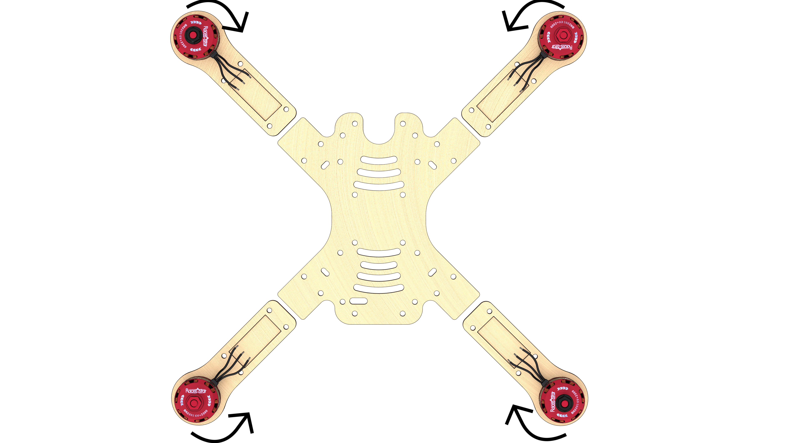

Порядок сборки
--------------

### Установка моторов

* Распаковать моторы. Используя плоскогубцы, укоротить провода на моторах, обрезать половину длины (оставив 25 мм).

Зачистить
* снять 2мм термоизоляции с конца провода не повредив медные жилы.

Скрутить провода.

Залудить
* Нанести флюс на оголенную часть провода.
* Покрыть припоем, используя пинцет.

#### Закрепить мотор на луче

* Установить мотор на сторону луча с гравировкой.
* Прикрепить моторы к лучам винтами М3х8, используя отвертку.

* Лучи с моторами необходимо расположить согласно схеме. Стрелками указано направление вращения моторов.

//указать стрелками направление вращения на моторах

#### Залудить три контактные площадки регулятора
* Нанести флюс
* Нанести припой

Чтобы припой аккуратно заполнил всю площадку, необходимо прогреть площадку регулятора. Для этого нужно удерживать жало паяльника на контактной плащадке в течение 2 сек (или больше, если потребуется)

* Повторить данную операцию для оставшихся трех регуляторов

#### Припаять провода моторов к регуляторам
Припаять ранее приготовленные провода моторов к контактным площадкам регуляторов.

* Повторить данную операцию для оставшихся трех регуляторов
