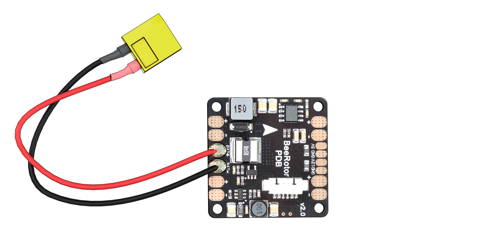

### Монтаж платы распределения питания

#### Предпаячная проверка

Прозвонить следующие цепи на НЕЗАМКНУТОСТЬ (отсутствие звукового сигнала мультиметра):
* “BAT+” и “BAT-”
* “12V” и “GND”
* “5V” и “GND”

Прозвонить следующие цепи на ЗАМКНУТОСТЬ (появление звукового сигнала мультиметра):
* “BAT-” c каждым контактом, обозначенным “-” и “GND”
* “BAT+”, с каждым контактом, обозначенным “+”

#### Залудить контактные площадки платы питания
1.  контактные площадки платы питания.
2. С помощью мультиметра проверить отсутствие контактного замыкания на плате (прозвонить)

Чтобы припой аккуратно заполнил всю площадку, необходимо её прогреть. Для этого нужно удерживать жало паяльника на контактной плащадке в течение 2 сек (или больше, если потребуется)

#### Пайка силового разъема питания XT60
Припаять разъем для АКБ, соблюдая полярность на контактных площадках.

ВАЖНО о полярности
* красный провод - это “+”
* черный провод - это “-”

#### Пайка разъема питания управляющей цепи 5В
Припаять разъем 5В, соблюдая полярность на контактных площадках.
(на изображении: красный провод - это питание “+”)

