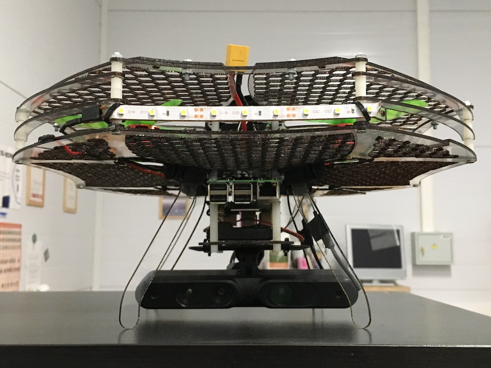

# Дрон для 3D-сканирования человека

Проект был создан совместно с компанией Texel, которая разрабатывает стационарные 3D-сканеры для создания модели человека.

Коллеги из Texel предоставили модуль, состоящий из Raspberry Pi с установленным ПО для сканирования и камеры для захвата 3D-изображения PrimeSense.

С нашей стороны был предоставлен квадрокоптер Клевер 3 с установленным оборудованием для автономного полета, а также написана полетная программа.

Мы провели множество тестов и настроек, внесли много изменений в конструкции дрона, чтобы в итоге добиться результата.

## Видео

<iframe width="966" height="543" src="https://www.youtube.com/embed/aqBION3TVhg" frameborder="0" allow="accelerometer; autoplay; encrypted-media; gyroscope; picture-in-picture" allowfullscreen></iframe>

## Команда

Над проектом работали:

* Тимофей Кондратьев [Copter Express] - сборка дрона, написание и отладка программы, проведение тестов;
* Антон Мальцев [Copter Express] - моделирование защиты пропеллеров;
* Андрей Посконин [Texel] - импорт ПО Texel на Raspberry Pi, совместные тесты;
