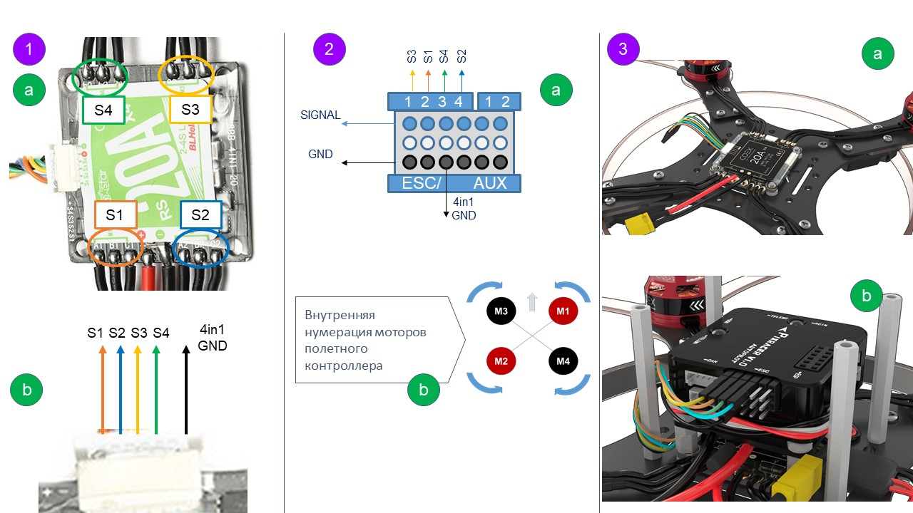

# Подключение регуляторов 4in1

## Распиновка платы регуляторов 4in1

Одним цветом выделены соответствующие фазные провода (рис. 1a) и управляющий ими сигнал (рис. 1b).

Например, оранжевый цвет -> нижний правый мотор -> S1 - оранжевый провода.

## Распиновка полетного контроллера Pixracer

На рис. 2a указана распиновка гребенки:

* **SIGNAL** – подключение регуляторов. Каждый пин имеет свой собственный сигнал. На 5 и 6 сигнал можно получать ШИМ сигнал (Например, можно подключить сервопривод).
* **GND** – земля полетного контроллера. Единая шина на всех пинах GND (отмечены черным).
* 1, 2, 3, 4 – порты для подключения ESC.
* 1, 2 - порты расширения выходного ШИМ сигнала (настраиваются в QGroundControl, также могут использоваться для управления гексакоптером).

    На рис. 2b указана нумерация моторов полетного контроллера Pixracer.

* Стрелочка – ориентация полетного контроллера.
* Черные M3, M4 – моторы, вращающиеся по часовой стрелке.
* Красные M1, M2 – моторы, вращающиеся против часовой стрелке.

## Иллюстрация подключения, исходя из текущей ориентации платы регуляторов 4in1

Используя рис. 1a, 1b, 2a, 2b необходимо сопоставить каждому мотору свой сигнал управления и подключить в соответствии с порядком нумерации моторов Pixracer.

Например, мотор М3, вращающийся против часовой стрелки (верхний левый угол) управляется сигналом S4 (зеленый провод). Подключается в порт 3.

