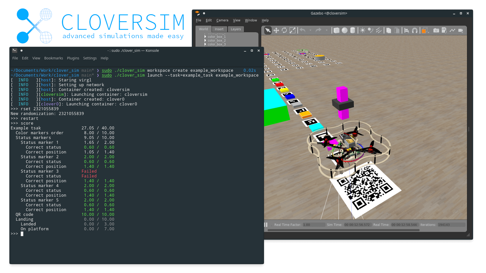

# Advanced Clover Simulator



[CopterHack-2022](copterhack2022.md), команда **FTL**.

[Ссылка на проект](https://github.com/FTL-team/clover_sim).

## Информация о команде

```cpp
#include "interestingCommandDescription.h"
```

Состав команды:

- Максим Романовский, [@maximmasterr](https://t.me/maximmasterr), капитан, программист.
- Михаил Кулик, [@mkulik05](https://t.me/mkulik05), программист.

Страна: Беларусь.

## Описание проекта

Разработка симулятора для Clover с возможностью создания workspace (окружения, позволяющие легко управлять и транспортировать файлы симулятора такие как: проекты, конфигурации, установленные пакеты).

- Простой, быстрый и производительный способ запуска симулятора.
- Инструментарий для создания заданий (как на [IOR2020](https://clover.coex.tech/ru/innopolis_open_L22_AERO.html)).
- Изоляция Gazebo и чекера заданий от Workspace пользователя и clover.
- Worker для проверки задач со степика.
- Возможность запуска несколько коптеров каждый из которых имеет свой контейнер.
- Полная симуляция raspberry с помощью qemu (включая GPIO, USB и камеру).

### Использование платформы "Клевер"

Данный проект является набором инструментов для запуска симуляторов Клевера.

## Первые пуски

Для начала мы решили разработать симулятор имеющий такой же функционал как и [виртуальная машина](./simulation_vm.md)

В качестве инструменты для запуска контейнеров мы используем `systemd-nspawn` ([read more](https://wiki.archlinux.org/title/systemd-nspawn)), так как он запускает systemd init и позволяет пользоваться `systemctl`, так как: не эмулируется ядро линукс, отсутствует ограничение на процессор и память, производительность такого метода выше чем у виртуальной машины.

С графикой посложнее, в виртуальной машине используется графика от VMware, однако в случае если мы не эмулируем ядро мы могли бы пробросить видеокарту. В отличии от виртуальной машины видеокарта останется доступна в хост машине, однако данный метод требует что бы внутри были установлены такие же драйвера как и в хосте(привет Nvidia). Поэтому мы используем `virgl` ([read more](https://gitlab.freedesktop.org/virgl/virglrenderer)), а точнее [virgl_test_server](https://gitlab.freedesktop.org/virgl/virglrenderer/-/wikis/vtest). VirGL представляет собой очень производительный способ проброса OpenGL (и Vulkan). Из-за бага в mesa требуется чтобы стояла mesa 21, для этого мы добавляем ppa [kisak-mesa](https://launchpad.net/~kisak/+archive/ubuntu/kisak-mesa). Работает это примерно так: virgl_test_server создаёт unix-сокет, он пробрасывается в контейнер, mesa в контейнере отправляет запросы на рендер в этот сокет, VirGL принимает их и транслирует в видеокарту, результат отображается на экране. Такой способ позволяет получить более 120fps в Gazebo.

Для реализации механизма workspace, мы используем [overlayfs](https://wiki.archlinux.org/title/Overlay_filesystem), она позволяет создать фс в которой файлы модифицируются и читаются в "верхней" файловой системе, а за тем по порядку в нижних. Таким образом у нас есть директория base которая хранит внутри симулятор, ubuntu, clover. А workspace являются папки поверх base которые хранят только изменения что позволяет сильно экономить место. Workspace можно быстро создавать и удалять, экспортировать и импортировать.

Для сборки base мы используем GitHub Actions, [здесь](https://GitHub.com/FTL-team/clover_sim_basefs) находится репозиторий со скриптами, из интересного можно отметить то что требуется прописать в `/etc/resolv.conf` dns-серверы, прописать нормальный hostname в `/etc/hostname` (иначе debootstrap скопирует его с runner-а GitHub, и оно будет странным) и прописать в `/etc/hosts` строку для резолва этого имени на `127.0.0.1` иначе ROS не запустится.

Для того чтобы было всё красиво и удобно мы создали [инструмент](https://github.com/FTL-team/clover_sim) на Go, который занимается управлением workspace-ами и запуском симулятора.

При попытке запуска симулятора происходило полное поглощение оперативной памяти и swap, а это 8+32 гигабайта. В чём же дело? А в том, что rosout для того чтобы проверить не упрётся ли оно в лимит файловых дескрипторов... аллоцирует их все :/ Гениальное решение. Решается добавление лимитов в `/etc/security/limits.d/30-nofilelimit.conf`. [Более подробно здесь](https://answers.ros.org/question/336963/rosout-high-memory-usage/).

## Сеть, раздельные контейнеры, внутренности systemd и ROS

Для того чтобы обеспечить лучшую переносимость workspace-ов и большую безопасность логично разделить симулятор на две части: Gazebo и clover. Часть Gazebo запускает внутри себя Gazebo и проверяющий скрипт, а часть clover запускает эмулятор PX4, сервисы clover и пользовательские программы. Для упрощения разработки и обеспечения большой безопасности в каждом контейнере должен запускаться свой roscore.

И чтобы это всё могло общаться между собой необходимо чтобы симулятор создавал свою виртуальную сеть. Имеется [очень хорошая статья](https://medium.com/techlog/diving-into-linux-networking-and-docker-bridge-veth-and-iptables-a05eb27b1e72) на эту тему, она рассказывает про тот как создаётся виртуальная сеть в докере. В отличие от докера systemd имеет возможность автоматической настройки network namespace если передать ему bridge что достаточно упрощает нашу задачу. Итак что происходит при запуске симулятора мы создаём bridge под названием `cloversim` и задаём ему IP `192.168.77.1`, такой IP будет у хост системы, [команды которые это делают](https://github.com/FTL-team/clover_sim/blob/15d194f7855be0436c9f1a0145dc331971bfeffd/src/network.go#L22-L24). Так же для того чтобы всё правильно работало необходимо выделять и присваивать IP адреса контейнерам. Выделение реализованно достаточно просто: если при запуске контейнера был указан рекомендуемый IP то начинаем поиск свободного с него, иначе c IP `192.168.77.10`, поиск происходит простой инкрементацией последнего числа, [реализация](https://github.com/FTL-team/clover_sim/blob/fe2ce8e343e06d668c155b5304dc54dc23d10445/src/network.go#L87-L99). Для того чтобы настроить сеть в контейнере внутри него выполняется команда `ip addr add <ip>/24 dev host0 && ip link set host0 up && ip route add default via 192.168.77.1`, она присваивает IP, поднимает подключение и говорит что все пакеты следует слать через него. Маршрутизацией пакетов между контейнером и хостом занимается bridge, а вот для того чтобы контейнеры могли получить доступ к интернету нужно поднять небольшой [NAT](https://ru.wikipedia.org/wiki/NAT). В статье упомянутой раньше используется iptables, но вместо него теперь рекомендуется nftables. Работает это примерно так: создать таблицу роутинга, добавить цепочку правил к таблице, добавить правило которое применяет nat. [Реализация](https://github.com/FTL-team/clover_sim/blob/fe2ce8e343e06d668c155b5304dc54dc23d10445/src/network.go#L42-L44).

О запуске внутри systemd-nspawn. Можно подумать что запуск внутри контейнера происходит как то так: `systemd-nspawn exec ls`, однако это в корни не так. Запускать команды нужно как-то так `systemd-run --machine=clover0 -t /bin/bash -c "ls"`. Что же такое systemd-run? Это инструмент systemd который создаёт временный systemd-сервис и запускает его. Кстати для того чтобы контролировать systemd-сервисы внутри контейнера нужно использовать `systemctl --machine=clover0 start SSHd.service`. И так для любых команд для работы с systemd. Как бы это не казалось странным всё дело в упрощении, для того чтобы не внедрять дополнительный функционал по запуску команд в systemd-nspawn, проще устанавливать соединение с systemd внутри контейнера и просить его создать и запустить сервис. У такого подхода есть свои плюсы: мы можем запускать команды после того как определённые сервисы запустились, мы получаем мощь сервисных файлов systemd для запуска команд, не нужно заново реализовывать логирование. Что касается создания соединения с systemd в контейнере, на самом деле systemctl (и др.) умеют подключаться не только к контейнерам но и к удалённым SSH машинам, так же это необходимо для того чтобы systemctl (и др.) могли подключаться не к системному systemd а к юзерскому (такая возможность также существует). Так что как бы не казалось монолитной структура systemd изначальна, в действительности она очень красиво реализована.


Далее для того чтобы контейнеру с clover было доступна камера и LED-лента, которой управляет симулятор. За работу камеры отвечают топики `/main_camera/image_raw` и `/main_camera/camera_info`, для работы LED нужен топик `/led/state` и сервис `/led/set_leds`. Конечно можно просто написать сервер который будет получать ROS-сообщения и отправлять их клиенту который будет публиковать их в другом клиенте. Но такой подход не самый производительный, по этому мы реализовали скрипт на Python который получает информацию из одного ROS-мастера и публикует его в другой, и в результате ноды разных мастеров общаются между собой напрямую. ROS мастер выполняет функцию связывающего который сообщает на каких адресах находятся какие ноды и какие топики они публикуют/подписаны, так же он сообщает адрес по которому доступна нода для сервисов, [более подробно](http://wiki.ROS.org/ROS/Technical%20Overview). Соответственно, для того чтобы сервисы и топики стали видны необходимо передать информацию из одного мастера в другой. Для этого можно обращаться напрямую к [ROS Master API](http://wiki.ROS.org/ROS/Master_API), API ROS представляет собой набор функций вызываемых с помощью xmlrpc. Для того чтобы "пробросить топик" из мастера А в мастер Б, мы подписываемся на нужный топик, получаем информацию о том кто его публикует, отправляем эту информацию в мастер B, топик становится доступным в мастере B. С сервисами ситуация чуть проще, при вызове сервиса клиент каждый раз запрашивает мастер про адрес по которому нужно вызывать сервис, так как сервис может представлять только одна нода то мы просто с определённой периодичностью запрашиваем информацию о сервисе у мастера A и отправляем её в мастер B. Вот так это всё реализовано: [тык](https://github.com/FTL-team/clover_sim_basefs/blob/main/files/cloversim/scripts/sim_proxy).

Launch-файл не сильно поменялся по сравнению с [прошлой версией](https://github.com/CopterExpress/clover/blob/master/clover_simulation/launch/simulator.launch). Во первых он был разнесён на две части: первая часть это - `Gazebo instance` и `Clover model`. Во вторую часть попали `PX4 instance` и `Clover services`. Так же в первую часть был добавлен запуск ROS-прокси. Во второй части была задана [переменная окружения](https://github.com/FTL-team/clover_sim_basefs/blob/0d2b12f9ff07916dd525d00206a552f1aa6e3cb3/files/cloversim/launch/copter.launch#L19) которая говорила PX4 что симулятор находиться в первом контейнере и gcs_bridge был переключён на UDP чтобы QGroundControl мог автоматически подключаться к контейнерам. Итоговые файлы: [контейнер с симулятор](https://github.com/FTL-team/clover_sim_basefs/blob/main/files/cloversim/launch/simulator.launch), [контейнер с clover-ом](https://github.com/FTL-team/clover_sim_basefs/blob/0d2b12f9ff07916dd525d00206a552f1aa6e3cb3/files/cloversim/launch/copter.launch).

[Видео](https://youtu.be/8k-gAUIeyis) с демонстрацией работы после описанного выше.

## Задачи, Catkin и Gazebo

Нам было необходимо реализовать какой-то метод для управления симулятором. Первой идеей было добавление подкоманд в clover_sim, тогда перезапуск симулятора выглядел бы примерно так: `sudo ./clover_sim simulator restart`. У такого подхода есть две проблемы: во-первых каждый раз надо набирать `sudo ./clover_sim`, во вторых нужно как-то(например с помощью unix-сокетов) реализовать обмен данными между запущенной командой и `sudo ./clover_sim launch` который контролирует всё. Поэтому мы решили реализовать консоль внутри `sudo ./clover_sim launch` которая позволит управлять симулятором. [Эта статья](https://www.lihaoyi.com/post/BuildyourownCommandLinewithANSIescapecodes.html) очень помогла сделать консоль удобной. [Реализация внутри clover_sim](https://github.com/FTL-team/clover_sim/blob/main/src/simulatorControl.go). Выглядит это так:


Далее для упрощения распространения мы решили перенести ROS-пакет с нашим симулятором из base_fs в отдельный слой overlay, мы собираем этот слой с помощью systemd-nspawn без boot флага(работает почти так же как простой chroot). Для того чтобы не собирать слой с нашим пакетом каждый раз мы сверяем package.xml в исходниках нашего пакета с package.xml в слое и если они не совпадают мы пересобираем слой. Также не стоит забывать про то что при сборке нужно подгружать переменные окружения.

### Задания

Задания представляют собой ROS-пакеты которые способны создавать миры Gazebo и проверять пользовательские решения, сами задания загружаются из папки tasks при launch-е. Так же как и в слое с cloversim мы храним задание в отдельном overlay слое, и при запуске cloversim сверяет package.xml в задании с package.xml в слое и если они не совпадают мы пересобираем слой. Следующая проблема это как нам вызвать что нибудь в задаче (например генерацию мира) тут на помощь приходит "особенность" catkin которая позволяет установить питоновский пакет в название независимое от название ROS-пакета. И используя эту особенность каждое задание вне зависимости от названия доступен так: `from cloversim_task.world import WORLD`. Файл который ложит пакет под одним и тем же именем: [тык](https://github.com/FTL-team/clover_sim/blob/main/sim/cloversim/setup.py). Кроме того нам необходимо запускать генерацию мира из roslaunch перед тем как запускать ноды типа Gazebo или clover. На помощь приходит фича roslaunch которая позволяет положить в ROS-параметр результат команды, [документация про это](http://wiki.ros.org/roslaunch/XML/param). Вот так это выглядит в roslaunch: [тык](https://github.com/FTL-team/clover_sim/blob/fb34a6ff81a8e67f2d5744b555a0f20df0aa61d1/sim/cloversim/launch/simulator.launch#L11-L12). Также для того чтобы не стартовать симулятор раньше времени у нас есть механизм синхронизации между контейнерами: roslaunch в контейнере с clover запускает TCP сервер и ждёт коннекта и выходит затем, в свою очередь контейнер с симулятором после генерации мира подключается к контейнеру с clover вследствие чего команды roslaunch в обоих контейнерах продолжает выполнение и запускает ноды.

Переходим к тому как задание работает с миром. Во-первых генерация, миры Gazebo описаны с помощью [SDFormat](http://sdformat.org/spec?elem=world) основанном на XML, и для генерации миров мы просто написали несколько классов (куб, цилиндр, модель из файла) которые генерирует мир в SDFormat и сохраняют его. Для того чтобы можно было использовать в качестве текстуры не только текст но и изображения мы реализуем [функцию](https://github.com/FTL-team/clover_sim/blob/main/sim/cloversim/src/cloversim/generation/image.py) которая генерирует ogre-скрипты которые подаются в Gazebo и рендерят картинку. Так же нам необходимо иметь возможность создавать модели с разными текстурами на разных гранях, для того чтобы это сделать например [для куба](https://github.com/FTL-team/clover_sim/blob/fb34a6ff81a8e67f2d5744b555a0f20df0aa61d1/sim/cloversim/src/cloversim/generation/basic.py#L150-L179) нам нужно создавать 6 тонких кубов и размещать их там где должны находится грани. Другой способ сделать разные текстуры на разных поверхностях это использование COLLADA-файлов, но мы отказались от этой идеи так как кроме генератора SDFormat нам пришлось бы делать генератор COLLADA что сильно усложнило бы библиотеку. Далее для того чтобы миры не были каждый раз одинаковыми необходимо добавить возможность рандомизации, на помощь приходит псевдо-рандом который позволяет генерировать псевдо-случайные значения используя seed, один seed один и тот же результат рандомизации. Использование seed так же позволяет легко переносить различные рандомизации и тестировать их по порядку. Теперь переходим к тому как проверять задания Gazebo предоставляет [ROS-сервисы](http://gazebosim.org/tutorials/?tut=ros_comm#Services:Stateandpropertygetters) которые позволяют получить текущее положение вещей. Так что для определения позиции коптера нам нужно просто вызвать get_model_state, а для проверки на arm коптера можно проверять скорость в `get_joint_state`.

## [Видео с демонстрацией](https://www.youtube.com/watch?v=mO9yoeeEdsw)
