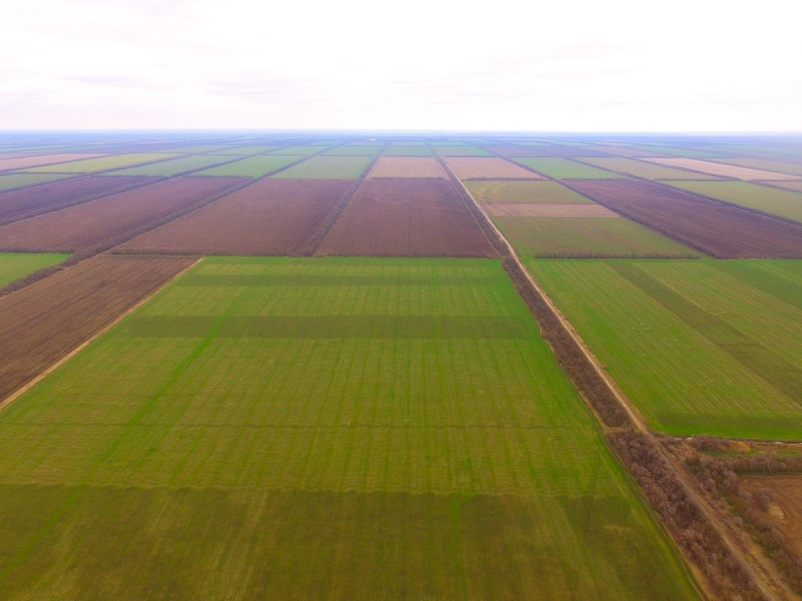

# Распознавание видов агрокультур в массовом сельском производстве

## Введение

Современное сельское хозяйство во многих странах превращается в один из ярких примеров быстрого и успешного внедрения новых технологий. Беспилотные летательные аппараты способны выполнять широкий круг задач, среди которых мониторинг сельскохозяйственных угодий сегодня стал уже почти привычным инструментом повышения эффективности сельских хозяйств. Целью моего проекта является написание кода для распознавания видов агрокультур в массовом сельском производстве. В дальнейшем из результатов распознавания можно спроектировать карту посевных площадей.

## Мониторинг

В сельском хозяйстве мониторинг необходим для получения информации о состоянии угодий и посевов. Фермеры или специалисты могут по результатам мониторинга понять, нормально ли всходят культуры, есть ли угроза со стороны сорняков и/или насекомых – вредителей, какова степень увлажненности отдельных участков или целых площадей и т.д.

## Объяснение кода

Подключаем библиотеки:

```python
import rospy
import cv2
from sensor_msgs.msg import Image
from cv_bridge import CvBridge
import numpy as np
```

Создаём некоторые переменные:

```python
rospy.init_node('computer_vision_sample')

bridge = CvBridge()

color = 'undefined'
shape = 'undefined'
culture = ""
```

Для реализации алгоритмов компьютерного зрения рекомендуется использовать предустановленную на образ Клевера библиотеку OpenCV.
 Создаём подписчика на топик с изображением с основной камеры для обработки с использованием OpenCV:

```python
def image_colback_color(data):
    global color, shape

    cv_image = bridge.imgmsg_to_cv2(data, 'bgr8') # OpenCV image
    img_hsv = cv2.cvtColor(cv_image, cv2.COLOR_BGR2HSV) #[118:119,158:159]

    #detected color
    #print(img_hsv[0][0])
```

Каждая культура имеет свой неповторимый оттенок(пшеница- золотистая, гречиха - светло-коричневая).




Прописываем диапазоны цветов для определённых культур:

```python
#пшеница
yellow_orange_low = (38, 110, 150)
yellow_orange_high= (52, 110, 150)

#гречиха
brown_low = (23, 50, 50)
brown_high= (37, 50, 50)

yellow_orange_mask = cv2.inRange(img_hsv, yellow_orange_low, yellow_orange_high)
brown_mask = cv2.inRange(img_hsv, brown_low, brown_high)

if yellow_orange_mask[119][159] == 255:
    shape = shape_recog(yellow_orange_mask)

elif brown_mask[119][159] == 255:
    shape = shape_recog(brown_mask)

else:
    shape = 'undefined'
    color = 'undefined'

if shape == 'brown':
    culture = "greshiha"
if shape == 'yellow_orange':
    culture = "pshenitsa"

image_sub = rospy.Subscriber('main_camera/image_raw', Image, image_colback_color)
```

Скрипт будет занимать 100% процессора. Для искусственного замедления работы скрипта можно запустить throttling кадров с камеры, например, в 5 Гц (`main_camera.launch`):

```xml
<node pkg="topic_tools" name="cam_throttle" type="throttle" args="messages main_camera/image_raw 5.0 main_camera/image_raw_throttled"/>
```

Топик для подписчика в этом случае необходимо поменять на: `main_camera/image_raw_throttled`.

```python
print (culture)
while not rospy.is_shutdown():
    print("color: {}".format(color))
    print("shape: {}".format(shape))
    rospy.sleep(0.2)
```

Данная программа будет определять культуру по её оттенку. Для повышения точности определения можно использовать больше цветовых диапазонов и дрон сможет распознавать большее количество культур.

Вот примеры цветовых диапазонов:

```python
red_low1 = (0, 110, 150)
red_high1 = (7, 255, 255)

red_low2 = (172, 110, 150)
red_high2 = (180, 255, 255)

red_orange_low = (8, 110, 150)
red_orange_high = (22, 110, 150)

orange_low = (23, 110, 150)
orange_high = (37, 110, 150)

yellow_orange_low = (38, 110, 150)
yellow_orange_high = (52, 110, 150)

yellow_low = (53, 150, 150)
yellow_high = (67, 255, 255)

yellow_green_low = (68, 150, 150)
yellow_green_high = (82, 255, 255)

green_low = (83, 150, 150)
green_high = (97, 255, 255)

blue_green_low = (98, 150, 150)
blue_green_high = (113, 255, 255)

blue_low = (114, 150, 150)
blue_high = (127, 255, 255)

blue_violet_low = (128, 150, 150)
blue_violet_high = (142, 255, 255)

violet_low = (143, 150, 150)
violet_high = (157, 255, 255)

red_violet_low = (158, 150, 150)
red_violet_hugh = (171, 255, 255)
```

Обратите внимание, что для красного цвета используется два диапазона т. к. красный цвет находится на границах цветового пространства HSV.
