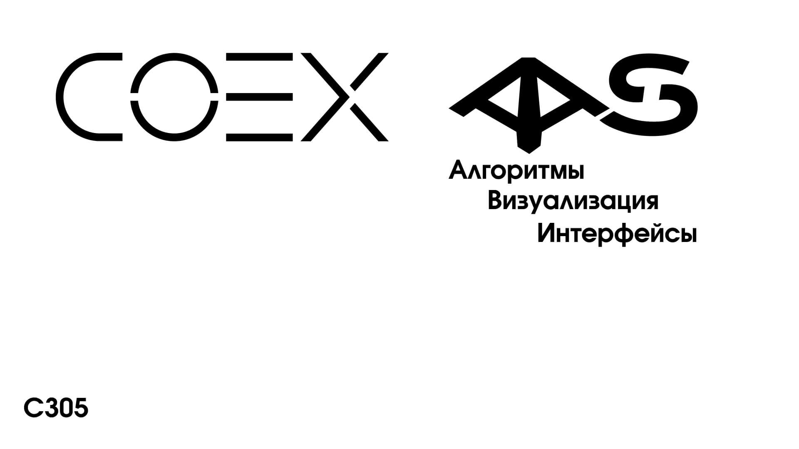

# Система мониторинга воздуха

[CopterHack-2022](copterhack2022.md), команда **С305**.

## Информация о команде

Состав команды:

* [Мамбетов Руслан](https://github.com/Ruslan2288) - CEO, разработчик встраиваемого ПО, дизайнер печатной платы;
* [Филимонов Сергей](https://github.com/Lukerrr) - программист (интерфейс пользователя, визуализатор);
* [Смадыч Никита](https://github.com/NikitaS2001) - инженер-программист (навигация дрона);
* [Антонов Георгий](https://github.com/GeJudas23) - инженер (сборка и настройка дрона, создание 3D-моделей).

## Описание проекта

### Идея проекта

Идея представляемого проекта заключается во внедрении в платформу “Клевера” дополнительных модулей предназначенных для измерения содержания в воздухе газов и органических соединений используемых в промышленности, а также лидара (RPLIDAR), предназначенного для автономной навигации.

Наши нововведения позволят использовать коптер для поиска участков с повышенным содержанием потенциально опасных для человека и окружающей среды газообразных веществ, строить карту загрязненности воздуха и обозначать на ней зоны с критической концентрацией газов. Также дрон сможет выполнять задачи по обнаружению утечек на газовых магистралях. В совокупности это даст возможность обнаруживать локальные зоны выброса опасных газов и впоследствии своевременно их устранять.

Применение лидара обусловлено необходимостью облета дроном возможных препятствий при выполнении миссии, либо работы в замкнутых помещениях, например, локализация зон утечек вредных газов в больших закрытых производственных и складских помещениях.

Проект, в том числе, направлен на мониторинг углеродного следа, являющимся важным фактором в вопросе глобального изменения климата. Статистика показывает, что повышение уровня выбросов парниковых газов в атмосферу за последние годы стремительно растет, что приводит к повышению температуры поверхности планеты и значительному увеличению числа природных катастроф и аномалий. Примером влияния глобального потепления являются и недавние события - аномальная жара летом 2021 года.

### Презентационный ролик

## [Репозиторий проекта](https://github.com/Lukerrr/air-analysis-system)

### Документация к проекту

* [Сборка коптера газоанализатора](https://github.com/Lukerrr/air-analysis-system/blob/master/docs/drone_assembly.md)
* [Настройка коптера для автономных полётов](https://github.com/Lukerrr/air-analysis-system/blob/master/docs/drone_config.md)
* [Система планирования полета](https://github.com/Lukerrr/air-analysis-system/blob/master/docs/path_planning.md)
* [Пользовательские приложения](https://github.com/Lukerrr/air-analysis-system/blob/master/docs/user_applications.md)
* [Настройка лидара](https://github.com/Lukerrr/air-analysis-system/blob/master/docs/setup_lidar.md)
* [Процесс загрузки прошивки](https://github.com/Lukerrr/air-analysis-system/blob/master/docs/firmware_upload.md)
* [Подключение датчиков газов](https://github.com/Lukerrr/air-analysis-system/blob/master/docs/gas_sensors.md)

### Ресурсы проекта

* [Исходный код программ для Raspberry Pi](https://github.com/Lukerrr/airmon)
* [Исходный код наземной станции](https://github.com/Lukerrr/airmon-control)
* [Модели крепления лидара](https://github.com/Lukerrr/air-analysis-system/tree/master/models)
* [Прошивка для газоанализатора (Arduino)](https://github.com/Lukerrr/air-analysis-system/tree/master/hardware/arduino_firmware)
* [Прошивка для газоанализатора (STM)](https://github.com/Lukerrr/air-analysis-system/tree/master/hardware/stm_firmware)
* [Gerber файлы платы газоанализатора](https://github.com/Lukerrr/air-analysis-system/tree/master/hardware/gerber_pcb_air_analysis_board)
