# Autonomous Multirotor Landing System (AMLS)

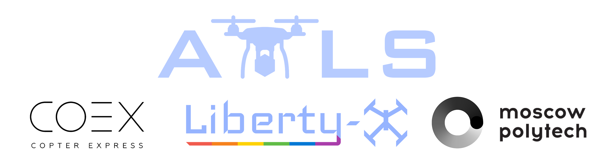

## Цель проекта: Автоматически посадить дрон в движении

### Статья о проекте AMLS

В этой статье будет описание нашего проекта, а именно, алгоритмов оптической стабилизации, удержания по GPS, следование по GPS, удержания высоты, системы захватов, крыши, измерения освещённости, скорости движения платформы. Также, после прочтения статьи станет понятно, как работает проект AMLS!

### Основной репозиторий проекта на GitHub

https://github.com/XxOinvizioNxX/Liberty-Way

### Разработчики

- [Павел Нешумов](mailto:xxoinvizionxx@gmail.com)
- [Андрей Кабалин](mailto:astik452@gmail.com)
- [Владислав Яснецкий](mailto:vlad.yasn@gmail.com)

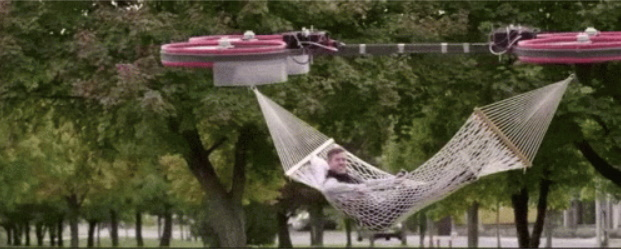

-----------

## Оглавление

- [0. Как это работает?](#how-it-works)
  - [0.1. Видео про наш проект](#short-video-about-our-project-clickable)
- [1. Удержание по GPS и полёт по точкам](#hold-and-flight-to-waypoints-functions)
  - [1.1. Чтение данных из UART](#serial-reading)
  - [1.2. Парсинг протокола UBlox](#ublox-parsing)
  - [1.3. Установка текущей путевой точки](#set-current-waypoint)
  - [1.4. Изменение точек (Чтобы летать по координатам)](#waypoint-edit-to-fly-to-waypoints)
  - [1.5. Удержание конкретной позиции](#waypoint-stabilization)
- [2. Следование за платформой](#following)
- [3. Компас](#compass)
- [4. Удержание высоты (барометр)](#altitude-stabilization-barometer)
- [5. Оптическая стабилизация](#optical-stabilization)
  - [5.1. Так сложно и так важно](#so-difficult-and-so-important)
  - [5.2. Первые шаги](#first-steps)
  - [5.3. Инверсия](#inverse-approach)
  - [5.4. Версия на Java](#java-edition)
  - [5.5. Liberty-Way](#liberty-way)
  - [5.6. Связь с дроном](#communication-with-the-drone)
  - [5.7. Подвес для камеры](#camera-gimbal)
- [6. Платформа Eitude](#eitude-amls-platform)
  - [6.1. Система захватов](#grabbing-system)
  - [6.2. Крыша](#weather-protection-system)
  - [6.3. Спидометр](#platform-speedometer)
  - [6.4. Датчики уровня освещённости](#platform-light-sensor)
- [7. Заключение](#conclusion)

-----------

## 0. Как это работает? {#how-it-works}

Система состоит из двух частей:

- Дрона

    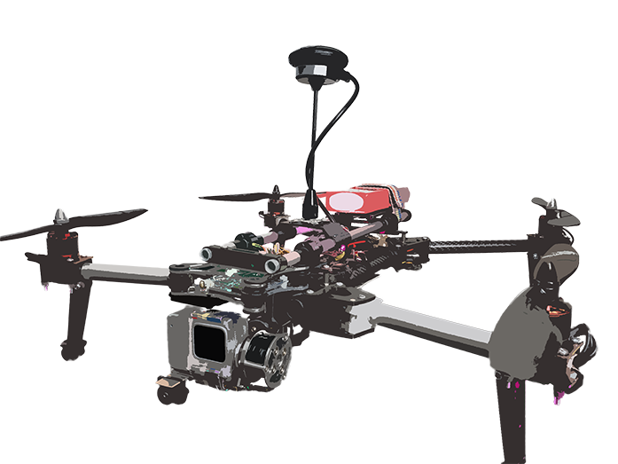

- И платформы, или подвижной (на автомобиле), или статичной (на постамате)

    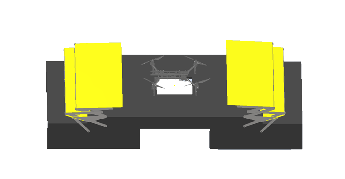

Порядок действий выглядит так:

- В начале, дрон с посылкой находится далеко от платформы. По сотовой связи или другому радиоканалу, ему отправляются GPS координаты платформы (на дроне установлен модуль Liberty-Link, способный корректировать его положение, независимо от прошивки полётного контроллера. (Модуль ставится в разрыв линии от приёмника (пульта) до полётника).
- Дрон летит на эти координаты. В процессе полёта они могут обновляться (но не часто, чтобы не нагружать канал).
- Когда дрон подлетает близко к платформе, включается стабилизация по GPS. Тут уже данные передаются по ближней радиосвязи и с большой частотой, чтобы дрон успевал за платформой.
- Вместе с этим, происходит снижение дрона (на платформе и дроне есть барометры). Снижение происходит до высоты 1.5-2 метра над платформой.
- В момент снижения включается оптическая (прецизионная) стабилизация с платформы. Как только камера увидит метку, алгоритм "захватит" дрон.
- После включения оптической стабилизации, GPS отходит на второй план и является страхующим (на случай, если что-то пойдёт не так, снова включается GPS стабилизация).
- Во время оптической стабилизации на дроне закреплена ArUco метка, которую видит камера на платформе и по ближней радиосвязи посылает на дрон корректирующие значения.
- Одновременно с оптической стабилизацией включается и посадка. Этот алгоритм искусственно плавно снижает setpoint по высоте (Z) до некоторого порога.
- Как только снижение достигло нужного значения, подаётся команда на платформу для активации механических захватов, которые должны поймать дрон.
- После поимки дрона, происходит его обслуживание, разгрузка посылки и закрытие крыши над платформой (для защиты от неблагоприятных погодных условий).
- На этом посадка завершена!

### Видео про наш проект (кликабельно) {#short-video-about-our-project-clickable}

<iframe width="560" height="315" src="https://www.youtube.com/embed/6qjS-iq6a3k" frameborder="0" allow="accelerometer; autoplay; encrypted-media; gyroscope; picture-in-picture" allowfullscreen></iframe>

-----------

## 1. Удержание по GPS и полёт по точкам {#hold-and-flight-to-waypoints-functions}

Как уже было сказано ранее, на дроне установлен "универсальный" модуль Liberty-Link, принимающий команды с платформы и корректирующий положение дрона, вмешиваясь в сигнал с пульта управления (подробнее об этом в следующих пунктах).

В Liberty-Link будет встроенный GPS модуль, и, соответственно, возможность поддержания положения по GPS и следования по точкам. Результат работы алгоритма поддержания позиции по GPS (кликабельно):

<iframe width="560" height="315" src="https://www.youtube.com/embed/x364giIt6lc" frameborder="0" allow="accelerometer; autoplay; encrypted-media; gyroscope; picture-in-picture" allowfullscreen></iframe>

GPS-модуль будет использоваться из семейства UBlox (например, UBlox Neo-M8). Установлено будет 1 или 3 (для минимизации погрешности) модуля.

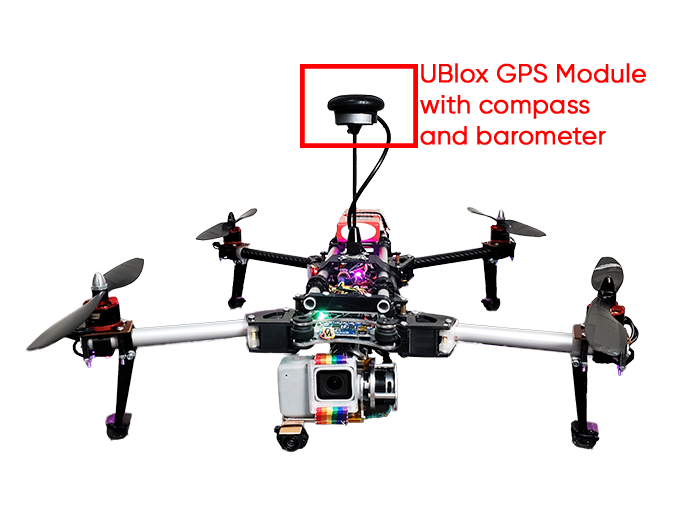

Модули работают по UART-интерфейсу. Настроены на частоту отправки 5 раз в секунду. Прошивка Liberty-Link будет читать данные с модулей и вычислять координаты текущего положения.

### 1.1. Чтение данных из UART {#serial-reading}

Чтение данных с модуля в буфер выглядит так:

```cpp
// Read data from the GPS module
while (GPS_serial.available() && new_line_found == 0) {
	// Stay in this loop as long as there is serial information from the GPS available
	char read_serial_byte = GPS_serial.read();
	if (read_serial_byte == '$') {
		// Clear the old data from the incoming buffer array if the new byte equals a $ character
		for (message_counter = 0; message_counter <= 99; message_counter++) {
			incoming_message[message_counter] = '-';
		}
		// Reset the message_counter variable because we want to start writing at the begin of the array
		message_counter = 0;
	}
	// If the received byte does not equal a $ character, increase the message_counter variable
	else if (message_counter <= 99)
		message_counter++;

	// Write the new received byte to the new position in the incoming_message array
	incoming_message[message_counter] = read_serial_byte;

	// Every NMEA line end with a '*'. If this character is detected the new_line_found variable is set to 1
	if (read_serial_byte == '*') new_line_found = 1;
}
```

### 1.2. Парсинг протокола UBlox {#ublox-parsing}

После, из заполненного буфера вычисляются широта, долгота, тип корректировки (2D, 3D) и количество спутников.
Парсинг GPS данных протокола UBlox выглядит так:

```cpp
// If the software has detected a new NMEA line it will check if it's a valid line that can be used
if (new_line_found == 1) {
	// Reset the new_line_found variable for the next line
	new_line_found = 0;
	if (incoming_message[4] == 'L' && incoming_message[5] == 'L' && incoming_message[7] == ',') {
		// When there is no GPS fix or latitude/longitude information available
		// Set some variables to 0 if no valid information is found by the GPS module. This is needed for GPS lost when flying
		l_lat_gps = 0;
		l_lon_gps = 0;
		lat_gps_previous = 0;
		lon_gps_previous = 0;
		number_used_sats = 0;
	}
	// If the line starts with GA and if there is a GPS fix we can scan the line for the latitude, longitude and number of satellites
	if (incoming_message[4] == 'G' && incoming_message[5] == 'A' && (incoming_message[44] == '1' || incoming_message[44] == '2')) {
		// Filter the minutes for the GGA line multiplied by 10
		lat_gps_actual = ((int)incoming_message[19] - 48) * (long)10000000;
		lat_gps_actual += ((int)incoming_message[20] - 48) * (long)1000000;
		lat_gps_actual += ((int)incoming_message[22] - 48) * (long)100000;
		lat_gps_actual += ((int)incoming_message[23] - 48) * (long)10000;
		lat_gps_actual += ((int)incoming_message[24] - 48) * (long)1000;
		lat_gps_actual += ((int)incoming_message[25] - 48) * (long)100;
		lat_gps_actual += ((int)incoming_message[26] - 48) * (long)10;
		// To convert the minutes to degrees we need to divide the minutes by 6
		lat_gps_actual /= (long)6;
		// Add the degrees multiplied by 10
		lat_gps_actual += ((int)incoming_message[17] - 48) * (long)100000000;
		lat_gps_actual += ((int)incoming_message[18] - 48) * (long)10000000;
		// Divide everything by 10
		lat_gps_actual /= 10;

		// Filter the minutes for the GGA line multiplied by 10
		lon_gps_actual = ((int)incoming_message[33] - 48) * (long)10000000;
		lon_gps_actual += ((int)incoming_message[34] - 48) * (long)1000000;
		lon_gps_actual += ((int)incoming_message[36] - 48) * (long)100000;
		lon_gps_actual += ((int)incoming_message[37] - 48) * (long)10000;
		lon_gps_actual += ((int)incoming_message[38] - 48) * (long)1000;
		lon_gps_actual += ((int)incoming_message[39] - 48) * (long)100;
		lon_gps_actual += ((int)incoming_message[40] - 48) * (long)10;
		// To convert the minutes to degrees we need to divide the minutes by 6
		lon_gps_actual /= (long)6;
		// Add the degrees multiplied by 10
		lon_gps_actual += ((int)incoming_message[30] - 48) * (long)1000000000;
		lon_gps_actual += ((int)incoming_message[31] - 48) * (long)100000000;
		lon_gps_actual += ((int)incoming_message[32] - 48) * (long)10000000;
		// Divide everything by 10
		lon_gps_actual /= 10;

		if (incoming_message[28] == 'N')
			// When flying north of the equator the latitude_north variable will be set to 1
			latitude_north = 1;
		else
			// When flying south of the equator the latitude_north variable will be set to 0
			latitude_north = 0;

		if (incoming_message[42] == 'E')
			// When flying east of the prime meridian the longiude_east variable will be set to 1
			longiude_east = 1;
		else
			// When flying west of the prime meridian the longiude_east variable will be set to 0
			longiude_east = 0;

		// Filter the number of satillites from the GGA line
		number_used_sats = ((int)incoming_message[46] - 48) * (long)10;
		number_used_sats += (int)incoming_message[47] - 48;

		if (lat_gps_previous == 0 && lon_gps_previous == 0) {
			// If this is the first time the GPS code is used
			// Set the lat_gps_previous variable to the lat_gps_actual variable
			lat_gps_previous = lat_gps_actual;
			// Set the lon_gps_previous variable to the lon_gps_actual variable
			lon_gps_previous = lon_gps_actual;
		}

		// Divide the difference between the new and previous latitude by ten
		lat_gps_loop_add = (float)(lat_gps_actual - lat_gps_previous) / 10.0;
		// Divide the difference between the new and previous longitude by ten
		lon_gps_loop_add = (float)(lon_gps_actual - lon_gps_previous) / 10.0;

		// Set the l_lat_gps variable to the previous latitude value
		l_lat_gps = lat_gps_previous;
		// Set the l_lon_gps variable to the previous longitude value
		l_lon_gps = lon_gps_previous;

		// Remember the new latitude value in the lat_gps_previous variable for the next loop
		lat_gps_previous = lat_gps_actual;
		// Remember the new longitude value in the lat_gps_previous variable for the next loop
		lon_gps_previous = lon_gps_actual;
	}

	// If the line starts with SA and if there is a GPS fix we can scan the line for the fix type (none, 2D or 3D)
	if (incoming_message[4] == 'S' && incoming_message[5] == 'A')
		fix_type = (int)incoming_message[9] - 48;

}
```

### 1.3. Установка текущей путевой точки {#set-current-waypoint}

Далее, с полученными данными и происходит самая магия. Для включения поддержания текущего положения достаточно установить флаг `waypoint_set = 1;` и установить текущие координаты как waypoint:

```cpp
l_lat_waypoint = l_lat_gps;
l_lon_waypoint = l_lon_gps;
```

После этого, начнётся вычисление ошибки в координатах и корректировка с помощью PD - регулятора. Для D - составляющей используется rotation memory.

<a name="14-waypoint-edit-to-fly-to-waypoints"></a>

### 1.4. Изменение точек (Чтобы летать по координатам) {#waypoint-edit-to-fly-to-waypoints}

Если просто задать новые `l_lat_waypoint` и `l_lon_wayoint`, находящиеся на большом удалении от дрона, он не сможет нормально прилететь и стабилизироваться на этих координатах. Для плавного изменения можно использовать переменные `l_lat_gps_float_adjust` и `l_lon_gps_float_adjust`. Это переменные типа `float`, изменяя которые, `l_lat_waypoint` и `l_lon_waypoint` будут плавно меняться.

Например, если в основном цикле постоянно прибавлять некую величину к этим переменным:

```cpp
l_lat_gps_float_adjust += 0.0015;
```

При установленном waypoint, дрон будет плавно перемещаться в заданном направлении.
В дальнейшим это будет использоваться для плавного ускорения и замедления во время движения к точке.

### 1.5. Удержание конкретной позиции {#waypoint-stabilization}

```cpp
if (waypoint_set == 1) {
	//If the waypoints are stored

	// Adjust l_lat_waypoint
	if (l_lat_gps_float_adjust > 1) {
		l_lat_waypoint++;
		l_lat_gps_float_adjust--;
	}
	if (l_lat_gps_float_adjust < -1) {
		l_lat_waypoint--;
		l_lat_gps_float_adjust++;
	}

	// Adjust l_lon_waypoint
	if (l_lon_gps_float_adjust > 1) {
		l_lon_waypoint++;
		l_lon_gps_float_adjust--;
	}
	if (l_lon_gps_float_adjust < -1) {
		l_lon_waypoint--;
		l_lon_gps_float_adjust++;
	}

	// Calculate the latitude error between waypoint and actual position
	gps_lon_error = l_lon_waypoint - l_lon_gps;
	// Calculate the longitude error between waypoint and actual position
	gps_lat_error = l_lat_gps - l_lat_waypoint;

	// Subtract the current memory position to make room for the new value
	gps_lat_total_average -= gps_lat_rotating_mem[gps_rotating_mem_location];
	// Calculate the new change between the actual pressure and the previous measurement
	gps_lat_rotating_mem[gps_rotating_mem_location] = gps_lat_error - gps_lat_error_previous;
	// Add the new value to the long term average value
	gps_lat_total_average += gps_lat_rotating_mem[gps_rotating_mem_location];

	// Subtract the current memory position to make room for the new value
	gps_lon_total_average -= gps_lon_rotating_mem[gps_rotating_mem_location];
	// Calculate the new change between the actual pressure and the previous measurement
	gps_lon_rotating_mem[gps_rotating_mem_location] = gps_lon_error - gps_lon_error_previous;
	// Add the new value to the long term average value
	gps_lon_total_average += gps_lon_rotating_mem[gps_rotating_mem_location];

	// Increase the rotating memory location
	gps_rotating_mem_location++;
	if (gps_rotating_mem_location == 35)
		// Start at 0 when the memory location 35 is reached
		gps_rotating_mem_location = 0;

	// Remember the error for the next loop
	gps_lat_error_previous = gps_lat_error;
	gps_lon_error_previous = gps_lon_error;

	//Calculate the GPS pitch and roll correction as if the nose of the multicopter is facing north.
	//The Proportional part = (float)gps_lat_error * gps_p_gain.
	//The Derivative part = (float)gps_lat_total_average * gps_d_gain.
	gps_pitch_adjust_north = (float)gps_lat_error * gps_p_gain + (float)gps_lat_total_average * gps_d_gain;
	gps_roll_adjust_north = (float)gps_lon_error * gps_p_gain + (float)gps_lon_total_average * gps_d_gain;

	if (!latitude_north)
		// Invert the pitch adjustmet because the quadcopter is flying south of the equator
		gps_pitch_adjust_north *= -1;
	if (!longiude_east)
		// Invert the roll adjustmet because the quadcopter is flying west of the prime meridian
		gps_roll_adjust_north *= -1;

	//Because the correction is calculated as if the nose was facing north, we need to convert it for the current heading.
	gps_roll_adjust = ((float)gps_roll_adjust_north * cos(angle_yaw * 0.017453)) + ((float)gps_pitch_adjust_north * cos((angle_yaw - 90) * 0.017453));
	gps_pitch_adjust = ((float)gps_pitch_adjust_north * cos(angle_yaw * 0.017453)) + ((float)gps_roll_adjust_north * cos((angle_yaw + 90) * 0.017453));

	//Limit the maximum correction to 300. This way we still have full control with the pitch and roll stick on the transmitter.
	if (gps_roll_adjust > 300) gps_roll_adjust = 300;
	if (gps_roll_adjust < -300) gps_roll_adjust = -300;
	if (gps_pitch_adjust > 300) gps_pitch_adjust = 300;
	if (gps_pitch_adjust < -300) gps_pitch_adjust = -300;
}

```

## 2. Следование за платформой {#following}

Основной задачей стабилизации по GPS-координатам стала разработка алгоритма предсказания положения дрона. Самым простым способом представилось использовать математический расчет следующего положения дрона. Это вычисляется для наиболее точного позиционирования дрона в отношении посадочной платформы.

Для начала был придуман простейший алгоритм расчета коэффициента изменения координат. Реализация производилась на языке Python. На этапе тестирования данного алгоритма встала проблема симуляции генерации GPS-координат. Дабы разрешить эту проблему, было испробовано много различных ресурсов: от открытых исходных кодов самодельных навигаторов до попытки использовать API Google Maps, Yandex Maps или 2GIS. И лишь спустя семестр мы додумались до простого изменения значений по некоторой дельте с отрисовкой в MatPlotLib либо PyQtGraph. До этого всё тестирование алгоритма производилось с использованием инструментария прошивки PX4, симулятора движения дрона Gazebo. Как следствие было преодолено много формальностей в вопросах общения с симулятором и увеличением производительности.

Видео работы алгоритма предсказания GPS координат (кликабельно)

<iframe width="560" height="315" src="https://www.youtube.com/embed/Rg-Y_fl4BKQ" frameborder="0" allow="accelerometer; autoplay; encrypted-media; gyroscope; picture-in-picture" allowfullscreen></iframe>

Конечный результат ошибки предсказанных координат достиг диапазона от 0 до 70 см.

-----------

<a name="3-compass"></a>

## 3. Компас {#compass}

До момента оптической стабилизации (во время GPS стабилизации), для вычисления вектора корректировки по GPS требуется знать точный угол по компасу. Для этого используется встроенный в GPS модуль компас.

Т.к. во время полёта меняются углы крена и тангажа, требуется корректировать значения с компаса. В общем плане, вычисления угла с комапса выглядит так:

```cpp
// The compass values change when the roll and pitch angle of the quadcopter changes. That's the reason that the x and y values need to calculated for a virtual horizontal position
// The 0.0174533 value is phi/180 as the functions are in radians in stead of degrees
compass_x_horizontal = (float)compass_x * cos(angle_pitch * -0.0174533) + (float)compass_y * sin(angle_roll * 0.0174533) * sin(angle_pitch * -0.0174533) - (float)compass_z * cos(angle_roll * 0.0174533) * sin(angle_pitch * -0.0174533);
compass_y_horizontal = (float)compass_y * cos(angle_roll * 0.0174533) + (float)compass_z * sin(angle_roll * 0.0174533);

// Now that the horizontal values are known the heading can be calculated. With the following lines of code the heading is calculated in degrees.
// Please note that the atan2 uses radians in stead of degrees. That is why the 180/3.14 is used.
if (compass_y_horizontal < 0)actual_compass_heading = 180 + (180 + ((atan2(compass_y_horizontal, compass_x_horizontal)) * (180 / 3.14)));
else actual_compass_heading = (atan2(compass_y_horizontal, compass_x_horizontal)) * (180 / 3.14);

// Add the declination to the magnetic compass heading to get the geographic north
actual_compass_heading += declination;
// If the compass heading becomes smaller then 0, 360 is added to keep it in the 0 till 360 degrees range
if (actual_compass_heading < 0) actual_compass_heading += 360;
// If the compass heading becomes larger then 360, 360 is subtracted to keep it in the 0 till 360 degrees range
else if (actual_compass_heading >= 360) actual_compass_heading -= 360;
```

Понятно, что угол с компаса можно использовать и для поддержания угла рыскания дрона в целом. При полётах по точкам это, возможно, будет реализовано. Но данный момент, острой необходимости в этом нет, т.к. после начала оптической стабилизации, её алгоритм способен корректировать дрон независимо от его угла рыскания. Также, во время оптической стабилизации угол автоматически корректируется.

-----------

## 4. Удержание высоты (барометр) {#altitude-stabilization-barometer}

До момента оптической стабилизации (во время GPS стабилизации), наш модуль Liberty-Link будет иметь возможность поддержания высоты при помощи барометра.

На платформе, так же, как и в Liberty-Link будут установлены следующие барометры MS5611.

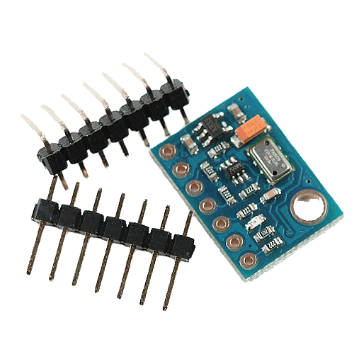

Согласно документации, разрешение по высоте составляет 10см. Алгоритм будет брать значения давления и, пропуская его через ПИД-регулятор, стабилизировать высоту дрона, изменяя Throttle (3-ий канал).

Видео работы алгоритма удержания высоты по барометру (кликабельно):

<iframe width="560" height="315" src="https://www.youtube.com/embed/xmvcGeZzEfc" frameborder="0" allow="accelerometer; autoplay; encrypted-media; gyroscope; picture-in-picture" allowfullscreen></iframe>

Во время полёта по точкам, setpoint давления будет уменьшаться, для повышения высоты (лететь по прямой безопаснее на большой высоте, чтобы ни во что не врезаться). А во время стабилизации по GPS (когда дрон находится уже близко к платформе), дрону будет задан setpoint по давлению такой, чтобы соответствовать ~1.5-2м высоты над платформой.

-----------

## 5. Оптическая стабилизация {#optical-stabilization}

### 5.1. Так сложно и так важно {#so-difficult-and-so-important}

Оптическая стабилизация - самая важная и сложная часть нашего проекта. Только благодаря этим алгоритмам в наших условиях возможно достаточно точно удерживать дрон над платформой. Текущая версия алгоритма оптической стабилизации вместе с описанием для повторения, доступна в нашем основном репозитории на GitHub. В дальнейшем, к ней добавится и стабилизация по GPS.

### 5.2. Первые шаги {#first-steps}

Так как мы не знали насколько реальным окажется выполнение этой далеко не простой задачи, первое что мы сделали, это определились, с помощью чего возможно точно стабилизировать дрон в пространстве.
И тут, практически единогласно победил вариант с оптической стабилизации при помощи меток дополненной реальности. Во первых, это достаточно бюджетно, не нужны дорогостоящие системы GPS RTK, а, во вторых, дает требуемую точность.
Одной из самых первых идей - было приделать Raspberry Pi к дрону, как это сделано на платформе Клевер, и стабилизироваться по метке на платформе.

Тест прототипа первой оптической стабилизации (кликабельно):

<iframe width="560" height="315" src="https://www.youtube.com/embed/TrrxXOHAqbQ" frameborder="0" allow="accelerometer; autoplay; encrypted-media; gyroscope; picture-in-picture" allowfullscreen></iframe>

Но, проведя пару тестов от этой идеи мы быстро отказались. Для начала, Raspberry Pi очень слабая для быстрого вычисления такого объема данных, во вторых, сама идея установки на каждый дрон компьютера выглядит нерациональной.

Также, у нас были промежуточные прототипы, например, попытки использовать цветовые маркеры (окружности различных цветов), но эти идеи не оказались достаточно работоспособными.

### 5.3. Инверсия {#inverse-approach}

Так мы и пришли к текущему виду оптической стабилизации, когда камера с мощным компьютером расположены на платформе, а на дроне лишь ArUco 4x4 метка и модуль, управляющий им.

Самые первые тесты, в этом примере даже нет оценки положения маркера (pose estimation)(кликабельно):

<iframe width="560" height="315" src="https://www.youtube.com/embed/A2oq6zCebVo" frameborder="0" allow="accelerometer; autoplay; encrypted-media; gyroscope; picture-in-picture" allowfullscreen></iframe>

Далее, были внедрены алгоритмы Pose Estimation благодаря библиотеке OpenCV. Первые тесты показали что мы на верном пути!

Pose Estimation Pyhton (кликабельно):

<iframe width="560" height="315" src="https://www.youtube.com/embed/kE3UmJZ00so" frameborder="0" allow="accelerometer; autoplay; encrypted-media; gyroscope; picture-in-picture" allowfullscreen></iframe>

Но, по прежнему, алгоритмы были далеки от идеала. Например, т.к. код писался на Python (https://github.com/XxOinvizioNxX/Liberty-X_Point), производительность была не велика, также, не было нормального контроля потоков. Поэтому, пришлось что-то менять.

### 5.4. Версия на Java {#java-edition}

Взвесив все ЗА и ПРОТИВ, было решено переписать всю оптическую стабилизацию на Java. Так и появилась первая версия Liberty-Way. На этот раз было решено подойти к ООП основательно, и, после небольшой настройки получился отличный алгоритм стабилизации и посадки.

Тест посадки на Liberty-Way v.beta_0.0.1 (кликабельно):

<iframe width="560" height="315" src="https://www.youtube.com/embed/8VAobWPFG8g" frameborder="0" allow="accelerometer; autoplay; encrypted-media; gyroscope; picture-in-picture" allowfullscreen></iframe>

### 5.5. Liberty-Way {#liberty-way}

Далее последовало много доработок и исправлений ошибок. В результате, Liberty-Way представляет собой кроссплатформенное приложение, управляющееся через веб сарвар, что очень удобно для настройки и отладки. Также, в последних версиях (beta_1.0.3 - beta_1.1.2) был внедрён blackbox (для записи логов), а также общение с платформой и много других необходимых алгоритмов.

Полное описание, включая все настройки, запуск и т.д. вы можете найти в нашем репозитории на GitHub: https://github.com/XxOinvizioNxX/Liberty-Way.

Видео работы статичной стабилизации (кликабельно):

<iframe width="560" height="315" src="https://www.youtube.com/embed/adR38R27MEU" frameborder="0" allow="accelerometer; autoplay; encrypted-media; gyroscope; picture-in-picture" allowfullscreen></iframe>

Liberty-Way может даже стабилизировать "брошенный" дрон (кликабельно):

<iframe width="560" height="315" src="https://www.youtube.com/embed/gAaGQSC-r2g" frameborder="0" allow="accelerometer; autoplay; encrypted-media; gyroscope; picture-in-picture" allowfullscreen></iframe>

Да, на видео есть небольшой баг с поворотом, в новом релизе он исправлен

И, конечно же, работа в движении (тестировалось ещё на beta_0.0.3)(кликабельно):

<iframe width="560" height="315" src="https://www.youtube.com/embed/8vB-8QIBoJU" frameborder="0" allow="accelerometer; autoplay; encrypted-media; gyroscope; picture-in-picture" allowfullscreen></iframe>

Все основные настройки удобно вынесены в отельный JSON-файлы (settings, PID), что позволяет без пересборки приложения быстро менять нужные параметры. Фактически, для запуска приложения, достаточно скачать последний релиз, распаковать архив и запустить через соответствующий вашей ОС лаунчер.

### 5.6. Связь с дроном {#communication-with-the-drone}

Liberty-Way подключается к модулю Liberty-Link, установленному на дроне, и, корректирует его положение, управляя напрямую первыми четырьмя основными каналами пульта. За один цикл (каждый фрейм с камеры) на модуль отправляются 12 байт данных корректировки:
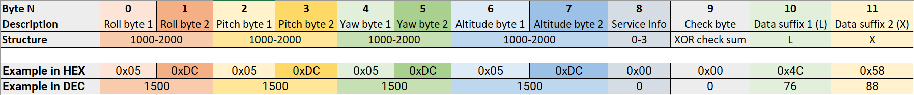

- **Roll bytes** - Корректировка крена (1000-2000)
- **Pitch bytes** - Корректировка тангажа (1000-2000)
- **Yaw bytes** - Корректировка рыскания (1000-2000)
- **Altitude bytes** - Корректировка газа (высоты)
- **Service info** - Состояние дрона (0 - Корректировка отключена, 1 - Стабилизация, 2 - Снижение по барометру (команда не внедрена), 3 - Отключение моторов)
- **Check byte** - XOR чек-сумма
- **Data suffix** - уникальная пара ASCII символов, чтобы обозначить конец пакета

На стороне дрона (модуля Liberty-Link), чтение данных происходит следующим образом:

```cpp
while (Telemetry_serial.available()) {
	tdc_receive_buffer[tdc_receive_buffer_counter] = Telemetry_serial.read();
	if (tdc_receive_byte_previous == 'L' && tdc_receive_buffer[tdc_receive_buffer_counter] == 'X') {
		tdc_receive_buffer_counter = 0;
		if (tdc_receive_start_detect >= 2) {
			tdc_check_byte = 0;
			for (tdc_temp_byte = 0; tdc_temp_byte <= 8; tdc_temp_byte++)
				tdc_check_byte ^= tdc_receive_buffer[tdc_temp_byte];
			if (tdc_check_byte == tdc_receive_buffer[9]) {
				direct_roll_control = (uint32_t)tdc_receive_buffer[1] | (uint32_t)tdc_receive_buffer[0] << 8;
				direct_pitch_control = (uint32_t)tdc_receive_buffer[3] | (uint32_t)tdc_receive_buffer[2] << 8;
				direct_yaw_control = (uint32_t)tdc_receive_buffer[5] | (uint32_t)tdc_receive_buffer[4] << 8;
				direct_throttle_control = (uint32_t)tdc_receive_buffer[7] | (uint32_t)tdc_receive_buffer[6] << 8;
				direct_service_info = (uint32_t)tdc_receive_buffer[8];

				if (direct_roll_control > 1100 && direct_roll_control < 1900 &&
					direct_pitch_control > 1100 && direct_pitch_control < 1900 &&
					direct_yaw_control > 1100 && direct_yaw_control < 1900 &&
					direct_throttle_control > 1100 && direct_throttle_control < 1900 &&
					/*flight_mode == 2 &&*/ channel_7 > 1500) {
					tdc_timer = millis();
					tdc_working = 1;
				}
				else
					tdc_working = 0;
			}
			else {
				direct_roll_control = 1500;
				direct_pitch_control = 1500;
				tdc_working = 0;
			}
		} else
			tdc_receive_start_detect++;
	}
	else {
		tdc_receive_byte_previous = tdc_receive_buffer[tdc_receive_buffer_counter];
		tdc_receive_buffer_counter++;
		if (tdc_receive_buffer_counter > 11)tdc_receive_buffer_counter = 0;
	}
}
if (millis() - tdc_timer >= 500) {
	tdc_working = 0;
}
if (tdc_working && direct_service_info == 2 && !return_to_home_step)
	return_to_home_step = 3;
if (!tdc_working)
	return_to_home_step = 0;
if (!tdc_working || direct_service_info < 1) {
	direct_roll_control = 1500;
	direct_pitch_control = 1500;
	direct_yaw_control = 1500;
	direct_throttle_control = 1500;
}
```

В результате, имеются 4 переменные:

```
direct_roll_control
direct_pitch_control
direct_yaw_control
direct_throttle_control
```

Которые напрямую прибавляются к данным, поступающим с пульта управления.
Вероятно, в дальнейшем, будут добавлены и другие данные, как минимум, для работы с GPS. Следите за обновлениями в нашем репозитории.

### 5.7. Подвес для камеры {#camera-gimbal}

Для эксплуатации нашей системы в реальных условиях, требуется минимизировать тряску камеры, чтобы не потерять метку на дроне. Для этого, была разработана 3Д-модель крепления подвеса от дрона к нашей платформе для стабилизации обычной веб камеры

Крепление для камеры:

 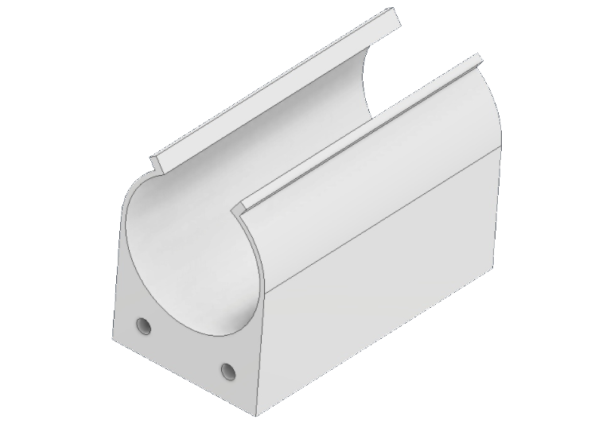

Крепление провода (ферритового фильтра на проводе) камеры:

 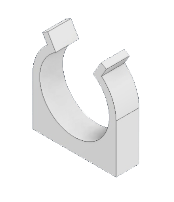

Крепление защёлок "крабиков" на подложку подвеса:

 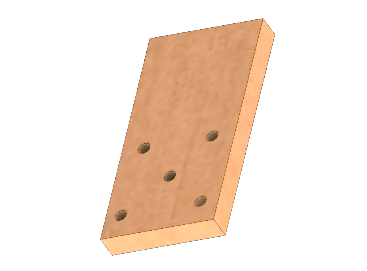

Примерный вид сборки всего механизма подвеса:

 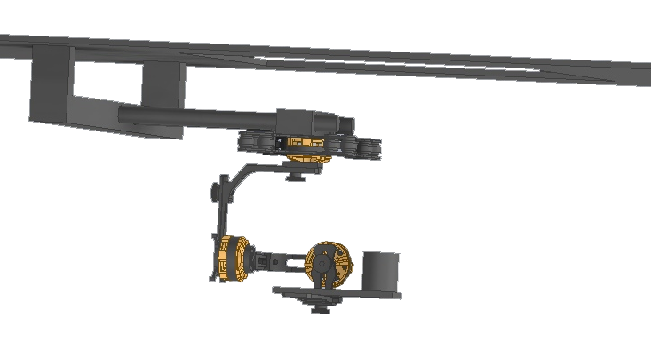

-----------

## 6. Платформа Eitude {#eitude-amls-platform}

Платформа - взаимосвязанная система для посадки дрона. Управляться платформа планируется через Serial-интерфейс, с помощью G-Code команд:
Текущий код платформы можно в репозитории Eitude на GitHub: https://github.com/XxOinvizioNxX/Eitude.

### 6.1. Система захватов {#grabbing-system}

Но ведь логично, что в реальности, без системы захватов невозможно посадить дрон, не повредив никого. Пока что, у нас есть прототип в виде 3Д модели. Для реализации захвата дрона будут изготовлены 4 длинных захвата с крючками на концах и по мере посадки коптера на платформу, шасси будут захватываться этими 4-мя крючками и удерживаться по мере снижения и после него.

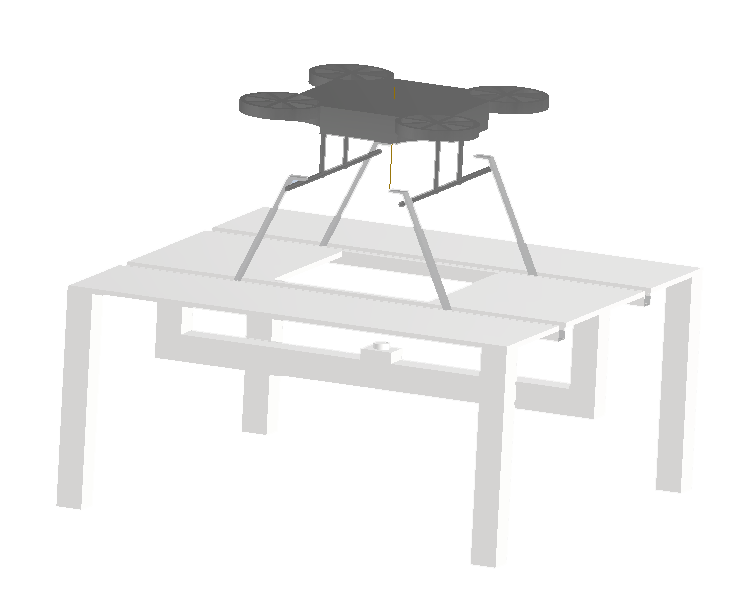


### 6.2. Крыша {#weather-protection-system}

Для защиты от неблагоприятных погодных условий, мы разработали механизм крыши - ножничные механизмы, обтянутые брезентом, которые находятся на краях платформы и после успешной посадки механизмы с обеих сторон платформы будут закрываться и защищать дрон от внешнего воздействия, Сама конструкция крыши делает её достаточно лёгкой и прочной, а ножничный механизм позволяет просто складывается и раскладывается при этом сборка такого механизма будет простой и надежной.


### 6.3. Спидометр {#platform-speedometer}

Для будущей посадки на быстро движущуюся платформу, очень полезно знать скорость её движения. На данный момент на платформе нет GPS модуля, или иных способов измерить абсолютную скорость. Поэтому, для временного решения этой проблемы, решено было вычислять скорость по ускорению, используя акселерометр. Для примера, MPU6050. IMU-модуль через мягкую подложку установлен на прототип платформы и прикрыт крышкой для защиты от ветра. Алгоритм стабилизации (Liberty-Way) посылает на платформу запрос `L1` для проверки скорости. В качестве ответа возвращается `S0 L<скорость в км/ч>`.

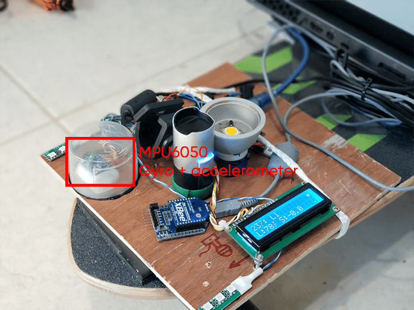

Тест спидометра (внутри серого круга нижний правый параметр (SPD) - скорость в км/ч) (кликабельно):

<iframe width="560" height="315" src="https://www.youtube.com/embed/yvCo6tYjdM0" frameborder="0" allow="accelerometer; autoplay; encrypted-media; gyroscope; picture-in-picture" allowfullscreen></iframe>

Для вычисления скорости, берётся ускорение за маленькие промежутки времени, перемножается со временем, получая моментальную скорость. Которая постоянно прибавляется к предыдущей сумме:

```cpp
void speed_handler(void) {
	gyro_signalen();

	// Filter accelerations
	acc_x_filtered = (float)acc_x_filtered * ACC_FILTER_KOEFF + (float)acc_x * (1.0 - ACC_FILTER_KOEFF);

	speed = acc_x_filtered;
	// Convert acceleration to G
	speed /= 4096.0;
	// Convert to m/s^2
	speed *= 9.81;
	// Multiply by dt to get instant speed in m/ms
	speed *= (millis() - speed_loop_timer);

	// Reset timer
	speed_loop_timer = millis();

	// Convert to m/s
	speed /= 1000.0;
	// Convert to km/h
	speed *= 3.6;

	// Accumulate instatnt speed
	speed_accumulator += speed;

	if (!in_move_flag) {
		// If the platform is not moving, reset the speed
		speed_accumulator = speed_accumulator * SPEED_ZEROING_FACTOR;
	}
}
```

Несмотря на наличие различных фильтров, из-за погрешности скорость может не "вернуться" в 0, поэтому, также производится замер вибраций, и, если они меньше порога, считается что платформа стоит и постепенно обнуляется скорость.

Полный код спидометра можно найти в репозитории Eitude на GitHub: https://github.com/XxOinvizioNxX/Eitude

### 6.4. Датчики уровня освещённости {#platform-light-sensor}

Т.к. наша платформа должна работать в различных окружающих условиях, а оптическая стабилизация очень требовательна к видимости ArUco маркера, важно иметь автоматическую систему измерения выдержки камеры по уровню освещённости, а, при её нехватке, даже включать дополнительную подсветку. В долгосрочной перспективе в качестве датчиков света планируется использовать специализированные сенсоры, например, BH1750.

В текущем варианте прототипа, используются 6 светодиодов в качестве датчика света и, встроенный в микроконтроллер, АЦП. Алгоритм стабилизации (Liberty-Way) посылает на платформу запрос `L0` для проверки уровня освещённости. В качестве ответа возвращается `S0 L<освещённость>`.

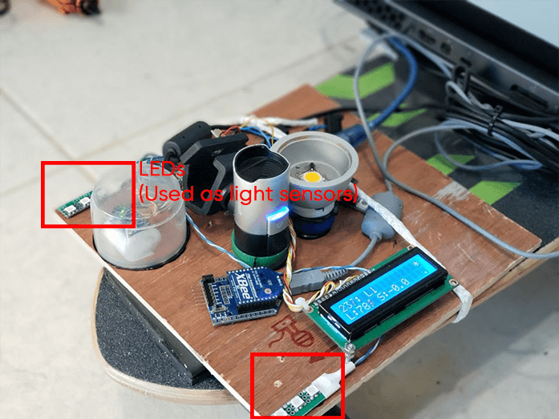

Тест определения уровня освещённости с помощью светодиодов (кликабельно):

<iframe width="560" height="315" src="https://www.youtube.com/embed/xQeiA945aRA" frameborder="0" allow="accelerometer; autoplay; encrypted-media; gyroscope; picture-in-picture" allowfullscreen></iframe>

Тест регулировки выдержки и включения дополнительной подсветки (кликабельно):

<iframe width="560" height="315" src="https://www.youtube.com/embed/iMORim6zxsg" frameborder="0" allow="accelerometer; autoplay; encrypted-media; gyroscope; picture-in-picture" allowfullscreen></iframe>

-----------

## 7. Заключение {#conclusion}

На данный момент, имеется отлаженный прототип оптической стабилизации, GPS удержания, стабилизации высоты по барометру, платформы и множество 3Д-моделей, жаждущих реализации.
Проект автоматической посадки дрона на движущуюся платформу ещё не закончен.

Следите за нашими апдейтами:

- На репозитории GitHub: https://github.com/XxOinvizioNxX/Liberty-Way.
- И на нашем YouTube-канале: https://www.youtube.com/channel/UCqN12Jzy-1eJLkcA32R0jdg.

В дальнейшем, мы планируем сделать ещё много нового и интересного!

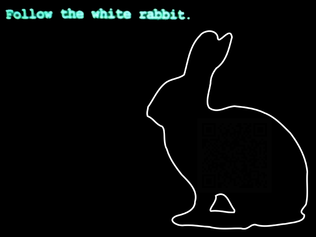
