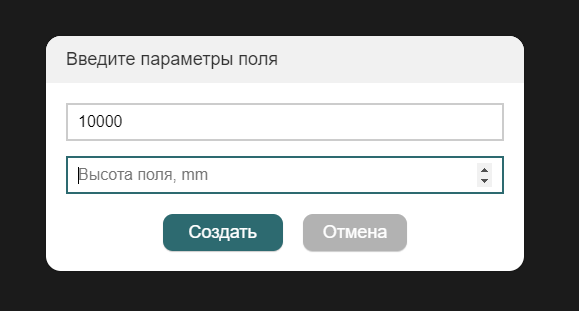
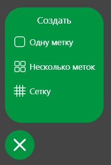

# Генератор ArUco карт

Автор проекта: [@tenessinum](https://t.me/tenessinum).

Начиная с образа версии *0.16* изменился подход к созданию карт маркеров: маркеры больше не привязаны к сетке и каждый из них теперь можно повернуть на любой угол вокруг всех трёх осей. Вместе с этим изменился и способ задания карт маркеров. Теперь карта загружается из текстового файла (подробнее в статье [**Навигация по картам ArUco-маркеров**](aruco_map.md)). Для упрощения процесса создания текстового файла был создан [*конструктор полей*](https://aruco.tenessinum.ru/).

## Создание поля

Перед началом работы надо задать размеры поля. Оно нужно только для удобства. Для перемещения по "полотну" используйте тачпад или колёсико мыши для перемещения по карте. При использовании мыши зажмите Shift для перемещения в горизонтальном направлении и Ctrl для увеличения/уменьшения поля.

## Инструмент творения

Нажав на плюсик в левом углу экрана откроется меню в котором можно создать какой-либо элемент.
<ui>
    <li><strong>Одна метка</strong> - просто одинокая метка в поле</li>
    <li><strong>Несколько меток</strong> - группа меток выстроенная в сетку</li>
    <li><strong>Сетка - инструмент</strong> к которому можно привязывать метки</li>
</ui>

## Экспорт

Карту можно экспортировать в двух форматах: ***txt*** (для Клевера) и ***svg*** (для печати)

