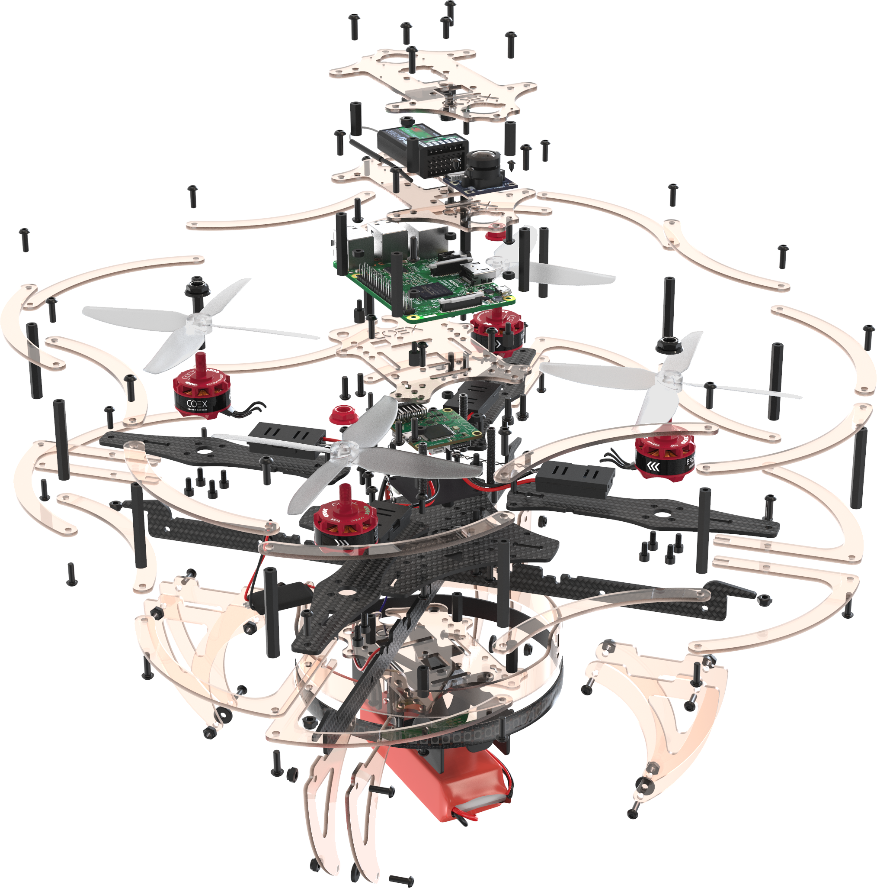

# Сборка Клевера 4

## Сборка основы для рамы

1. Совместите 2 карбоновые пластины жесткости, используя центральные пазы.
2. Используя пазы, установите сверху карбоновую центральную деку.

    

        
        
    

3. Стяните конструкцию с помощью винтов М3х8 и стальных гаек, установленных в пазах пластин.

    

        
        
    

## Установка моторов

1. Распакуйте моторы.
2. Используя ножницы, укоротите провода на моторах:

    * Обрежьте половину длины (оставив 30 мм).
    * Зачистите (снимите 5 мм изоляции с конца провода, не повредив медные жилы).

    

    * Скрутите провода.
    * [Залудите провода](tinning.md), используя пинцет.

3. Установите мотор на луч.
4. Прикрепите мотор к лучу винтами М3х5, используя шестигранный ключ.

Повторите эти действия для остальных моторов.

## Сборка рамы

1. Установите 4 луча с моторами на базу рамы, используя пазы, согласно схеме вращения моторов.

    

    > **Hint** Для правильной установки моторов обратите внимание на цвета гаек.

2. Зафиксируйте лучи на раме, используя 8 винтов М3х8 и 6 стальных гаек, а также 2 стойки "мама-мама" 15 мм.

    

        
        
    

## Подготовка платы распределения питания

1. [Залудите](tinning.md) контактные площадки платы питания.
2. С помощью мультиметра проверьте отсутствие контактного замыкания (прозвонить):
    * Выставите мультиметр в режим прозвона.
    * Проверьте работу мультиметра путем замыкания щупов между собой. При корректной работе прибор издаст характерный звук.
    * Попарно один щуп прикладывается к контакту **«+»**, а второй к **«-»/GND**. Если в цепи есть короткое замыкание, издается звук.

## Монтаж PDB

1. Установите 4 стойки "папа-мама" 6 мм на центральную деку винтами М3х6.

    

        
        
    

2. Установите PDB на стойки.
3. Стрелки на PDB и центральной деке должны быть направлены в одну сторону.

    

## Пайка регуляторов и ВЕС

1. Припаяйте фазные провода моторов к регуляторам.
2. Припаяйте силовые провода регуляторов к контактным площадкам платы (**красный** к **«+»**, **черный** к **«-»**).

    

        
        
    

3. Припаяйте силовые провода каждого BEC к контактным площадкам одного из регуляторов (**красный** к **«+»**, **черный** к **«-»**).

    

        
        
    

## Сопряжение приёмника и пульта

1. Подключите радиоприемник к разъему от BEC 5В.
2. Установите джампер на вход (B/VCC).
3. Подключите АКБ.
4. Светодиод на радиоприемнике должен мигать.

    

        
        
    

5. Зажмите кнопку **BIND KEY** на пульте.
6. Включите пульт (перещелкните *POWER*, не отпуская *BIND KEY*).

    

7. Ждите синхронизации.
8. Отсоедините джампер.
9. Светодиод на приемнике должен гореть непрерывно.

Если пульт заблокирован, необходимо перевести все стики в начальное положение:

1. Левый стик в **центральной нижней позиции**.
2. Правый стик в **центре**.
3. Переключатели A, B, C, D в положение **"от себя"**.

    

Убедитесь, что PPM в меню RX Setup отключен:

1. Для входа в меню удерживайте нажатой кнопку "ОК".
2. Кнопками Up/Down выбираем меню "System setup", кнопкой "ОК" подтвердите выбор.
3. Выберите "RX Setup".
4. Выберите "Output mode".
5. Убедитесь, что в открывшемся меню выбран пункт "PWM".
6. Чтобы сохранить настройки, удерживайте нажатой кнопку "Cancel".

## Сборка

1. Установите 4 стойки "папа-мама" 6 мм на PDB.
2. Подключите шлейф питания к PDB.
3. Установите поликарбонатную пластину на стойки и зафиксировать нейлоновыми гайками.

    

        
        
        
    

## Установка полётного контроллера

1. Установите полетный контроллер на пластину с помощью двухстороннего скотча.
2. Стрелки на полетном контроллере и центральной деке должны быть направлены в одну сторону.
3. Подключите шлейф питания PDB к разъему *"POWER"* полетного контроллера, закрутив его в "косичку" для взаимной фиксации проводов.

    

        
        
    

4. Установите 4 алюминиевые стойки 40 мм с помощью винтов М3х10.

    

        
        
    

5. Подключите сигнальные провода регуляторов к полетному контроллеру следующим образом:

    

        
        
    

6. Установите 2 стойки "мама-мама" 15 мм на центральную деку с помощью винтов М3х8.
7. Другие 2 стойки крепятся винтами М3х10 при том, что фиксируют 2 карбоновые детали, помимо стойки.

    

        
        
    

## Установка обруча для светодиодной ленты

1. Согните поликарбонатную заготовку в обруч и зафиксируйте ее концы в замке.
2. Установите обруч на раму, используя пазы.

    

        
        
    

## Установка Raspberry Pi

1. Установите плату Raspberry Pi на стойки, используя 4 стойки "папа-мама".
2. Протяните провода от BEC через паз в центральной раме.

    

        
        
    

3. Подключите провод питания от BEC к Raspberry, согласно схеме:

## Установка светодиодной ленты на обруч

1. Проверьте наличие напаянных пинов на контактах ленты (при отсутствии - напаять).
2. Установите светодиодную ленту на обруч (используя клеевой слой на ленте) так, чтобы контакты были в задней части коптера. Для фиксации использовать **стяжки**.

    

        
        
        
    

## Подключение светодиодной ленты к Raspberry Pi

1. Питание для ленты берется от второго BEC. Подключите контакты *«-»* и *«+»* к *Ground* и *5v* на ленте соответственно.
2. Контакт *D* можно подключить к любому свободному пину "GPIO" на Raspberry.

## Установка шлейфа для камеры

1. Поднимите защелку.
2. Подключите шлейф.
3. Закройте защелку.

## Установка оборудования на нижнюю монтажную деку

1. Подготовьте лазерный дальномер к монтажу, предварительно напаяв на него контакты.
2. Установите камеру на 4 самореза 2х5.
3. Установить на деку лазерный дальномер с помощью 2 винтов М3х8 и стальных гаек.

    

        
        
    

4. Установите приемник на нижнюю деку с помощью двухстороннего скотча.

    

5. Установите нижнюю деку с помощью 4 винтов М3х10.
6. Подключите шлейф к камере.

    

        
        
    

7. Подключите лазерный дальномер к Raspberry Pi с помощью проводов типа "мама-мама":
    * Разъем *VCC* к пину 1 (*3.3v*).
    * Разъем *GND* к пину 9 (*Ground*).
    * Разъем *SDA* к пину 3 (*GPIO02*).
    * Разъем *SCL* к пину 5 (*GPIO03*).

    

## Монтаж ножек

1. Установите 8 ножек с помощью винтов М3х10 и стальных гаек.
2. Установите демпфирующие прокладки на ножки с помощью винтов М3х10 и стальных гаек.

    

        
        
    

## Подключение шлейфов

1. Подключите шлейф радиоприемника в *RCIN* разъем полетного контроллера.
2. Подключите шлейф к приемнику.

    

## Сборка защиты винтов

1. Соберите нижнюю часть защиты, используя 12 винтов М3х10 и 12 нейлоновых стоек 40 мм.
2. Установите верхнюю часть, используя 12 винтов М3х10.

    

        
        
    

3. Установите защиту на коптер, с помощью 4 винтов М3х10 и стальных гаек.

    

        
        
    

## Установка верхней деки на коптер

1. Установите на верхнюю деку держатель АКБ с помощью 4 винтов М3х8 и стальных гаек.
2. Проденьте в пазы ремешок для фиксации АКБ.
3. Установите верхнюю деку на коптер с помощью 4 винтов М3х10.

    

        
        
    

4. Подключите USB кабель к разъему на полетном контроллере и USB разъему Raspberry Pi.
5. Зафиксируйте "улитку" кабеля в удобном месте с помощью двухстороннего скотча так, чтобы провод не мешал вращению винтов.

    

        
        
    

## Установка АКБ

> **Warning** Убедитесь, чтобы все провода были спрятаны и движению пропеллеров ничего не мешает.

Проверьте сборку квадрокоптера:

* Балансировочный разъем АКБ должен быть спрятан под утягивающим ремешком.
* Регуляторы должны быть зафиксированы хомутами.
* Все провода, идущие от PDB и полетного контроллера, должны быть зафиксированы липучкой, обмотанной вокруг алюминиевых стоек.

## Установка пропеллеров и подготовка к полёту

Произведите настройку компонентов квадрокоптера, используя статью ["Настройка"](setup.md).

> **Warning** Установка пропеллеров должна производиться **только после окончательной настройки коптера**, непосредственно перед полетом.

Установите 4 пропеллера, согласно схеме вращения. При установке пропеллеров АКБ должна быть отключена.

    
    

> **Success** Дрон готов к полету!.
