# Сборка Клевера 4

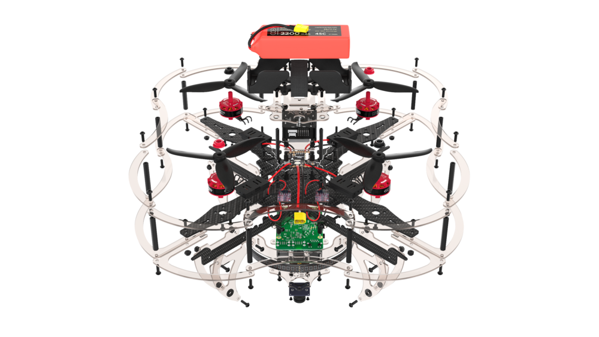

## Сборка основы для рамы

> **Info** Для увеличения прочности рамы вы можете распечатать на 3D принтере или нарезать на лазерном резаке рем-накладки.

1. В случае наличия, закрепите рем-накладки на пластинах жесткости, иначе продолжайте без них.

    

2. Совместите 2 карбоновые пластины жесткости, используя центральные пазы.

    

        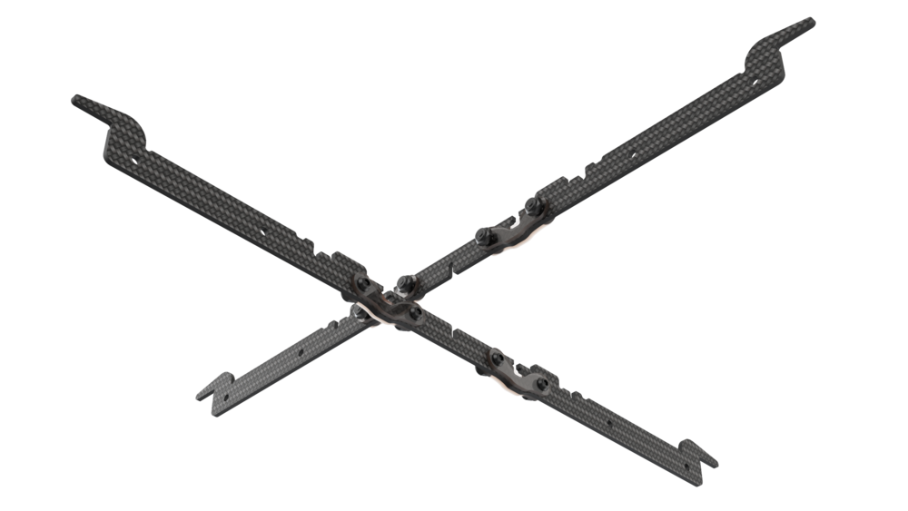
        
    

3. Используя пазы, установите сверху карбоновую центральную деку.

    

        
        
    

4. Стяните конструкцию с помощью винтов М3х8 и стальных гаек с нейлоновой вставкой, установленных в пазах пластин.

## Установка моторов

1. Распакуйте моторы.
2. Используя бокорезы, укоротите провода на моторах:

    * Обрежьте половину длины (оставив 30 мм).
    * Зачистите (снимите 5 мм изоляции с конца провода, не повредив медные жилы).

    

    * Скрутите медные жилы.
    * [Залудите провода](tinning.md), используя пинцет.

3. Установите мотор на луч.
4. Прикрепите мотор к лучу винтами М3х5, используя шестигранный ключ или отвёртку.

    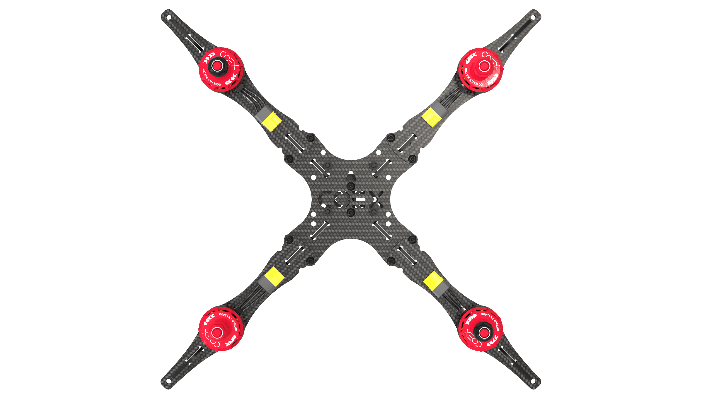

Повторите эти действия для остальных моторов.

## Сборка рамы

1. Установите 4 луча с моторами на базу рамы, используя пазы, согласно [схеме вращения моторов](#проверка-направления-вращения-моторов).

    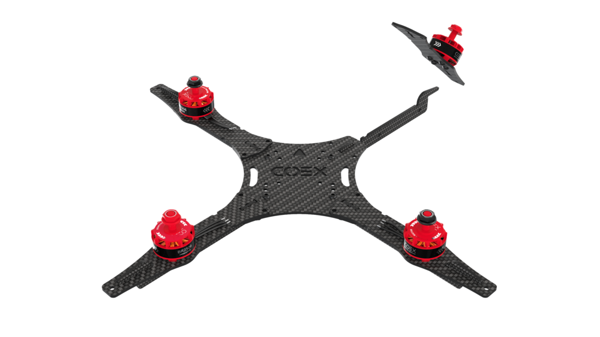

    > **Hint** Для правильной установки моторов обратите внимание на цвета гаек. Моторы с красными гайками следует установить на передний правый и задний левый лучи, с чёрными - на передний левый и задний правый.

2. Зафиксируйте лучи на раме, используя 8 винтов М3х8 и 6 стальных гаек, а также 2 стойки "мама-мама" 15 мм.

    

        
        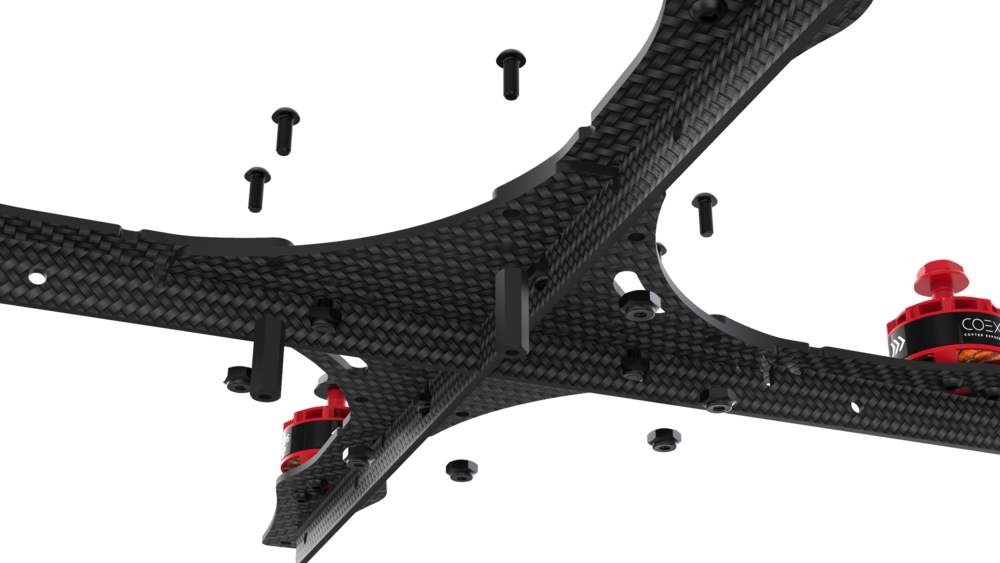
    

## Подготовка платы распределения питания

1. [Залудите](tinning.md) контактные площадки платы питания.
2. С помощью мультиметра проверьте отсутствие короткого замыкания (прозвонить):
    * Установите мультиметр в режим прозвонки.
    * Проверьте работу мультиметра путем замыкания щупов между собой. При корректной работе прибор издаст характерный звук.
    * Попарно один щуп прикладывается к контакту **«+»**, а второй к **«-»/GND**. Если в цепи есть короткое замыкание, издается звук.

## Монтаж PDB

1. Установите 4 стойки "папа-мама" 6 мм на центральную деку винтами М3х6.

    

        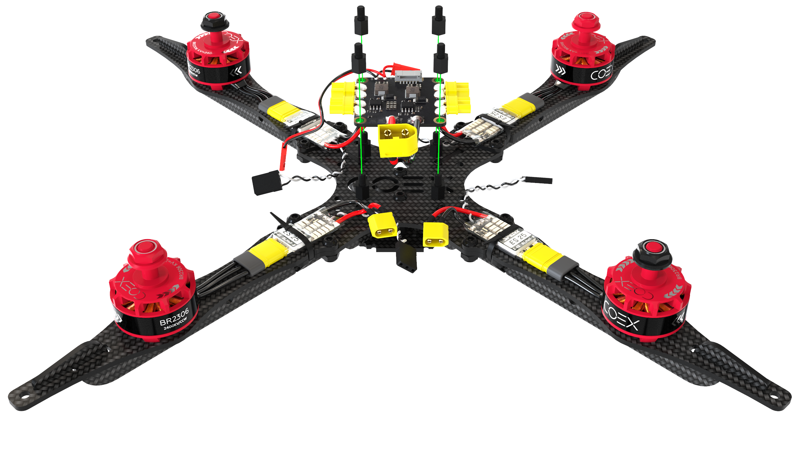
        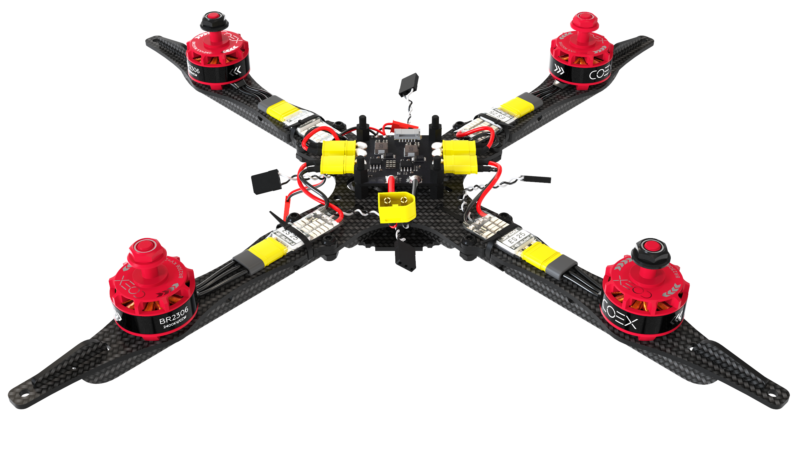
    

2. Установите PDB на стойки.

    

3. Стрелки на PDB и центральной деке должны быть направлены в одну сторону.

## Пайка регуляторов и ВЕС

1. Припаяйте фазные провода моторов к регуляторам.
2. Припаяйте силовые провода регуляторов к контактным площадкам платы (**красный** к **«+»**, **черный** к **«-»**).

    

        
        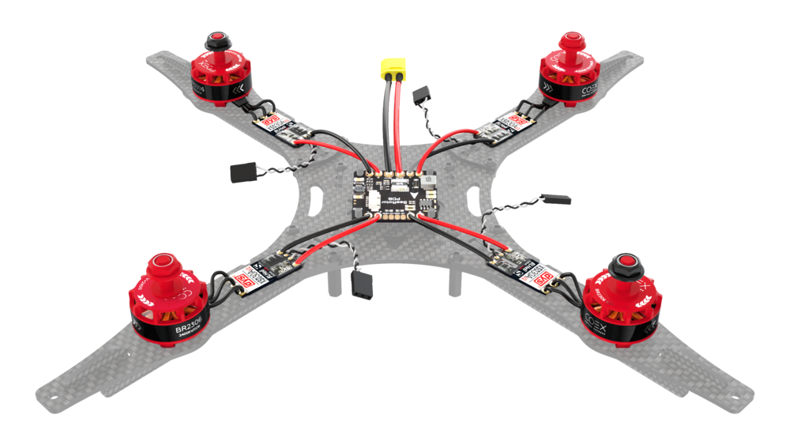
    

3. Припаяйте силовые провода каждого BEC к контактным площадкам одного из регуляторов (**красный** к **«+»**, **черный** к **«-»**).

    

        
        
    

4. С помощью мультиметра проверьте, что в цепи нет короткого замыкания.

### Перевод пульта в режим PWM

Включите пульт с помощью слайдера **POWER**. Если пульт заблокирован, необходимо перевести все стики в начальное положение:

1. Левый стик в **центральной нижней позиции**.
2. Правый стик в **центре**.
3. Переключатели A, B, C, D в положение **"от себя"**.

    

Убедитесь, что PPM в меню RX Setup отключен:

1. Убедитесь, что питание дрона выключено.
2. Для входа в меню удерживайте нажатой кнопку "ОК".
3. Кнопками Up/Down выбираем меню "System setup", кнопкой "ОК" подтвердите выбор.
4. Выберите "RX Setup".
5. Выберите "Output mode".
6. Убедитесь, что в открывшемся меню выбран пункт "PWM".
7. Чтобы сохранить настройки, удерживайте нажатой кнопку "Cancel".

### Сопряжение приёмника и пульта

1. Выключите пульт с помощью слайдера **POWER**.
2. Подключите радиоприемник к разъему BEC 5В. Чёрный провод подключите к одному из нижних пинов, красный - к одному из центральных.
3. Установите джампер на вход (B/VCC).
4. Подключите АКБ.
5. Светодиод на радиоприемнике должен мигать.

    

        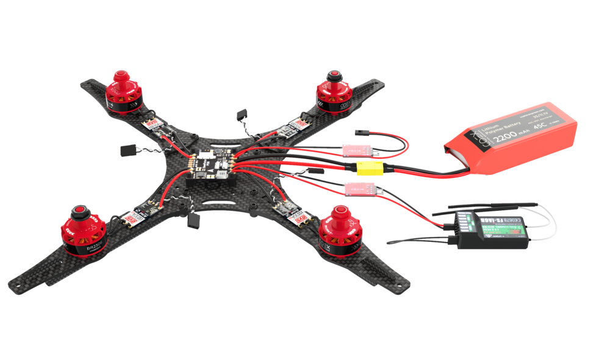
        
    

6. Зажмите кнопку **BIND KEY** на пульте.
7. Включите пульт (перещелкните **POWER**, не отпуская **BIND KEY**).

    

8. Ждите синхронизации.
9. Отсоедините джампер.
10. Светодиод на приемнике должен гореть непрерывно.

### Проверка направления вращения моторов

Моторы с **красными** гайками должны вращаться **против** часовой стрелки, с **чёрными** - **по** часовой стрелке. Правильные направления вращения также указаны на самих моторах. Для проверки направления вращения можно использовать сервотестер или радиоприёмник с пультом.

1. Отключите АКБ и пульт.
2. Подключите сигнальный провод от ESC к выходу CH3 на приёмнике. Белый провод должен подходить к верхнему пину, чёрный - к нижнему.
3. Включите пульт. Левый стик должен быть в нижнем положении.
4. Подключите АКБ.
5. Медленно поднимайте левый стик до тех пор, пока мотор не начнёт вращаться.

Если мотор вращается в неправильную сторону, поменяйте местами два любых фазных провода.

> **Info** Направление вращения также можно изменить программно. Процесс описан [в статье про прошивку ESC](esc_firmware.md).

Повторите процесс для каждого мотора.

### Перевод пульта в режим PPM

Полётный контроллер не может работать с пультом в режиме PWM, поэтому следует произвести перевод пульта в режим PPM.

1. Убедитесь, что питание дрона выключено.
2. Для входа в меню удерживайте нажатой кнопку "ОК".
3. Кнопками Up/Down выбираем меню "System setup", кнопкой "ОК" подтвердите выбор.
4. Выберите "RX Setup".
5. Выберите "Output mode".
6. Убедитесь, что в открывшемся меню выбран пункт "PPM".
7. Чтобы сохранить настройки, удерживайте нажатой кнопку "Cancel".

## Установка пластины для полётного контроллера

1. Установите 4 стойки "папа-мама" 6 мм на PDB.

    

2. Подключите шлейф питания к PDB.

    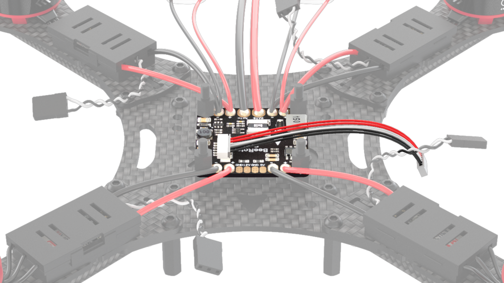

3. Установите поликарбонатную пластину на стойки и зафиксируйте нейлоновыми гайками.

    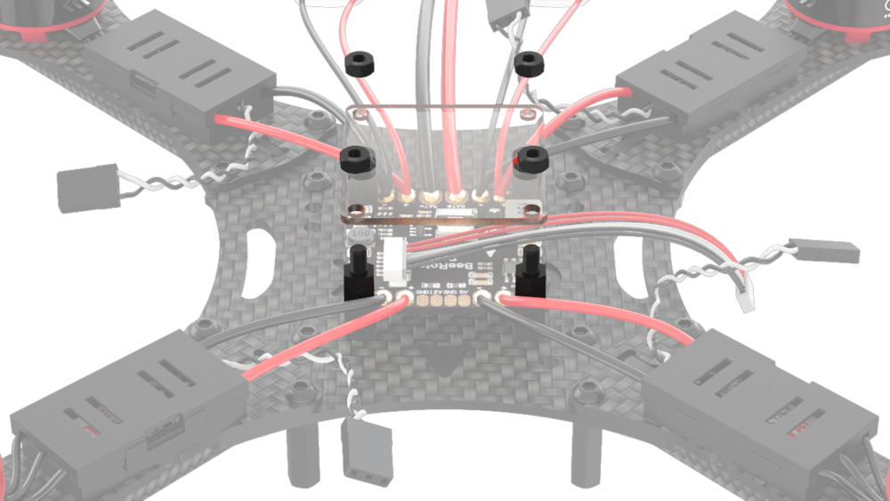

## Установка полётного контроллера

1. Вставьте карту microSD в полётный контроллер.

    

2. Установите полетный контроллер на пластину с помощью двухстороннего скотча.

    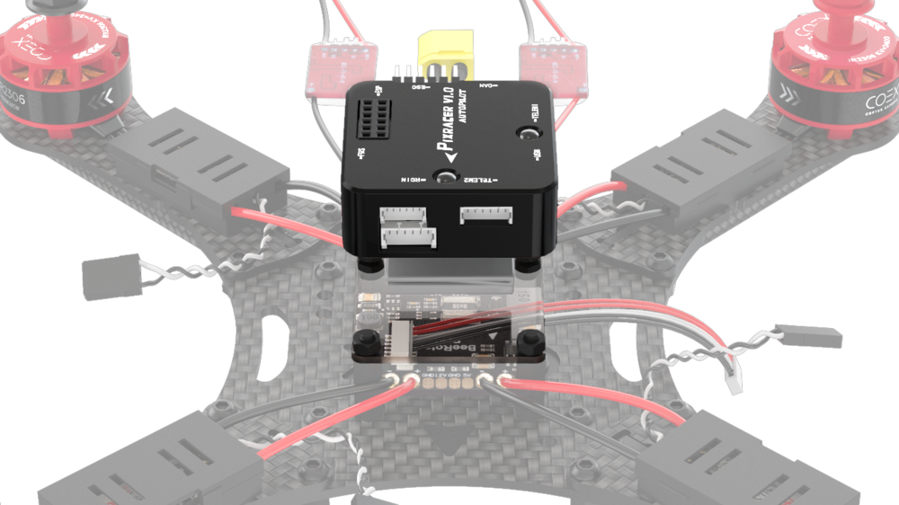

3. Стрелки на полетном контроллере и центральной деке должны быть направлены в одну сторону.
4. Подключите шлейф питания PDB к разъему *"POWER"* полетного контроллера, закрутив его в "косичку" для взаимной фиксации проводов.

    

        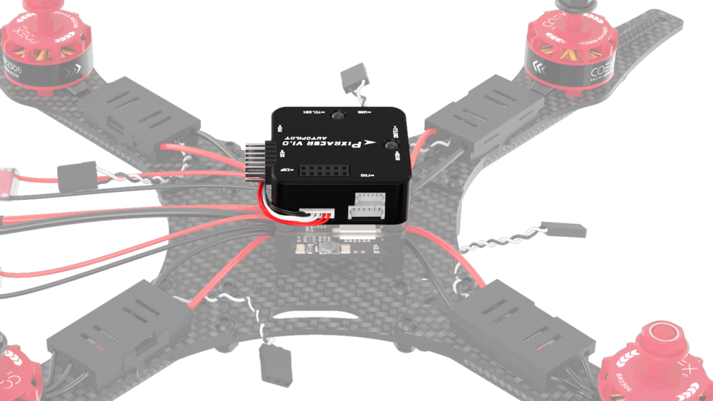
        
    

5. Установите 4 алюминиевые стойки 40 мм с помощью винтов М3х10.

    

        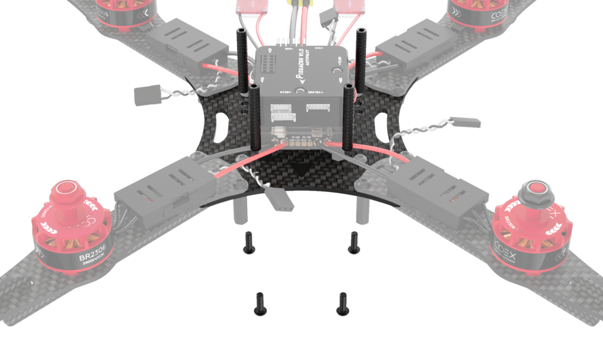
        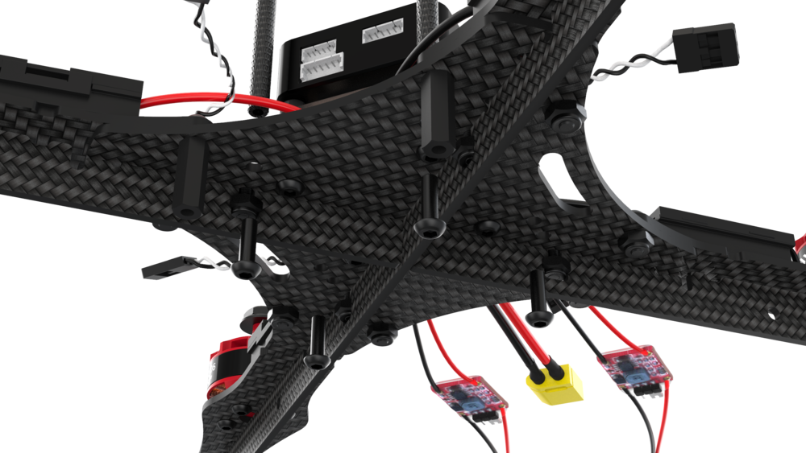
    

6. Подключите сигнальные провода регуляторов к полетному контроллеру следующим образом:

    

        
        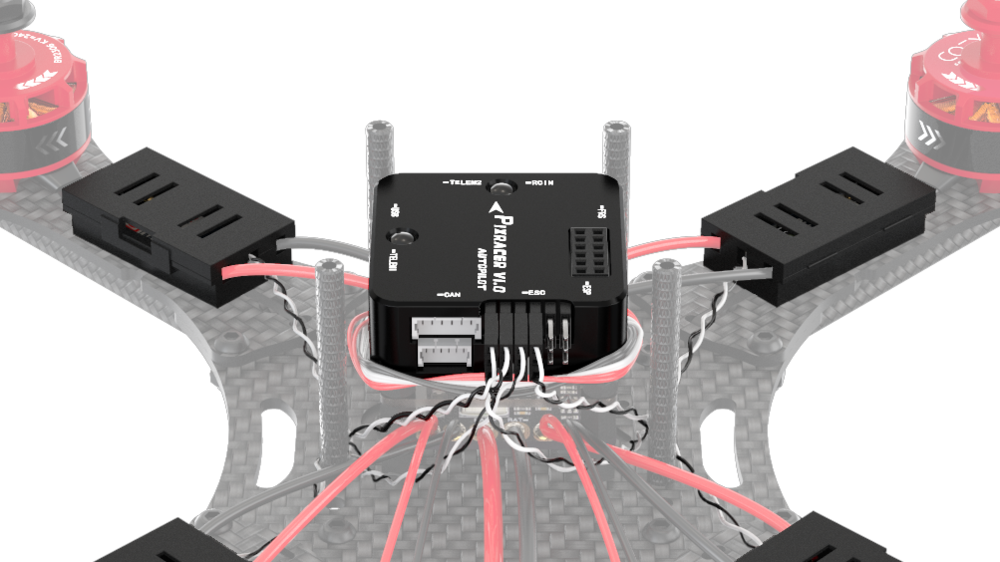
    

7. Установите 2 стойки "мама-мама" 15 мм на центральную деку с помощью винтов М3х8.

    

        
        
    

8. Другие 2 стойки были установлены ранее в разделе "Сборка рамы", п. 2.

## Установка обруча для светодиодной ленты

1. Согните поликарбонатную заготовку в обруч и зафиксируйте ее концы в замке.
2. Установите обруч на раму, используя пазы.

    

        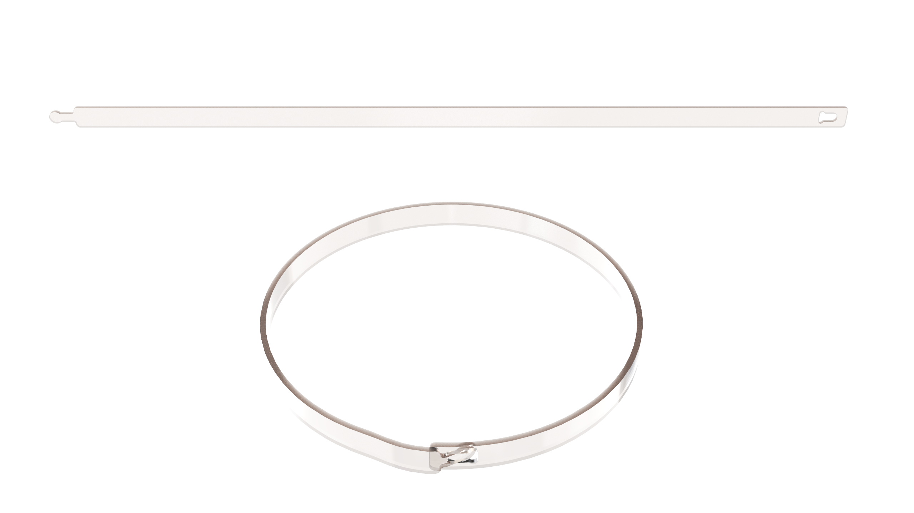
        
    

## Установка Raspberry Pi

1. Вставьте карту microSD с [записанным образом](image.md) в Raspberry Pi

    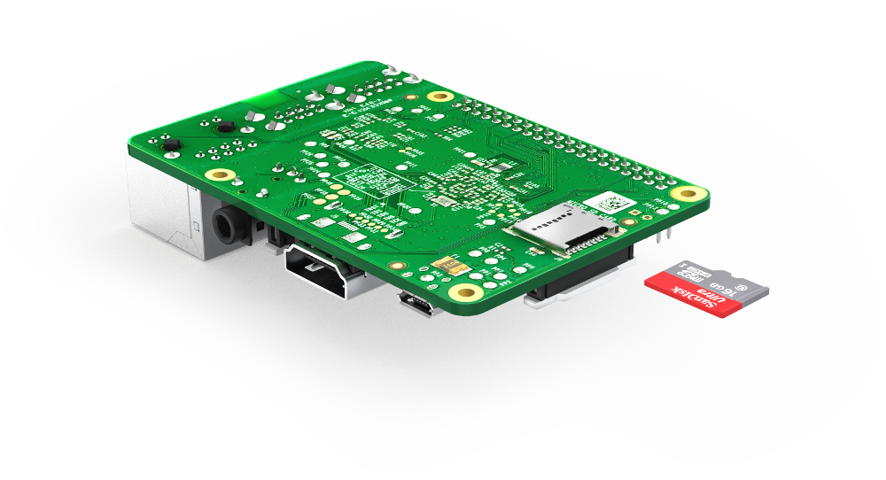

2. Установите плату Raspberry Pi на стойки, используя 4 стойки "папа-мама".

    

3. Протяните провода от BEC через паз в центральной раме.

    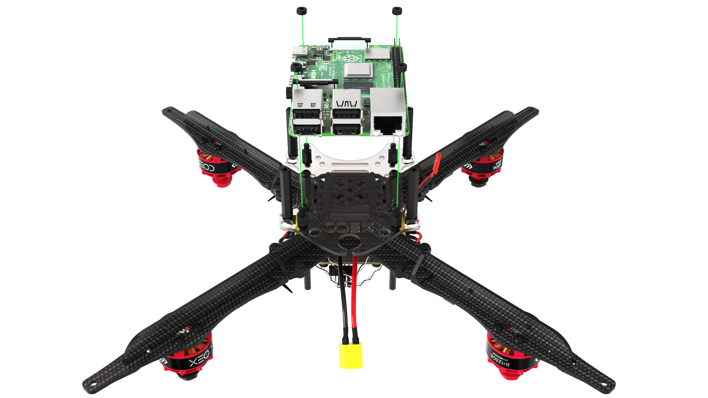

4. Подключите провод питания от BEC к Raspberry, согласно схеме:

    

## Установка светодиодной ленты на обруч

1. Проверьте наличие напаянных пинов на контактах ленты (при отсутствии - напаять).

    

        
        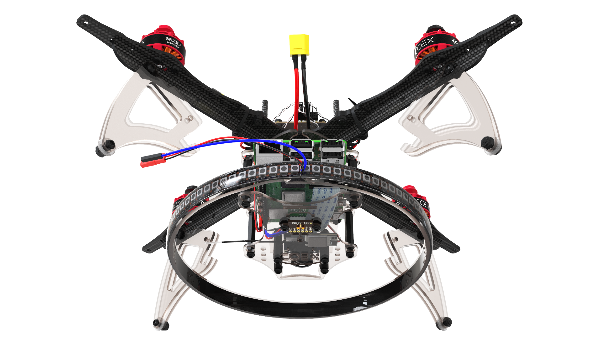
    

2. Установите светодиодную ленту на обруч (используя клеевой слой на ленте) так, чтобы контакты были в задней части коптера. Для дополнительной фиксации используйте **стяжки**.

    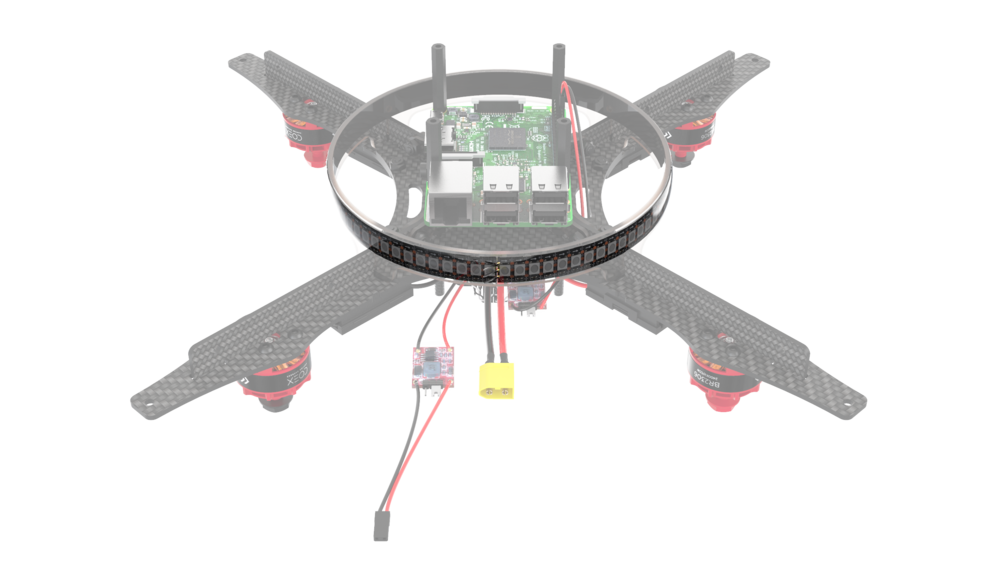

## Подключение светодиодной ленты к Raspberry Pi

1. Питание для ленты берется от второго BEC. Подключите контакты *«-»* и *«+»* к *Ground* и *5v* на ленте соответственно.

    

        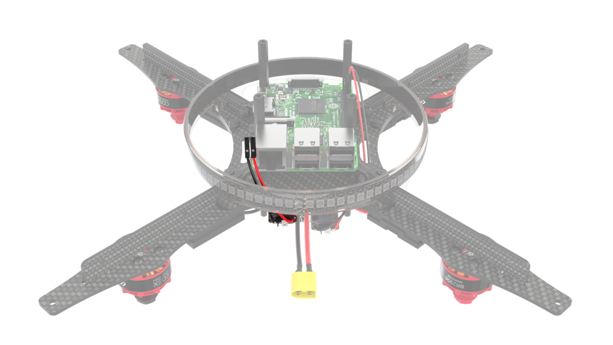
        
    

2. Подключите контакт *D* к GPIO-пину на Raspberry. Рекомендуется использовать пин GPIO21.

    

## Установка шлейфа для камеры

1. Поднимите защелку.
2. Подключите шлейф.
3. Закройте защелку.

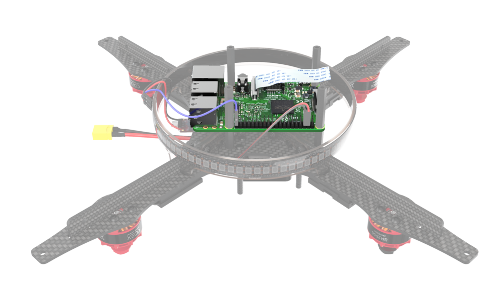

## Установка оборудования на нижнюю монтажную деку

1. Подготовьте лазерный дальномер к монтажу, предварительно напаяв на него контакты.
2. Установите камеру на 4 самореза 2х5.

    > **Warning** Убедитесь, что саморезы не касаются деталей на печатной плате камеры. В противном случае камера может не заработать.

3. Установить на деку лазерный дальномер с помощью 2 винтов М3х8 и стальных гаек.

    

        
        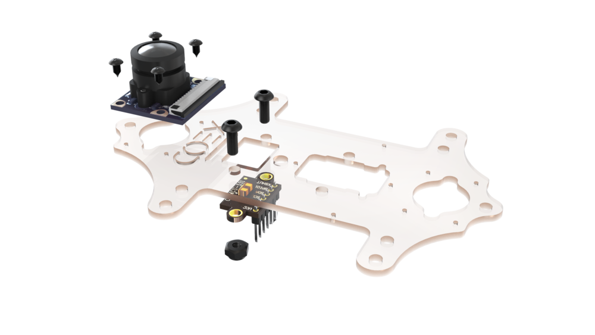
    

4. Установите приемник на нижнюю деку с помощью двухстороннего скотча.

    

5. Установите нижнюю деку с помощью 4 винтов М3х10.

    

6. Подключите шлейф к камере.
7. Подключите лазерный дальномер к Raspberry Pi с помощью проводов типа "мама-мама":
    * Разъем *VCC* к пину 1 (*3.3v*).
    * Разъем *GND* к пину 9 (*Ground*).
    * Разъем *SDA* к пину 3 (*GPIO02*).
    * Разъем *SCL* к пину 5 (*GPIO03*).

    

## Монтаж ножек

1. Установите 8 ножек с помощью винтов М3х10 и стальных гаек.

    

        
        
    

2. Установите демпфирующие прокладки на ножки с помощью винтов М3х10 и стальных гаек.

    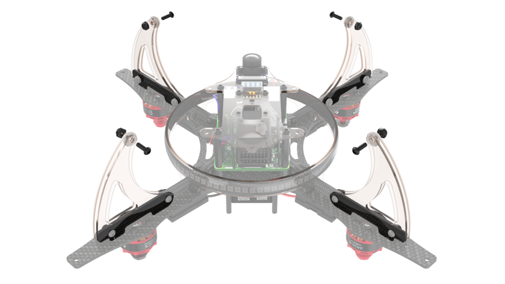

## Подключение кабелей

1. Подключите кабель радиоприемника в *RCIN* разъем полетного контроллера.

    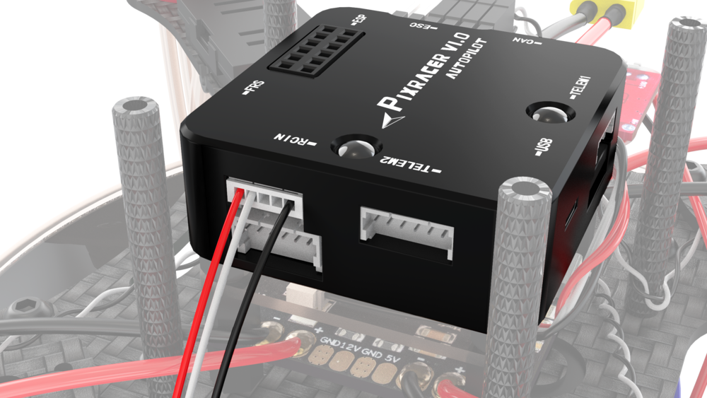

2. Подключите кабель к приемнику, соответственно изображению.

    

        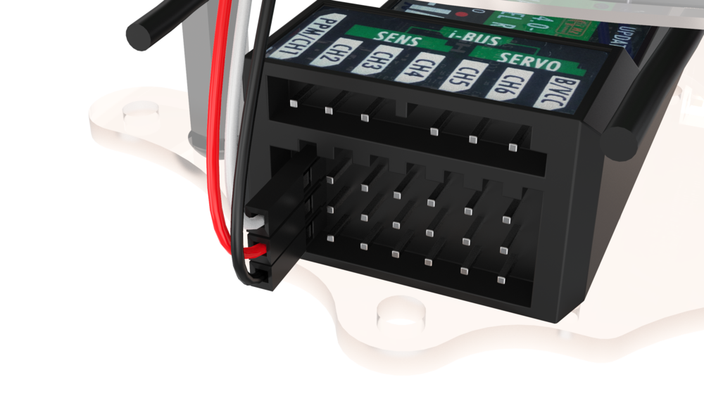
        
    

## Сборка защиты винтов

1. Соберите нижнюю часть защиты, используя 12 винтов М3х10 и 12 нейлоновых стоек 40 мм.

    

2. Установите верхнюю часть, используя 12 винтов М3х10.

    

3. Установите защиту на коптер, с помощью 4 винтов М3х10 и стальных гаек.

    

        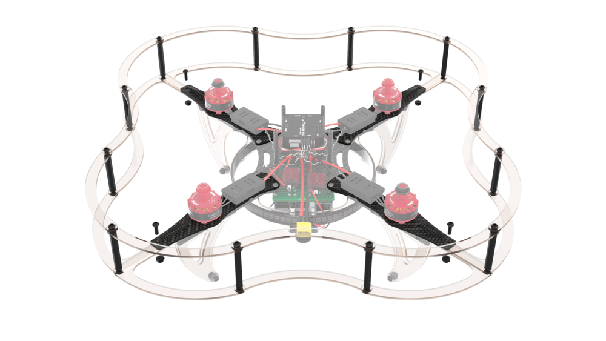
        
    

## Установка верхней деки на коптер

1. Установите на верхнюю деку держатель АКБ с помощью 4 винтов М3х8 и стальных гаек.
2. Проденьте в пазы ремешок для фиксации АКБ.
3. Установите верхнюю деку на коптер с помощью 4 винтов М3х10.

    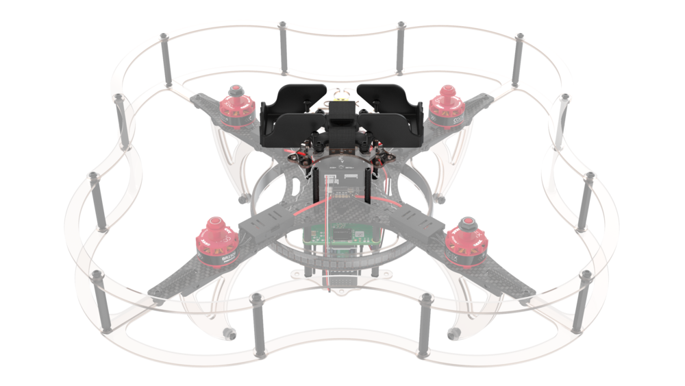

4. Подключите USB кабель к разъему на полетном контроллере и USB разъему Raspberry Pi.

    

        
        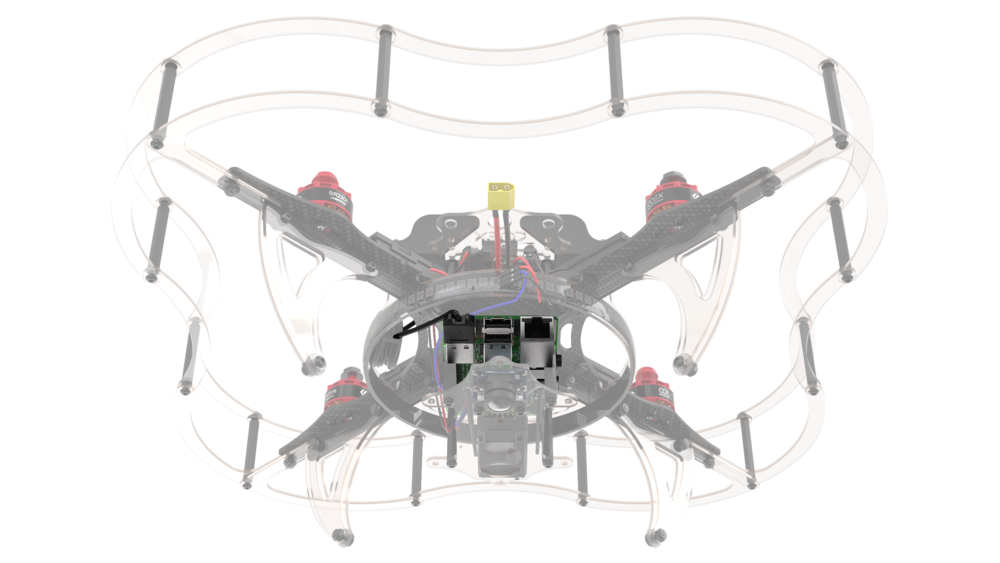
    

5. Зафиксируйте "улитку" кабеля в удобном месте с помощью двухстороннего скотча так, чтобы провод не мешал вращению винтов.

    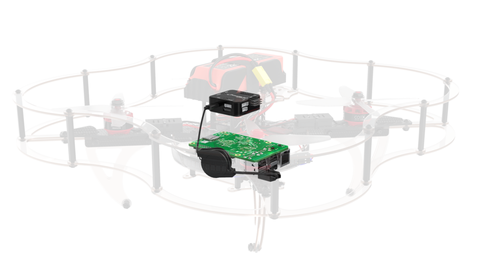

## Установка пропеллеров и подготовка к полёту

Произведите настройку компонентов квадрокоптера, используя раздел ["Настройка"](setup.md).

> **Warning** Установка пропеллеров должна производиться **только после окончательной настройки коптера**, непосредственно перед полетом.

Установите 4 пропеллера, согласно [схеме вращения](#проверка-направления-вращения-моторов). При установке пропеллеров АКБ должна быть отключена.

При установке будьте внимательны, чтобы пропеллер не был перевернут. На лицевой стороне пропеллера имеется маркировка его характеристик, а также направление вращения, которое должно совпадать с направлением вращения моторов.

    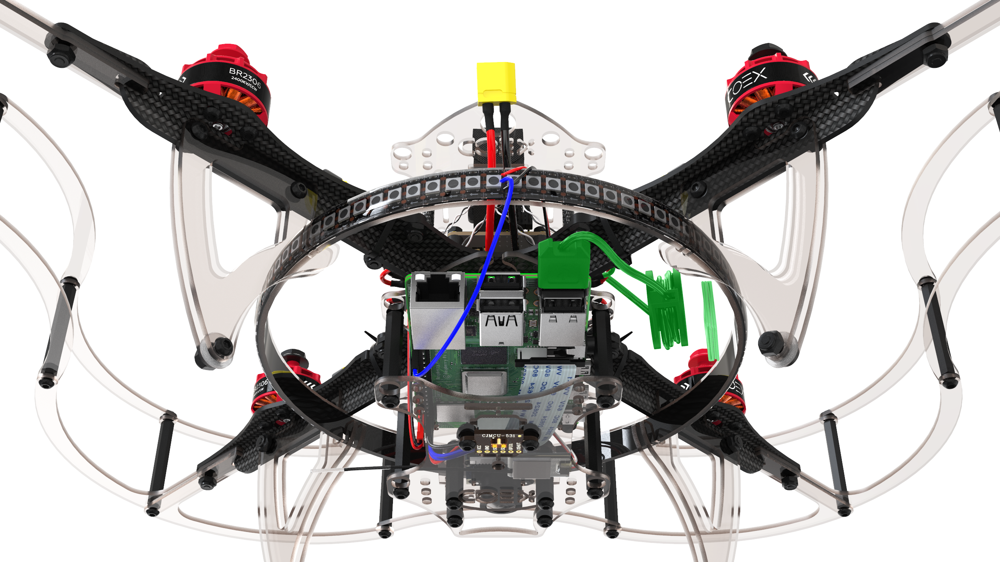
    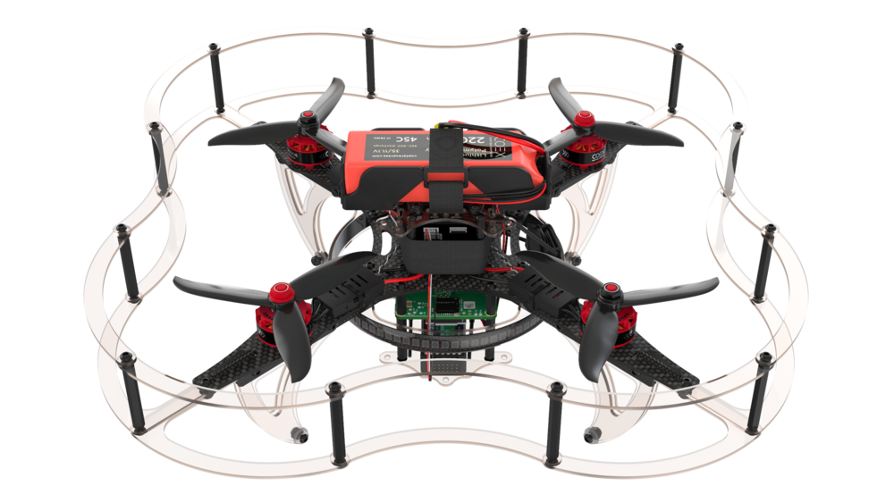

## Установка АКБ

> **Warning** Убедитесь, чтобы все провода были спрятаны и движению пропеллеров ничего не мешает.

Проверьте сборку квадрокоптера:

* Балансировочный разъем АКБ должен быть спрятан под утягивающим ремешком.
* Регуляторы должны быть зафиксированы хомутами.
* Все провода, идущие от PDB и полетного контроллера, должны быть зафиксированы липучкой или обмотанной вокруг алюминиевых стоек.
* Пропеллеры установлены правильной стороной и соответствуют направлению кручения моторов.

Обязательно установите и настройте индикатор напряжения перед полетом, чтобы не переразрядить аккумулятор. Для настройки индикатора используйте кнопку расположенную в его основании. Отображаемые цифры во время настройки обозначают минимально возможное напряжение в каждой [ячейке](glossary.md#ячейка--банка-акб) аккумулятора, рекомендуемое значение **3.5**.

> **Info** Звуковая индикация означает, что ваш аккумулятор разряжен и его нужно зарядить.

> **Success** Дрон готов к полету!
