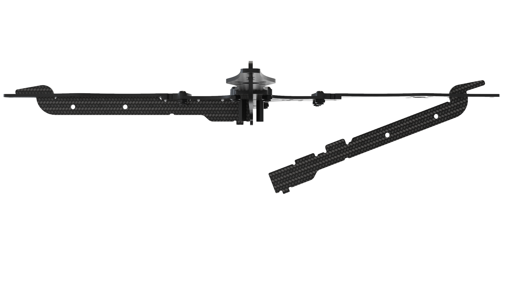
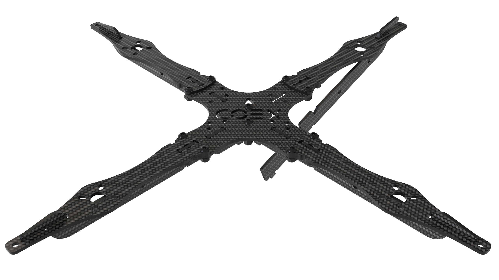
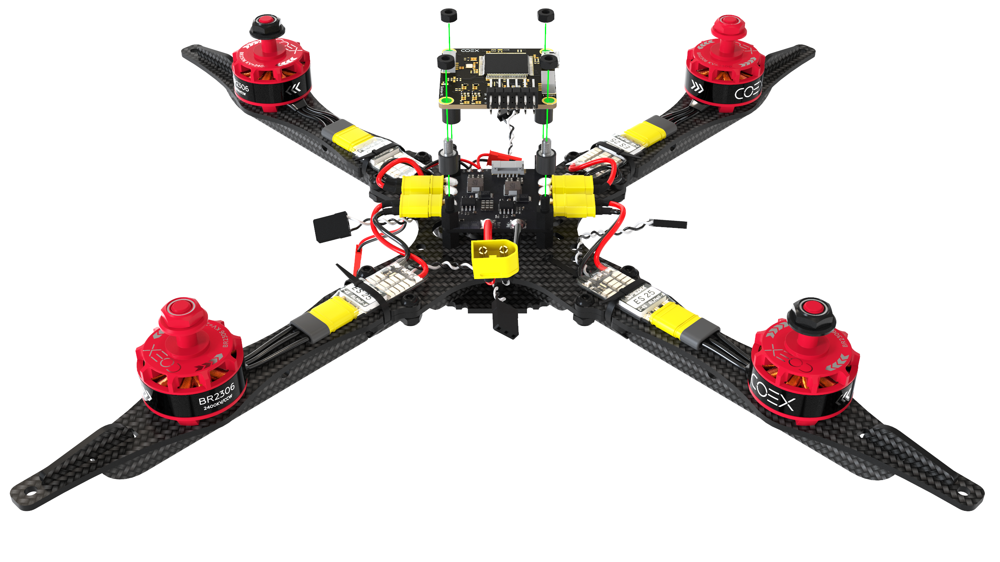
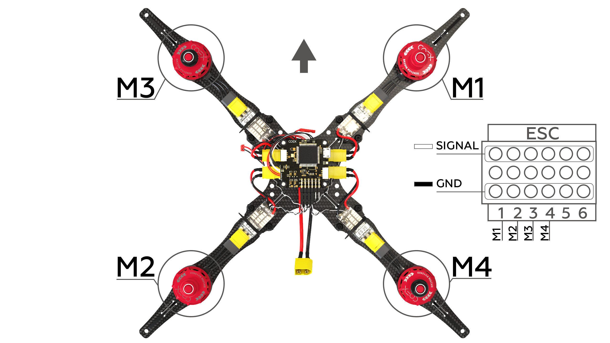
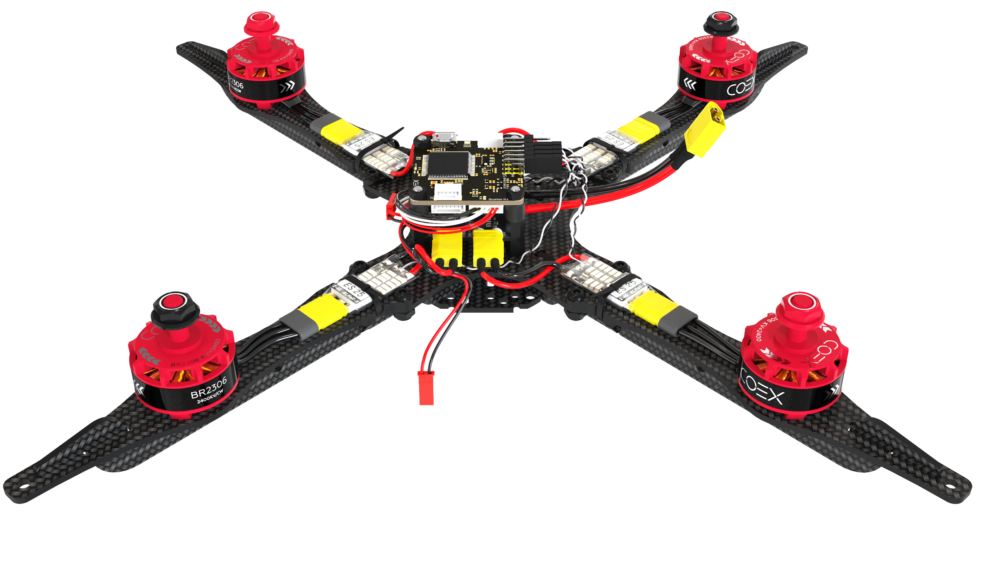
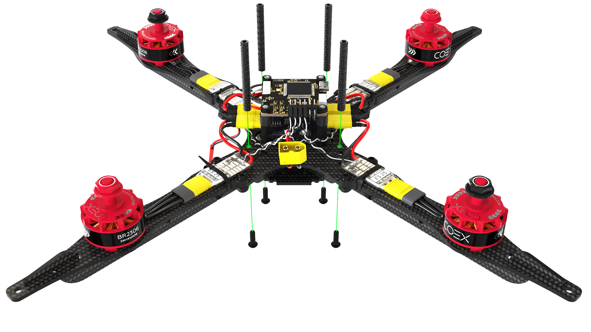

# Сборка Клевера 4

## Сборка рамы

1. Совместите 4 луча с центральной декой, зафиксируйте их при помощи болтов М3х8 и гаек с нейлоновой вставкой.

    

        
        
    

2. На центральные отверстия в главной деке установите 2 стойки 20мм и закрепите их с помощью болтов М3х8.

    

3. Установите крючок пластины жесткости в паз на луче.

    

4. Прижмите пластину жесткости к главной деке.

    

5. Стяните пластины жесткости с помощью малой карбоновой деки.

    

6. Установите 4 стойки 6мм и закрепите их с помощью болтов М3х6.

    

## Установка моторов

1. При установке моторов обратите внимание на схему вращения моторов. Маркировка вращения на моторах должна совпадать со схемой вращения.

    

2. Установите мотор на соответствующие отверстия в луче с помощью болтов М3х5.

    

        
        
    

## Установка ESC и PDB

1. Подсоедините к моторам регуляторы оборотов с помощью разъемов MR30 и закрепите их на лучах с помощью пластиковых хомутов.

    

        
        
    

2. На заранее закрепленные стойки установите плату распределения питания и зафиксируйте ее стойками 6мм. Плата распределения питания должна быть установлена таким образом, чтобы кабель подключения питания был направлен в сторону хвоста вашего коптера.

    

3. Подключите к плате распределения питания силовые выходы регуляторов оборотов.

    

## Установка полетного контроллера

Набор *Клевер 4* позволяет установить различные полетные контроллеры, к примеру *COEX Pix* и *Pixracer*.

> **Caution** При установке полетного контроллера обратите внимание на стрелку, расположенную на плате, при монтаже она должна быть направлена к носу коптера.

### COEX Pix

Установите резиновые стойки 6мм, на них закрепите *COEX Pix* с помощью нейлоновых гаек.

### Pixracer

1. Установите малую деку на стойки и зафиксируйте ее нейлоновыми гайками.

    

2. Склейте 3-4 слоя двустороннего скотча, приклейте его в центр малой деки и установите сверху *Pixracer*.

    

## Подключение полетного контроллера

1. Подключите регуляторы оборотов к полетному контроллеру в соответствии со схемой.

    

2. Подключите кабель питания к плате распределения питания и соответствующему разъему на полетном контроллере.

    

Установите алюминиевые стойки 40мм на болты М3х12.

## Установка Raspberry Pi

