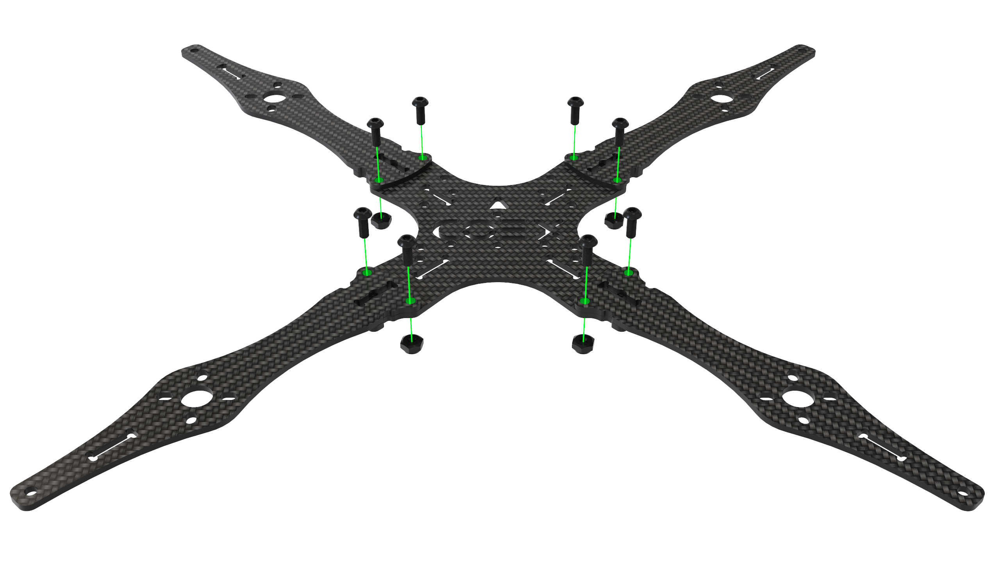
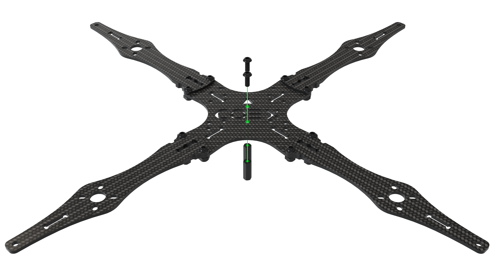
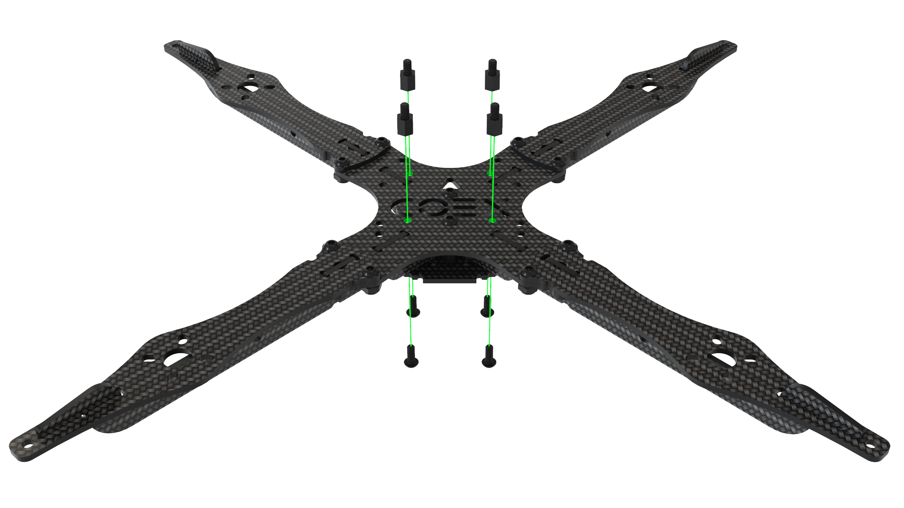
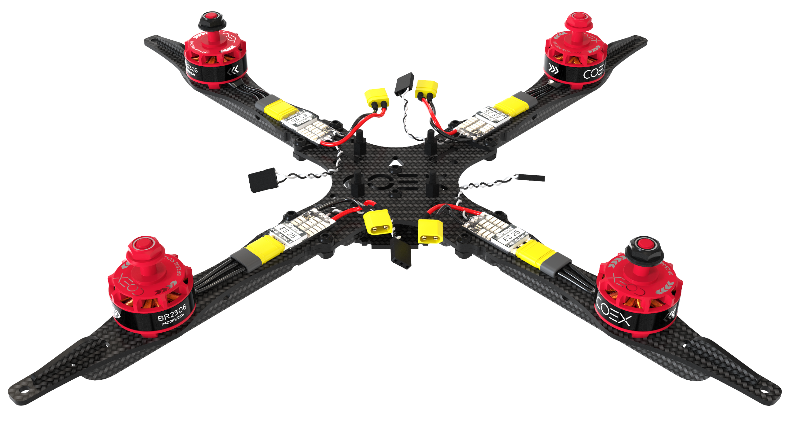
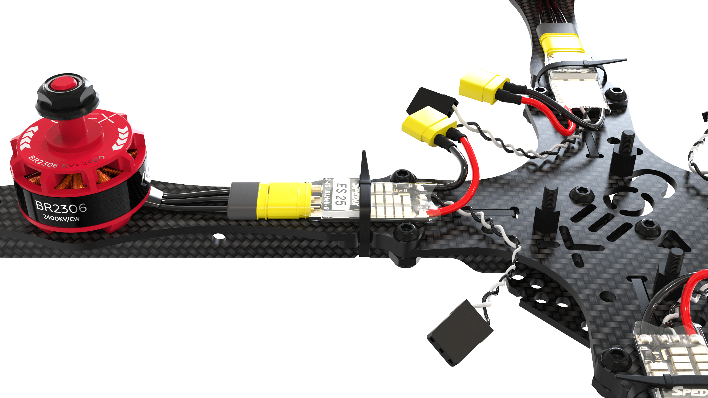
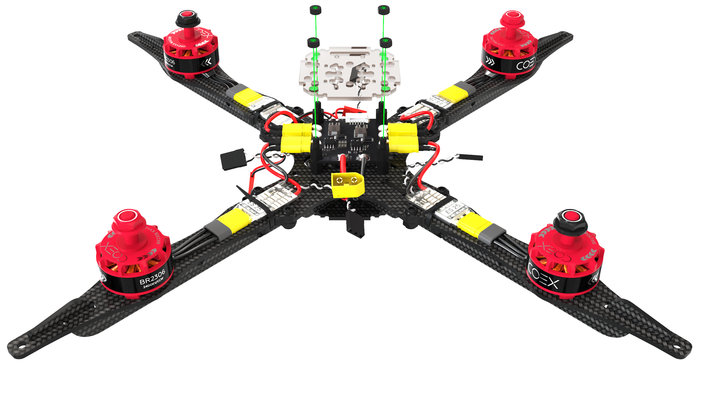
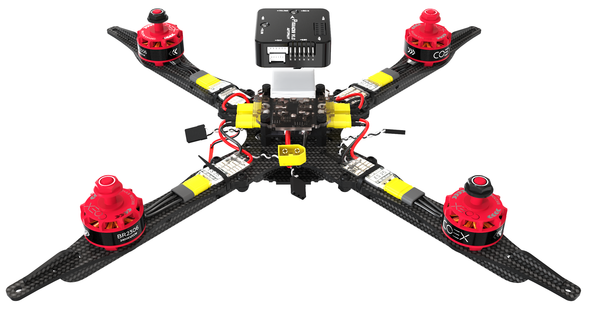

# Сборка Клевера 4

## Сборка рамы

1. Совместите 4 луча с центральной декой, зафиксируйте их при помощи винтов М3х8 и гаек с нейлоновой вставкой.

    

        
        
    

2. На центральные отверстия в главной деке установите 2 стойки 20мм и закрепите их с помощью винтов М3х8.

    

3. Установите крючок пластины жесткости в паз на луче.

    

4. Прижмите пластины жесткости к главной деке.

    

5. Стяните пластины жесткости с помощью малой карбоновой деки.

    

6. Установите 4 стойки 6мм и закрепите их с помощью винтов М3х6.

    

## Установка моторов

1. При установке моторов обратите внимание на схему вращения моторов. Маркировка вращения на моторах должна совпадать со схемой вращения.

    

2. Установите мотор на соответствующие отверстия в луче с помощью **винтов М3х5**.

    

        
        
    

## Установка ESC и PDB

1. Подсоедините к моторам регуляторы оборотов(ESC) с помощью разъемов MR30 и закрепите их на лучах с помощью хомутов.

    

        
        
    

2. На заранее закрепленные стойки установите плату распределения питания(PDB) и зафиксируйте ее стойками 6мм. Плата распределения питания должна быть установлена таким образом, чтобы кабель подключения питания был направлен в сторону хвоста коптера.

    

3. Подключите к плате распределения питания силовые выходы регуляторов оборотов.

    

## Установка полетного контроллера

Набор *Клевер 4* позволяет установить различные полетные контроллеры, к примеру *COEX Pix* и *Pixracer*.

> **Caution** При установке полетного контроллера обратите внимание на стрелку, расположенную на плате, при монтаже она должна быть направлена к носу коптера.

### COEX Pix

>**Hint** Перед установкой резиновых стоек, накрутите 2 слоя нейлоновых гаек, для более прочного крепления или откусите лишнюю резьбу с помощью бокорезов.

Установите резиновые стойки 6мм, на них закрепите *COEX Pix* с помощью нейлоновых гаек.

### Pixracer

1. Установите малую деку на стойки и зафиксируйте ее нейлоновыми гайками.

    

2. Склейте 3-4 слоя двустороннего скотча, приклейте его в центр малой деки и установите сверху *Pixracer*.

    

## Подключение полетного контроллера

1. Подключите регуляторы оборотов к полетному контроллеру в соответствии со схемой.

    

2. Подключите кабель питания к плате распределения питания и соответствующему разъему на полетном контроллере.

    

Установите алюминиевые стойки 40мм на болты М3х12.

    
    

## Установка Raspberry Pi

1. На основную деку установите стойки 20мм, закрепите их с помощью винтов М3х8.

    

        
        
    

2. На монтажную деку установите стойки 6мм и стойки 30мм, закрепите их с помощью болто М3х6 и М3х12.

    

3. Установите собранную монтажную деку на основную и закрепите с помощью винтов М3х8.

    

4. Установите плату *Raspberry Pi* и зафиксируйте с помощью нейлоновых гаек.

    

5. На деку захвата установите дальномер с помощью самоконтрящихся гаек и винтов М3х8, и приклейте радиоприемник с помощью двустороннего скотча.

    

6. Установите 4 стойки 20мм и закрепите их с помощью винтов М3х8.

    

7. На малую монтажную деку установите камеру и зафиксируйте ее с помощью 2ух маленьких саморезов, в верхнем левом и нижнем правом углах.

    

#TODO Нужен скрин с подключением шлефа к камере

8. Установите модуль камеры на деку захвата и закрепите с помощью винтов М3х8.

    

9. Установите собранную деку захвата и зафиксируйте с помощью винтов М3х8.

    

10. Подключите к *Raspberri Pi* дальномер и кабель питания.

    

11. Подключите шлейф камеры к *Raspberry Pi*.

    

## Установка LED ленты

1. Соберите обруч для светодиодной ленты, объединив замок на концах.

    

2. Наклейте светодиодную ленту на обруч, для большей крепкости притяните ее с помощью 3-4 хомутов.

    

3. Установите ножки на пластину жесткости с помощью самоконтрящихся гаек и винтов М3х8 используя только крайние монтажные отверстия. Снизу, между пластинами ножек установите демпферное силиконовое колечко.

    

4. Отогните ножки назад и в специальный паз на них установите обруч со светодиодной лентой, таким образом, чтобы кабели подключения выходили с хвостовой стороны коптера.

    

5. За крепите ножки с помощью самоконтрящихся гаек и винтов М3х8.

    

6. Подключите питание светодиодной ленты(красный, черный кабели) в короткий разъем JST на плате распределения питания.

    

7. Подключите сигнальный выход светодиодной ленты(белый кабель) в *Raspberry Ri*, к пину *GPIO 21*.

    

## Установка защиты

1. Соберите нижний уровень защиты с помощью стоек 40мм и винтов М3х12.

    

2. Соберите верхний уровень защиты с помощью винтов М3х12.

    

3. Установите монтажную деку и закрепите ее болтами М3х8.

    

4. Установите защиту и закрепите на лучах с помощью самоконтрящихся гаек и винтов М3х8.

    

## Подготовка к полету

1. Установите ремешок для аккумулятора и подключите полетный контроллер к *Raspberry Pi* с помощью USB кабеля.

    

        
        
    

2. Установите пропеллеры в соответствии со [схемой направления движения моторов](#prop_rotation).

    

3. Установите аккумулятор.

    

> **Success** Дрон собран, далее произведите ["настройку"](setup.md).
