# Сборка Клевера 4.2 WorldSkills

Габаритный чертеж – [clover-4.2-ws.pdf](https://github.com/CopterExpress/clover/raw/master/docs/assets/dimensional-drawing/clover-4.2-ws.pdf).

## Размер крепежа

> **Hint** Во время сборки используются винты и стойки различных размеров, использование крепежа не соответствующего размера может повредить коптер.

<table class="type_table">
    <tr>
        <td>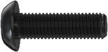</td>
        <td >Винт M3x10</td>
        <td></td>
        <td >Стойка алюминиевая 40 мм</td>
    </tr>
    <tr>
        <td></td>
        <td >Винт M3x8</td>
        <td></td>
        <td >Стойка алюминиевая 15 мм</td>
    </tr>
    <tr>
        <td></td>
        <td >Винт M3x5</td>
        <td></td>
        <td >Стойка нейлоновая 40 мм</td>
    </tr>
    <tr>
        <td>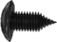</td>
        <td >Саморез M2x5</td>
        <td></td>
        <td >Стойка нейлоновая 30 мм</td>
    </tr>
    <tr>
        <td>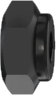</td>
        <td >Гайка M3 (самоконтрящаяся)</td>
        <td></td>
        <td >Стойка нейлоновая 20 мм</td>
    </tr>
    <tr>
        <td></td>
        <td >Гайка M3 (нейлоновая)</td>
        <td></td>
        <td >Стойка нейлоновая 15 мм</td>
    </tr>
    <tr>
        <td>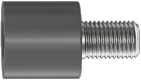</td>
        <td >Стойка демпферная</td>
        <td>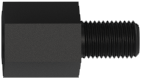</td>
        <td >Стойка нейлоновая 6 мм</td>
    </tr>
</table>

## Сборка рамы

1. Совместите 4 луча с центральной декой, зафиксируйте их при помощи винтов М3х8 и самоконтрящихся гаек.

    

        
        
    

2. На центральные отверстия в главной деке установите 2 стойки 15 мм и закрепите их с помощью винтов М3х8.

    

3. Установите крючок пластины жесткости в паз на луче.

    

4. Прижмите пластины жесткости к главной деке.

    

5. Стяните пластины жесткости с помощью малой карбоновой деки.

    

6. Установите 4 нейлоновые стойки 6мм и закрепите их с помощью винтов М3х5.

    

## Установка моторов

1. При установке моторов обратите внимание на схему вращения моторов. Маркировка вращения на моторах должна совпадать со схемой вращения.

    

2. Установите мотор на соответствующие отверстия в луче с помощью **винтов М3х5**.

    

        
        
    

> **Caution** Убедитесь, что моторы закреплены с помощью винтов М3х5, в противном случае может возникнуть короткое замыкание между обмотками.

## Установка ESC и PDB

1. На заранее закрепленные стойки установите плату распределения питания (PDB), она должна быть установлена таким образом, чтобы силовой кабель питания был направлен в сторону хвоста коптера.

    

        
        
    

2. Установите регуляторы оборотов (ESC) в соответствующие места на луче.

    

        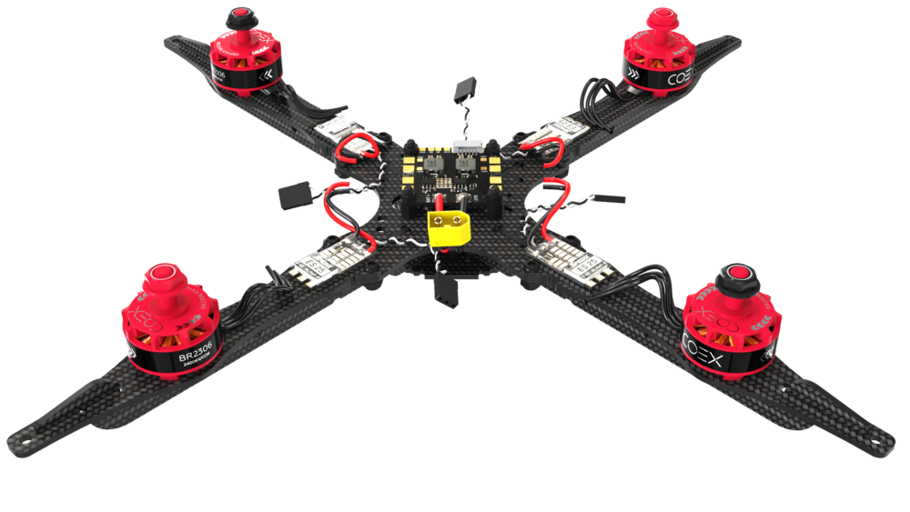
        
    

3. Притяните регуляторы оборотов (ESC) хомутами.

    

4. Отмерьте необходимое количество силового провода регуляторов оборотов(ESC), и обрежьте лишнее.

5. Зачистите и залудите обрезанные провода.

6. Залудите контактные площадки на плате распределения питания.

7. Припаяйте силовые провода регуляторов оборотов к плате распределения питания.

    

        
        
    

    > **Caution** Будьте внимательны к подписям контактов на плате. Красный провод должен идти к площадке с подписью *+*, а черный к подписи *-*.

8. Обрежьте лишний фазный кабель идущий от моторов.

9. Зачистите и залудите фазные кабели.

10. Залудите контактные площадки регуляторов оборотов.

11. Припаяйте фазные кабели к контактным площадкам регуляторов в любом порядке.

    

        
        
    

12. Припаяйте 3 разъема JST мама к 2ум площадкам *5V* и площадке *bat+*.

    

        
        
    

## Установка полетного контроллера

Набор "Клевер 4" позволяет установить различные полетные контроллеры, к примеру, [COEX Pix](coex_pix.md) и Pixracer.

> **Caution** При установке полетного контроллера обратите внимание на ориентацию платы. Если Вы установите COEX Pix серворазъемами назад (как на изображениях в инструкции) то впоследствии при [настройке](calibration.md) полетного контроллера в *Autopilot Orientation* необходимо будет указать значение `ROTATION_ROLL_180_YAW_90`, иначе полетный контроллер будет некорректно воспринимать наклоны и повороты коптера. Для полетного контроллера Pixracer это не требуется.

### COEX Pix

> **Hint** Перед установкой демпферных стоек, накрутите 2 слоя нейлоновых гаек, для более прочного крепления или откусите лишнюю резьбу с помощью бокорезов.

1. Закрепите плату распределения питания с помощью нейлоновых гаек, сверху установите демпферные стойки.

2. Установите полетный контроллер и закрепите нейлоновыми гайками.

    

3. Вставьте флеш-карту для записи логов в полетный контроллер.

    

### Pixracer

1. Закрепите плату распределения питания с помощью нейлоновых стоек 6мм.

2. Установите малую крепежную деку и закрепите ее с помощью нейлоновых гаек.

    

3. Склейте 3–4 слоя двустороннего скотча, приклейте его в центр малой деки и установите сверху Pixracer.

    

4. Вставьте флеш-карту для записи логов в полетный контроллер.

    

## Подключение полетного контроллера

1. Подключите регуляторы оборотов к полетному контроллеру в соответствии со схемой.

    

2. Подключите кабель питания к плате распределения питания (PDB) и соответствующему разъему на полетном контроллере.

    

        
        
    

3. Установите алюминиевые стойки 40 мм на винты М3х10.

    

        
        
    

## Установка Raspberry Pi

1. На монтажную деку установите стойки 20 мм и 40 мм, закрепите их с помощью винтов М3х8.

    

2. Нарежьте резьбу М3 в крепежных отверстиях Raspberry Pi с помощью болта М3х10.

3. Вкрутите в плату Raspberry Pi стойки 6мм, при необходимости закрепите их нейлоновыми гайками.

    

        
        
    

4. Установите Raspberry Pi на монтажную деку, закрепив ее болтами М3х6.

    

5. Установите собранный модуль в соответствующие пазы основной деке дрона.

    

6. Подключите разъем 5V JST в соответствующие пины питания Raspberry Pi.

    

7. Возьмите 4 провода Dupont, обрежьте 5–7 см кабеля и припаяйте к соответствующим пинам дальномера.

    

        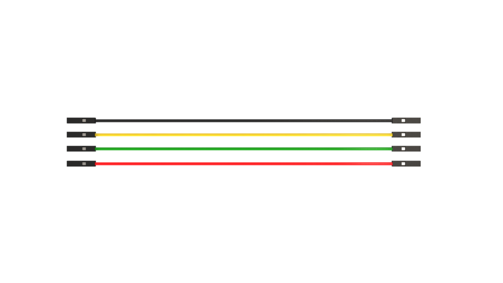
        
    

   <table class=versions>
        <tr><th>Провод</th><th>Пин дальномера</th></tr>
        <tr>
             <td>
                  Красный
             </td>
             <td>5v</td>
        </tr>
        <tr>
             <td>Черный</td>
             <td>GND</td>
        </tr>
        <tr>
             <td>Желтый</td>
             <td>SDA</td>
        </tr>
        <tr>
             <td>Зеленый </td>
             <td>SCL</td>
        </tr>
   </table>

    

        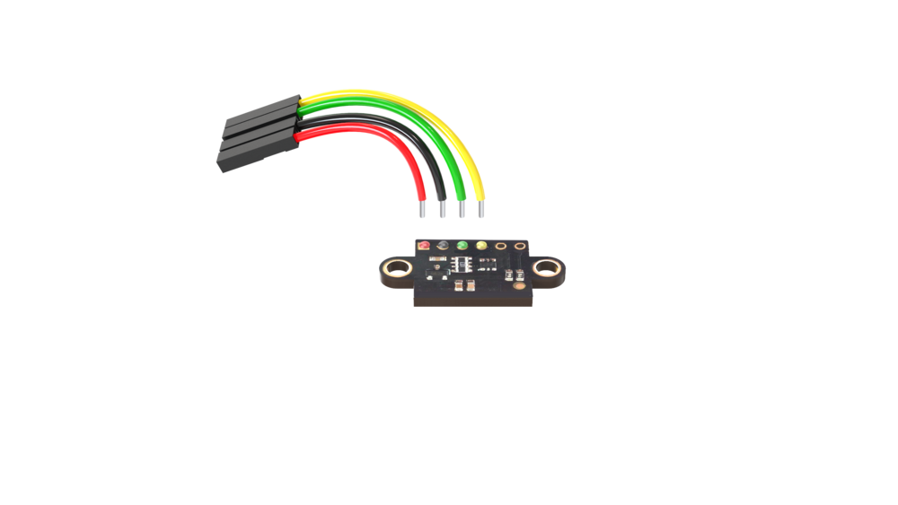
        
    

8. Установите дальномер на деку захвата и Приклейте радиоприемник на 3М скотч.

    > **Caution** Устанавливайте дальномер таки образом, чтобы гайки не прислонялись к плате напрямую. При такой установке если большая вероятность повредить элементы платы.

    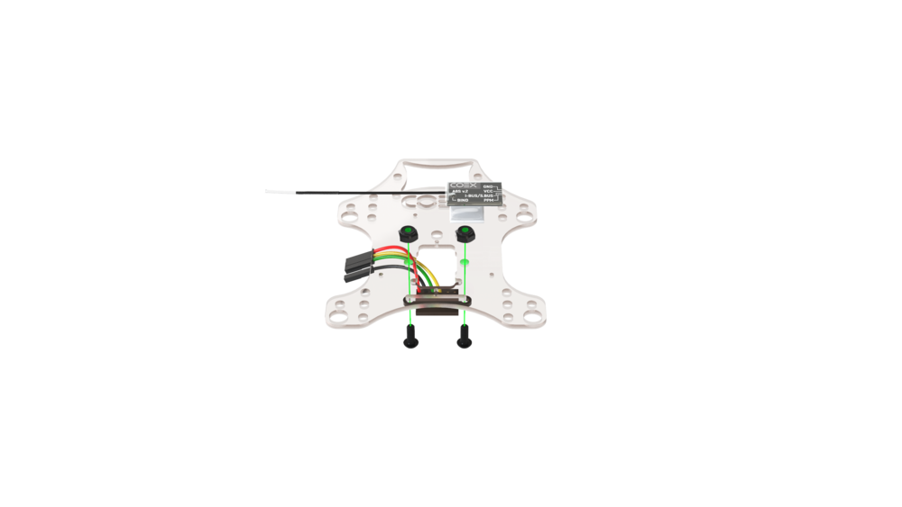

9. Установите 4 нейлоновые стойки 20мм и зафиксируйте их болтами М3х8.

    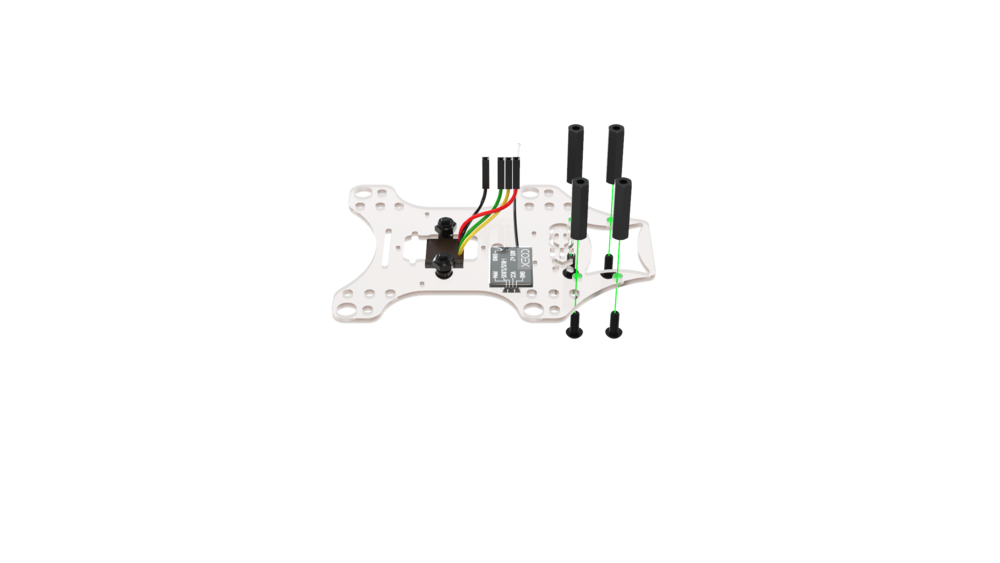

10. На малую монтажную деку установите камеру и зафиксируйте ее двумя короткими саморезами.

    > **Caution** Если закрепить камеру в верхнем правом углу и шляпка самореза будет касаться элемента на камере, камера не будет работать.

    

11. Установите малую монтажную деку с камерой на стойки и зафиксируйте с помощью болтов М3х8.

    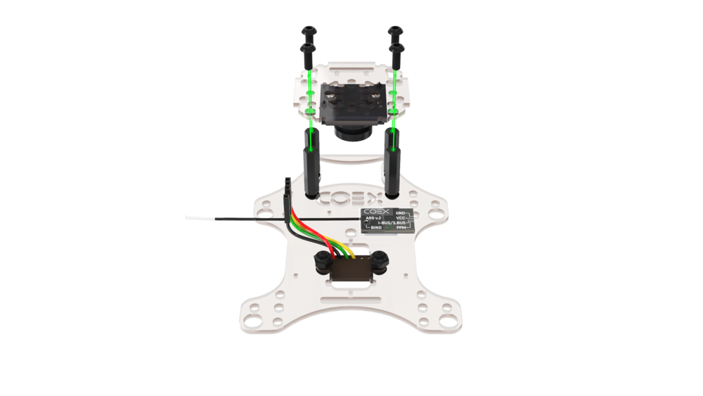

12. Собранный модуль установите над модулем Raspberry Pi и зафиксируйте болтами М3х8.

    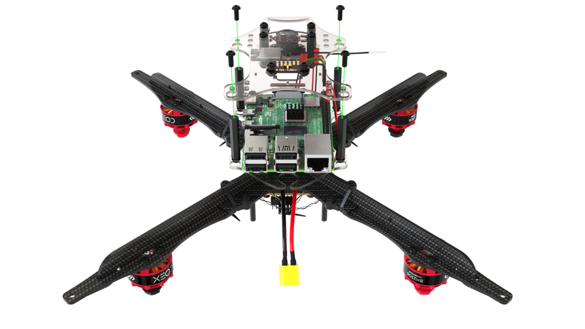

13. Соедините камеру и Raspberry Pi с помощью шлейфа.

    

14. Подсоедините дальномер к Raspberry Pi в соответствующие пины.

    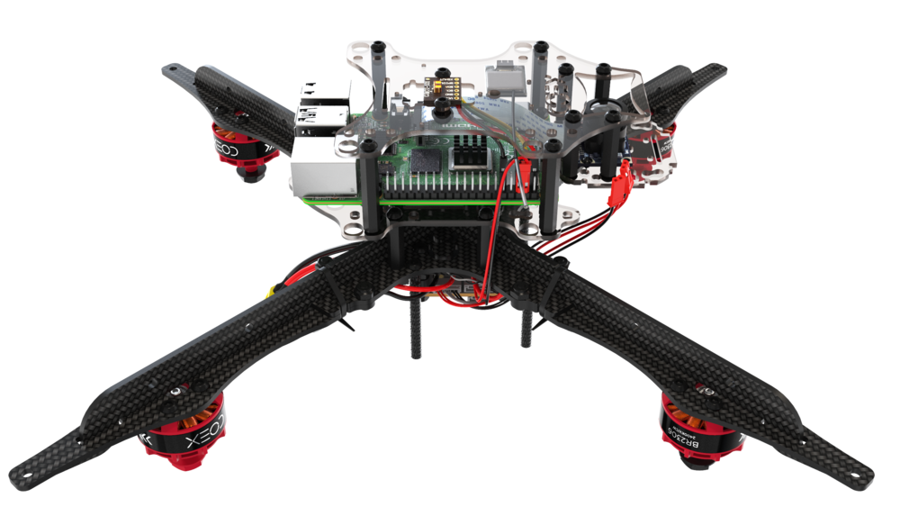

15. Соедините радиоприемник и полетный контроллер с помощью 4-х пинового кабеля.

    

## Установка LED ленты и ножек

1. Соберите обруч для светодиодной ленты, объединив замок на концах.

    

2. Припаяйте JST-папа к площадке питания и Dupont-мама к сигнальной площадке.

    

3. Наклейте светодиодную ленту на обруч, для большей крепкости притяните ее с помощью 3–4 хомутов.

    

4. Установите ножки на пластину жесткости с помощью самоконтрящихся гаек и винтов М3х10 используя только крайние монтажные отверстия. Снизу, между пластинами ножек, установите демпферное силиконовое колечко.

    

5. Отогните ножки назад и в специальный паз на них установите обруч со светодиодной лентой, таким образом, чтобы кабели подключения выходили с хвостовой стороны коптера.

    

6. Закрепите ножки с помощью самоконтрящихся гаек и винтов М3х10.

    

7. Подключите питание светодиодной ленты в разъем JST 5V на плате распределения питания.

    

8. Подключите сигнальный выход светодиодной ленты в Raspberry Ri, к пину *GPIO21*.

    

9. Установите монтажную деку и закрепите ее винтами М3х8.

    

## Установка защиты

1. Соберите нижний уровень защиты с помощью стоек 40 мм и винтов М3х10.

    

2. Соберите верхний уровень защиты с помощью винтов М3х10.

    

3. Установите защиту и закрепите на лучах с помощью самоконтрящихся гаек и винтов М3х10.

    

4. Подключите полетный контролер к Raspberry Pi с помощью USB к кабеля.

    

        
        
    

5. Установите ремешок для крепления АКБ.

    

> **Success** Дрон собран, далее произведите [настройку](setup.md).
