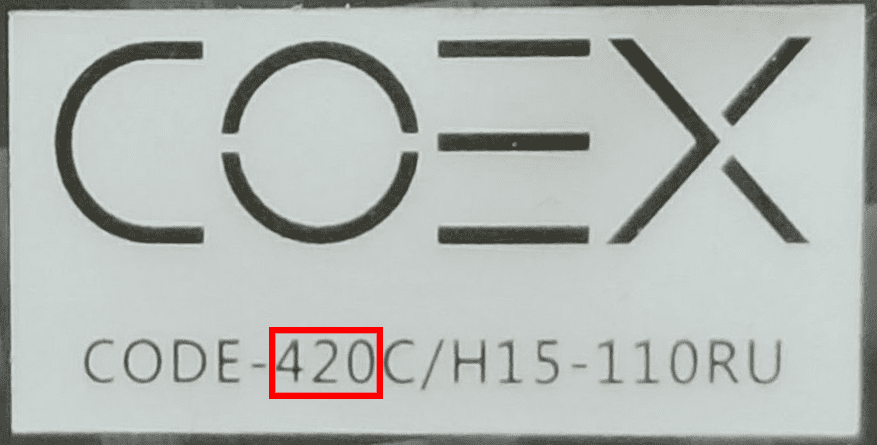

# Сборка Клевера

В этом разделе находится статьи, описывающие сборку каждой из версии Клевера.

<table class=versions>
     <tr><th>Версия</th><th>Изображение</th></tr>
     <tr>
          <td>
               <a href="assemble_4_2.md">Клевер&nbsp;4.2</a>
               

                    (<a href="assemble_4_2_ws.md">WorldSkills</a>,
                    <a href="assemble_4_2_pro.md">Pro</a>)
               

          </td>
          <td></td>
     </tr>
     <tr>
          <td><a href="assemble_4_1.md">Клевер&nbsp;4.1</a></td>
          <td></td>
     </tr>
     <tr>
          <td><a href="assemble_4.md">Клевер&nbsp;4</a></td>
          <td></td>
     </tr>
     <tr>
          <td><a href="assemble_3.md">Клевер&nbsp;3</a></td>
          <td></td>
     </tr>
     <tr>
          <td><a href="assemble_2.md">Клевер&nbsp;2</a></td>
          <td></td>
     </tr>
</table>

Ссылки на CAD-модели деталей Клевера доступны в статье "[CAD-модели](models.md)".

## Определение версии

Для определения версии Клевера 4 посмотрите на серийный номер.

В данном случае число *420* обозначает версию Клевера **4.2**.
