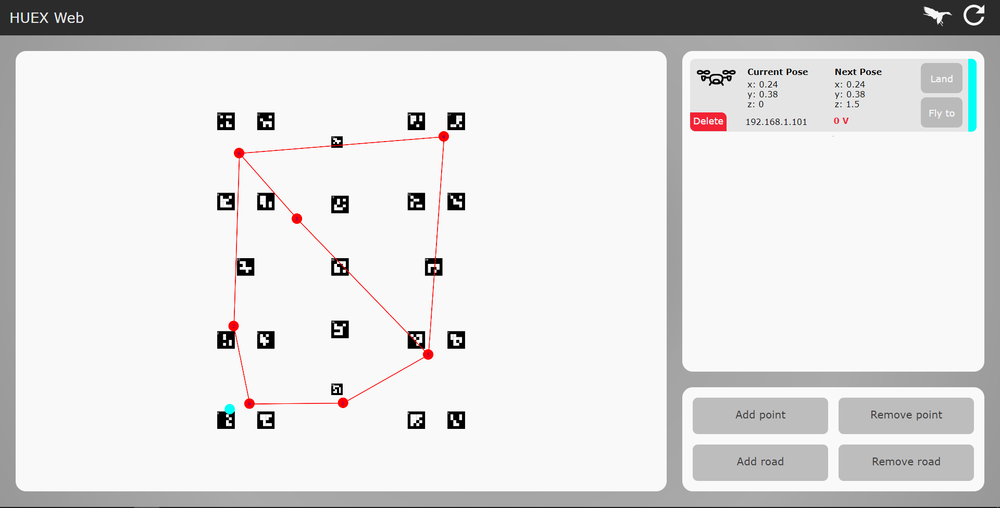

# Аэротакси

Проект команды Human Express на проектной программе "Большие Вызовы"

## Суть проекта

Крупные города страдают из-за пробок и перегруженности транспорта. Пробки на дорогах и перегруженность транспорта влечёт за собой многие неудобства. Одной из таких проблем является отсутствие возможности быстро добраться из точки А в точку Б. При этом воздушное пространство практически не используется. Предлагаемое решение заключается в создании системы, которая в режиме реального времени наблюдает и контролирует движение беспилотных летательных аппаратов. Такое решение приводит к полной автоматизации процесса полёта и исключает возможность воздушно-транспортных происшествий. В результате проделанной работы удалось сделать систему, которая состоит из нескольких дронов и сервера. Сервер прокладывает маршрут дронам из начальной точки в заданную по проложенным дорогам. Также в работу сервера входит логистика, благодаря которой беспилотники не сталкиваются в полёте.

<iframe width="100%" height="433" src="https://www.youtube.com/embed/nq1DKjacs6U" frameborder="0" allow="accelerometer; autoplay; encrypted-media; gyroscope; picture-in-picture" allowfullscreen></iframe>
<iframe width="100%" height="433" src="https://www.youtube.com/embed/QdgZ4lzPmwQ" frameborder="0" allow="accelerometer; autoplay; encrypted-media; gyroscope; picture-in-picture" allowfullscreen></iframe>

## Настройка сервера

Чтобы скачать проект на сервер выполните команду

```bash
git clone https://github.com/Tennessium/HUEX
```

Перед началом работы с системой необходимо подключить устройство к сети WiFi (например, раздать со смартфона) установить на него необходимые библиотеки

```bash
cd HUEX/server
pip install -r requirements.txt
```

В случае необходимости вы можете изменить высоту эшелонов и разрешенные IP-адреса для доступа к Центру управления полетами в файле *server/consts.py* и настроить поле с метками в *server/static/map.txt*.
Теперь можно запустить сервер написав в командную строку

```bash
python manage.py runserver 0.0.0.0:8000
```

Чтобы перейти на веб страницу наберите в адресной строке ip адрес сервера в локальной сети и укажите порт 8000 (`http://ip:8000`).
[Как узнать ip адрес устройства](https://remontka.pro/ip-adres/)

## Настройка коптеров

В первую очередь подготовьте SD-карту с образом Clover ([Инструкция](image.md))

Чтобы скачать проект на Raspberry Pi в коптере выполните команду

```bash
git clone https://github.com/Tennessium/HUEX
```

Перед началом работы с системой необходимо перевести коптеры в режим клиента и подключить к сети WiFi. Вы можете воспользоваться [этим мануалом](network.md#переключение-адаптера-в-режим-клиента)

Однако, для упрощения развертывания системы на нескольких коптерах, рекомендуется использование нашего скрипта, лежащего в папке *copter/setup/*

- Перейдите в папку

```bash
cd HUEX/copter/setup/
```

- Используя любой редактор, в файле *networkData.txt* измените SSID и пароль сети
- Запустите скрипт

```bash
sudo bash networkEdit.sh
```

- Перезагрузите Raspberry Pi

Произведите установку и настройку ROS-пакета для LED-ленты

```bash
cd ~/catkin_ws/src
git clone https://github.com/bart02/ros-led-lib.git led
cd led
```

Воспользовавшись nano ledsub.py, измените переменную LED_COUNT на число светодиодов на вашей ленте

```bash
chmod +x ledsub.py
cd ~/catkin_ws
catkin_make
sudo systemctl enable /home/pi/catkin_ws/src/led/led.service
sudo systemctl start led
```

Установите необходимые пакеты

```bash
cd HUEX/clever
pip install -r requirements.txt
```

В файле *copter/consts.py* укажите IP-адрес сервера.

Для запуска основного скрипта воспользуйтесь нашим systemd-сервисом.

```bash
sudo systemctl enable /home/pi/HUEX/clever/setup/taxi.service
sudo systemctl start taxi.service
```

Скрипт будет запускаться автоматически при старте системы.
Для остановки можно воспользоваться командой

```bash
sudo systemctl stop taxi.service
```

## Веб-интерфейс центра управления полётами


В данном веб интерфейсе можно следить за полётами всех дронов на карте (масштабировать с помощью колёсика, передвигать с помощью Alt). При нажатии на лебедя в правом верхнем углу все коптеры аварийно садятся, А при нажатии на значок "обновить" все коптеры автоматически удаляются, что приводит к удалению всех команд и посадке активных на текущий момент коптеров.
С помощью инструментов в правом нижнем углу можно строить новые основания и рёбра.

## Веб-интерфейс заказа

Чтобы перейти на веб страницу наберите в адресной строке `http://ip:8000/m`, где *ip* - адрес сервера в сети.

## Визуализатор

Для наглядности работы системы был разработан 3D-визуализатор воздушного пространства. Он отображает систему эшелонов, поле ArUco-маркеров; позиции коптеров и направления их движения в real-time.

Запускать визуализатор можно после старта сервера. Компьютер должен быть подключен к той же сети, что и сервер.

```bash
cd viz
python main.py
```

Программа автоматически подгрузит карты маркеров и эшелонов. Если одна из них изменяется в процессе эксплуатации, перезагрузите программу для внесения изменений.


>Камеру можно передвигать при помощи клавиш *WASD* и поворачивать при помощи стрелок.

## DDoS-скрипт

Во время смены был написан простой скрипт, предназначенный для тестирования логистики. Его суть заключается в бесконечном заказе такси между случайными точками. Перед тем как запустить программу [*DDos.py*](https://github.com/Tennessium/HUEX/blob/master/DDos.py) замените параметр *static_path* в пятой строке на *ip* вашего сервера.

## API

На случай если вы захотите реализовать свою "обёртку" вы можете реализовать взаимодействие с сервером по средствам *HTTP/HTTPS* запросов

### /get

Возвращает телеметрию всех доступных коптеров.
Пример:

```json
{
  "message": "OK",
  "drones": [
    {
      "ip": "192.168.1.101",
      "led": "#FF0000",
      "status": "land",
      "pose": {
        "x": 0.24,
        "y": 0.38,
        "z": 0,
        "yaw": 0
      },
      "voltage": 4.12,
      "nextp": {
        "led": "#FF0000",
        "status": "land",
        "pose": {
          "x": 0.24,
          "y": 0.38,
          "z": 1.5,
          "yaw": 0
        }
      }
    }
  ]
}
```

Где

- **ip** - ip адрес коптера
<!-- markdownlint-disable MD044 -->
- **led** - цвет светодиодной ленты
<!-- markdownlint-restore MD044 -->
- **status** - *fly* или *land* - текущий статус коптера
- **pose** - позиция коптера (*x*, *y*, *z*,  и *yaw*)
- **voltage** - напряжение на одной банке
<!-- markdownlint-disable MD044 -->
- **nextp** - отдаваемая коптеру команда на полёт (*led*, *status*, *pose* как выше)
<!-- markdownlint-restore MD044 -->

### /static/roads.json

Текущая карта дорог первого эшелона
Пример:

```json
{
  "points": [
    {
      "x": 2.1,
      "y": 3.5
    },
    {
      "x": 0.6,
      "y": 0.4
    },
    {
      "x": 2.4,
      "y": 0.5
    }
  ],
  "lines": [
    {
      "1": 2,
      "2": 1
    },
    {
      "1": 1,
      "2": 0
    }
  ]
}
```

Где

- **poits** - массив вершин графа и их координат
- **lines** - массив рёбер графа (*1* - точка из которой выходит ребро, *2* - точка куда это ребро направлено)

### /ask_taxi?o=x&t=y

Заказ такси из точки под номером *x* в точку под номером *y*. Точки *x* и *y* берутся  из **/static/roads.json**

### /get_dist?o=x&t=y

Возвращает расстояние и цену за пролёт между точками.
Пример:

```json
{"dist": 5.3, "cost": 309}
```

Где

- **dist** - Дистанция в метрах
- **cost** - Цена в рублях (150₽ + 30₽ &times; *n* метров)
