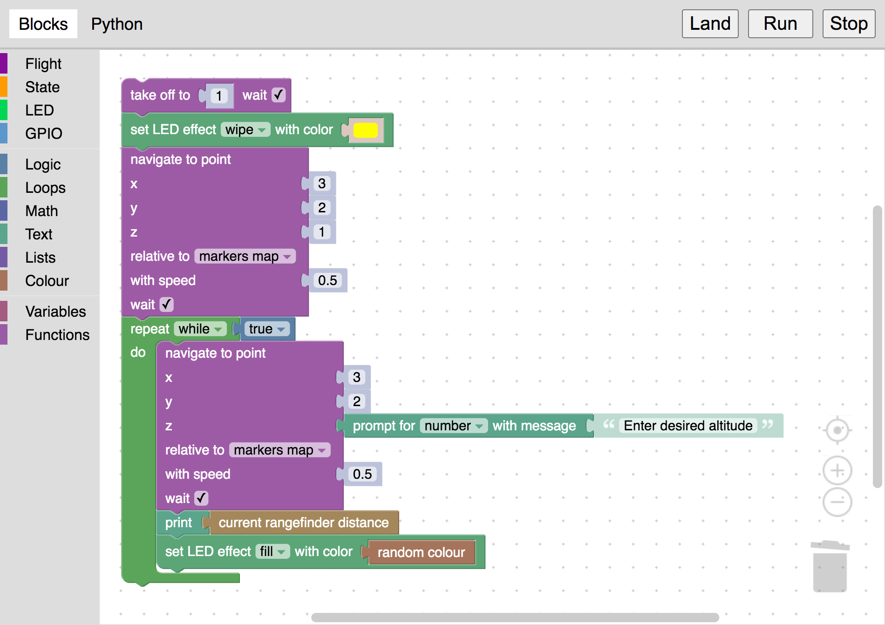
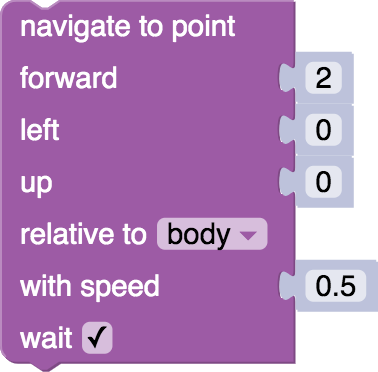

# Блочное программирование Клевера


Возможность блочного визуального программирования автономных полетов Клевера добавлена в [образ для RPi](image.md), начиная с версии **0.21**. Реализация блочного программирования основана на [Google Blockly](https://developers.google.com/blockly). Интеграция Blockly в Клевер позволяет понизить входной порог в программирование автономных полетов до минимального уровня.

## Конфигурация

Для корректной работы работы блочного программирования аргумент `blocks` в launch-файле Клевера (`~/catkin_ws/src/clover/clover/launch/clover.launch`) [должен быть в значении](cli.md#editing) `true`:

```xml
<arg name="blocks" default="true"/>
```

## Запуск

Для того, чтобы открыть интерфейс блочного программирования в Клевере, [подключитесь к Клеверу по Wi-Fi](wifi.md) и перейдите на страницу http://192.168.11.1/clover_blocks/ либо нажмите ссылку *Blocks programming* на [основной веб-странице Клевера](wifi.md#веб-интерфейс).

Интерфейс выглядит следующим образом:



Соберите необходимую программу из блоков в меню слева а затем нажмите кнопку *Run* для ее запуска. Также вы можете просмотреть сгенерированный код на языке Python, переключившись во вкладку *Python*.

Кнопка *Stop* позволяет остановить программу. Нажатие кнопки *Land* также останавливает программу и сажает дрон.

## Сохранение и загрузка


Для сохранения программы откройте меню справа сверху, выберите пункт меню *Save* и введите название программы. Название программы может содержать только латинские буквы, дефис, подчеркивание и точку. Все ранее сохраненные программы будут доступны в этом же меню.

На карте памяти сохраненные XML-файлы программ хранятся в каталоге `/catkin_ws/src/clover/clover_blocks/programs/`.

В этом же меню доступны примеры программ (подкаталог `examples`).

## Блоки

Набор блоков приблизительно аналогичен набору ROS-сервисов [API автономных полетов Клевера](simple_offboard.md). В этом разделе приведено описание некоторых из них.

Блоки Клевера поделены на 4 категории:

* <span style="padding:2px;color:white;background:#9d5ca6">Flight</span> – команды, имеющие отношение к полету.
* <span style="padding:2px;color:white;background:#ff9b00">State</span> – блоки, позволяющие получить те или иные параметры текущего состояния коптера.
* <span style="padding:2px;color:white;background:#01d754">LED</span> – блоки для управления [LED-лентой](leds.md).
* <span style="padding:2px;color:white;background:#5b97cc">GPIO</span> – блоки для работы с [GPIO-пинами](gpio.md).

В остальных категориях находятся стандартные блоки Google Blockly.

### take_off


Взлететь на указанную высоту в метрах. Высота может быть произвольным блоком, возвращающим числовое значение.

Флаг `wait` определяет, должен ли дрон ожидать окончания взлета перед выполнением следующего блока.

### navigate



Прилететь в заданную точку. Координаты точки задаются в метрах.

Флаг `wait` определяет, должен ли дрон ожидать завершения полета в точку перед выполнением следующего блока.

#### Поле *relative to* {#relative_to}

В блоке может быть выбрана [система координат](frames.md), в которой задана целевая точка:

* *body* – координаты относительно коптера: вперед (*forward*), влево (*left*), вверх (*up*).
* *markers map* – система координат, связанная с [картой ArUco-маркеров](aruco_map.md).
* *marker* – система координат, связанная с [ArUco-маркером](aruco_marker.md); появляется поле для ввода ID маркеа.
* *last navigate target* – координаты относительно последней заданной точки для навигации.
* *global* – глобальная система координат (широта и долгота) и относительная высота.
* *global, WGS 84 alt.* – глобальная система координат и высота в [системе WGS 84](https://ru.wikipedia.org/wiki/WGS_84).

### land


Произвести посадку.

Флаг `wait` определяет, должен ли дрон ожидать окончания посадки перед выполнением следующего блока.

### wait


Ожидать заданное время в секундах. Время ожидания может быть произвольным блоком, возвращающим числовое значение.

### wait_arrival


Ожидать, пока дрон долетит до целевой точки (заданной в [navigate](#navigate)-блоке).

### get_position


Блок позволяет получить позицию, скорость и угол по рысканью дрона в заданной [системе координат](#relative_to).

### set_effect


Блок позволяет устанавливать различные анимации на LED-ленту аналогично [ROS-сервису `set_effect`](leds.md#set_effect).

Пример использования блока для установки случайного цвета (блоки, связанные с цветами находятся в категории *Colour*):


### Работа с GPIO {#GPIO}

Категория <span style="padding:2px;color:white;background:#5b97cc">GPIO</span> содержит блоки для работы с GPIO. Обратите внимание, что для корректной работы этих блоков демон для работы с GPIO `pigpiod` должен быть включен:

```bash
sudo systemctl enable pigpiod.service
sudo systemctl start pigpiod.service
```

Более подробную информацию о GPIO читайте в [соответствующей статье](gpio.md).
