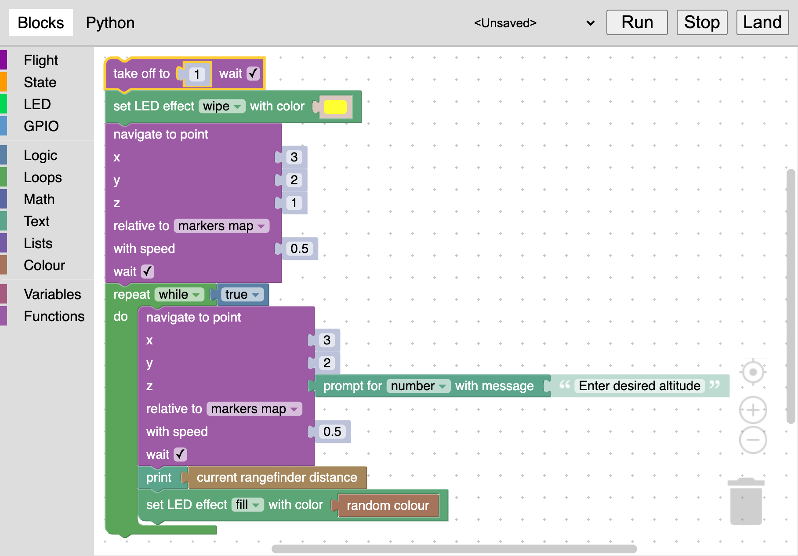

# Блочное программирование

TODO

Набор блоков приблизительно аналогичен набору ROS-сервисов [API автономных полетов Клевера](simple_offboard.md).

## Блоки

В этом разделе приведено описание некоторых блоков.

### take_off

Взлететь на указанную высоту в метрах. Высота может быть произвольным блоком, возвращающим числовое значение.

Флаг `wait` определяет, должен ли дрон ожидать окончания взлета перед выполнением следующего блока.

### navigate

Прилететь в заданную точку.

Флаг `wait` определяет, должен ли дрон ожидать завершения полета в точку перед выполнением следующего блока.

### land

Произвести посадку дрона.

Флаг `wait` определяет, должен ли дрон ожидать окончания посадки перед выполнением следующего блока.

### wait

Ожидать заданное время в секундах. Время ожидания может быть произвольным блоком, возвращающим числовое значение.

### get_position

### set_effect

