# «Copter For Space» (C4S) – принимаем данные со спутника на Клевер

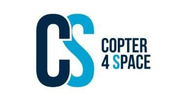

[CopterHack-2022](copterhack2022.md), **команда Space clowns**.

## Информация о команде

Состав команды:

* Илья Холодилов, https://t.me/ilyazxz, TeamLead, программист-инженер.
* Вячеслав Демьяненко, https://t.me/SlavikYD, инженер-программист.
* Андрей Пивоваров, https://t.me/DedAndrew, программист.
* Ярослав Мухатдинов, https://t.me/Euenot2, инженер-конструктор.
* Тимур Малышкин, https://t.me/Timur_Malyshkin, аналитик космических снимков и геопространственных данных (декодирование и постобработка данных), TechWriter.

## Видео о проекте

## Описание проекта

Создание инженерного конструктора станции приёма данных L-диапазона с метеорологических спутников на базе «Clover-4.2».

Наша цель - сделать конструктор доступнее, чтобы вовлечь как можно больше школьников в прикладные исследования в областях летающей робототехники, программирования, а также метеорологии.

### Идея проекта

#### Аперитив

Однажды пятеро джентльменов, любуясь туманными горами Кабардино-Балкарии, решили проверить дерзкую, не имеющую аналогов в мире идею. А что если вместо программируемой руки-манипулятора или тяжёлой тросово-опорной конструкции, для переноса облучателя над фокальной плоскостью комплекса приёма космической информации использовать дрон или же сеть дронов?

Прежде чем начать повествование об инновационной разработке, Вы, дорогой читатель, должны понимать основной принцип работы станций приёма космических данных. Предлагаем Вам ознакомиться с обучающими вебинарами (https://youtu.be/adclrJgpJWg), где на примере комплекса «Link To Space», разработанного инженерной компанией «LoReTT», описываются основные аспекты приёма, декодирования, обработки, постобработки, а также анализа космических снимков.

#### Шоу начинается

В далёком 1963-м году, в 15-ти километрах от маленького пуэрто-риканского городка Аресибо, была открыта одноимённая радиообсерватория. В 1974 году именно оттуда было отправлено легендарное «Послание Аресибо», адресованное внеземным цивилизациям. Помимо этого, данная радиообсерватория принимала активное участие в изучении дальнего космоса. В 2020-ом году, из-за усталости конструкции, лопнул один из тросов, удерживающих облучатель, что повлекло за собой разрушение не только облучателя, но и, частично, «зеркала» приёмного комплекса. На восстановление комплекса уйдут годы и миллионы долларов, поэтому Корнеллский университет и Научный фонд США – главные операторы обсерватории, - сочли нецелесообразным восстановление объекта. Кто знает, может быть, США могли бы совершить ещё не одно открытие в области изучения космоса.

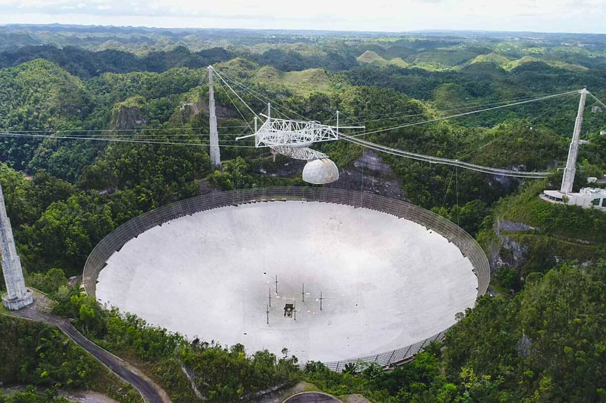

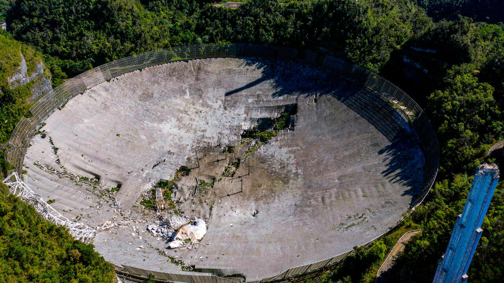

Но давайте немного отыграем ситуацию назад. А что если вместо программируемой руки-манипулятора или тяжёлой тросово-опорной конструкции, для переноса облучателя над фокальной плоскостью комплекса приёма космической информации использовать дрон или же сеть дронов? А если это возможно, то почему бы не создать инженерный конструктор для школьных технологических кружков?

### Использование платформы Клевер

В качестве устройства для переноса облучателя над фокальной плоскостью был выбран «Clover 4 Code». Выбор Клевера – не случаен. Данный дрон имеет широкий спектр выполняемых задач, возможности для модификации и самостоятельной доработки под конкретные цели. Поскольку предполагается перенос массивного модуля электроники с облучателем, мы поставили на Клевер более мощные моторы и аккумулятор увеличенной ёмкости, установили улучшенные винты. Скорректировав PID-ы, Клевер без проблем взлетал и выполнял полётное задание с подвешенным на него оборудованием.

#### От идеи до практической реализации

Первым делом наши инженеры создали модели блока электроники, облучателя, опор коптера. Нельзя не отметить факт перераспределения ударной нагрузки на ножки в 3-х направлениях, что повышает срок службы оборудования, а также «выживаемость» дрона в случае аварийной посадки.

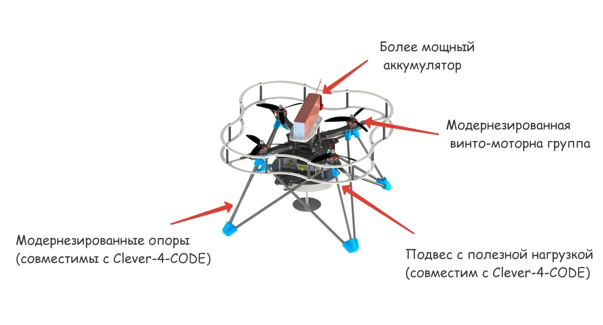

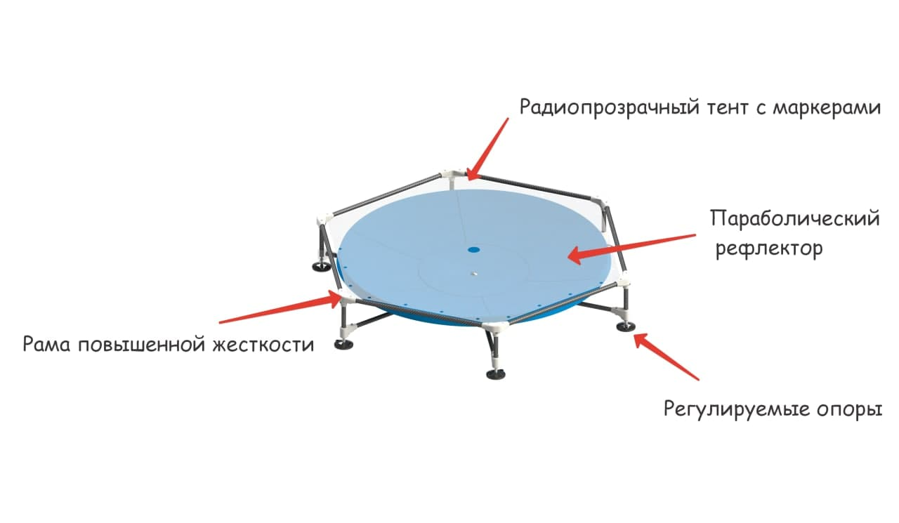

Блок электроники включает в себя всю необходимую аппаратуру для приёма и записи сигнала со спутника: SDR-приёмник, малошумящий усилитель (МШУ), блок питания МШУ, микрокомпьютер «Raspberry-Pi 4», облучатель.

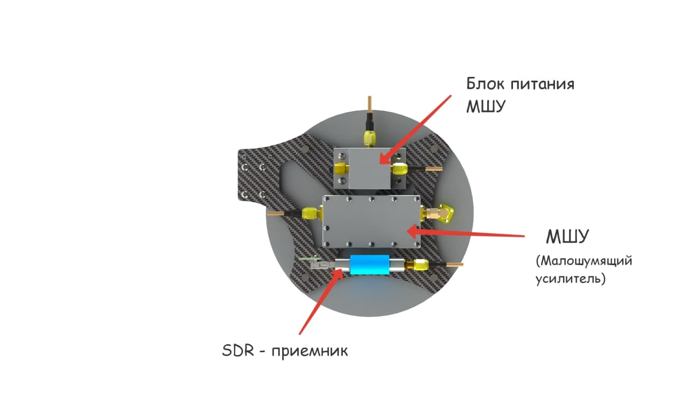

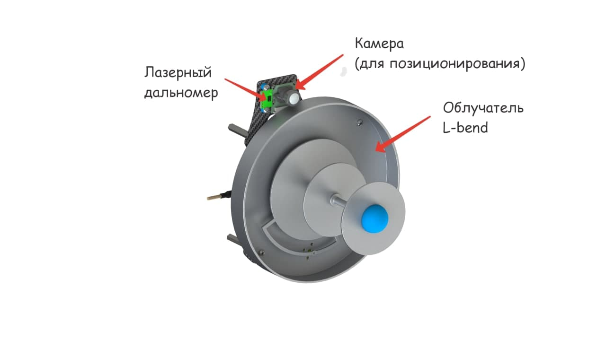

Следующим шагом стало написание программной части. Было создано ПО для автономного полёта и записи принимаемого сигнала. Запись сигнала осуществлялась на Raspberry.

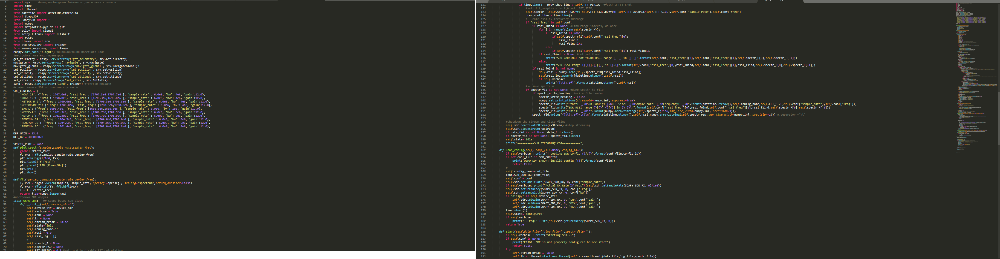

https://github.com/petayyyy/Lorett/ (ссылка на наш репозиторий).

Итак, в чём же новизна нашей разработки? Вместо роботизированного манипулятора, облучатель над «тарелкой» переносит дрон. Клевер взлетает и начинает полёт по заранее рассчитанной траектории приёма спутниковых данных (траектория рассчитывается на основе орбитальных параметров конкретного космического аппарата). Координаты пролёта спутника конвертируются в координаты маркеров, которые закреплены над плоскостью тарелки на радиопрозрачном баннере. Ориентируясь по ArUco-маркерам, Клевер пролетает по заданной траектории, принимая сигнал со спутника на облучатель и записывая его через SDR в память микрокомпьютера. По завершению пролёта, дрон совершает посадку. Для визуализации принципа действия дрона, предлагаем Вам взглянуть на фрагмент симуляции:

https://youtu.be/tWtlljBtSvw

После посадки дрона, мы переносим принятый сигнал на рабочий ноутбук, где приступаем к демодулированию и декодированию. Затем, можно начинать постобработку и анализ полученных данных. С помощью тематического ПО и анализа спутниковых снимков в разных цветовых каналах мы можем «вытащить» из них следующие данные: температура воды и подстилающей поверхности/верхней границы облаков, тип подстилающей поверхности, альбедо поверхности, тип облаков, водозапас облаков. Полученные данные помогут составить точный прогноз погоды для территории, с которой был принят сигнал.

Примеры обработанных снимков:

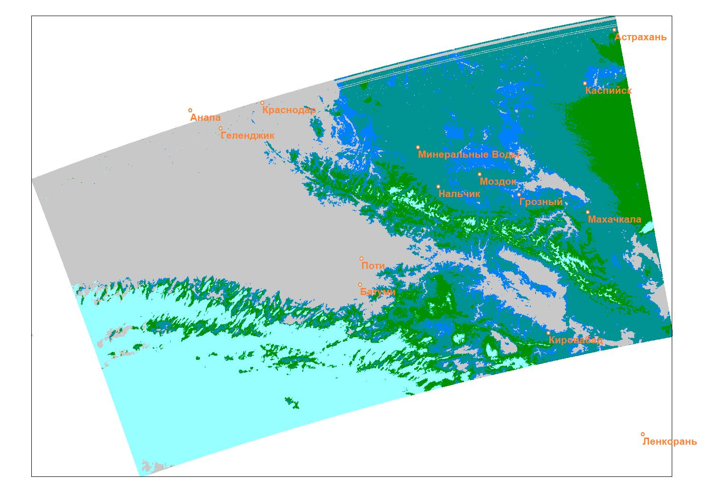

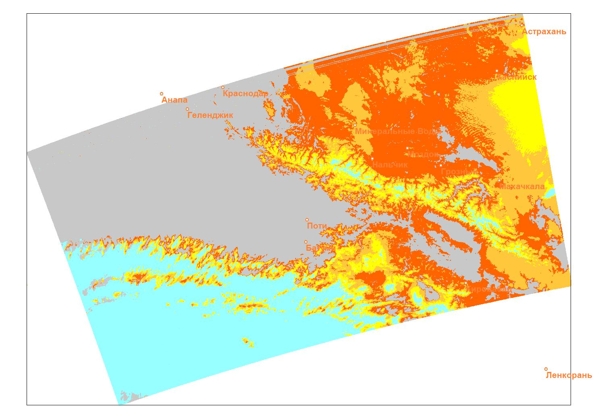

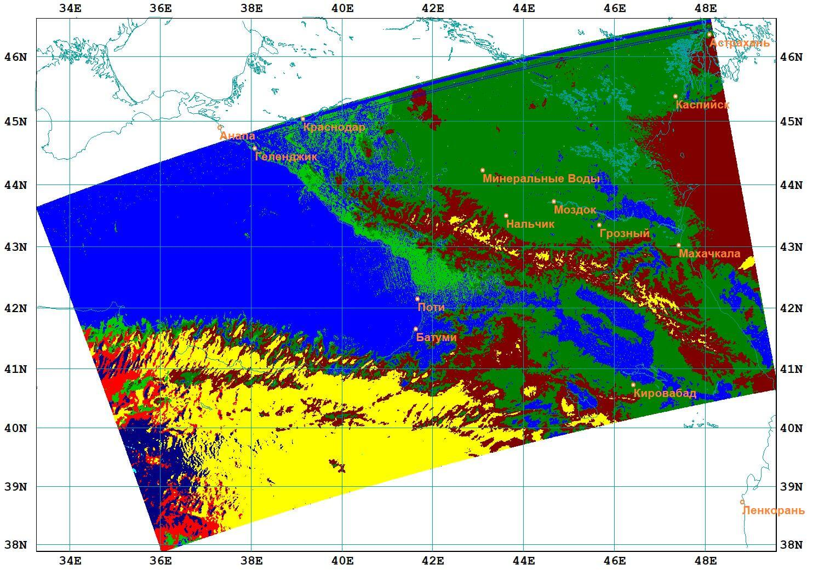

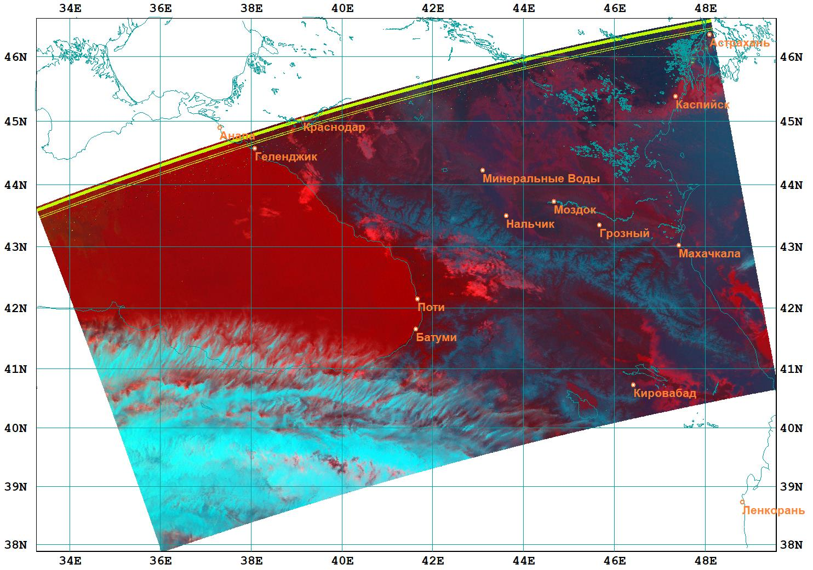

Пример снимка без обработки:

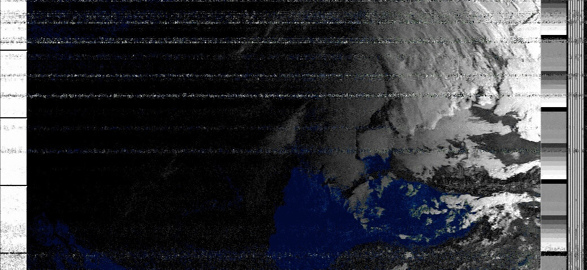

#### Взлёт разрешён

Положив рядом жгут, много перевязочного материала, пустырник, мы преступили к испытаниям. Полёты проходили в разных местах нашей Родины, а также в разные сезоны. Первая серия полётов была в Нальчике (Кабардино-Балкарская Республика) на образовательной программе ОЦ «Сириус» в марте 2021 года. Горный ветер не щадил никого, ни уши испытателей, ни Клевер. Было много сомнений насчёт практической применяемости нашей новинки, но в конечном счёте, мы приняли сигнал. Результат декодирования произвёл эффект разорвавшейся бомбы. На экране ноутбука появилась полоска, шириной в несколько пикселей, которую смог воспринять HRPT-Reader (ПО для постобработки). Данное изображение было возможно просмотреть в разных цветовых каналах. Это могло значить только одно – при более «плавном» перемещении дрона, мы имеем все шансы получить идеальное изображение, как со станции «Link2Space».

Принятая полоска:

Видео тестовых полетов: https://youtu.be/xP1Ne3j95zU

Вторые полётные испытания, после частичной доработки дрона (установка более мощных моторов, новых пропеллеров, доработка ПО), прошли в подмосковной Кубинке, на конкурсе «ИнтЭРА», проходившего в рамках международного военно-технического форума «Армия-2021». Казалось бы, всё должно пройти гладко, но одновременно с нами, на полигоне Алабино (в радиусе 5 км от нас) проходили «Международные армейские игры», где соревновались, в том числе военные-связисты. И результат их работы мы целиком и полностью ощутили на себе. Их средства подавления сигналов различного рода работали безотказно, что даже при приёме мощнейшего метеоспутника (китайский FengYun) мы получали 9 Гб «белого шума».

Белый шум:

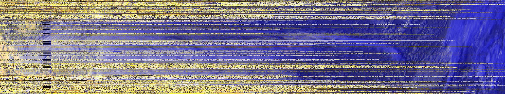

Видео с испытаний: https://youtu.be/k1ORpj3o-ew

#### Доработка проекта в рамках "CopterHack 2022"

### Модификация конструкции дрона

Были доработаны опоры "Клевера" таким образом, что блок электроники и облучатель стали лучше защищены в случае аварийной посадки дрона. Также был решен вопрос совместимости компонентов и подобрана их наилучшая конфигурация. Каждый компонент так и просится на свое место.

https://petayyyy.gitbook.io/copter-for-space/more/dev/3d-modeli-detalei - Ссылка на 3D-модели деталей

https://disk.yandex.ru/d/SrQ9xaMjKvO6vw - STL-файлы моделей

### Специальное оборудование

Приёмная часть состоит из облучателя L-диапазона (ряд металлизированных дисков разных размеров, закрепленных при помощи шпильки на некотором расстоянии друг от друга), малошумящего усилителя соответствующих частот, тройника смешения(специальное устройство, позволяющее подавать питание на МШУ и принимать сигнал по одному проводу) и Программируемого радиоприемника (airspy sdr).

МШУ (Малошумящий усилитель) – устройство, входящее в состав базовой станции (БС) и используемое для повышения чувствительности приемника в восходящем направлении UL (Uplink).

Software-defined radio/SDR (рус.Программно определяемая радиосистема) — радиопередатчик и/или радиоприёмник, использующий технологию, позволяющую с помощью программного обеспечения устанавливать или изменять рабочие радиочастотные параметры, включая, в частности, диапазон частот, тип модуляции или выходную мощность, за исключением изменения рабочих параметров, используемых в ходе обычной предварительно определённой работы с предварительными установками радиоустройства, согласно той или иной спецификации или системы.

Блок питания МШУ - регуляция входного и выходного напряжений.

Облучатель − сосредоточенный элемент параболической антенны, находящийся в её фокусе (фазовом центре) или фокальной плоскости, формирующий диаграмму направленности и поляризацию антенны.

### Программное обеспечение

Основываясь на открытом программном коде был создан автоматический демодулятор-декодер (далее Д-Д), который мы назвали "SatDump". Позднее, возможности Д-Д были оптимизированы для Raspberry Pi с некоторыми дополнительными возможностями. Например - автоматическая демодуляция и декодирования данных с метеорологических спутников с возможностью просмотра спутниковых снимков в браузере.

https://github.com/petayyyy/Lorett// - исходный код

https://gitlab.com/lpmrfentazis/HRPTAutoDecoder - автодекодер.

https://gitlab.com/lpmrfentazis/lorettorbital/-/blob/develop/lorettOrbital/orbital.py - библиотека “LoReTT Orbital” для расчёта расписания пролётов спутников и создания траектории перемещения облучателя дроном в фокальной плоскости “зеркала”

https://github.com/petayyyy/Lorett// - сборник ПО для функционирования комплекса-конструктора, описанного в "ГитБуке"

### Документация

Концепция конструктора подразумевает из себя возможность  освоения обучающимися определенных компетенций в областях инжиниринга, программирования, радиотехники, летающей робототехники и работы с данными дистанционного зондирования Земли. Для комфортного освоения мы подготовили все необходимые учебные материалы:

https://disk.yandex.ru/i/hJjB1w0ekQ0Lug - руководство по эксплуатация комплекса.

https://petayyyy.gitbook.io/copter-for-space/ - инструкция по сборке, настройке и эксплуатации комплекса в удобном формате “ГитБука”.

https://disk.yandex.ru/d/WOpfbO74N2cmPQ - инструкция по демодуляции и декодированию сигнала с метеорологических спутников, а также анализу полученных космических снимков.

### Результаты

1. Подготовлен сборник подробной документации по работе с комплексом-конструктором.
2. Доработан конструктив дрона, улучшена “живучесть” и сбалансированность компонентов.
3. Проведены образовательные мероприятия на площадках в Гимназии МГУ и “ФизТех-Лицее им.Капицы”, в ходе которых обучающиеся произвели монтаж и настройку комплекса-конструктора, а также выполнили сеансы приема данных с метеоспутников. После образовательной программы в ФТЛ был создан “ГитБук” для удобства работы с учебными материалами.
4. Создано новое ПО для расчета расписания пролетов спутников и, в соответствии с параметрами ИСЗ, выбора оптимальной траектории движения дрона-манипулятора в фокальной плоскости “зеркала”. Разработан автоматический демодулятор-декодер “SatDump”.

#### Список дополнительных компонентов

Основные доп.компоненты:

* DIATONE MAMBA TOKA 2207.5/2450KV - моторы.
* HQProp DP6X4X3 PC (2 пары) - пропеллеры.
* ONBO 4200mAh 4S 35C Lipo Pack - аккумулятор.

Для более подробного ознакомления со списком компонентов и узнать, где приобрести данные комплектующие вы можете перейти в таблицу по ссылке ниже:

https://docs.google.com/spreadsheets/d/19Gwm3lu31WgYOmuQ6WVm2aCMhhrhTMLTLWVspxvzfWs/edit#gid=0

Для приобретения специального оборудования, свяжитесь с ИК "LoReTT", ввиду эксклюзивности данных компонентов.

Контакты: ООО "Лоретт", Россия, г. Москва, Инновационный центр "Сколково", Большой бульвар, 42, стр. 1, офис 334, 121205.

+7 (985) 727-7630.

contact@lorett.org.

#### Перспективы

Хочется отметить перспективы использования дрона или сети дронов для переноса облучателя на крупных приёмных комплексах. В будущем возможно использовать платформу Pelican. Данная конструкция значительно упростит обслуживание крупных антенн, а также снизит количество потенциальных узлов отказа.

Безусловно, работа школьников с конструктором развивает в них не только инженерно-технические компетенции, но и научно-исследовательские! Платформа “Clover” предоставляет широкий спектр возможностей для модификации, кто знает, может быть, найдётся Левша, который модифицирует исходный конструктор так, что нам и не снилось! Познание мира - в экспериментах. А команда “SpaceClowns”, совместно с компанией “LoReTT” поможет в формировании будущих “Кулибиных”.
