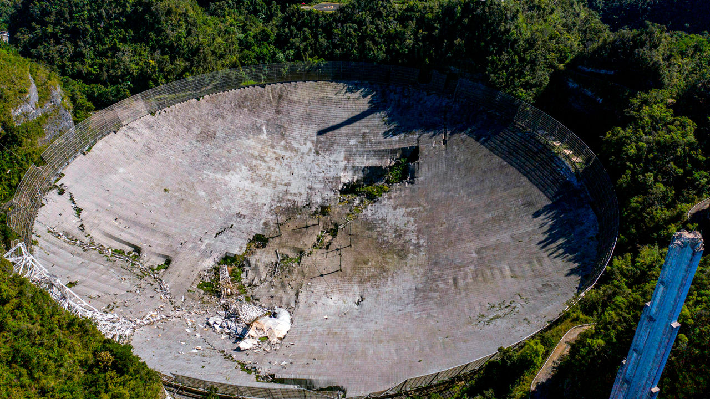
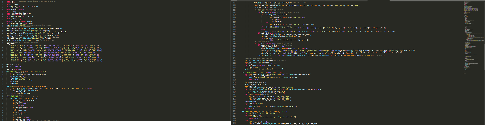

# «Copter For Space» (C4S) – принимаем данные со спутника на Клевер

[CopterHack-2022](copterhack2022.md), **команда Space clowns**.

## Информация о команде

Состав команды:

* Илья Холодилов, https://t.me/ilyazxz, TeamLead, программист-инженер.
* Вячеслав Демьяненко, https://t.me/SlavikYD, инженер-программист.
* Андрей Пивоваров, https://t.me/DedAndrew, программист.
* Ярослав Мухатдинов, https://t.me/Euenot2, инженер-конструктор.
* Тимур Малышкин, https://t.me/Timur_Malyshkin, аналитик космических снимков и геопространственных данных (декодирование и постобработка данных), TechWriter.

## Описание проекта

Создание инженерного конструктора станции приёма данных L-диапазона с метеорологических спутников на базе «Clover-4.2».

### Идея проекта

#### Аперитив

Однажды пятеро джентльменов, любуясь туманными горами Кабардино-Балкарии, решили проверить дерзкую, не имеющую аналогов в мире идею. А что если вместо программируемой руки-манипулятора или тяжёлой тросово-опорной конструкции, для переноса облучателя над фокальной плоскостью комплекса приёма космической информации использовать дрон или же сеть дронов?

Прежде чем начать повествование об инновационной разработке, Вы, дорогой читатель, должны понимать основной принцип работы станций приёма космических данных. Предлагаем Вам ознакомиться с обучающими вебинарами ( https://disk.yandex.ru/d/4QrUriogAuuFWA ), где на примере комплекса «Link To Space», разработанного инженерной компанией «LoReTT», описываются основные аспекты приёма, декодирования, обработки, постобработки, а также анализа космических снимков.

#### Шоу начинается

В далёком 1963-м году, в 15-ти километрах от маленького пуэрто-риканского городка Аресибо, была открыта одноимённая радиообсерватория. В 1974 году именно оттуда было отправлено легендарное «Послание Аресибо», адресованное внеземным цивилизациям. Помимо этого, данная радиообсерватория принимала активное участие в изучении дальнего космоса. В 2020-ом году, из-за усталости конструкции, лопнул один из тросов, удерживающих облучатель, что повлекло за собой разрушение не только облучателя, но и, частично, «зеркала» приёмного комплекса. На восстановление комплекса уйдут годы и миллионы долларов, поэтому Корнеллский университет и Научный фонд США – главные операторы обсерватории, - сочли нецелесообразным восстановление объекта. Кто знает, может быть, США могли бы совершить ещё не одно открытие в области изучения космоса.

Но давайте немного отыграем ситуацию назад. А что если вместо программируемой руки-манипулятора или тяжёлой тросово-опорной конструкции, для переноса облучателя над фокальной плоскостью комплекса приёма космической информации использовать дрон или же сеть дронов? А если это возможно, то почему бы не создать инженерный конструктор для школьных технологических кружков?

### Использование платформы Клевер

В качестве устройства для переноса облучателя над фокальной плоскостью был выбран «Clover 4 Code». Выбор Клевера – не случаен. Данный дрон имеет широкий спектр выполняемых задач, возможности для модификации и самостоятельной доработки под конкретные цели. Поскольку предполагается перенос массивного модуля электроники с облучателем, мы поставили на Клевер более мощные моторы и аккумулятор увеличенной ёмкости, установили улучшенные винты. Скорректировав PID-ы, Клевер без проблем взлетал и выполнял полётное задание с подвешенным на него оборудованием.

#### От идеи до практической реализации

Первым делом наши инженеры создали модели блока электроники, облучателя, опор коптера. Нельзя не отметить факт перераспределения ударной нагрузки на ножки в 3-х направлениях, что повышает срок службы оборудования, а также «выживаемость» дрона в случае аварийной посадки.

Блок электроники включает в себя всю необходимую аппаратуру для приёма и записи сигнала со спутника: SDR-приёмник, малошумящий усилитель (МШУ), блок питания МШУ, микрокомпьютер «Raspberry-Pi 4», облучатель.

Следующим шагом стало написание программной части. Было создано ПО для автономного полёта и записи принимаемого сигнала. Запись сигнала осуществлялась на Raspberry.

https://github.com/slavikyd/drone-obluchatel (ссылка на наш репозиторий, со всем имеющимся на данный момент кодом)

Итак, в чём же новизна нашей разработки? Вместо роботизированного манипулятора, облучатель над «тарелкой» переносит дрон. Клевер взлетает и начинает полёт по заранее рассчитанной траектории приёма спутниковых данных (траектория рассчитывается на основе орбитальных параметров конкретного космического аппарата). Координаты пролёта спутника конвертируются в координаты маркеров, которые закреплены над плоскостью тарелки на радиопрозрачном баннере. Ориентируясь по ArUco-маркерам, Клевер пролетает по заданной траектории, принимая сигнал со спутника на облучатель и записывая его через SDR в память микрокомпьютера. По завершению пролёта, дрон совершает посадку. Для визуализации принципа действия дрона, предлагаем Вам взглянуть на фрагмент симуляции:

https://youtu.be/tWtlljBtSvw

После посадки дрона, мы переносим принятый сигнал на рабочий ноутбук, где приступаем к демодулированию и декодированию. Затем, можно начинать постобработку и анализ полученных данных. С помощью тематического ПО и анализа спутниковых снимков в разных цветовых каналах мы можем «вытащить» из них следующие данные: температура воды и подстилающей поверхности/верхней границы облаков, тип подстилающей поверхности, альбедо поверхности, тип облаков, водозапас облаков. Полученные данные помогут составить точный прогноз погоды для территории, с которой был принят сигнал.

Примеры обработанных снимков:

#### Взлёт разрешён

Положив рядом жгут, много перевязочного материала, пустырник, мы преступили к испытаниям. Полёты проходили в разных местах нашей Родины, а также в разные сезоны. Первая серия полётов была в Нальчике (Кабардино-Балкарская Республика) на образовательной программе ОЦ «Сириус» в марте 2021 года. Горный ветер не щадил никого, ни уши испытателей, ни Клевер. Было много сомнений насчёт практической применяемости нашей новинки, но в конечном счёте, мы приняли сигнал. Результат декодирования произвёл эффект разорвавшейся бомбы. На экране ноутбука появилась полоска, шириной в несколько пикселей, которую смог воспринять HRPT-Reader (ПО для постобработки). Данное изображение было возможно просмотреть в разных цветовых каналах. Это могло значить только одно – при более «плавном» перемещении дрона, мы имеем все шансы получить идеальное изображение, как со станции «Link2Space».

Принятая полоска:

Видео тестовых полетов: https://youtu.be/xP1Ne3j95zU

Вторые полётные испытания, после частичной доработки дрона (установка более мощных моторов, новых пропеллеров, доработка ПО), прошли в подмосковной Кубинке, на конкурсе «ИнтЭРА», проходившего в рамках международного военно-технического форума «Армия-2021». Казалось бы, всё должно пройти гладко, но одновременно с нами, на полигоне Алабино (в радиусе 5 км от нас) проходили «Международные армейские игры», где соревновались, в том числе военные-связисты. И результат их работы мы целиком и полностью ощутили на себе. Их средства подавления сигналов различного рода работали безотказно, что даже при приёме мощнейшего метеоспутника (китайский FengYun) мы получали 9 Гб «белого шума».

Белый шум:

Видео с испытаний: https://youtu.be/k1ORpj3o-ew

### Планируемые результаты

Совместная работа с инженерной компанией «LoReTT» позволила создать товарный знак «C4S» и продвигать образовательный конструктор. Компактный кейс, подробные инструкции описания каждого этапа работы, делают процесс сборки, испытаний, а также приёма данных увлекательным и экстремальным, словно рыбалка на быстрой горной реке.

Наша цель – сделать конструктор доступнее, чтобы вовлечь как можно больше школьников в прикладные исследования в областях летающей робототехники, программирования, а также метеорологии.

#### Перспективы

Хочется отметить перспективы использования дрона или сети дронов для переноса облучателя на крупных приёмных комплексах. В будущем возможно использовать платформу Pelican. Данная конструкция значительно упростит обслуживание крупных антенн, а также снизит количество потенциальных узлов отказа.

https://pypi.org/project/lorettOrbital/
