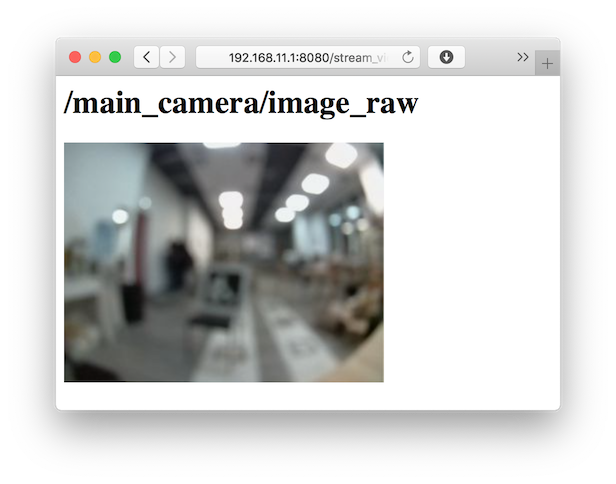
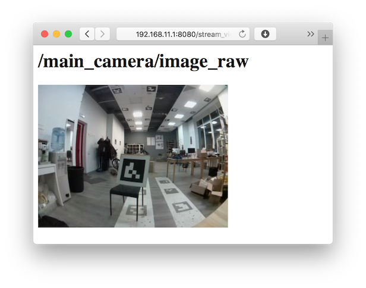
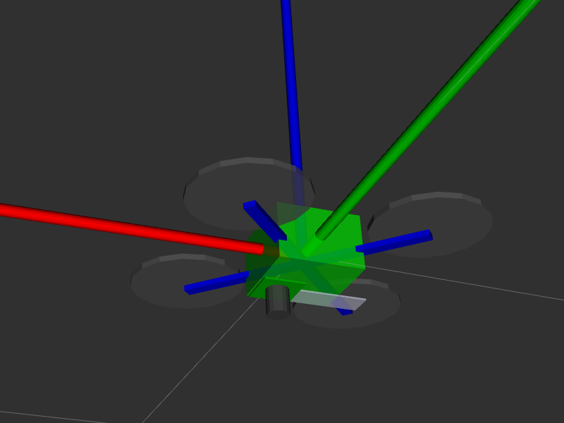
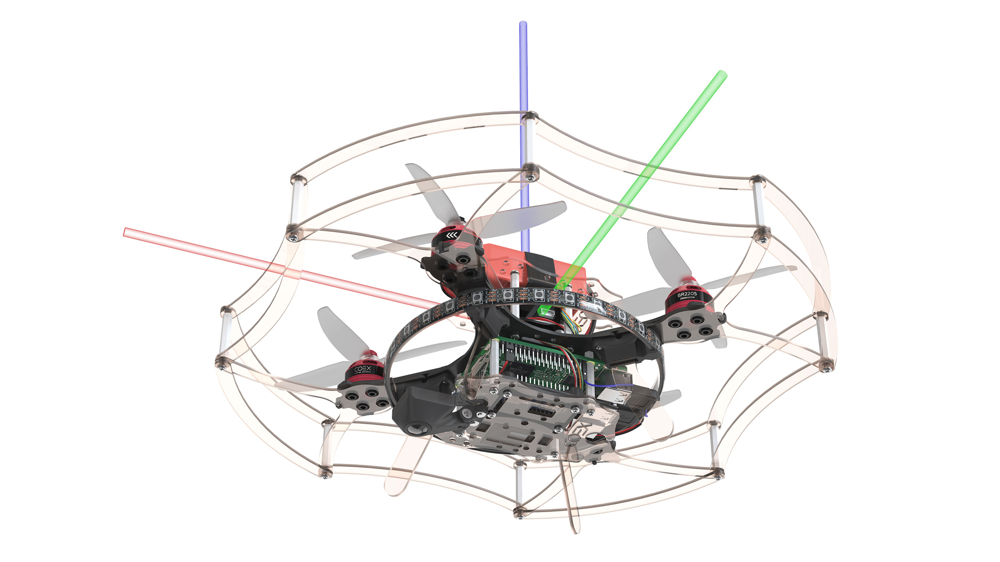
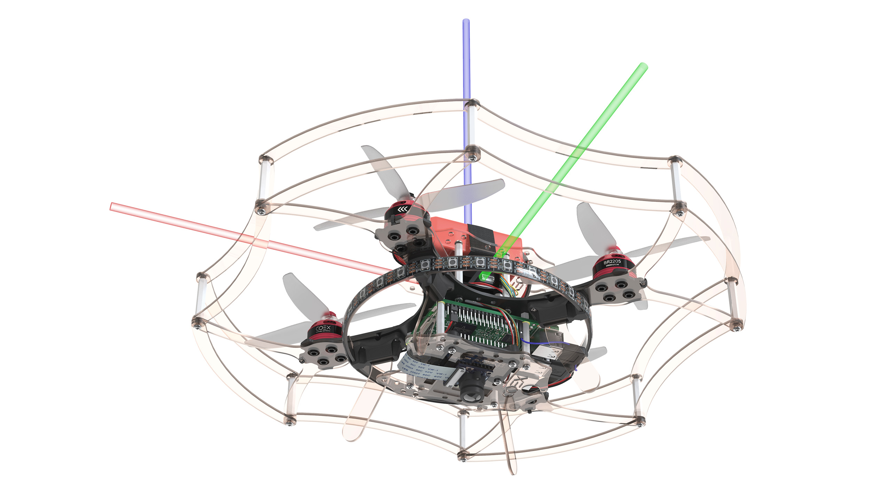
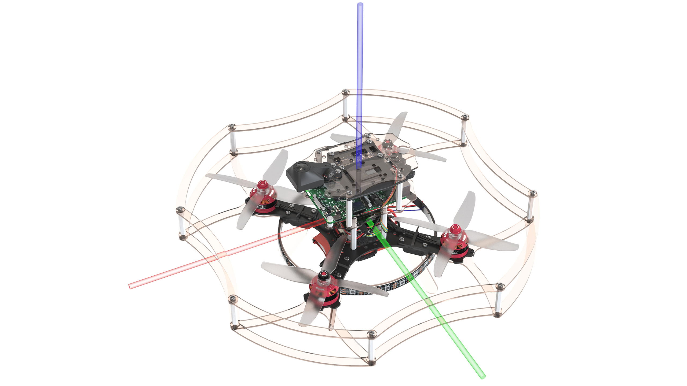
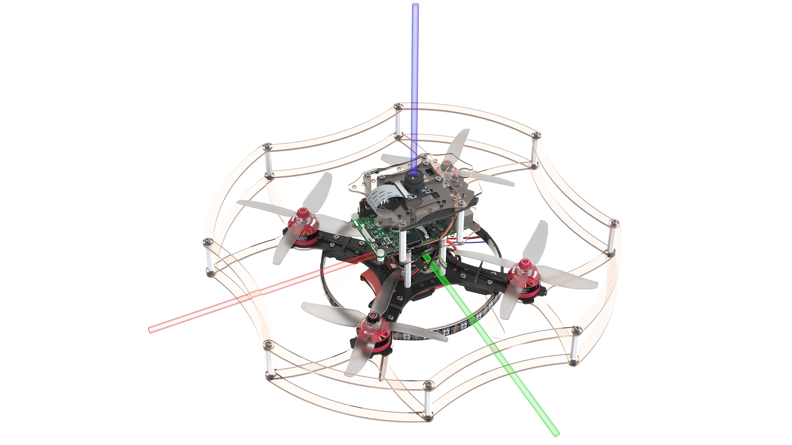

# Настройка камеры

> **Note** Документация для версий [образа](image.md), начиная с **0.15**. Для более ранних версий см. [документацию для версии **0.14**](https://github.com/CopterExpress/clever/blob/v0.14/docs/ru/camera_frame.md).

Для корректной работы всех модулей, связанных с компьютерным зрением (в том числе [полет по ArUco-маркерам](aruco.md) и [Optical Flow](optical_flow.md)) необходимо сфкусировать основную камеру, а также выставить ее расположение и ориентацию.

## Настройка фокуса камеры

Для успешного осуществления полетов с использованием камеры, необходимо настроить фокус камеры.

1. Откройте трансляцию изображения с камеры используя [web_video_server](web_video_server.md).
2. С помощью вращения объектива камеры добейтесь максимальной резкости деталей (предпочтительно на расстоянии предполагаемого полета – 2–3 м).

Расфокусированное изображение:



Сфокусированное изображение:



## Настройка расположения камеры {#frame}

Расположение и ориентация камеры [задается в файле](cli.md#editing) `~/catkin_ws/src/clever/clever/launch/main_camera.launch`:

```xml
<node pkg="tf2_ros" type="static_transform_publisher" name="main_camera_frame" args="0 0 -0.07 -1.5707963 0 3.1415926 base_link main_camera_optical"/>
```

Эта строка задает статическую трансформацию между фреймом `base_link` ([соответствует корпусу полетного контроллера](frames.md)) и камерой (`main_camera_optical`) в формате:

```txt
сдвиг_x сдвиг_y сдвиг_z угол_рысканье угол_тангаж угол_крен
```

Фрейм камеры задается таким образом, что:

* **<font color=red>x</font>** указывает направо на изображении;
* **<font color=green>y</font>** указывает вниз на изображении;
* **<font color=blue>z</font>** указывает от плоскости матрицы камеры.

Сдвиги задаются в метрах, углы задаются в радианах. Корректность установленной трансформации может быть проверена с использованием [rviz](rviz.md).

### Настройки для Клевера

Первое изображение – как выглядит модель коптера в rviz при указанных настройках, второе – как выглядит Клевер при тех же настройках.

#### 1. Камера направлена вниз, шлейф назад

```xml
<node pkg="tf2_ros" type="static_transform_publisher" name="main_camera_frame" args="0.05 0 -0.07 -1.5707963 0 3.1415926 base_link main_camera_optical"/>
```




#### 2. Камера направлена вниз, шлейф вперёд

```xml
<node pkg="tf2_ros" type="static_transform_publisher" name="main_camera_frame" args="0.05 0 -0.07 1.5707963 0 3.1415926 base_link main_camera_optical"/>
```




#### 3. Камера направлена вверх, шлейф назад

```xml
<node pkg="tf2_ros" type="static_transform_publisher" name="main_camera_frame" args="0.05 0 0.07 1.5707963 0 0 base_link main_camera_optical"/>
```




#### 4. Камера направлена вверх, шлейф вперёд

```xml
<node pkg="tf2_ros" type="static_transform_publisher" name="main_camera_frame" args="0.05 0 0.07 -1.5707963 0 0 base_link main_camera_optical"/>
```




> **Hint** [Утилита `selfcheck.py`](selfcheck.md) выдает словесное описание установленной в данной момент ориентации основной камеры.
