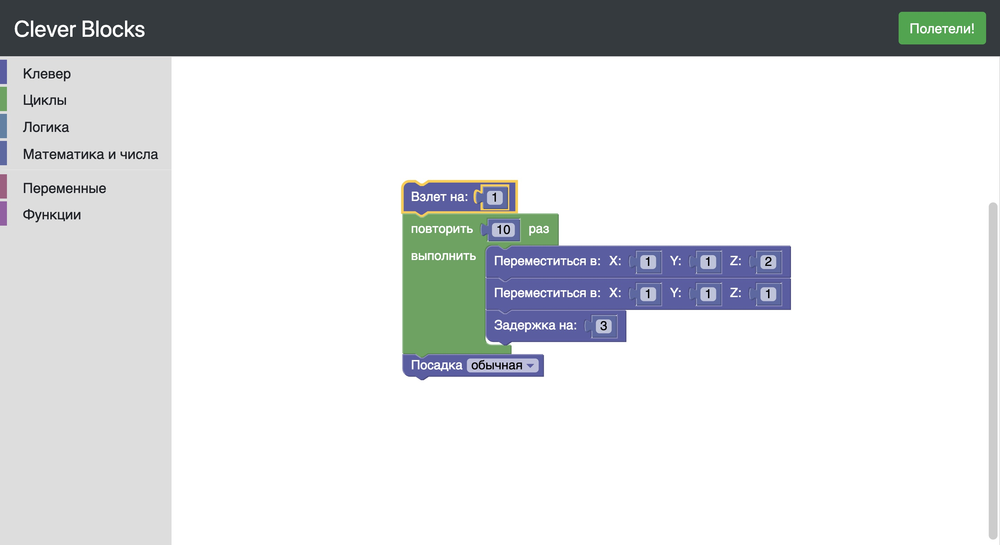

# Блочное программирование Клевера

> **Warning** В этой статье описана неофициальная реализация блочного программирования. [Официальная поддержка](blocks.md) появилась в образе Клевера версии **0.21**.



В этой статье я опишу процесс скачивания, установки и запуска блочного конструктора программ для квадрокоптера Клевер.

## Скачивание

Есть два варианта скачивания кода проекта на RPi:

### Вариант 1

Подключить плату к интернету (вставив в нее ethernet-кабель или [перенастроив Wi-Fi](network.md)) и в командной строке RPi выполнить:

```
cd
git clone https://github.com/garinegor/clever-blocks
```

### Вариант 2

Исходный код проекта можно скачать на компьютер с [GitHub](https://github.com/garinegor/clever-blocks), а затем скопировать его в домашнюю директорию RPi посредством SFTP или SCP.

## Установка

Если Вы хотите, чтобы блочный конструктор запускался автоматически, необходимо создать соответствующий сервис. Для этого следует ввести в командную строку RPi следующие команды:

```
sudo systemctl enable /home/pi/clever-blocks/service/
sudo systemctl start clever-blocks.service
```

Все готово! Теперь можно переходить к использованию.

## Использование

Если Вы не стали добавлять сервис для автоматического старта сервера, для его запуска Вам нужно ввести следующую команду, находясь в папке проекта:

```
python main.py
```

После запуска Вы можете открыть веб-интерфейс для блочного программирования по адресу [192.168.11.1:5000](http://192.168.11.1:5000).
