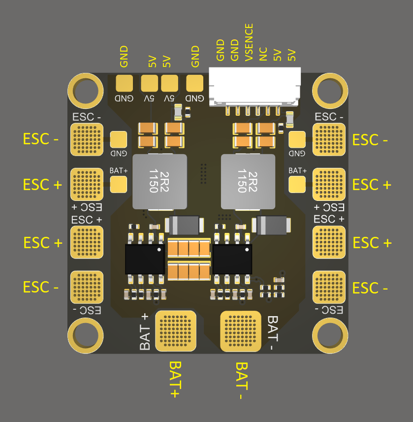
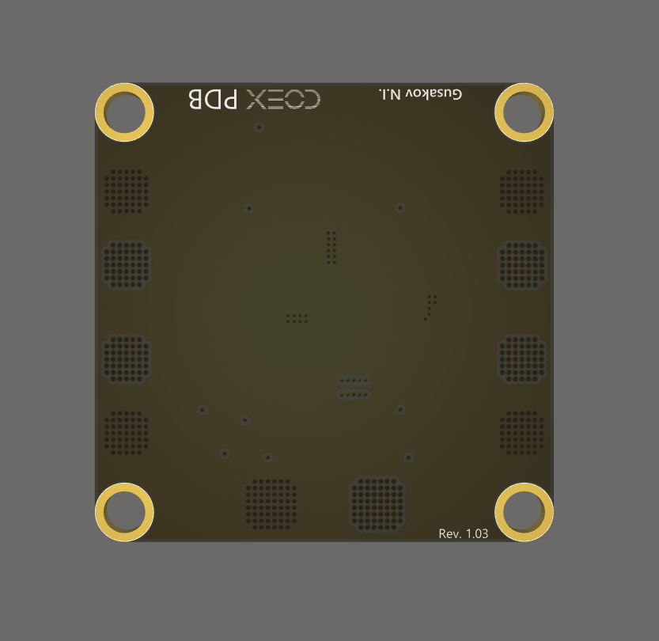

# COEX PDB

**COEX PDB** (Power Distribution Board) – плата распределения питания для квадрокоптеров <a href="assemble_4_2.md">Клевер&nbsp;4</a>.

Габаритные размеры платы: 35x35 мм.

> **Hint** Исходные файлы платы COEX PDB [выложены](https://github.com/CopterExpress/hardware/tree/master/COEX%20PDB) в открытый доступ под лицензией CC BY-NC-SA.

## Схемы расположения контактов

### Вид сверху

### Вид снизу

